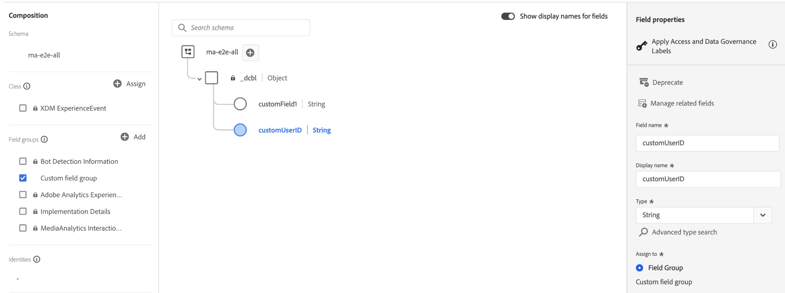

# Compatibilidad con metadatos personalizados: formato XDM

La API de Experience Edge le permite enviar metadatos personalizados de medios junto con campos XDM estándar en eventos de API `sessionStart`, `adStart` y `chapterStart`. Los metadatos personalizados de medios enviados mediante el formato XDM se pueden reenviar tanto a **Adobe Analytics** como a **Adobe Experience Platform**.

Para implementaciones de API de Media Collection, consulte [Compatibilidad con metadatos personalizados](https://developer.adobe.com/analytics-collection-apis/methods/media-collection/custom-metadata).

## Información general

Los metadatos personalizados de contenidos se pueden enviar en dos ubicaciones dentro de una solicitud de Experience Edge, cada una con un comportamiento de enrutamiento diferente:

| Ubicación | Enviado a Adobe Analytics | Enviado a Adobe Experience Platform | Caso de uso |
|----------|------------------------|-----------------------------------|----------|
| `xdm.mediaCollection.customMetadata` | ✅ Sí | ✅ Sí | Se necesitan datos empresariales en ambos sistemas |
| `_data` | ✅ Sí | ❌ No | Indicadores específicos de Analytics o sugerencias de procesamiento |

Los metadatos personalizados se aplican a tres tipos de eventos:

| Evento | Los Metadatos Se Aplican |
|-------|-------------------|
| `sessionStart` | Contenido principal (toda la sesión) |
| `adStart` | Anuncio individual |
| `chapterStart` | Capítulo o segmento de contenido |

## Estructura

### `xdm.mediaCollection.customMetadata` (Analytics + AEP)

Los metadatos personalizados son una **matriz de objetos nombre-valor** dentro del objeto `mediaCollection`:

```json
{
  "xdm": {
    "mediaCollection": {
      "customMetadata": [
        {
          "name": "_tenant.fieldName",
          "value": "fieldValue"
        }
      ]
    }
  }
}
```

<InlineAlert variant="warning" slots="text" />

`customMetadata` debe ser una **matriz** dentro de `mediaCollection`, no en el nivel raíz `xdm`.

**Incorrecto:**

```json
{
  "xdm": {
    "eventType": "media.sessionStart",
    "customMetadata": [...]  // ❌ Wrong location
  }
}
```

**Correcto:**

```json
{
  "xdm": {
    "eventType": "media.sessionStart",
    "mediaCollection": {
      "customMetadata": [...]  // ✅ Inside mediaCollection
    }
  }
}
```

### `_data` (solo Analytics)

El objeto `_data` es una construcción especial de Experience Edge que envía datos exclusivamente a Adobe Analytics, omitiendo los conjuntos de datos de AEP. Los metadatos personalizados deben colocarse bajo `__adobe.analytics.contextData`.

A diferencia de `xdm.mediaCollection.customMetadata`, que usa una matriz **de objetos nombre-valor**, la asignación `_data` usa un objeto **clave-valor** plano, directamente debajo de `contextData`:

| Enfoque | Estructura | Destino |
|----------|-----------|-------------|
| `xdm.mediaCollection.customMetadata` | Matriz de `{"name": "...", "value": "..."}` objetos | Analytics + AEP |
| `_data.__adobe.analytics.contextData` | Objeto de clave-valor plano `{"key": "value"}` | Solo Analytics |

```json
{
  "xdm": { ... },
  "_data": {
    "__adobe": {
      "analytics": {
        "contextData": {
          "debugMode": "true",
          "internalTestFlag": "QA-Session"
        }
      }
    }
  }
}
```

### Convenciones de nomenclatura

* **Formato XDM:** prefijo con espacio de nombres de inquilino que usa un guion bajo. También puede crear estructuras en el grupo de campos personalizados de inquilino como `_<tenant>.<struct_name>.<field_name>`.
* **`_data`formato:** campos se colocan en `_data.__adobe.analytics.contextData`. No se requiere prefijo de guion bajo en el nombre de campo (por ejemplo, `debugFlag`).

## Metadatos personalizados de contenido principal

Enviado con `sessionStart`. Se aplica a los medios principales de los que se realiza un seguimiento y permanece disponible durante las llamadas de anuncio y capítulo. Cualquier metadato personalizado definido aquí se combinará automáticamente con el back-end de medios en las llamadas de cierre correspondientes. Se incluirá junto con cualquier metadato personalizado específico definido para anuncios y capítulos.

<CodeBlock slots="heading, code" repeat="1" languages="CURL"/>

### Solicitud

```sh
curl -X POST "https://edge.adobedc.net/ee/va/v1/sessionStart?configId={datastreamId}" \
--header 'Content-Type: application/json' \
--data '{
  "events": [
    {
      "xdm": {
        "eventType": "media.sessionStart",
        "mediaCollection": {
          "sessionDetails": {
            "name": "Sample Video",
            "playerName": "HTML5 Player",
            "contentType": "VOD",
            "length": 3600,
            "channel": "Sports"
          },
          "playhead": 0,
          "customMetadata": [
            {
              "name": "_mycompany.contentCategory",
              "value": "Live Sports"
            },
            {
              "name": "_mycompany.leagueType",
              "value": "Professional"
            }
          ]
        },
        "timestamp": "2026-03-10T18:00:00Z"
      }
    }
  ]
}'
```

## Añadir metadatos personalizados

Enviado con `adStart`. Específico para cada anuncio individual. Los metadatos personalizados de `sessionStart` también se combinan automáticamente por el backend de medios en la llamada de cierre de anuncio junto con cualquier metadato personalizado específico de anuncio definido aquí.

<CodeBlock slots="heading, code" repeat="1" languages="CURL"/>

### Solicitud

```sh
curl -X POST "https://edge.adobedc.net/ee/va/v1/adStart?configId={datastreamId}" \
--header 'Content-Type: application/json' \
--data '{
  "events": [
    {
      "xdm": {
        "eventType": "media.adStart",
        "mediaCollection": {
          "sessionID": "your-session-id",
          "playhead": 30,
          "advertisingDetails": {
            "name": "Summer Sale Ad",
            "playerName": "HTML5 Player",
            "length": 30,
            "podPosition": 1
          },
          "customMetadata": [
            {
              "name": "_mycompany.campaignId",
              "value": "SUMMER2026"
            },
            {
              "name": "_mycompany.targetAudience",
              "value": "18-34"
            },
            {
              "name": "_mycompany.adFormat",
              "value": "skippable"
            }
          ]
        },
        "timestamp": "2026-03-10T18:05:30Z"
      }
    }
  ]
}'
```

## Metadatos personalizados de capítulo

Enviado con `chapterStart`. Específico para cada capítulo o segmento de contenido. Los metadatos personalizados de `sessionStart` también se combinan automáticamente con el backend de medios en la llamada de cierre de capítulo junto con cualquier metadato personalizado específico de capítulo definido aquí.

<CodeBlock slots="heading, code" repeat="1" languages="CURL"/>

### Solicitud

```sh
curl -X POST "https://edge.adobedc.net/ee/va/v1/chapterStart?configId={datastreamId}" \
--header 'Content-Type: application/json' \
--data '{
  "events": [
    {
      "xdm": {
        "eventType": "media.chapterStart",
        "mediaCollection": {
          "sessionID": "your-session-id",
          "playhead": 600,
          "chapterDetails": {
            "friendlyName": "Introduction",
            "length": 300,
            "index": 1,
            "offset": 600
          },
          "customMetadata": [
            {
              "name": "_mycompany.chapterType",
              "value": "tutorial"
            },
            {
              "name": "_mycompany.difficulty",
              "value": "beginner"
            }
          ]
        },
        "timestamp": "2026-03-10T18:10:00Z"
      }
    }
  ]
}'
```

## Uso del objeto `_data` (metadatos solo de Analytics)

Utilice el objeto `_data` cuando necesite metadatos en Adobe Analytics que **no** deban almacenarse en el conjunto de datos de AEP. Algunos ejemplos son indicadores temporales, variables de depuración o sugerencias de procesamiento específicas de Analytics.

<InlineAlert variant="warning" slots="text" />

Los datos enviados a través de `_data` no se almacenan en Adobe Experience Platform y no están disponibles para Real-Time CDP, Journey Orchestration u otros servicios de AEP.

<CodeBlock slots="heading, code" repeat="1" languages="CURL"/>

### Solicitud

```sh
curl -X POST "https://edge.adobedc.net/ee/va/v1/sessionStart?configId={datastreamId}" \
--header 'Content-Type: application/json' \
--data '{
  "events": [
    {
      "xdm": {
        "eventType": "media.sessionStart",
        "mediaCollection": {
          "sessionDetails": {
            "name": "Sample Video",
            "playerName": "HTML5 Player",
            "contentType": "VOD",
            "length": 3600
          },
          "playhead": 0,
          "customMetadata": [
            {
              "name": "_mycompany.league",
              "value": "Action"
            }
          ]
        },
        "timestamp": "2026-03-10T18:00:00Z"
      },
      "_data": {
        "__adobe": {
          "analytics": {
            "contextData": {
              "debugMode": "true",
              "testFlag": "QA-Session"
            }
          }
        }
      }
    }
  ]
}'
```

En este ejemplo:

* `_mycompany.league` → envió tanto a Analytics como a AEP
* `debugMode` y `testFlag` (menos de `_data.__adobe.analytics.contextData`) solo → envían a Analytics


## Ubicación de datos descendentes

<InlineAlert variant="info" slots="text" />

`xdm.mediaCollection.customMetadata` es la **ruta de API de entrada** que se usa para enviar metadatos personalizados con eventos. Después del procesamiento, los datos se reenvían a Adobe Analytics como variables de datos de contexto y se almacenan en Adobe Experience Platform en `xdm.mediaReporting.customMetadata` y como campos aplanados de nivel superior.

**Adobe Analytics:**

* Después del procesamiento, los metadatos personalizados se reenvían a Adobe Analytics como variables de datos de contexto. El prefijo `_tenant` se elimina automáticamente, por lo que las reglas de procesamiento solo hacen referencia a la ruta de campo después de `_tenant` (por ejemplo, `_mycompany.contentCategory` se convierte en `contentCategory`)
* Los datos enviados a través de `_data` también se reenvían a Adobe Analytics y están disponibles mediante reglas de procesamiento
* Utilice reglas de procesamiento para asignar variables de datos de contexto a eVars, props u otras variables de Analytics. Consulte [Asignación de variables de datos para Adobe Experience Platform Edge Network](https://experienceleague.adobe.com/en/docs/analytics/implementation/aep-edge/data-var-mapping) para obtener más información.

**Adobe Experience Platform:**

* Los campos de metadatos personalizados deben definirse como campos personalizados en el esquema XDM (por ejemplo, `_mycompany`) y pueden almacenarse y consultarse en AEP como campos aplanados

  
* Para informes y consultas, los metadatos personalizados están disponibles en `xdm.mediaReporting.customMetadata` y también como campos aplanados de nivel superior. Utilice el que sea más adecuado para su caso de uso.
* Accesible para la segmentación, Journey Orchestration y activación de Real-Time CDP

## Comportamiento

* Todos los valores de metadatos personalizados deben ser **strings**. Convierta números y valores booleanos antes de enviar.
* `sessionStart` metadatos persisten durante toda la sesión; las actualizaciones requieren una nueva sesión
* Cada evento `adStart` y `chapterStart` puede llevar metadatos personalizados diferentes
* Preferir campos XDM estándar (`sessionDetails`, `advertisingDetails`, `chapterDetails`) sobre metadatos personalizados cuando existe un campo estándar

>[!MORELIKETHIS]
>
>* [Compatibilidad con metadatos personalizados de API de recopilación de medios](https://developer.adobe.com/analytics-collection-apis/methods/media-collection/custom-metadata)
>* [Tipo de datos de detalles de recopilación de medios](https://experienceleague.adobe.com/en/docs/experience-platform/xdm/data-types/media-collection-details)
>* [Asignación de variables de datos para Adobe Experience Platform Edge Network](https://experienceleague.adobe.com/en/docs/analytics/implementation/aep-edge/data-var-mapping)
