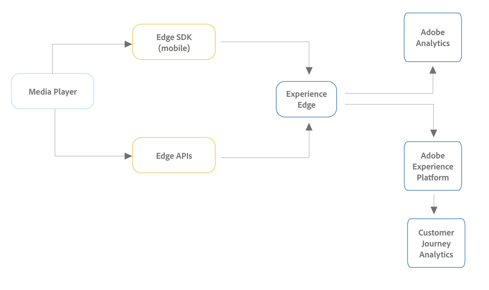

# Instalación de Media Analytics con Experience Platform Edge

Adobe Experience Platform Edge le permite enviar datos destinados a varios productos a una ubicación centralizada. Experience Edge reenvía la información adecuada a los productos deseados. Este concepto le permite consolidar los esfuerzos de implementación, especialmente abarcando varias soluciones de datos.

El siguiente gráfico ilustra cómo una implementación de Media Analytics puede utilizar Experience Platform Edge para que los datos estén disponibles en Analysis Workspace, ya sea en Adobe Analytics o en Customer Journey Analytics:

Para obtener una descripción general de todas las opciones de implementación, incluidos los métodos de implementación que no utilizan Experience Platform Edge, consulte [Implementación de medios de streaming para Adobe Analytics o Customer Journey Analytics](/help/implementation/overview.md).

>[!IMPORTANT]
>
>Streaming Media aún no está integrado con el SDK web de AEP.

Independientemente de si utiliza el SDK móvil o la API para implementar Streaming Media con Experience Edge, primero debe completar las secciones siguientes:

## Configuración del esquema en Adobe Experience Platform

Para estandarizar la recopilación de datos para su uso en todas las aplicaciones que aprovechan Adobe Experience Platform, Adobe ha creado el estándar abierto y documentado públicamente, Experience Data Model (XDM).

Para crear y configurar un esquema:

1. En Adobe Experience Platform, empiece a crear el esquema como se describe en [Crear y editar esquemas en la interfaz de usuario](https://experienceleague.adobe.com/docs/experience-platform/xdm/ui/resources/schemas.html?lang=en).

   Al crear el esquema, elija [!UICONTROL **ExperienceEvent de XDM**] desde el [!UICONTROL **Crear esquema**] menú desplegable.

1. En el [!UICONTROL **Composición**] , en el [!UICONTROL **Grupos de campos**] , seleccione [!UICONTROL **Añadir**], luego busque y agregue los siguientes grupos de campos nuevos al esquema:
   * `Adobe Analytics ExperienceEvent Template`
   * `Implementation Details`
   * `MediaAnalytics Interaction Details`

   Después de agregar los grupos de campos, deben mostrarse en la variable [!UICONTROL **Grupos de campos**] , como se indica a continuación:

   

1. Seleccionar [!UICONTROL **Confirmar**] para guardar los cambios.

1. (Opcional) Puede ocultar ciertos campos que no utiliza la API de Media Edge. Al ocultar estos campos, el esquema es más fácil de leer y comprender, pero no es obligatorio. Estos campos solo hacen referencia a los del `MediaAnalytics Interaction Details` grupo de campo.

+++ Amplíe aquí para ver las instrucciones de los campos que puede ocultar.

   1. En el [!UICONTROL **Estructura**] , seleccione la `Media Collection Details` , luego seleccione [!UICONTROL **Administrar campos relacionados**].

      

   1. Active la opción para lo siguiente [!UICONTROL **Mostrar nombres para mostrar para campos**], luego actualice el esquema como se indica a continuación:

      * En el `Media Collection Details` > `Advertising Details` , oculte los siguientes campos de informe: `Ad Completed`, `Ad Started`, y `Ad Time Played`.

      * En el `Media Collection Details` > `Advertising Pod Details` , oculte el siguiente campo de informe: `Ad Break ID`

      * En el `Media Collection Details` > `Chapter Details` , oculte los siguientes campos de informe: `Chapter Completed`, `Chapter ID`, `Chapter Started`, y `Chapter Time Played`.

      * En el `Media Collection Details` , oculte el campo `List Of States` field.

        

      * En el `Media Collection Details` > `List Of States End` y `Media Collection Details` > `List Of States Start` , oculte los siguientes campos de informe: `Player State Count`, `Player State Set`, y `Player State Time`.

        

      * En el `Media Collection Details` > `Qoe Data Details` , oculte los siguientes campos de informe: `Average Bitrate`, `Average Bitrate Bucket`, `Bitrate Change Impacted Streams`, `Bitrate Changes`, `Buffer Impacted Streams`, `Buffer Events`, `Dropped Frame Impacted Streams`, `Drops Before Starts`, `Errors`, `External Error IDs`, `Error Impacted Streams`, `Media SDK Error IDs`, `Player SDK Error IDs`, `Stalling Impacted Streams`, `Stalling Events`, `Total Buffer Duration`, y `Total Stalling Duration`.

      * En el `Media Collection Details` > `Session Details` , oculte los siguientes campos de informe: `10% Progress Marker`, `25% Progress Marker`, `50% Progress Marker`, `75% Progress Marker`, `95% Progress Marker`, `Ad Count`, `Average Minute Audience`, `Content Completes`, `Chapter Count`, `Content Starts`, `Content Time Spent`, `Estimated Streams`, `Federated Data`, `Media Segment Views`, `Media Downloaded Flag`, `Media Starts`, `Media Session ID`, `Media Session Server Timeout`, `Media Time Spent`, `Pause Events`, `Pause Impacted Streams`, `Pev3`, `Pccr`, `Total Pause Duration`, `Unique Time Played`, y `Video Segment`.

   1. Seleccionar [!UICONTROL **Confirmar**] para guardar los cambios.

   1. En el [!UICONTROL **Estructura**] , active la opción para [!UICONTROL **Mostrar nombres para mostrar para campos**], luego seleccione la `List Of Media Collection Downloaded Content Events` field.

   1. Seleccionar [!UICONTROL **Administrar campos relacionados**], luego actualice el esquema como se indica a continuación:

      * En el `List Of Media Collection Downloaded Content Events` > `Media Details` > `Advertising Details` , oculte los siguientes campos de informe: `Ad Completed`, `Ad Started`, y `Ad Time Played`.

      * En el `List Of Media Collection Downloaded Content Events` > `Media Details` > `Advertising Pod Details` , oculte el siguiente campo de informe: `Ad Break ID`

      * En el `List Of Media Collection Downloaded Content Events` > `Media Details` > `Chapter Details` , oculte los siguientes campos de informe: `Chapter Completed`, `Chapter ID`, `Chapter Started`, y `Chapter Time Played`.

      * En el `List Of Media Collection Downloaded Content Events` > `Media Details` , oculte el campo `List Of States` field.

      * En el `List Of Media Collection Downloaded Content Events` > `Media Details` > `List Of States End` y `Media Collection Details` > `List Of States Start` , oculte los siguientes campos de informe: `Player State Count`, `Player State Set`, y `Player State Time`.

      * En el `List Of Media Collection Downloaded Content Events` > `Media Details` > `Qoe Data Details` , oculte los siguientes campos de informe: `Average Bitrate`, `Average Bitrate Bucket`, `Bitrate Change Impacted Streams`, `Bitrate Changes`, `Buffer Events`, `Buffer Impacted Streams`, `Drops Before Starts`, `Dropped Frame Impacted Streams`, `Error Impacted Streams`, `Errors`, `External Error IDs`, `Media SDK Error IDs`, `Player SDK Error IDs`, `Stalling Events`, `Stalling Impacted Streams`, `Total Buffer Duration`, y `Total Stalling Duration`.

      * En el `List Of Media Collection Downloaded Content Events` > `Media Details` > `Session Details` , oculte los siguientes campos de informe: `10% Progress Marker`, `25% Progress Marker`, `50% Progress Marker`, `75% Progress Marker`, `95% Progress Marker`, `Ad Count`, `Average Minute Audience`, `Chapter Count`, `Content Completes`, `Content Starts`, `Content Time Spent`, `Estimated Streams`, `Federated Data`, `Media Downloaded Flag`, `Media Segment Views`, `Media Session ID`, `Media Session Server Timeout`, `Media Starts`, `Media Time Spent`, `Pause Events`, `Pause Impacted Streams`, `Pccr`, `Pev3`, `Total Pause Duration`, `Unique Time Played`, y `Video Segment`.

      * En el `List Of Media Collection Downloaded Content Events` > `Media Details`  , oculte el campo `Media Session ID` field.

   1. Seleccionar [!UICONTROL **Confirmar**] para guardar los cambios.

   1. En el [!UICONTROL **Estructura**] , seleccione la `Media Reporting Details` , seleccione [!UICONTROL **Administrar campos relacionados**].

   1. Active la opción para lo siguiente [!UICONTROL **Mostrar nombres para mostrar para campos**], luego actualice el esquema como se indica a continuación:

      * En el `Media Reporting Details` , oculte los campos siguientes: `Error Details`, `List Of States End`, `List of States Start`, y `Media Session ID`.

   1. Seleccionar [!UICONTROL **Confirmar**] > [!UICONTROL **Guardar**]  para guardar los cambios.

1. Continuar con [Crear un conjunto de datos en Adobe Experience Platform](#create-a-dataset-in-adobe-experience-platform).

## Crear un conjunto de datos en Adobe Experience Platform

1. Asegúrese de configurar un esquema como se describe en [Configuración del esquema en Adobe Experience Platform](#set-up-the-schema-in-adobe-experience-platform).

1. En Adobe Experience Platform, empiece a crear el conjunto de datos como se describe en [Guía de IU de conjuntos de datos](https://experienceleague.adobe.com/docs/experience-platform/catalog/datasets/user-guide.html?lang=es#create).

   Al seleccionar un esquema para el conjunto de datos, elija el esquema que creó anteriormente, tal como se describe en [Configuración del esquema en Adobe Experience Platform](#set-up-the-schema-in-adobe-experience-platform).

1. Continuar con [Configuración de una secuencia de datos en Customer Journey Analytics](#configure-a-datastream-in-adobe-experience-platform).

## Configuración de una secuencia de datos en Adobe Experience Platform

1. Asegúrese de haber creado un conjunto de datos como se describe en [Crear un conjunto de datos en Adobe Experience Platform](#create-a-dataset-in-adobe-experience-platform).

1. Cree una nueva secuencia de datos como se describe en [Configuración de una secuencia de datos](https://experienceleague.adobe.com/docs/experience-platform/edge/datastreams/overview.html?lang=es).

   Al crear la secuencia de datos, asegúrese de realizar las siguientes selecciones de configuración:

   * En el [!UICONTROL **Esquema de evento**] al crear la secuencia de datos, asegúrese de seleccionar el esquema que creó en [Configuración del esquema en Adobe Experience Platform](#set-up-the-schema-in-adobe-experience-platform). Seleccione [!UICONTROL **Guardar**].

     >[!IMPORTANT]
     >
         > No seleccionar [!UICONTROL **Guardar y agregar asignación**] porque, de hacerlo, se producirán errores de asignación para el campo Marca de tiempo.
     
     

   * Agregue cualquiera de los siguientes servicios al conjunto de datos, en función de si utiliza Adobe Analytics o Customer Journey Analytics:

      * [!UICONTROL **Adobe Analytics**] (si utiliza Adobe Analytics)

        Si utiliza Adobe Analytics, asegúrese de definir un grupo de informes como se describe en la sección [Definir un grupo de informes](#define-a-report-suite) en este artículo.

      * [!UICONTROL **Adobe Experience Platform**] (si se usa el Customer Journey Analytics)

     Para obtener información sobre cómo añadir un servicio a un conjunto de datos, consulte la sección Añadir servicios a un conjunto de datos en [Configuración de una secuencia de datos](https://experienceleague.adobe.com/docs/experience-platform/edge/datastreams/configure.html?lang=en#view-details).

     

   * Expandir [!UICONTROL **Opciones avanzadas**] y, a continuación, habilite la [!UICONTROL **Media Analytics**] opción.

     

1. Ya está listo para implementar el [API de Media Edge](/help/implementation/edge/implementation-edge-api.md) o [SDK de Media Edge](/help/implementation/edge/edge-mobile-sdk.md) para empezar a recopilar datos de media analytics.

   Después de recopilar algunos datos, puede hacer lo siguiente [Crear una conexión en el Customer Journey Analytics](#create-a-connection-in-customer-journey-analytics).

## Crear una conexión en Customer Journey Analytics

>[!NOTE]
>
>El siguiente procedimiento solo es necesario si utiliza Customer Journey Analytics.

1. Asegúrese de haber creado un conjunto de datos como se describe en [Configuración de una secuencia de datos en Customer Journey Analytics](#configure-a-datastream-in-adobe-experience-platform).

1. En Customer Journey Analytics, cree una conexión como se describe en [Crear una conexión](https://experienceleague.adobe.com/docs/analytics-platform/using/cja-connections/create-connection.html?lang=es).

   Al crear la conexión, se requieren las siguientes selecciones de configuración para implementar Streaming Media:

   1. Seleccione el conjunto de datos que creó anteriormente, tal como se describe en [Crear un conjunto de datos en Adobe Experience Platform](#create-a-dataset-in-adobe-experience-platform).

   1. Asegúrese de que la variable [!UICONTROL **Importar todos los datos nuevos**] La configuración está habilitada.

1. Continuar con [Creación de una vista de datos en Customer Journey Analytics](#create-a-new-data-view-in-customer-journey-analytics).

## Creación de una vista de datos en Customer Journey Analytics

>[!NOTE]
>
>El siguiente procedimiento solo es necesario si utiliza Customer Journey Analytics.

1. Asegúrese de haber creado una conexión en Customer Journey Analytics como se describe en [Crear una conexión en el Customer Journey Analytics](#create-a-connection-in-customer-journey-analytics).

1. En Customer Recorrido Analytics, cree una vista de datos como se describe en [Creación o edición de una vista de datos](https://experienceleague.adobe.com/docs/analytics-platform/using/cja-dataviews/create-dataview.html?lang=en).

   Al crear la vista de datos, se requieren las siguientes selecciones de configuración para implementar Streaming Media:

   1. En el [!UICONTROL **Conexión**] , seleccione la conexión que creó anteriormente, tal como se describe en [Crear una conexión en el Customer Journey Analytics](#create-a-connection-in-customer-journey-analytics).

      La conexión que ha creado puede tardar hasta 15 minutos en estar disponible para su selección.

   1. En el [!UICONTROL **Componentes**] , en la pestaña [!UICONTROL **Campos de esquema**] , busque cada componente enumerado en las tablas siguientes y arrástrelo al [!UICONTROL **Métricas**] panel. Si existen varios campos con el mismo nombre, utilice la ruta XDM para asegurarse de que sea el campo correcto.

      **Contenido principal: métricas de contenido**

      | Nombre del componente | Ruta de XDM |
      |----------|---------|
      | Inicios de contenidos | mediaReporting.sessionDetails.isViewed |
      | Vistas de segmentos de medios | mediaReporting.sessionDetails.hasSegmentView |
      | Inicio de contenido | mediaReporting.sessionDetails.isPlayed |
      | Finalización de contenido | mediaReporting.sessionDetails.isCompleted |
      | Tiempo invertido en contenido | mediaReporting.sessionDetails.timePlayed |
      | Tiempo invertido en contenido | mediaReporting.sessionDetails.totalTimePlayed |
      | Tiempo de reproducción única | mediaReporting.sessionDetails.uniqueTimePlayed |
      | Marcador de progreso del 10% | mediaReporting.sessionDetails.hasProgress10 |
      | Promedio de audiencia por minuto | mediaReporting.sessionDetails.averageMinuteAudience |

      **Capítulo y anuncios: métricas de capítulo y anuncios**

      | Nombre del componente | Ruta de XDM |
      |----------|---------|
      | Capítulo iniciado | mediaReporting.chapterDetails.isStarted |
      | Capítulo completado | mediaReporting.chapterDetails.isCompleted |
      | Tiempo de reproducción del capítulo | mediaReporting.chapterDetails.timePlayed |
      | Anuncio iniciado | mediaReporting.advertisingDetails.isStarted |
      | Anuncio completado | mediaReporting.advertisingDetails.isCompleted |
      | Tiempo de reproducción del anuncio | mediaReporting.advertisingDetails.timePlayed |

      **Métricas de QoE - QoE**

      | Nombre del componente | Ruta de XDM |
      |----------|---------|
      | Tiempo para el inicio | mediaReporting.qoeDataDetails.timeToStart |
      | Pérdidas antes del inicio | mediaReporting.qoeDataDetails.isDroppedBeforeStart |
      | Flujos afectados por el búfer | mediaReporting.qoeDataDetails.hasBufferImpactedStreams |
      | Flujos afectados por el cambio en la velocidad de bits | mediaReporting.qoeDataDetails.hasBitrateChangeImpactedStreams |
      | Cambios en la velocidad de bits | mediaReporting.qoeDataDetails.bitrateChangeCount |
      | Velocidad de bits media | mediaReporting.qoeDataDetails.bitrateAverage |
      | Fotogramas perdidos | mediaReporting.qoeDataDetails.droppedFrames |
      | Errores | mediaReporting.qoeDataDetails.errorCount |
      | Flujos afectados por el error | mediaReporting.qoeDataDetails.hasErrorImpactedStreams |
      | Flujos afectados por la pérdida de cuadros | mediaReporting.qoeDataDetails.hasDroppedFrameImpactedStreams |

      **Estado del reproductor: métricas de estado del reproductor**

      | Nombre del componente | Ruta de XDM |
      |----------|---------|
      | Conjunto de estado del reproductor | mediaReporting.states.isSet |
      | Recuento de estados del reproductor | mediaReporting.states.count |
      | Hora de estado del reproductor | mediaReporting.states.time |

   1. Actualice las etiquetas (en el [!UICONTROL **Etiquetas de contexto**] menú desplegable) para los componentes de la siguiente tabla. Busque y arrastre cualquier componente que no esté ya en el panel de métricas al panel.

      | Nombre del componente | Etiqueta de contexto |
      |---------|----------|
      | Tiempo de espera del servidor de sesión multimedia | Medios: Segundos desde la última llamada |
      | Tiempo invertido en contenido | Medios: tiempo invertido en contenido |
      | Duración total del búfer | Medios: Duración total del búfer |
      | Tiempo para el inicio | Medios: tiempo para el inicio |
      | Duración de la pausa | Medios: Duración total de la pausa |

   1. Para agregar desgloses al proyecto de Customer Journey Analytics, agregue las siguientes dimensiones al [!UICONTROL **Dimension**] panel:

      | Ruta de XDM | Nombre del componente |
      |---------|----------|
      | mediaReporting.states.name | Nombre del estado del reproductor |
      | mediaReporting.sessionDetails.ID | ID de sesión de contenidos |

      Además de las dimensiones de esta tabla, puede agregar cualquier otra dimensión que desee que esté disponible para filtrar datos en proyectos de Customer Journey Analytics.

1. Seleccionar [!UICONTROL **Guardar y continuar**] > [!UICONTROL **Guardar y finalizar**] para guardar los cambios.

1. Continuar con [Creación y configuración de un proyecto en Customer Journey Analytics](#create-and-configure-a-project-in-customer-journey-analytics).

## Creación y configuración de un proyecto en Customer Journey Analytics

1. Asegúrese de haber creado una vista de datos en Customer Journey Analytics como se describe en [Creación de una vista de datos en Customer Journey Analytics](#create-a-new-data-view-in-customer-journey-analytics).

1. En Customer Journey Analytics, en la variable [!UICONTROL **Workspace**] , en la pestaña [!UICONTROL **Proyectos**] , seleccione [!UICONTROL **Crear proyecto**].

1. Seleccionar [!UICONTROL **Proyecto en blanco**] > [!UICONTROL **Crear**].

1. En el nuevo proyecto, seleccione la vista de datos que creó anteriormente.

   Al crear paneles en el proyecto, puede utilizar cualquier componente que haya agregado a la vista de datos, tal como se describe en [Creación de una vista de datos en Customer Journey Analytics](#create-a-new-data-view-in-customer-journey-analytics).

   Los siguientes 4 paneles son ejemplos de paneles que puede crear:

   

   

   

   

1. Seleccione el **Paneles** en el carril izquierdo y, a continuación, arrastre el [!UICONTROL **Espectadores simultáneos de medios**] y el panel [!UICONTROL **Tiempo invertido en la reproducción de contenido**] panel.

   Los dos paneles deben tener un aspecto similar al siguiente:

   

   

1. Comparta el proyecto tal como se describe en [Compartir proyectos](https://experienceleague.adobe.com/docs/analytics-platform/using/cja-workspace/curate-share/share-projects.html?lang=en).

   >[!NOTE]
   >
   >   Si los usuarios con los que desea compartir no están disponibles, asegúrese de que los usuarios tengan acceso de usuario y administrador a Customer Journey Analytics en Adobe Admin Console.

1. Continuar con [Envío de datos a Experience Platform Edge](#send-data-to-experience-platform-edge).

## Envío de datos a Experience Platform Edge mediante el SDK para móviles de AEP

Puede utilizar el SDK móvil de Adobe Experience Platform para enviar datos móviles a Experience Platform Edge.

Utilice los siguientes recursos de documentación para completar la implementación tanto para iOS como para Android:

* [Introducción](https://developer.adobe.com/client-sdks/documentation/media-for-edge-network/)

* [Referencia de API](https://developer.adobe.com/client-sdks/documentation/media-for-edge-network/api-reference/)

* [Migrar a medios de streaming de Adobe para la extensión de red perimetral](https://developer.adobe.com/client-sdks/documentation/adobe-media-analytics/migration-guide/)

También puede utilizar una implementación personalizada de las API de Edge con los siguientes recursos:

* [Información general de API de Media Edge](https://experienceleague.adobe.com/docs/experience-platform/edge-network-server-api/media-edge-apis/overview.html)

* [Introducción a la API de Media Edge](https://experienceleague.adobe.com/docs/experience-platform/edge-network-server-api/media-edge-apis/getting-started.html)

* [Guía de solución de problemas de API de Media Edge](https://experienceleague.adobe.com/docs/experience-platform/edge-network-server-api/media-edge-apis/troubleshooting.html)

* [Uso del archivo de especificación de API abierta para las API de Media Edge](https://experienceleague.adobe.com/docs/experience-platform/edge-network-server-api/media-edge-apis/swagger.html)
