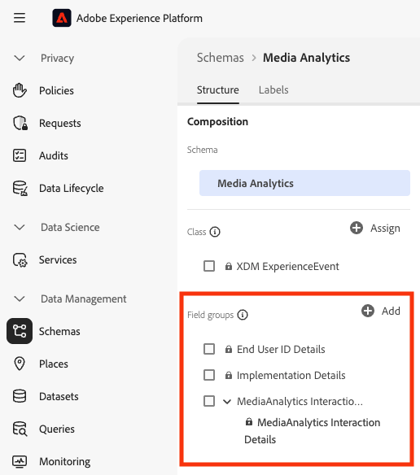
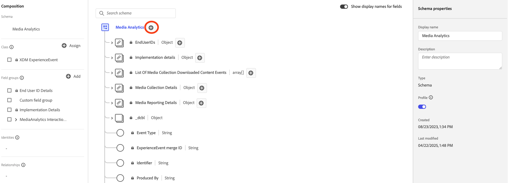

# Implementar la recopilación de medios de streaming con Edge Network

La red Edge de Adobe Experience Platform le permite enviar datos destinados a varios productos a una ubicación centralizada. Experience Edge reenvía la información adecuada a los productos deseados. Este concepto le permite consolidar los esfuerzos de implementación, especialmente abarcando varias soluciones de datos.

El siguiente gráfico ilustra cómo se puede implementar el complemento de recopilación de medios de streaming para utilizar Experience Platform Edge y hacer que los datos estén disponibles en Analysis Workspace, ya sea en Adobe Analytics o en Customer Journey Analytics:

Para obtener una descripción general de todas las opciones de implementación, incluidos los métodos de implementación que no utilizan Experience Platform Edge, consulte [Implementación de servicios de medios de transmisión para Adobe Analytics o Customer Journey Analytics](/help/implementation/overview.md).

Independientemente de si utiliza Adobe Experience Platform Web SDK, Adobe Experience Platform Mobile SDK, Adobe Experience Platform Roku SDK o la API para implementar la recopilación de medios de streaming con Experience Edge, primero debe completar las secciones siguientes:

## Configuración del esquema en Adobe Experience Platform

Para estandarizar la recopilación de datos para su uso en todas las aplicaciones que aprovechan Adobe Experience Platform, Adobe ha creado el estándar abierto y documentado públicamente, Modelo de datos de experiencia (XDM).

Para crear y configurar un esquema:

1. En Adobe Experience Platform, empiece a crear el esquema como se describe en [Crear y editar esquemas en la interfaz de usuario](https://experienceleague.adobe.com/docs/experience-platform/xdm/ui/resources/schemas.html?lang=en).

1. En la página Detalles del esquema al crear el esquema, elija [!UICONTROL **Evento de experiencia**] al elegir la clase base para el esquema.

   

1. Seleccione [!UICONTROL **Siguiente**].

1. Especifique un nombre para mostrar y una descripción de esquema y, a continuación, seleccione [!UICONTROL **Finalizar**].

1. En el área [!UICONTROL **Composición**], en la sección [!UICONTROL **Grupos de campos**], seleccione [!UICONTROL **Agregar**] y, a continuación, busque y agregue los siguientes grupos de campos nuevos al esquema:
   * `End User ID Details`
   * `Implementation Details`
   * `MediaAnalytics Interaction Details`

   Después de agregar los grupos de campos, deben mostrarse en la sección [!UICONTROL **Grupos de campos**] de la siguiente manera:

   

1. Seleccione [!UICONTROL **Guardar**] para guardar los cambios.

1. (Opcional) Puede ocultar determinados campos que no utiliza la API de Media Edge. Al ocultar estos campos, el esquema es más fácil de leer y comprender, pero no es obligatorio. Estos campos solo hacen referencia a los del grupo de campos `MediaAnalytics Interaction Details`.

   +++ Amplíe aquí para ver las instrucciones de los campos que puede ocultar.

   1. En el área [!UICONTROL **Estructura**], seleccione el campo `Media Collection Details` y luego seleccione [!UICONTROL **Administrar campos relacionados**].

      

   1. Habilite la opción para [!UICONTROL **Mostrar nombres para mostrar en los campos**] y, a continuación, actualice el esquema de la siguiente manera:

      * En el campo `Media Collection Details` > `Advertising Details`, oculte los siguientes campos de informe: `Ad Completed`, `Ad Started` y `Ad Time Played`.

      * En el campo `Media Collection Details` > `Advertising Pod Details`, oculte el siguiente campo de informe: `Ad Break ID`

      * En el campo `Media Collection Details` > `Chapter Details`, oculte los siguientes campos de informe: `Chapter Completed`, `Chapter ID`, `Chapter Started` y `Chapter Time Played`.

      * En el campo `Media Collection Details`, oculte el campo `List Of States`.

        

      * En el campo `Media Collection Details` > `List Of States End` y `Media Collection Details` > `List Of States Start`, oculte los siguientes campos de informe: `Player State Count`, `Player State Set` y `Player State Time`.

        

      * En el campo `Media Collection Details` > `Qoe Data Details`, oculte los siguientes campos de informe: `Average Bitrate`, `Average Bitrate Bucket`, `Bitrate Change Impacted Streams`, `Bitrate Changes`, `Buffer Impacted Streams`, `Buffer Events`, `Dropped Frame Impacted Streams`, `Drops Before Starts`, `Errors`, `External Error IDs`, `Error Impacted Streams`, `Media SDK Error IDs`, `Player SDK Error IDs`, `Stalling Impacted Streams`, `Stalling Events`, `Total Buffer Duration` y `Total Stalling Duration`.

      * En el campo `Media Collection Details` > `Session Details`, oculte los siguientes campos de informe: `10% Progress Marker`, `25% Progress Marker`, `50% Progress Marker`, `75% Progress Marker`, `95% Progress Marker`, `Ad Count`, `Average Minute Audience`, `Content Completes`, `Chapter Count`, `Content Starts`, `Content Time Spent`, `Estimated Streams`, `Federated Data`, `Media Segment Views`, `Media Downloaded Flag`, `Media Starts`, `Media Session ID`, `Media Session Server Timeout`, `Media Time Spent`, `Pause Events`, `Pause Impacted Streams`, `Pev3`, `Pccr`, `Total Pause Duration`, `Unique Time Played` y `Video Segment`.

   1. Seleccione [!UICONTROL **Confirmar**] para guardar los cambios.

   1. En el área [!UICONTROL **Estructura**], habilite la opción para [!UICONTROL **Mostrar nombres para mostrar para los campos**] y, a continuación, seleccione el campo `List Of Media Collection Downloaded Content Events`.

   1. Seleccione [!UICONTROL **Administrar campos relacionados**] y, a continuación, actualice el esquema de la siguiente manera:

      * En el campo `List Of Media Collection Downloaded Content Events` > `Media Details` > `Advertising Details`, oculte los siguientes campos de informe: `Ad Completed`, `Ad Started` y `Ad Time Played`.

      * En el campo `List Of Media Collection Downloaded Content Events` > `Media Details` > `Advertising Pod Details`, oculte el siguiente campo de informe: `Ad Break ID`

      * En el campo `List Of Media Collection Downloaded Content Events` > `Media Details` > `Chapter Details`, oculte los siguientes campos de informe: `Chapter Completed`, `Chapter ID`, `Chapter Started` y `Chapter Time Played`.

      * En el campo `List Of Media Collection Downloaded Content Events` > `Media Details`, oculte el campo `List Of States`.

      * En el campo `List Of Media Collection Downloaded Content Events` > `Media Details` > `List Of States End` y `Media Collection Details` > `List Of States Start`, oculte los siguientes campos de informe: `Player State Count`, `Player State Set` y `Player State Time`.

      * En el campo `List Of Media Collection Downloaded Content Events` > `Media Details` > `Qoe Data Details`, oculte los siguientes campos de informe: `Average Bitrate`, `Average Bitrate Bucket`, `Bitrate Change Impacted Streams`, `Bitrate Changes`, `Buffer Events`, `Buffer Impacted Streams`, `Drops Before Starts`, `Dropped Frame Impacted Streams`, `Error Impacted Streams`, `Errors`, `External Error IDs`, `Media SDK Error IDs`, `Player SDK Error IDs`, `Stalling Events`, `Stalling Impacted Streams`, `Total Buffer Duration` y `Total Stalling Duration`.

      * En el campo `List Of Media Collection Downloaded Content Events` > `Media Details` > `Session Details`, oculte los siguientes campos de informe: `10% Progress Marker`, `25% Progress Marker`, `50% Progress Marker`, `75% Progress Marker`, `95% Progress Marker`, `Ad Count`, `Average Minute Audience`, `Chapter Count`, `Content Completes`, `Content Starts`, `Content Time Spent`, `Estimated Streams`, `Federated Data`, `Media Downloaded Flag`, `Media Segment Views`, `Media Session ID`, `Media Session Server Timeout`, `Media Starts`, `Media Time Spent`, `Pause Events`, `Pause Impacted Streams`, `Pccr`, `Pev3`, `Total Pause Duration`, `Unique Time Played` y `Video Segment`.

      * En el campo `List Of Media Collection Downloaded Content Events` > `Media Details`, oculte el campo `Media Session ID`.

   1. Seleccione [!UICONTROL **Confirmar**] para guardar los cambios.

   1. En el área [!UICONTROL **Estructura**], seleccione el campo `Media Reporting Details` y seleccione [!UICONTROL **Administrar campos relacionados**].

   1. Habilite la opción para [!UICONTROL **Mostrar nombres para mostrar en los campos**] y, a continuación, actualice el esquema de la siguiente manera:

      * En el campo `Media Reporting Details`, oculte los campos siguientes: `Error Details`, `List Of States End`, `List of States Start` y `Media Session ID`.

   1. Seleccione [!UICONTROL **Confirmar**] > [!UICONTROL **Guardar**] para guardar los cambios.

   +++

1. (Opcional) Puede agregar metadatos personalizados al esquema. Esto le permite incluir metadatos adicionales definidos por el usuario que se pueden personalizar para necesidades o contextos específicos. Esta flexibilidad es útil en situaciones en las que los esquemas existentes no cubren los puntos de datos deseados. (También puede trabajar con metadatos personalizados con las API de Media Edge. Para obtener más información, consulte [Crear metadatos personalizados con las API de Media Edge](https://developer.adobe.com/cja-apis/docs/endpoints/media-edge/custom-metadata/).)

   +++ Amplíe aquí para ver instrucciones sobre cómo agregar metadatos personalizados al esquema.

   1. Busque el nombre del inquilino de la organización seleccionando [!UICONTROL **Información de la cuenta**] > [!UICONTROL **Organizaciones asignadas**] > [!UICONTROL _**nombre de la organización**_] > [!UICONTROL **inquilino**].

      Estos campos personalizados se recibirán a través de esta ruta. (Por ejemplo, nombre de inquilino: _dcbl → ruta myCustomField: _dcbl.myCustomField).

   1. Agregue un grupo de campos personalizados al esquema de medios definido.

      

   1. Agregue al grupo de campos los campos personalizados que desee rastrear.

      

   1. [Use la ruta generada](https://experienceleague.adobe.com/en/docs/experience-platform/xdm/ui/fields/overview#type-specific-properties) para el campo personalizado en la carga de la solicitud.

      

   +++

1. Continúe con [Crear un conjunto de datos en Adobe Experience Platform](#create-a-dataset-in-adobe-experience-platform).

## Creación de un conjunto de datos en Adobe Experience Platform

1. Asegúrese de configurar un esquema como se describe en [Configurar el esquema en Adobe Experience Platform](#set-up-the-schema-in-adobe-experience-platform).

1. En Adobe Experience Platform, empiece a crear el conjunto de datos como se describe en [Guía de la interfaz de usuario de conjuntos de datos](https://experienceleague.adobe.com/docs/experience-platform/catalog/datasets/user-guide.html?lang=es#create).

   Al seleccionar un esquema para su conjunto de datos, elija el esquema que creó anteriormente, tal como se describe en [Configurar el esquema en Adobe Experience Platform](#set-up-the-schema-in-adobe-experience-platform).

1. Continúe con [Configuración de una secuencia de datos en Customer Journey Analytics](#configure-a-datastream-in-adobe-experience-platform).

## Configuración de una secuencia de datos en Adobe Experience Platform

1. Asegúrese de crear un conjunto de datos como se describe en [Crear un conjunto de datos en Adobe Experience Platform](#create-a-dataset-in-adobe-experience-platform).

1. Cree una nueva secuencia de datos como se describe en [Configurar una secuencia de datos](https://experienceleague.adobe.com/docs/experience-platform/edge/datastreams/overview.html?lang=es).

   Al crear la secuencia de datos, asegúrese de realizar las siguientes selecciones de configuración:

   * En el campo [!UICONTROL **Esquema de evento**] al crear la secuencia de datos, asegúrese de seleccionar el esquema que creó en [Configurar el esquema en Adobe Experience Platform](#set-up-the-schema-in-adobe-experience-platform). Seleccione [!UICONTROL **Guardar**].

     >[!IMPORTANT]
     >
     >No seleccione [!UICONTROL **Guardar y agregar asignación**] porque si lo hace se producirán errores de asignación para el campo Marca de tiempo.

     

   * Agregue cualquiera de los siguientes servicios al conjunto de datos, en función de si utiliza Adobe Analytics o Customer Journey Analytics:

      * [!UICONTROL **Adobe Analytics**] (si usa Adobe Analytics)

        Si usa Adobe Analytics, asegúrese de definir un grupo de informes, tal como se describe en [Crear un grupo de informes](https://experienceleague.adobe.com/en/docs/analytics/admin/admin-tools/manage-report-suites/c-new-report-suite/t-create-a-report-suite).

      * [!UICONTROL **Adobe Experience Platform**] (si usa Customer Journey Analytics)

     Para obtener información acerca de cómo agregar un servicio a un conjunto de datos, vea la sección &quot;Agregar servicios a un conjunto de datos&quot; en [Configurar un conjunto de datos](https://experienceleague.adobe.com/docs/experience-platform/edge/datastreams/configure.html?lang=en#view-details).

     

      * Expanda [!UICONTROL **Opciones avanzadas**] y, a continuación, habilite la opción [!UICONTROL **Media Analytics**].

     

1. Ya está listo para implementar la [API de Media Edge](/help/implementation/edge/implementation-edge-api.md) o [SDK de Media Edge](/help/implementation/edge/edge-mobile-sdk.md) para empezar a recopilar datos de análisis de medios.

   Después de haber recopilado algunos datos, puede [Crear una conexión en Customer Journey Analytics](#create-a-connection-in-customer-journey-analytics).

## Crear una conexión en Customer Journey Analytics

>[!NOTE]
>
>El siguiente procedimiento solo es necesario si utiliza Customer Journey Analytics.

1. Asegúrese de crear una secuencia de datos como se describe en [Configurar una secuencia de datos en Customer Journey Analytics](#configure-a-datastream-in-adobe-experience-platform).

1. En Customer Journey Analytics, cree una conexión como se describe en [Crear una conexión](https://experienceleague.adobe.com/docs/analytics-platform/using/cja-connections/create-connection.html?lang=es).

   Al crear la conexión, se requieren las siguientes selecciones de configuración para implementar la recopilación de medios de streaming:

   1. Seleccione el conjunto de datos que creó anteriormente, tal como se describe en [Crear un conjunto de datos en Adobe Experience Platform](#create-a-dataset-in-adobe-experience-platform).

   1. Asegúrese de que la opción [!UICONTROL **Importar todos los datos nuevos**] esté habilitada.

1. Continuar con [Crear una vista de datos en Customer Journey Analytics](#create-a-new-data-view-in-customer-journey-analytics).

## Creación de una vista de datos en Customer Journey Analytics

>[!NOTE]
>
>El siguiente procedimiento solo es necesario si utiliza Customer Journey Analytics.

1. Asegúrese de haber creado una conexión en Customer Journey Analytics como se describe en [Crear una conexión en Customer Journey Analytics](#create-a-connection-in-customer-journey-analytics).

1. En Customer Recorrido Analytics, cree una vista de datos como se describe en [Crear o editar una vista de datos](https://experienceleague.adobe.com/docs/analytics-platform/using/cja-dataviews/create-dataview.html?lang=es).

   Al crear la vista de datos, se requieren las siguientes selecciones de configuración para implementar la recopilación de medios de streaming:

   1. En el campo [!UICONTROL **Conexión**], seleccione la conexión que creó anteriormente, tal como se describe en [Crear una conexión en Customer Journey Analytics](#create-a-connection-in-customer-journey-analytics).

      La conexión que ha creado puede tardar hasta 15 minutos en estar disponible para su selección.

   1. En la ficha [!UICONTROL **Componentes**], en la sección [!UICONTROL **Campos de esquema**], busque cada componente enumerado en las tablas siguientes y arrástrelo al panel [!UICONTROL **Métricas**]. Si existen varios campos con el mismo nombre, utilice la ruta XDM para asegurarse de que sea el campo correcto.

      **Contenido principal - Métricas de contenido**

      | Nombre del componente | Ruta de XDM |
      |----------|---------|
      | Inicios de contenidos | mediaReporting.sessionDetails.isViewed |
      | Vistas de segmentos de medios | mediaReporting.sessionDetails.hasSegmentView |
      | Inicio de contenido | mediaReporting.sessionDetails.isPlayed |
      | Finalización de contenido | mediaReporting.sessionDetails.isCompleted |
      | Tiempo invertido en contenido | mediaReporting.sessionDetails.timePlayed |
      | Tiempo invertido en contenido | mediaReporting.sessionDetails.totalTimePlayed |
      | Tiempo de reproducción única | mediaReporting.sessionDetails.uniqueTimePlayed |
      | Marcador de progreso del 10% | mediaReporting.sessionDetails.hasProgress10 |
      | Promedio de audiencia por minuto | mediaReporting.sessionDetails.averageMinuteAudience |

      **Capítulo y anuncios - Métricas de capítulo y anuncios**

      | Nombre del componente | Ruta de XDM |
      |----------|---------|
      | Capítulo iniciado | mediaReporting.chapterDetails.isStarted |
      | Capítulo completado | mediaReporting.chapterDetails.isCompleted |
      | Tiempo de reproducción del capítulo | mediaReporting.chapterDetails.timePlayed |
      | Anuncio iniciado | mediaReporting.advertisingDetails.isStarted |
      | Anuncio completado | mediaReporting.advertisingDetails.isCompleted |
      | Tiempo de reproducción del anuncio | mediaReporting.advertisingDetails.timePlayed |

      **QoE - métricas de QoE**

      | Nombre del componente | Ruta de XDM |
      |----------|---------|
      | Tiempo para el inicio | mediaReporting.qoeDataDetails.timeToStart |
      | Pérdidas antes del inicio | mediaReporting.qoeDataDetails.isDroppedBeforeStart |
      | Flujos afectados por el búfer | mediaReporting.qoeDataDetails.hasBufferImpactedStreams |
      | Flujos afectados por el cambio en la velocidad de bits | mediaReporting.qoeDataDetails.hasBitrateChangeImpactedStreams |
      | Cambios en la velocidad de bits | mediaReporting.qoeDataDetails.bitrateChangeCount |
      | Velocidad de bits media | mediaReporting.qoeDataDetails.bitrateAverage |
      | Fotogramas perdidos | mediaReporting.qoeDataDetails.droppedFrames |
      | Errores | mediaReporting.qoeDataDetails.errorCount |
      | Flujos afectados por el error | mediaReporting.qoeDataDetails.hasErrorImpactedStreams |
      | Flujos afectados por la pérdida de cuadros | mediaReporting.qoeDataDetails.hasDroppedFrameImpactedStreams |

      **Estado del reproductor - Métricas de estado del reproductor**

      | Nombre del componente | Ruta de XDM |
      |----------|---------|
      | Conjunto de estado del reproductor | mediaReporting.states.isSet |
      | Recuento de estados del reproductor | mediaReporting.states.count |
      | Hora de estado del reproductor | mediaReporting.states.time |

   1. Actualice las etiquetas (en el menú desplegable [!UICONTROL **Context labels**]) de los componentes de la siguiente tabla. Busque y arrastre cualquier componente que no esté ya en el panel de métricas al panel.

      | Nombre del componente | Etiqueta de contexto |
      |---------|----------|
      | Tiempo de espera del servidor de sesión multimedia | Medios: Segundos desde la última llamada |
      | Tiempo invertido en contenido | Medios: tiempo invertido en contenido |
      | Duración total del búfer | Medios: Duración total del búfer |
      | Tiempo para el inicio | Medios: tiempo para el inicio |
      | Duración de la pausa | Medios: Duración total de la pausa |

   1. Para agregar desgloses al proyecto de Customer Journey Analytics, agregue las siguientes dimensiones al panel [!UICONTROL **Dimensiones**]:

      | Ruta de XDM | Nombre del componente |
      |---------|----------|
      | mediaReporting.states.name | Nombre del estado del reproductor |
      | mediaReporting.sessionDetails.ID | ID de sesión de contenidos |

      Además de las dimensiones de esta tabla, puede agregar cualquier otra dimensión que desee que esté disponible para filtrar datos en proyectos de Customer Journey Analytics.

1. Seleccione [!UICONTROL **Guardar y continuar**] > [!UICONTROL **Guardar y finalizar**] para guardar los cambios.

1. Continúe con [Crear y configurar un proyecto en Customer Journey Analytics](#create-and-configure-a-project-in-customer-journey-analytics).

## Creación y configuración de un proyecto en Customer Journey Analytics

1. Asegúrese de haber creado una vista de datos en Customer Journey Analytics como se describe en [Crear una vista de datos en Customer Journey Analytics](#create-a-new-data-view-in-customer-journey-analytics).

1. En Customer Journey Analytics, en la ficha [!UICONTROL **Workspace**], en el área de [!UICONTROL **Proyectos**], seleccione [!UICONTROL **Crear proyecto**].

1. Seleccione [!UICONTROL **Proyecto en blanco**] > [!UICONTROL **Crear**].

1. En el nuevo proyecto, seleccione la vista de datos que creó anteriormente.

   Al crear paneles en el proyecto, puede usar cualquier componente que haya agregado a la vista de datos, tal como se describe en [Crear una vista de datos en Customer Journey Analytics](#create-a-new-data-view-in-customer-journey-analytics).

   Los siguientes 4 paneles son ejemplos de paneles que puede crear:

   

   

   

   

1. Seleccione el icono **Paneles** en el carril izquierdo y, a continuación, arrastre el panel [!UICONTROL **Visualizadores simultáneos de medios**] y el panel [!UICONTROL **Tiempo invertido en la reproducción de medios**].

   Los dos paneles deben tener un aspecto similar al siguiente:

   

   

1. (Condicional) Si agregó metadatos personalizados al esquema, tal como se describe en el paso 8 de [Configurar el esquema en Adobe Experience Platform](#set-up-the-schema-in-adobe-experience-platform), necesitará establecer la persistencia para los campos personalizados, tal como se describe en [Configuración del componente de persistencia](https://experienceleague.adobe.com/es/docs/analytics-platform/using/cja-dataviews/component-settings/persistence) en la guía de Customer Journey Analytics.

   Cuando los datos lleguen a Customer Journey Analytics, estará disponible la dimensión de ID de usuario personalizado.

   

   >[!NOTE]
   >
   >Si configura Adobe Analytics como flujo ascendente para el conjunto de datos, los metadatos personalizados también están presentes en ContextData, con el nombre que establezca en el esquema (sin el prefijo de inquilino, por ejemplo myCustomField). Esto permite usar todas las características de Adobe Analytics disponibles para ContextData, como [crear una regla de procesamiento](https://experienceleague.adobe.com/en/docs/analytics/admin/admin-tools/manage-report-suites/edit-report-suite/report-suite-general/c-processing-rules/processing-rules).

1. Comparta el proyecto como se describe en [Compartir proyectos](https://experienceleague.adobe.com/docs/analytics-platform/using/cja-workspace/curate-share/share-projects.html?lang=en).

   >[!NOTE]
   >
   >   Si los usuarios con los que desea compartir no están disponibles, asegúrese de que los usuarios tengan acceso de usuario y administrador a Customer Journey Analytics en Adobe Admin Console.

1. Continúe con [Enviar datos a Experience Platform Edge](#send-data-to-experience-platform-edge).

## Envío de datos a Experience Platform Edge

Según el tipo de datos que desee enviar a Experience Platform Edge, puede utilizar cualquiera de los siguientes métodos:

### Web: Uso de Adobe Experience Platform Web SDK

* [Introducción](https://developer.adobe.com/client-sdks/documentation/media-for-edge-network/)

* [Envío de datos web a Edge con Adobe Experience Platform Web SDK](/help/implementation/edge/edge-web-sdk.md)

* [Migrar a Adobe Streaming Media para la extensión de Edge Network](https://developer.adobe.com/client-sdks/documentation/adobe-media-analytics/migration-guide/)

### Móvil: usar Adobe Experience Platform Mobile SDK

Utilice los siguientes recursos de documentación para completar la implementación tanto para iOS como para Android:

* [Introducción](https://developer.adobe.com/client-sdks/documentation/media-for-edge-network/)

* [Referencia de API](https://developer.adobe.com/client-sdks/documentation/media-for-edge-network/api-reference/)

* [Migrar a Adobe Streaming Media para la extensión de Edge Network](https://developer.adobe.com/client-sdks/documentation/adobe-media-analytics/migration-guide/)

### Roku: Adobe Experience Platform Roku SDK

* [Introducción](https://developer.adobe.com/client-sdks/documentation/media-for-edge-network/)

* [Adobe Experience Platform Roku SDK](https://github.com/adobe/aepsdk-roku/tree/main)

* [Migrar a Adobe Streaming Media para la extensión de Edge Network](https://developer.adobe.com/client-sdks/documentation/adobe-media-analytics/migration-guide/) <!-- is the information here also applicable for Roku? -->

### API: web y otros

Actualmente, la API es la única forma admitida de enviar datos web a Experience Platform Edge.

La API también está disponible si desea utilizar una implementación personalizada de las API de Edge.

Para obtener más información sobre la API de Media Edge, consulte los siguientes recursos:

* [Resumen de la API de Media Edge](https://experienceleague.adobe.com/docs/experience-platform/edge-network-server-api/media-edge-apis/overview.html)

* [Introducción a la API de Media Edge](https://experienceleague.adobe.com/docs/experience-platform/edge-network-server-api/media-edge-apis/getting-started.html)

* [Guía de solución de problemas de API de Media Edge](https://experienceleague.adobe.com/docs/experience-platform/edge-network-server-api/media-edge-apis/troubleshooting.html)

* [Uso del archivo de especificación de API abierta para las API de Media Edge](https://developer.adobe.com/data-collection-apis/docs/api/media-edge/)
