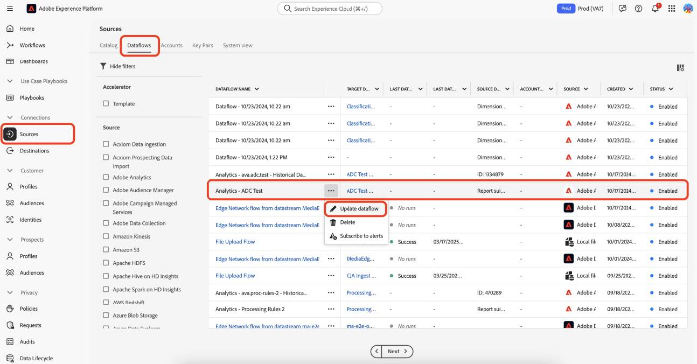
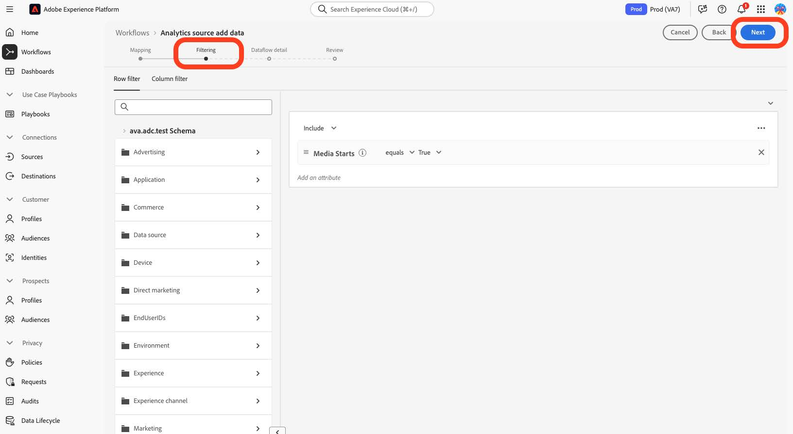
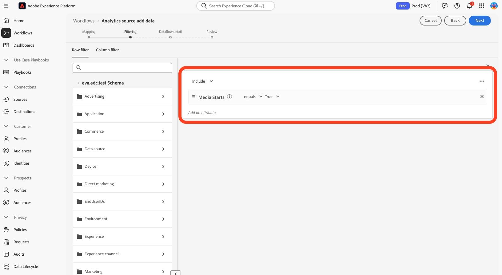
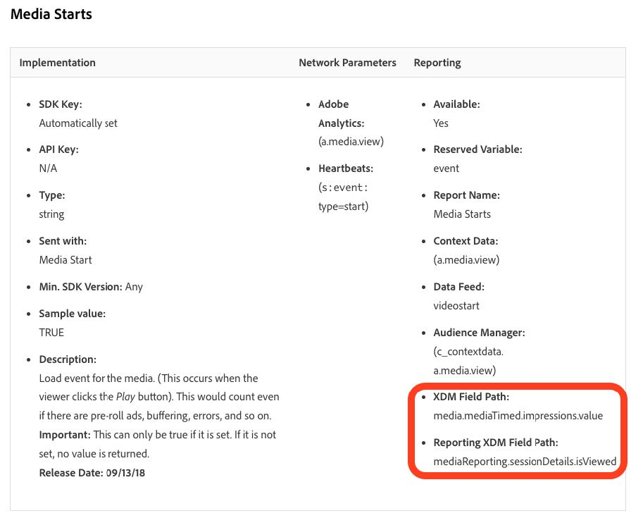
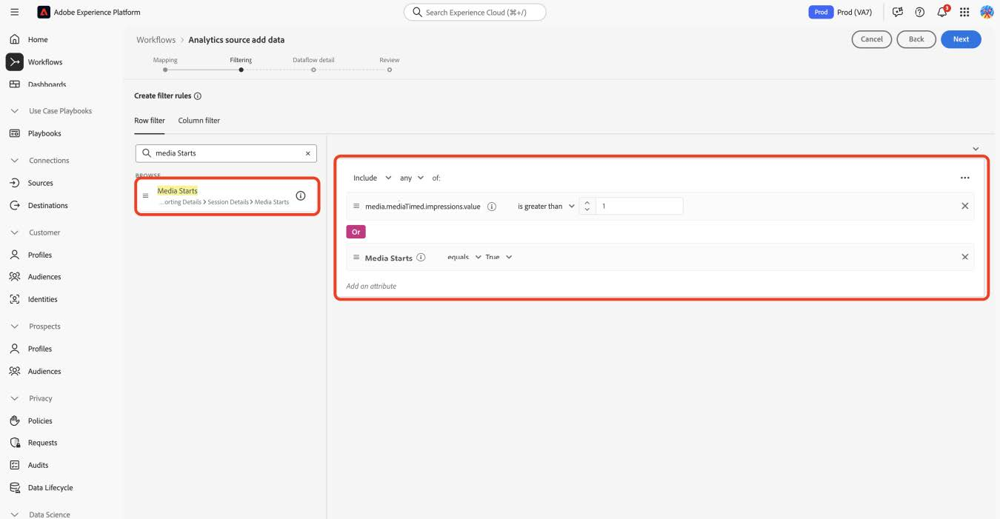

# Migración de perfiles a los nuevos campos de medios de streaming

En este documento se describe el proceso de migración del servicio de filtrado de perfiles que existe sobre los flujos de recopilación de datos de Adobe habilitados para Adobe Analytics para datos de medios de streaming. La migración convierte el servicio de filtrado de perfiles de usar el tipo de datos de los servicios de medios de streaming de Adobe denominado &quot;Medios&quot; a fin de usar el nuevo tipo de datos correspondiente denominado &quot;[Detalles de informes de medios](https://experienceleague.adobe.com/en/docs/experience-platform/xdm/data-types/media-reporting-details)&quot;.

## Migración de perfiles

Para migrar el filtrado de perfiles del tipo de datos anterior denominado &quot;Medios&quot; al nuevo tipo de datos denominado &quot;[Detalles de informes de medios](https://experienceleague.adobe.com/en/docs/experience-platform/xdm/data-types/media-reporting-details)&quot;, debe editar las reglas de filtrado de perfiles existentes:

1. En Adobe Experience Platform, en la sección **[!UICONTROL Sources]**, vaya a la pestaña **[!UICONTROL Dataflows]**.

1. Busque el flujo de datos responsable de importar los datos de medios de streaming de Adobe Analytics a Adobe Experience Platform mediante la recopilación de datos de Adobe.

1. Seleccione **[!UICONTROL Actualizar flujo de datos]** para modificar la configuración del filtrado de perfiles reemplazando cada regla personalizada que contenga un campo obsoleto con el nuevo campo correspondiente del nuevo objeto XDM.

1. Busque los filtros que contienen campos del objeto &quot;Medios&quot; obsoleto.

1. Anexe esos filtros añadiendo campos del nuevo objeto &quot;Detalles de creación de informes de contenidos&quot;.

1. Utilice un operador OR entre los dos campos;

1. Compruebe que los perfiles siguen funcionando según lo esperado.

Consulte el parámetro [Content ID](/help/reporting/dimensions/content.md) y el resto de las variables de medios de streaming documentadas en [Servicios de medios de streaming](/help/media-overview.md) para asignar entre los campos antiguos y los campos nuevos. La ruta de campo antigua se encuentra en la propiedad &quot;Ruta de campo XDM&quot;, mientras que la nueva ruta de campo se puede encontrar en la propiedad &quot;Ruta de campo XDM de creación de informes&quot;.

## Ejemplo

Para facilitar el seguimiento de las directrices de migración, tenga en cuenta el siguiente ejemplo de flujo de datos que contiene una sola regla de filtrado de perfil. En este caso, como solo hay una regla, debe aplicar las directrices de migración solo una vez.

1. En Adobe Experience Platform, en la sección **[!UICONTROL Sources]**, vaya a la pestaña **[!UICONTROL Dataflows]**.

1.Localice el flujo de datos responsable de importar los datos de medios de streaming de Adobe Analytics a Adobe Experience Platform a través de Adobe Analytics.

1. Seleccione **[!UICONTROL Actualizar flujo de datos]** para ingresar a la interfaz de usuario de edición como se muestra en la siguiente imagen.

   

1. Seleccione **[!UICONTROL Siguiente]** para ir a la ficha Filtrado.

   

1. En la ficha **[!UICONTROL Filtrado]**, identifique las reglas de filtrado que dependen de `media.mediaTimed` campos.

   

   Para cada filtro que use el objeto media.mediaTimed, busque su correspondiente en el objeto `mediaReporting` usando las variables de medios de transmisión documentadas en [Servicios de medios de transmisión](/help/media-overview.md) para asignar entre los campos antiguos y los campos nuevos. La ruta de campo antigua se encuentra en la propiedad &quot;Ruta de campo XDM&quot;, mientras que la nueva ruta de campo se encuentra en la propiedad &quot;Ruta de campo XDM de creación de informes&quot;. Por ejemplo, para [Inicios de medios](/help/reporting/metrics/media-starts.md), el corresponsal de `media.mediaTimed.impressions.value` es `xdm.mediaReporting.sessionDetails.isViewed`.

   

1. Arrastre el campo `mediaReporting` correspondiente a la regla de filtrado y utilice el operador OR entre las dos reglas. Añada la misma regla que la existente al utilizar el nuevo campo.

   

1. Seleccione **[!UICONTROL Siguiente]** para guardar los cambios.
