# Información general sobre la implementación Edge

Adobe Experience Platform Edge Network permite enviar datos destinados a varios productos a un único extremo, que a su vez reenvía la información adecuada a cada producto. Esto consolida el esfuerzo de implementación en varias soluciones de datos y es la forma recomendada de implementar la recopilación de medios de streaming tanto para Adobe Analytics como para Customer Journey Analytics.

Independientemente del código base que utilice (Web SDK, Mobile SDK (iOS o Android), Roku SDK o la API de Media Edge), primero debe completar la configuración de la plataforma que se describe en esta página: crear un esquema, crear un conjunto de datos y configurar un conjunto de datos.

## Requisitos previos

1. **Complete los requisitos previos generales.** Consulte los [requisitos previos generales](/help/getting-started/prereqs.md).

1. **Confirmar una solución de Adobe compatible.** Debe tener una implementación de Customer Journey Analytics, Adobe Analytics, Adobe Journey Optimizer o Real-Time Customer Data Platform en funcionamiento:
   * [Guía de Customer Journey Analytics](https://experienceleague.adobe.com/docs/analytics-platform/using/cja-landing.html?lang=es)
   * [Implementación de Adobe Analytics](https://experienceleague.adobe.com/docs/analytics/implementation/home.html?lang=es)
   * [Documentación de Adobe Journey Optimizer](https://experienceleague.adobe.com/docs/journey-optimizer.html?lang=es)
   * [Documentación de Real-Time Customer Data Platform](https://experienceleague.adobe.com/docs/real-time-customer-data-platform.html)

## Configuración del esquema en Adobe Experience Platform

Para estandarizar la recopilación de datos en todas las aplicaciones que utilizan Adobe Experience Platform, Adobe ha creado el estándar abierto y documentado públicamente Experience Data Model (XDM).

1. En Adobe Experience Platform, empiece a crear el esquema como se describe en [Crear y editar esquemas en la interfaz de usuario](https://experienceleague.adobe.com/docs/experience-platform/xdm/ui/resources/schemas.html?lang=en).

1. En la página Detalles del esquema, elija **[!UICONTROL Evento de experiencia]** como clase base para el esquema.

   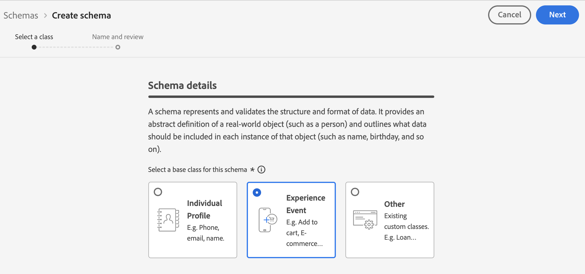

1. Seleccione **[!UICONTROL Siguiente]**.

1. Especifique un nombre para mostrar y una descripción de esquema y, a continuación, seleccione **[!UICONTROL Finalizar]**.

1. En el área **[!UICONTROL Composición]**, en la sección **[!UICONTROL Grupos de campos]**, seleccione **[!UICONTROL Agregar]** y, a continuación, busque y agregue los siguientes grupos de campos al esquema:
   * `End User ID Details`
   * `Implementation Details`
   * `MediaAnalytics Interaction Details`

   Después de agregar los grupos de campos, se muestran en la sección **[!UICONTROL Grupos de campos]**:

   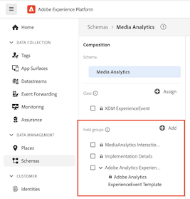

1. Seleccione **[!UICONTROL Guardar]** para guardar los cambios.

1. (Opcional) Puede ocultar determinados campos que no utiliza la API de Media Edge. Al ocultar estos campos, el esquema es más fácil de leer, pero no es obligatorio. Estos campos solo hacen referencia a los del grupo de campos `MediaAnalytics Interaction Details`.

   +++ Amplíe para ver las instrucciones de los campos que puede ocultar.

   1. En el área **[!UICONTROL Estructura]**, seleccione el campo `Media Collection Details` y luego seleccione **[!UICONTROL Administrar campos relacionados]**.

      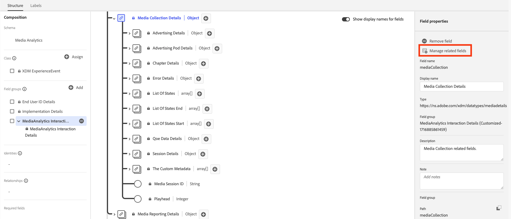

   1. Habilite la opción para **[!UICONTROL Mostrar nombres para mostrar en los campos]** y, a continuación, actualice el esquema de la siguiente manera:

      * En el campo `Media Collection Details` > `Advertising Details`, oculte los siguientes campos de informe: `Ad Completed`, `Ad Started` y `Ad Time Played`.

      * En el campo `Media Collection Details` > `Advertising Pod Details`, oculte el siguiente campo de informe: `Ad Break ID`

      * En el campo `Media Collection Details` > `Chapter Details`, oculte los siguientes campos de informe: `Chapter Completed`, `Chapter ID`, `Chapter Started` y `Chapter Time Played`.

      * En el campo `Media Collection Details`, oculte el campo `List Of States`.

        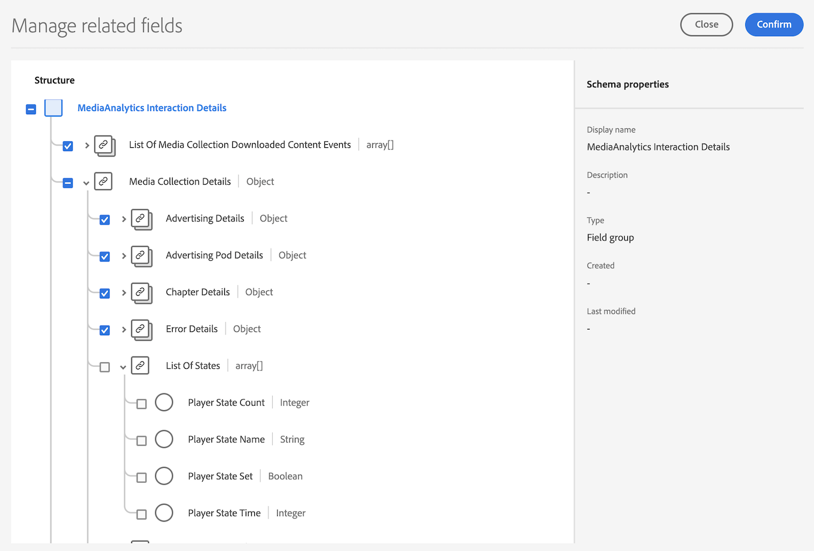

      * En el campo `Media Collection Details` > `List Of States End` y `Media Collection Details` > `List Of States Start`, oculte los siguientes campos de informe: `Player State Count`, `Player State Set` y `Player State Time`.

        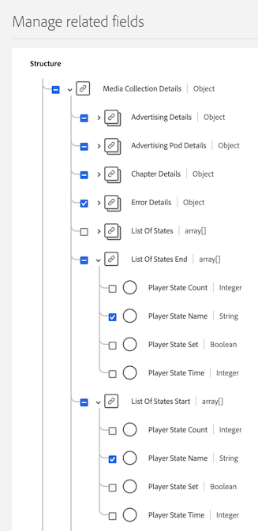

      * En el campo `Media Collection Details` > `Qoe Data Details`, oculte los siguientes campos de informe: `Average Bitrate`, `Average Bitrate Bucket`, `Bitrate Change Impacted Streams`, `Bitrate Changes`, `Buffer Impacted Streams`, `Buffer Events`, `Dropped Frame Impacted Streams`, `Drops Before Starts`, `Errors`, `External Error IDs`, `Error Impacted Streams`, `Media SDK Error IDs`, `Player SDK Error IDs`, `Stalling Impacted Streams`, `Stalling Events`, `Total Buffer Duration` y `Total Stalling Duration`.

      * En el campo `Media Collection Details` > `Session Details`, oculte los siguientes campos de informe: `10% Progress Marker`, `25% Progress Marker`, `50% Progress Marker`, `75% Progress Marker`, `95% Progress Marker`, `Ad Count`, `Average Minute Audience`, `Content Completes`, `Chapter Count`, `Content Starts`, `Content Time Spent`, `Estimated Streams`, `Federated Data`, `Media Segment Views`, `Media Downloaded Flag`, `Media Starts`, `Media Session ID`, `Media Session Server Timeout`, `Media Time Spent`, `Pause Events`, `Pause Impacted Streams`, `Pev3`, `Pccr`, `Total Pause Duration`, `Unique Time Played` y `Video Segment`.

   1. Seleccione **[!UICONTROL Confirmar]** para guardar los cambios.

   1. En el área **[!UICONTROL Estructura]**, habilite la opción para **[!UICONTROL Mostrar nombres para mostrar para los campos]** y, a continuación, seleccione el campo `List Of Media Collection Downloaded Content Events`.

   1. Seleccione **[!UICONTROL Administrar campos relacionados]** y, a continuación, actualice el esquema de la siguiente manera:

      * En el campo `List Of Media Collection Downloaded Content Events` > `Media Details` > `Advertising Details`, oculte los siguientes campos de informe: `Ad Completed`, `Ad Started` y `Ad Time Played`.

      * En el campo `List Of Media Collection Downloaded Content Events` > `Media Details` > `Advertising Pod Details`, oculte el siguiente campo de informe: `Ad Break ID`

      * En el campo `List Of Media Collection Downloaded Content Events` > `Media Details` > `Chapter Details`, oculte los siguientes campos de informe: `Chapter Completed`, `Chapter ID`, `Chapter Started` y `Chapter Time Played`.

      * En el campo `List Of Media Collection Downloaded Content Events` > `Media Details`, oculte el campo `List Of States`.

      * En el campo `List Of Media Collection Downloaded Content Events` > `Media Details` > `List Of States End` y `Media Collection Details` > `List Of States Start`, oculte los siguientes campos de informe: `Player State Count`, `Player State Set` y `Player State Time`.

      * En el campo `List Of Media Collection Downloaded Content Events` > `Media Details` > `Qoe Data Details`, oculte los siguientes campos de informe: `Average Bitrate`, `Average Bitrate Bucket`, `Bitrate Change Impacted Streams`, `Bitrate Changes`, `Buffer Events`, `Buffer Impacted Streams`, `Drops Before Starts`, `Dropped Frame Impacted Streams`, `Error Impacted Streams`, `Errors`, `External Error IDs`, `Media SDK Error IDs`, `Player SDK Error IDs`, `Stalling Events`, `Stalling Impacted Streams`, `Total Buffer Duration` y `Total Stalling Duration`.

      * En el campo `List Of Media Collection Downloaded Content Events` > `Media Details` > `Session Details`, oculte los siguientes campos de informe: `10% Progress Marker`, `25% Progress Marker`, `50% Progress Marker`, `75% Progress Marker`, `95% Progress Marker`, `Ad Count`, `Average Minute Audience`, `Chapter Count`, `Content Completes`, `Content Starts`, `Content Time Spent`, `Estimated Streams`, `Federated Data`, `Media Downloaded Flag`, `Media Segment Views`, `Media Session ID`, `Media Session Server Timeout`, `Media Starts`, `Media Time Spent`, `Pause Events`, `Pause Impacted Streams`, `Pccr`, `Pev3`, `Total Pause Duration`, `Unique Time Played` y `Video Segment`.

      * En el campo `List Of Media Collection Downloaded Content Events` > `Media Details`, oculte el campo `Media Session ID`.

   1. Seleccione **[!UICONTROL Confirmar]** para guardar los cambios.

   1. En el área **[!UICONTROL Estructura]**, seleccione el campo `Media Reporting Details` y luego seleccione **[!UICONTROL Administrar campos relacionados]**.

   1. Habilite la opción para **[!UICONTROL Mostrar nombres para mostrar en los campos]** y, a continuación, actualice el esquema de la siguiente manera:

      * En el campo `Media Reporting Details`, oculte los campos siguientes: `Error Details`, `List Of States End`, `List of States Start` y `Media Session ID`.

   1. Seleccione **[!UICONTROL Confirmar]** > **[!UICONTROL Guardar]** para guardar los cambios.

   +++

1. (Opcional) Puede agregar metadatos personalizados al esquema. Esto permite incluir metadatos adicionales definidos por el usuario para necesidades o contextos específicos. Para obtener más información sobre metadatos personalizados con la API de Media Edge, consulte [Compatibilidad con metadatos personalizados](custom-metadata.md).

   +++ Amplíe para ver instrucciones sobre cómo agregar metadatos personalizados al esquema.

   1. Busque el nombre de inquilino de la organización seleccionando **[!UICONTROL Información de cuenta]** > **[!UICONTROL Organizaciones asignadas]** > [!UICONTROL _**Nombre de organización**_] > **[!UICONTROL inquilino]**.

      Los campos personalizados se reciben a través de esta ruta. (Por ejemplo, nombre de inquilino: _dcbl → ruta myCustomField: _dcbl.myCustomField).

   1. Agregue un grupo de campos personalizados al esquema de medios definido.

      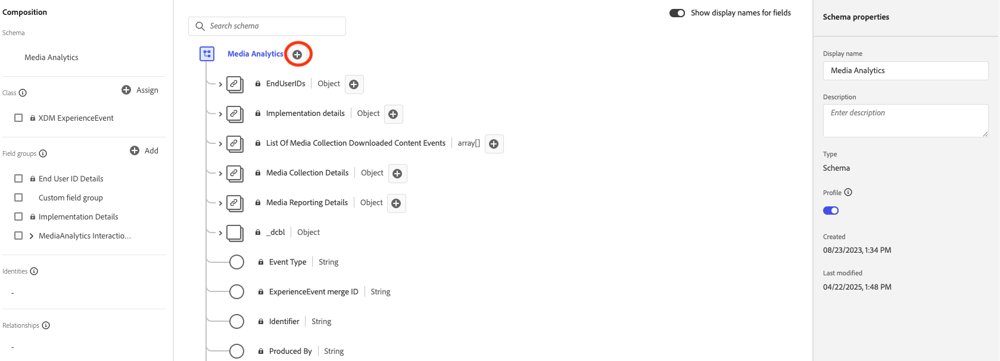

   1. Agregue al grupo de campos los campos personalizados que desee rastrear.

      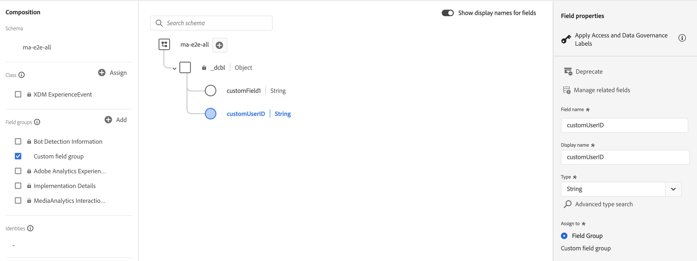

   1. [Use la ruta generada](https://experienceleague.adobe.com/en/docs/experience-platform/xdm/ui/fields/overview#type-specific-properties) para el campo personalizado en la carga de la solicitud.

      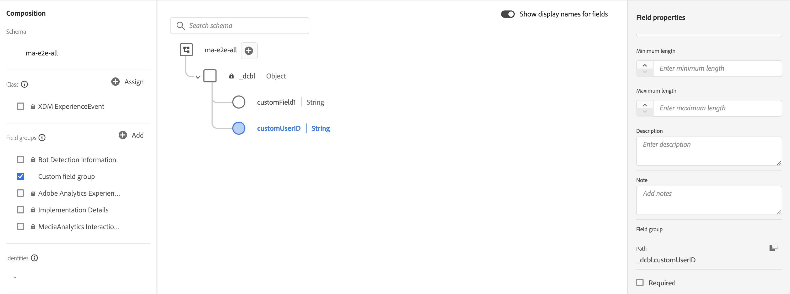

   +++

1. Continúe con [Crear un conjunto de datos en Adobe Experience Platform](#create-a-dataset-in-adobe-experience-platform).

## Creación de un conjunto de datos en Adobe Experience Platform

1. Asegúrese de configurar un esquema como se describe en [Configure el esquema en Adobe Experience Platform](#set-up-the-schema-in-adobe-experience-platform).

1. En Adobe Experience Platform, empiece a crear el conjunto de datos como se describe en la [Guía de IU de conjuntos de datos](https://experienceleague.adobe.com/docs/experience-platform/catalog/datasets/user-guide.html?lang=es#create).

   Al seleccionar un esquema para el conjunto de datos, elija el esquema que creó anteriormente.

1. Continúe con [Configuración de una secuencia de datos en Adobe Experience Platform](#configure-a-datastream-in-adobe-experience-platform).

## Configuración de una secuencia de datos en Adobe Experience Platform

1. Asegúrese de crear un conjunto de datos como se describe en [Crear un conjunto de datos en Adobe Experience Platform](#create-a-dataset-in-adobe-experience-platform).

1. Cree una nueva secuencia de datos como se describe en [Configurar una secuencia de datos](https://experienceleague.adobe.com/docs/experience-platform/edge/datastreams/overview.html?lang=es).

   Al crear la secuencia de datos, realice las siguientes selecciones:

   * En el campo **[!UICONTROL Esquema de evento]**, seleccione el esquema que creó en [Configurar el esquema en Adobe Experience Platform](#set-up-the-schema-in-adobe-experience-platform). Seleccione **[!UICONTROL Guardar]**.

     >[!IMPORTANT]
     >
     >No seleccione **[!UICONTROL Guardar y agregar asignación]**, ya que al hacerlo se producen errores de asignación para el campo Marca de tiempo.

     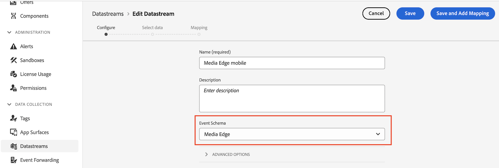

   * Agregue cualquiera de los siguientes servicios al conjunto de datos, en función de si utiliza Adobe Analytics o Customer Journey Analytics:

      * **[!UICONTROL Adobe Analytics]** (si usa Adobe Analytics)

        Si usa Adobe Analytics, defina un grupo de informes como se describe en [Crear un grupo de informes](https://experienceleague.adobe.com/en/docs/analytics/admin/admin-tools/manage-report-suites/c-new-report-suite/t-create-a-report-suite).

      * **[!UICONTROL Adobe Experience Platform]** (si usa Customer Journey Analytics)

     Para obtener información sobre cómo agregar un servicio a un conjunto de datos, vea &quot;Agregar servicios a un conjunto de datos&quot; en [Configurar un conjunto de datos](https://experienceleague.adobe.com/docs/experience-platform/edge/datastreams/configure.html?lang=en#view-details).

     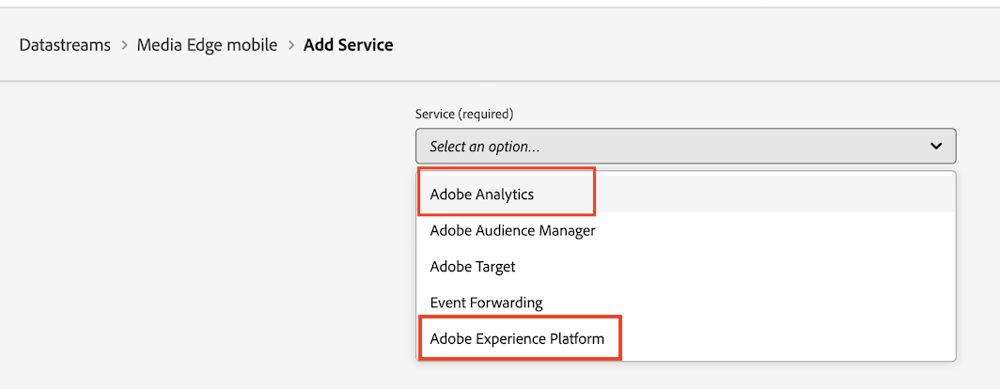

   * Expanda **[!UICONTROL Opciones avanzadas]** y, a continuación, habilite la opción **[!UICONTROL Media Analytics]**.

     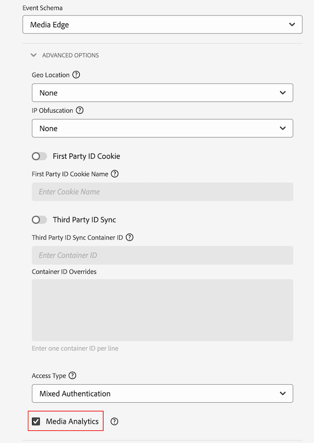

## Elija el método de implementación

Con el esquema, el conjunto de datos y el conjunto de datos en su lugar, implemente uno de los siguientes códigos para empezar a enviar datos de medios de streaming a Edge Network. Cada página cubre la configuración específica de los medios de streaming; el código por evento y por variable se encuentra en [Events](/help/implementation/events/overview.md) y [Variables](/help/implementation/variables/overview.md).

| Código base | En código | Mediante etiquetas |
|---|---|---|
| Web | [SDK web ](web-sdk.md) | [Extensión de etiqueta Web SDK](web-sdk-tags.md) |
| iOS | [iOS](ios.md) | [iOS (etiquetas)](ios-tags.md) |
| Android | [Android](android.md) | [Android (etiquetas)](android-tags.md) |
| Roku | [Roku](roku.md) | — |
| API | [API de Media Edge](media-edge-api.md) | — |

## Siguiente paso

Una vez que empiece a recopilar datos, puede configurar la creación de informes:

* [Configurar informes para implementaciones de Edge](/help/reporting/setup/edge-reporting.md) (Customer Journey Analytics)
* [Configurar informes para implementaciones solo de Analytics](/help/reporting/setup/analytics-reporting.md) (si el flujo de datos alimenta a Adobe Analytics)

>[!MORELIKETHIS]
>
>* [Compatibilidad con metadatos personalizados](custom-metadata.md)
>* [Esquema de informe XDM](reporting-schema.md)
>* [Resumen de eventos](/help/implementation/events/overview.md)
