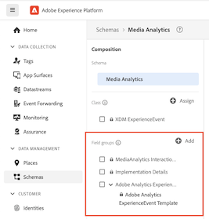
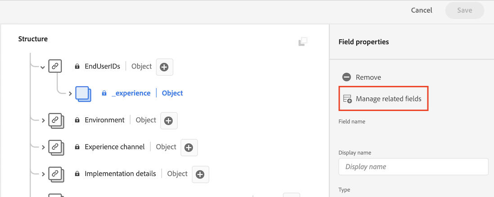
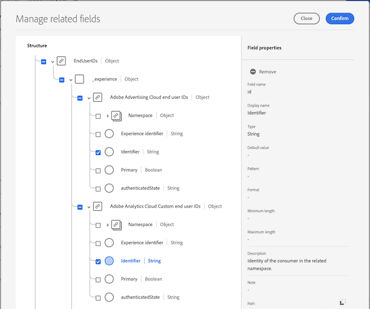

# Instalación de Media Analytics con Experience Platform Edge

Adobe Experience Platform Edge le permite enviar datos destinados a varios productos a una ubicación centralizada. Experience Edge reenvía la información adecuada a los productos deseados. Este concepto le permite consolidar los esfuerzos de implementación, especialmente abarcando varias soluciones de datos.

El gráfico siguiente ilustra una implementación de Media Analytics que utiliza Experience Platform Edge:

>[!IMPORTANT]
>
>Actualmente, solo puede enviar datos a Experience Edge mediante el SDK de Adobe Experience Platform Mobile.

<!-- Replace the above sentence with this after it web releases: You can send data to Experience Edge using any of the following implementation methods:

* Adobe Experience Platform Web SDK (Coming soon)
* Adobe Experience Platform Mobile SDK
* Edge Network Server API

Regardless of which Experience Edge implementation method you use for configuring media tracking, you must first complete the following sections:

-->

Complete las secciones siguientes para implementar Media Analytics con Experience Platform Edge:

* [Definir un grupo de informes](#define-a-report-suite)
* [Configuración del esquema en Adobe Experience Platform](#set-up-the-schema-in-adobe-experience-platform)
* [Creación de un conjunto de datos en Adobe Experience Platform](#create-a-dataset-in-adobe-experience-platform)
* [Configuración de un conjunto de datos en Adobe Experience Platform](#configure-a-datastream-in-adobe-experience-platform)
* [Crear una conexión en Customer Journey Analytics](#create-a-connection-in-customer-journey-analytics)
* [Creación de una vista de datos en el Customer Journey Analytics](#create-a-data-view-in-customer-journey-analytics)
* [Creación y configuración de un proyecto en Customer Journey Analytics](#create-and-configure-a-project-in-customer-journey-analytics)
* [Envío de datos a Experience Platform Edge con la extensión de Edge](#send-data-to-experience-platform-edge-with-the-edge-extension)

## Definir un grupo de informes

>[!NOTE]
>
>Solo es necesario un grupo de informes si utiliza Adobe Analytics. No se necesita un grupo de informes si planea usar Customer Journey Analytics para los informes.

Si planea usar Adobe Analytics para la creación de informes, deberá disponer de un grupo de informes para su implementación de Streaming Media. Para obtener información sobre la definición de un grupo de informes, consulte [Administrador del grupo de informes](https://experienceleague.adobe.com/docs/analytics/admin/admin-tools/manage-report-suites/report-suites-admin.html?lang=en).

Una vez definido un grupo de informes, continúe con [Configuración del esquema en Adobe Experience Platform](#set-up-the-schema-in-adobe-experience-platform).

## Configuración del esquema en Adobe Experience Platform

Para estandarizar la recopilación de datos para su uso en todas las aplicaciones que aprovechan Adobe Experience Platform, Adobe ha creado el estándar abierto y documentado públicamente, Experience Data Model (XDM).

Para crear y configurar un esquema:

1. En Adobe Experience Platform, comience a crear el esquema como se describe en [Crear y editar esquemas en la interfaz de usuario](https://experienceleague.adobe.com/docs/experience-platform/xdm/ui/resources/schemas.html?lang=en).

   Al crear el esquema, elija [!UICONTROL **XDM ExperienceEvent**] de la variable [!UICONTROL **Crear esquema**] menú desplegable.

1. En el [!UICONTROL **Composición**] , en el [!UICONTROL **Grupos de campo**] , seleccione [!UICONTROL **Agregar**] y, a continuación, busque y añada los siguientes grupos de campos nuevos al esquema:
   * `Adobe Analytics ExperienceEvent Template`
   * `Implementation Details`
   * `MediaAnalytics Interaction Details`

   Después de agregar los grupos de campos, deben mostrarse en la variable [!UICONTROL **Grupos de campo**] , como se indica a continuación:

   

1. En el [!UICONTROL **Estructura**] seleccione el `endUserIds` > `_experience` grupo de campos y, a continuación, seleccione [!UICONTROL **Administrar campos relacionados**].

   

1. Actualice el esquema como se indica a continuación:

   * En el `Adobe Analytics ExperienceEvent Template` grupo de campos, ocultar todos los campos excepto `EndUserIDs`.

   * En el `endUserIds` > `_experience` > `Adobe Advertising Cloud end user IDs` grupo de campos, oculte todos los campos excepto el `Identifier` campo .

   * En el `endUserIds` > `_experience` > `Adobe Analytics Cloud Custom end user IDs` grupo de campos, oculte todos los campos excepto el `Identifier` campo .

      

1. Select [!UICONTROL **Confirmar**] para guardar los cambios.

1. En el [!UICONTROL **Estructura**] seleccione el `Implementation Details` grupo de campos, seleccione [!UICONTROL **Administrar campos relacionados**] y, a continuación, actualice el esquema como se indica a continuación:

   * En el `Implementation Details` > `Implementation details` grupo de campos, ocultar todos los campos excepto `version`.

      

1. Select [!UICONTROL **Confirmar**] para guardar los cambios.

1. En el [!UICONTROL **Estructura**] seleccione el `Media Collection Details` grupo de campos, seleccione [!UICONTROL **Administrar campos relacionados**] y, a continuación, actualice el esquema como se indica a continuación:

   * En el `Media Collection Details` grupo de campos, ocultar `List Of States` grupo de campos.

      

   * En el `Media Collection Details` > `Advertising Details` grupo de campos, oculte los siguientes campos de informes: `Ad Completed`, `Ad Started`y `Ad Time Played`.

   * En el `Media Collection Details` > `Advertising Pod Details` grupo de campos, oculte el siguiente campo de informe: `Ad Break ID`

   * En el `Media Collection Details` > `Chapter Details` grupo de campos, oculte los siguientes campos de informes: `Chapter ID`, `Chapter Completed`, `Chapter Started`y `Chapter Time Played`.

   * En el `Media Collection Details` > `Qoe Data Details` grupo de campos, oculte los siguientes campos de informes: `Average Bitrate`, `Average Bitrate Bucket`, `Bitrate Changes`, `Buffer Events`, `Total Buffer Duration`, `Errors`, `External Error IDs`, `Bitrate Change Impacted Streams`, `Buffer Impacted Streams`, `Dropped Frame Impacted Streams`, `Error Impacted Streams`, `Stalling Impacted Streams`, `Drops Before Starts`, `Media SDK Error IDs`, `Player SDK Error IDs`, `Stalling Events`y `Total Stalling Duration`.

   * En el `Media Collection Details` > `Session Details` grupo de campos, oculte los siguientes campos de informes: `Media Session ID`, `Ad Count`, `Average Minute Audience`, `Chapter Count`, `Estimated Streams`, `Pause Impacted Streams`, `10% Progress Marker`, `25% Progress Marker`, `50% Progress Marker`, `75% Progress Marker`, `95% Progress Marker`, `Media Segment Views`, `Content Completes`, `Media Downloaded Flag`, `Federated Data`, `Content Starts`, `Media Starts`, `Pause Events`, `Total Pause Duration`, `Media Session Server Timeout`, `Video Segment`, `Content Time Spent`, `Media Time Spent`, `Unique Time Played`, `Pev3`y `Pccr`.

   * En el `Media Collection Details` > `List Of States End` y `Media Collection Details` > `List Of States Start` grupos de campos, oculte los siguientes campos de informes: `Player State Count`, `Player State Set`y `Player State Time`.

      

1. Select [!UICONTROL **Confirmar**] para guardar los cambios.

1. En el [!UICONTROL **Estructura**] seleccione el `List Of Media Collection Downloaded Content Events` grupo de campos, seleccione [!UICONTROL **Administrar campos relacionados**] y, a continuación, actualice el esquema como se indica a continuación:

   * En el `List Of Media Collection Downloaded Content Events` > `Media Details` grupo de campos, ocultar `List Of States` grupo de campos.

   * En el `List Of Media Collection Downloaded Content Events` > `Media Details` > `Advertising Details` grupo de campos, oculte los siguientes campos de informes: `Ad Completed`, `Ad Started`y `Ad Time Played`.

   * En el `List Of Media Collection Downloaded Content Events` > `Media Details` > `Advertising Pod Details` grupo de campos, oculte el siguiente campo de informe: `Ad Break ID`

   * En el `List Of Media Collection Downloaded Content Events` > `Media Details` > `Chapter Details` grupo de campos, oculte los siguientes campos de informes: `Chapter ID`, `Chapter Completed`, `Chapter Started`y `Chapter Time Played`.

   * En el `List Of Media Collection Downloaded Content Events` > `Media Details` > `Qoe Data Details` grupo de campos, oculte los siguientes campos de informes: `Average Bitrate`, `Average Bitrate Bucket`, `Bitrate Changes`, `Buffer Events`, `Total Buffer Duration`, `Errors`, `External Error IDs`, `Bitrate Change Impacted Streams`, `Buffer Impacted Streams`, `Dropped Frame Impacted Streams`, `Error Impacted Streams`, `Stalling Impacted Streams`, `Drops Before Starts`, `Media SDK Error IDs`, `Player SDK Error IDs`, `Stalling Events`y `Total Stalling Duration`.

   * En el `List Of Media Collection Downloaded Content Events` > `Media Details` > `Session Details` grupo de campos, oculte los siguientes campos de informes: `Media Session ID`, `Ad Count`, `Average Minute Audience`, `Chapter Count`, `Estimated Streams`, `Pause Impacted Streams`, `10% Progress Marker`, `25% Progress Marker`, `50% Progress Marker`, `75% Progress Marker`, `95% Progress Marker`, `Media Segment Views`, `Content Completes`, `Media Downloaded Flag`, `Federated Data`, `Content Starts`, `Media Starts`, `Pause Events`, `Total Pause Duration`, `Media Session Server Timeout`, `Video Segment`, `Content Time Spent`, `Media Time Spent`, `Unique Time Played`, `Pev3`y `Pccr`.

   * En el `List Of Media Collection Downloaded Content Events` > `Media Details` > `List Of States End` y `Media Collection Details` > `List Of States Start` grupos de campos, oculte los siguientes campos de informes: `Player State Count`, `Player State Set`y `Player State Time`.

   * En el `List Of Media Collection Downloaded Content Events` > `Media Details`  grupo de campos, ocultar `Media Session ID` campo .

1. Select [!UICONTROL **Confirmar**] para guardar los cambios.

1. En el [!UICONTROL **Estructura**] seleccione el `Media Reporting Details` grupo de campos, seleccione [!UICONTROL **Administrar campos relacionados**] y, a continuación, actualice el esquema como se indica a continuación:

   * En el `Media Reporting Details` grupo de campos, oculte los siguientes grupos de campos: `Error Details`, `List Of States End`, `List of States Start`, `Playhead`y `Media Session ID`.

1. Select [!UICONTROL **Confirmar**] > [!UICONTROL **Guardar**]  para guardar los cambios.

1. Continuar con [Creación de un conjunto de datos en Adobe Experience Platform](#create-a-dataset-in-adobe-experience-platform).

## Creación de un conjunto de datos en Adobe Experience Platform

1. Asegúrese de configurar un esquema como se describe en [Configuración del esquema en Adobe Experience Platform](#set-up-the-schema-in-adobe-experience-platform).

1. En Adobe Experience Platform, comience a crear el conjunto de datos como se describe en [Guía de la interfaz de usuario de conjuntos de datos](https://experienceleague.adobe.com/docs/experience-platform/catalog/datasets/user-guide.html?lang=es#create).

   Al seleccionar un esquema para el conjunto de datos, elija el esquema que creó anteriormente, tal como se describe en [Configuración del esquema en Adobe Experience Platform](#set-up-the-schema-in-adobe-experience-platform).

1. Continuar con [Configuración de un conjunto de datos en el Customer Journey Analytics](#configure-a-datastream-in-adobe-experience-platform).

## Configuración de un conjunto de datos en Adobe Experience Platform

1. Asegúrese de que ha creado un conjunto de datos como se describe en [Creación de un conjunto de datos en Adobe Experience Platform](#create-a-dataset-in-adobe-experience-platform).

1. Cree un nuevo conjunto de datos como se describe en [Configurar un conjunto de datos](https://experienceleague.adobe.com/docs/experience-platform/edge/datastreams/overview.html?lang=es).

   Al crear el conjunto de datos, asegúrese de realizar las siguientes selecciones de configuración:

   * En el [!UICONTROL **Esquema de evento**] al crear el conjunto de datos, asegúrese de seleccionar el esquema creado en [Configuración del esquema en Adobe Experience Platform](#set-up-the-schema-in-adobe-experience-platform). Seleccione [!UICONTROL **Guardar**].

      >[!IMPORTANT]
          >
      > No seleccionar [!UICONTROL **Guardar y agregar asignación**] porque al hacerlo, se generarán errores de asignación para el campo Marca de tiempo.
      

      

   * Añada cualquiera de los siguientes servicios al conjunto de datos, en función de si utiliza Adobe Analytics o Customer Journey Analytics:

      * [!UICONTROL **Adobe Analytics**] (si se usa Adobe Analytics)

         Si utiliza Adobe Analytics, asegúrese de definir un grupo de informes, tal como se describe en la sección [Definir un grupo de informes](#define-a-report-suite) en este artículo.

      * [!UICONTROL **Adobe Experience Platform**] (si se usa Customer Journey Analytics)
      Para obtener información sobre cómo añadir un servicio a un conjunto de datos, consulte la sección &quot;Añadir servicios a un conjunto de datos&quot; en [Configurar un conjunto de datos](https://experienceleague.adobe.com/docs/experience-platform/edge/datastreams/configure.html?lang=en#view-details).

      

   * Expandir [!UICONTROL **Opciones avanzadas**] y, a continuación, active la variable [!UICONTROL **Media Analytics**] .

      

1. Continuar con [Crear una conexión en el Customer Journey Analytics](#create-a-connection-in-customer-journey-analytics).

## Crear una conexión en Customer Journey Analytics

>[!NOTE]
>
>El siguiente procedimiento solo es necesario si está utilizando Customer Journey Analytics.

1. Asegúrese de crear un conjunto de datos como se describe en [Configuración de un conjunto de datos en el Customer Journey Analytics](#configure-a-datastream-in-adobe-experience-platform).

1. En el Customer Journey Analytics, cree una conexión como se describe en [Crear una conexión](https://experienceleague.adobe.com/docs/analytics-platform/using/cja-connections/create-connection.html?lang=es).

   Al crear la conexión, se requieren las siguientes selecciones de configuración para implementar Streaming Media:

   1. Seleccione el conjunto de datos que creó anteriormente, tal como se describe en [Creación de un conjunto de datos en Adobe Experience Platform](#create-a-dataset-in-adobe-experience-platform).

   1. Asegúrese de que la variable [!UICONTROL **Importar todos los datos nuevos**] está activada.

1. Continuar con [Creación de una vista de datos en el Customer Journey Analytics](#create-a-new-data-view-in-customer-journey-analytics).

## Creación de una vista de datos en el Customer Journey Analytics

>[!NOTE]
>
>El siguiente procedimiento solo es necesario si está utilizando Customer Journey Analytics.

1. Asegúrese de que ha creado una conexión en Customer Journey Analytics como se describe en [Crear una conexión en el Customer Journey Analytics](#create-a-connection-in-customer-journey-analytics).

1. En Customer Recorrido Analytics, cree una vista de datos como se describe en [Crear o editar una vista de datos](https://experienceleague.adobe.com/docs/analytics-platform/using/cja-dataviews/create-dataview.html?lang=es).

   Al crear la vista de datos, se requieren las siguientes selecciones de configuración para implementar Streaming Media:

   1. En el [!UICONTROL **Conexión**] , seleccione la conexión que ha creado anteriormente, tal como se describe en [Crear una conexión en el Customer Journey Analytics](#create-a-connection-in-customer-journey-analytics).

      Puede tardar hasta 15 minutos en que la conexión que ha creado esté disponible para la selección.

   1. En el [!UICONTROL **Componentes**] en la [!UICONTROL **Campos de esquema**] , busque cada componente enumerado en las tablas siguientes y arrástrelo a la [!UICONTROL **Métricas**] panel. Si existen varios campos con el mismo nombre, utilice la ruta XDM para asegurarse de que es el campo correcto.

      **Contenido principal: Métricas de contenido**

      | Nombre del componente | Ruta XDM |
      |----------|---------|
      | Inicios de contenidos | mediaReporting.sessionDetails.isViewed |
      | Vistas de segmentos de medios | mediaReporting.sessionDetails.hasSegmentView |
      | Inicio de contenido | mediaReporting.sessionDetails.isPlayed |
      | Finalización de contenido | mediaReporting.sessionDetails.isCompleted |
      | Tiempo invertido en contenido | mediaReporting.sessionDetails.timePlayed |
      | Tiempo invertido en contenido | mediaReporting.sessionDetails.totalTimePlayed |
      | Tiempo de reproducción única | mediaReporting.sessionDetails.uniqueTimePlayed |
      | Marcador de progreso del 10 % | mediaReporting.sessionDetails.hasProgress10 |
      | Promedio de audiencia por minuto | mediaReporting.sessionDetails.averageMinuteAudience |

      **Capítulo y anuncios: métricas de capítulos y anuncios**

      | Nombre del componente | Ruta XDM |
      |----------|---------|
      | Capítulo iniciado | mediaReporting.chapterDetails.isStarted |
      | Capítulo completado | mediaReporting.chapterDetails.isCompleted |
      | Tiempo de reproducción del capítulo | mediaReporting.chapterDetails.timePlayed |
      | Publicidad iniciada | mediaReporting.advertisingDetails.isStarted |
      | Anuncio completado | mediaReporting.advertisingDetails.isCompleted |
      | Tiempo de reproducción del anuncio | mediaReporting.advertisingDetails.timePlayed |

      **Métricas de QoE - QoE**

      | Nombre del componente | Ruta XDM |
      |----------|---------|
      | Tiempo para el inicio | mediaReporting.qoeDataDetails.timeToStart |
      | Pérdidas antes del inicio | mediaReporting.qoeDataDetails.isDroppedBeforeStart |
      | Flujos afectados por el búfer | mediaReporting.qoeDataDetails.hasBufferImpactedStreams |
      | Flujos afectados por el cambio en la velocidad de bits | mediaReporting.qoeDataDetails.hasBitrateChangeImpactedStreams |
      | Cambios en la velocidad de bits | mediaReporting.qoeDataDetails.bitrateChangeCount |
      | Velocidad de bits media | mediaReporting.qoeDataDetails.bitrateAverage |
      | Fotogramas perdidos | mediaReporting.qoeDataDetails.droppedFrames |
      | Errores | mediaReporting.qoeDataDetails.errorCount |
      | Flujos afectados por el error | mediaReporting.qoeDataDetails.hasErrorImpactedStreams |
      | Flujos afectados por la pérdida de cuadros | mediaReporting.qoeDataDetails.hasDroppedFrameImpactedStreams |

      **Estado del reproductor: métricas del estado del reproductor**

      | Nombre del componente | Ruta XDM |
      |----------|---------|
      | Conjunto de estados del reproductor | mediaReporting.states.isSet |
      | Recuento de estado del reproductor | mediaReporting.states.count |
      | Hora del estado del reproductor | mediaReporting.states.time |

   1. Actualice las etiquetas (en el [!UICONTROL **Etiquetas de contexto**] menú desplegable) para los componentes de la siguiente tabla. Busque y arrastre al panel cualquier componente que no esté ya en el panel de métricas.

      | Nombre del componente | Etiqueta de contexto |
      |---------|----------|
      | Tiempo de espera del servidor de sesión de medios | Medios: Segundos desde la última llamada |
      | Tiempo invertido en contenido | Medios: Tiempo invertido en contenido |
      | Duración total del búfer | Medios: Duración total del búfer |
      | Tiempo para el inicio | Medios: Tiempo para el inicio |
      | Duración de la pausa | Medios: Duración total de la pausa |

   1. Para agregar desgloses al proyecto de Customer Journey Analytics, agregue las siguientes dimensiones al [!UICONTROL **Dimension**] panel:

      | Ruta XDM | Nombre del componente |
      |---------|----------|
      | mediaReporting.states.name | Nombre de estado del reproductor |
      | mediaReporting.sessionDetails.ID | ID de sesión de contenidos |

      Además de las dimensiones de esta tabla, puede agregar otras dimensiones que desee poner a disposición para filtrar los datos en proyectos de Customer Journey Analytics.

1. Select [!UICONTROL **Guardar y continuar**] > [!UICONTROL **Guardar y finalizar**] para guardar los cambios.

1. Continuar con [Creación y configuración de un proyecto en Customer Journey Analytics](#create-and-configure-a-project-in-customer-journey-analytics).

## Creación y configuración de un proyecto en Customer Journey Analytics

1. Asegúrese de que ha creado una vista de datos en Customer Journey Analytics como se describe en [Creación de una vista de datos en el Customer Journey Analytics](#create-a-new-data-view-in-customer-journey-analytics).

1. En Customer Journey Analytics, en la variable [!UICONTROL **Espacio de trabajo**] en la [!UICONTROL **Proyectos**] área, seleccione [!UICONTROL **Crear proyecto**].

1. Select [!UICONTROL **Proyecto en blanco**] > [!UICONTROL **Crear**].

1. En el nuevo proyecto, seleccione la vista de datos que ha creado anteriormente.

   Al crear paneles en el proyecto, puede utilizar cualquier componente que haya agregado a la vista de datos, tal como se describe en [Creación de una vista de datos en el Customer Journey Analytics](#create-a-new-data-view-in-customer-journey-analytics).

   Los 4 paneles siguientes son ejemplos de paneles que puede crear:

   

   

   

   

1. Seleccione el **Paneles** en el carril izquierdo y, a continuación, arrastre el [!UICONTROL **Espectadores simultáneos de medios**] y [!UICONTROL **Tiempo invertido en la reproducción de contenido**] panel.

   Los dos paneles deberían tener este aspecto:

   

   

1. Compartir el proyecto como se describe en [Compartir proyectos](https://experienceleague.adobe.com/docs/analytics-platform/using/cja-workspace/curate-share/share-projects.html?lang=en).

   >[!NOTE]
   >
   >   Si los usuarios con los que desea compartir no están disponibles, asegúrese de que los usuarios tengan acceso de usuario y administrador al Customer Journey Analytics en Adobe Admin Console.

1. Continuar con [Envío de datos a Experience Platform Edge](#send-data-to-experience-platform-edge).

## Envío de datos a Experience Platform Edge mediante el SDK de AEP Mobile

Puede utilizar el SDK móvil de Adobe Experience Platform para enviar datos móviles a Experience Platform Edge. (Como alternativa, puede utilizar una implementación personalizada de las API perimetrales.<!-- I guess we don't need/want to document this? -->)

Utilice los siguientes recursos de documentación para completar la implementación:

| Sistema operativo móvil | Recursos  |
|---------|----------|
| **iOS** | Los siguientes recursos están disponibles para enviar datos móviles de iOS: <ul><li>[Configuración del SDK móvil mediante la interfaz de usuario de recopilación de datos](https://github.com/adobe/aepsdk-edgemedia-ios/blob/dev/Documentation/getting-started.md)</li><li>[Migración de Media SDK a Edge Media SDK](https://github.com/adobe/aepsdk-edgemedia-ios/blob/dev/Documentation/migration-guide.md)</li><li>[Referencia de la API de Edge Media](https://github.com/adobe/aepsdk-edgemedia-ios/blob/dev/Documentation/api-reference.md)</li></ul> |
| **Android** | Los siguientes recursos están disponibles para enviar datos móviles de Android: <ul><li>[Configuración del SDK móvil mediante la interfaz de usuario de recopilación de datos](https://github.com/adobe/aepsdk-edgemedia-android/blob/dev/Documentation/getting-started.md)</li><li>[Migración de Media SDK a Edge Media SDK](https://github.com/adobe/aepsdk-edgemedia-android/blob/dev/Documentation/migration-guide.md)</li><li>[Referencia de la API de Edge Media](https://github.com/adobe/aepsdk-edgemedia-android/blob/dev/Documentation/api-reference.md)</li></ul> |

<!--

+++Adobe Experience Platform Mobile SDK

If you plan to use the Mobile SDK extension in Adobe Experience Platform Data Collection to send data to Edge, complete the following sections:

### Create a mobile property

Create a mobile property, as described in [Set up a mobile property](https://developer.adobe.com/client-sdks/documentation/getting-started/create-a-mobile-property/). 

Content initially copied from here: https://experienceleague.adobe.com/docs/analytics/implementation/aep-edge/mobile-sdk/overview.html?lang=en 

The Adobe Experience Platform Mobile SDK helps power Adobe's Experience Cloud solutions and services in your mobile apps. It is available for Android, iOS, and various cross-platform development frameworks. Configuration is handled through Adobe Experience Platform Data Collection.
>[!IMPORTANT]
>
>An Adobe Analytics extension is also available in Adobe Experience Platform Data Collection. If you install this extension, you do not take advantage of XDM or the Edge Network.

### Register the extensions and load your tag configuration

Use code in your app to register the necessary extensions and load your tag configuration. For more information, see [Set up the configuration](https://developer.adobe.com/client-sdks/documentation/user-guides/getting-started-with-platform/overview/#set-up-the-configuration) in [Getting started with Adobe Experience Platform](https://developer.adobe.com/client-sdks/documentation/user-guides/getting-started-with-platform/overview/#set-up-the-configuration).

### Implement and test fuctionality

Implement and test app functionality using a combination of tags data elements, rules, additional extensions, and SDK API calls. Inspect, validate, and debug data collection and experiences for your mobile application.

For more information, see [Use the sample application](https://developer.adobe.com/client-sdks/documentation/user-guides/getting-started-with-platform/overview/#use-the-sample-application) in [Getting started with Adobe Experience Platform](https://developer.adobe.com/client-sdks/documentation/user-guides/getting-started-with-platform/overview/#set-up-the-configuration).

### Extend and validate your mobile app implementation

Before pushing the mobile app extension to your production environment, first validate that it works.

(What are the steps to do this?)

-->

<!--

+++Adobe Experience Platform Web SDK (Coming soon)

>[!NOTE]
>
>The Adobe Experience Platform Web SDK is not yet available. This page will be updated when it becomes available.

<!-- Content initially copied from here: https://experienceleague.adobe.com/docs/analytics/implementation/aep-edge/web-sdk/overview.html?lang=en -->

<!-- Use the Web SDK extension in Adobe Experience Platform Data Collection to send data to Edge.

You can use the [Adobe Experience Platform Web SDK](https://experienceleague.adobe.com/docs/experience-platform/tags/extensions/client/sdk/overview.html) to send data to Adobe Analytics. This implementation method works by translating the [Experience Data Model (XDM)](https://experienceleague.adobe.com/docs/experience-platform/xdm/home.html) into a format used by Analytics.

You can send data to Experience Edge directly using the Web SDK, or through the Web SDK extension in Tags. -->

<!-- ### Web SDK

A high-level overview of the implementation tasks:

<table style="width:100%">

<tr>
<th style="width:5%"></th><th style="width:60%"><b>Task</b></th><th style="width:35%"><b>More Information</b></th>
</tr>

<tr>
<td>1</td>
<td>Ensure you have <b>defined a report suite</b>.</td>
<td><a href="../../../admin/admin/c-manage-report-suites/report-suites-admin.md">Report Suite Manager</a></td>
</tr>

<tr>
<td>2</td>
<td><b>Setup schemas and datasets</b>. To standardize data collection for use across applications that leverage Adobe Experience Platform, Adobe has created the open and publicly documented standard, Experience Data Model (XDM).</td>
<td><a href="https://experienceleague.adobe.com/docs/experience-platform/xdm/ui/overview.html?lang=en">Schemas UI overview</a> and <a href="https://experienceleague.adobe.com/docs/experience-platform/catalog/datasets/user-guide.html?lang=en">Datasets UI overview</a></td>
</tr>

<tr>
<td>3</td>
<td><b>Create a data layer</b> to manage the tracking of the data on your website.</td>
<td><a href="../../prepare/data-layer.md">Create a data layer</a></td>
</tr>

<tr>
<td> 4</td>
<td><b>Install the prebuilt standalone version</b>. You can reference the library (<code>alloy.js</code>) on the CDN directly on your page or download and host it on your own infrastructure. Alternatively, you can use the NPM package.</td>
<td><a href="https://experienceleague.adobe.com/docs/experience-platform/edge/fundamentals/installing-the-sdk.html?lang=en#option-2%3A-installing-the-prebuilt-standalone-version">Installing the prebuilt standalone version</a> and <a href="https://experienceleague.adobe.com/docs/experience-platform/edge/fundamentals/installing-the-sdk.html?lang=en#option-3%3A-using-the-npm-package">Using the NPM package</a></td>
</tr>

<tr>
<td>5</td>
<td><b>Configure a datastream</b>. A datastream represents the server-side configuration when implementing the Adobe Experience Platform Web SDK.</td>
<td><a href="https://experienceleague.adobe.com/docs/experience-platform/edge/datastreams/configure.html?lang=en">Configure a datastream<a></td> 
</tr>

<td>6</td>
<td><b>Add an Adobe Analytics service</b> to your datastream. That service controls whether and how data is sent to Adobe Analytics.</td>
<td><a href="https://experienceleague.adobe.com/docs/experience-platform/edge/datastreams/configure.html?lang=en#analytics">Add Adobe Analytics service to a datastream</a></td>
</tr>

<tr>
<td>7</td>
<td><b>Configure the Web SDK</b>. Ensure the library that you installed in step 4 is properly configured with the datastream ID (formerly known as edge configuration id (<code>edgeConfigId</code>)), organization id (<code>orgId</code>), and other available options.</td>
<td><a href="https://experienceleague.adobe.com/docs/experience-platform/edge/fundamentals/configuring-the-sdk.html?lang=en">Configure the Web SDK</a></td>
</tr>

<tr>
<td>8</td>
<td><b>Execute commands</b> and/or <b>track events</b>. After the base code has been implemented on your webpage, you can begin executing commands and tracking events with the SDK.
</td>
<td><a href="https://experienceleague.adobe.com/docs/experience-platform/edge/fundamentals/executing-commands.html?lang=en">Execute commands</a> and <a href="https://experienceleague.adobe.com/docs/experience-platform/edge/fundamentals/tracking-events.html?lang=en">Track events</a></td>
</tr>

<tr>
<td>9</td><td><b>Extend and validate your implementation</b> before pushing it out to production.</td><td></td> 
</tr>
</table>

### Web SDK extension

A high-level overview of the implementation tasks:

<table style="width:100%">

<tr>
<th style="width:5%"></th><th style="width:60%"><b>Task</b></th><th style="width:35%"><b>More Information</b></th>
</tr>

<tr>
<td>1</td>
<td>Ensure you have <b>defined a report suite</b>.</td>
<td><a href="../../../admin/admin/c-manage-report-suites/report-suites-admin.md">Report Suite Manager</a></td>
</tr>

<tr>
<td>2</td>
<td><b>Setup schemas and datasets</b>. To standardize data collection for use across applications that leverage Adobe Experience Platform, Adobe has created the open and publicly documented standard, Experience Data Model (XDM).</td>
<td><a href="https://experienceleague.adobe.com/docs/experience-platform/xdm/ui/overview.html?lang=en">Schemas UI overview</a> and <a href="https://experienceleague.adobe.com/docs/experience-platform/catalog/datasets/user-guide.html?lang=en">Datasets UI overview</a></td>
</tr>

<tr>
<td>3</td>
<td><b>Create a data layer</b> to manage the tracking of the data on your website.</td>
<td><a href="../../prepare/data-layer.md">Create a data layer</a></td>
</tr>

<tr>
<td>4</td>
<td><b>Configure a datastream</b>. A datastream represents the server-side configuration when implementing the Adobe Experience Platform Web SDK.</td>
<td><a href="https://experienceleague.adobe.com/docs/experience-platform/edge/datastreams/configure.html?lang=en">Configure a datastream<a></td> 
</tr>

<tr>
<td>5</td> 
<td><b>Add an Adobe Analytics service</b> to your datastream. That service controls whether and how data is sent to Adobe Analytics.</td>
<td><a href="https://experienceleague.adobe.com/docs/experience-platform/edge/datastreams/configure.html?lang=en#analytics">Add Adobe Analytics service to a datastream</a></td>
</tr>

<tr>
<td>6</td>
<td><b>Create a tag property</b>. Properties are overarching containers used to reference tag management data.</td>
<td><a href="https://experienceleague.adobe.com/docs/experience-platform/tags/admin/companies-and-properties.html?lang=en#for-web">Create or configure a tag property for web</a></td>
</tr>

<tr>
<td>7</td> 
<td><b>Install and configure the Web SDK extension</b> in your tag property. Configure the Web SDK extension to send data to the datastream configured in step 4.</td>
<td><a href="https://experienceleague.adobe.com/docs/experience-platform/tags/extensions/client/sdk/overview.html?lang=en">Adobe Experience Platform Web SDK extension overview</a></td>
</tr>

<tr>
<td>8</td>
<td><b>Iterate, validate, and publish</b> to production. Add the tag property to your web site. Then use data elements, rules, and so on, to customize your implementation.</td>
<td><a href="https://experienceleague.adobe.com/docs/experience-platform/tags/publish/overview.html?lang=en">Publishing overview</a></td>
</tr>

</table>

### Additional resources

Tags can be highly customized. Learn more about how you can get the most out of Adobe Analytics by including the right data in your implementation.

-   [Tags documentation](https://experienceleague.adobe.com/docs/experience-platform/tags/home.html#): Learn how the interface works and what extensions are available.

-   [Adobe Experience Platform Web SDK documentation](https://experienceleague.adobe.com/docs/web-sdk.html?lang=en)

+++

-->

<!--

### Adobe Experience Platform SDK

A high-level overview of the implementation tasks:

<table style="width:100%">

<tr>
<th style="width:5%"></th><th style="width:60%"><b>Task</b></th><th style="width:35%"><b>More Information</b></th>
</tr>

<tr>
<td>1</td>
<td>Ensure you have <b>defined a report suite</b>.</td>
<td><a href="../../../admin/admin/c-manage-report-suites/report-suites-admin.md">Report Suite Manager</a></td>
</tr>

<tr>
<td>2</td>
<td><b>Setup schemas and datasets</b>. To standardize data collection for use across applications that leverage Adobe Experience Platform, Adobe has created the open and publicly documented standard, Experience Data Model (XDM).</td>
<td><a href="https://experienceleague.adobe.com/docs/experience-platform/xdm/ui/overview.html?lang=en">Schemas UI overview</a> and <a href="https://experienceleague.adobe.com/docs/experience-platform/catalog/datasets/user-guide.html?lang=en">Datasets UI overview</a></td>
</tr>

<tr>
<td>3</td>
<td><b>Configure a datastream</b>. A datastream represents the server-side configuration when implementing the Adobe Experience Platform Web SDK.</td>
<td><a href="https://experienceleague.adobe.com/docs/experience-platform/edge/datastreams/configure.html?lang=en">Configure a datastream<a></td> 
</tr>

<td>4</td>
<td><b>Add an Adobe Analytics service</b> to your datastream. That service controls whether and how data is sent to Adobe Analytics.</td>
<td><a href="https://experienceleague.adobe.com/docs/experience-platform/edge/datastreams/configure.html?lang=en#analytics">Add Adobe Analytics service to a datastream</a></td>
</tr>

<tr>
<td>5</td>
<td><b>Create a mobile property</b>. A property is a container that you fill with extensions, rules, data elements, and libraries.</td>
<td><a href="https://developer.adobe.com/client-sdks/documentation/getting-started/create-a-mobile-property/">Set up a mobile property</a></tr>

<tr>
<td>6</td>
<td><b>Install the Adobe Experience Platform Edge Network extension</b> in the mobile tag property and configure the datastream in the extension.</td>
<td><a href="https://developer.adobe.com/client-sdks/documentation/edge-network/">Adobe Experience Platform Edge Network</a>
</tr>

<tr>
<td>7</td>
<td><b>Use code in your app</b> to register the necessary extensions and load your tag configuration.</td>
<td><a href="https://developer.adobe.com/client-sdks/documentation/user-guides/getting-started-with-platform/overview/#set-up-the-configuration">Set up the configuration</a></td>
</tr>

<tr>
<td>8</td>
<td><b>Implement and test functionality</b> using combination of tag's data elements, rules, additional extensions, and SDK API calls in your app. Inspect, validate, and debug data collection and experiences for your mobile application.</td>
<td><a href="https://developer.adobe.com/client-sdks/documentation/user-guides/getting-started-with-platform/overview/#use-the-sample-application">Use the sample application</a>
</tr>

<tr>
<td>9</td>
<td><b>Extend and validate your mobile app implementation</b> before pushing it out to production.</td>
<td></td> 
</tr>

</table>

### Adobe Analytics extension.

A high-level overview of the implementation tasks:

<table style="width:100%">

<tr>
<th style="width:5%"></th><th style="width:60%"><b>Task</b></th><th style="width:35%"><b>More Information</b></th>
</tr>

<tr>
<td>1</td>
<td>Ensure you have <b>defined a report suite</b>.</td>
<td><a href="../../../admin/admin/c-manage-report-suites/report-suites-admin.md">Report Suite Manager</a></td>
</tr>

<tr>
<td>2</td>
<td><b>Setup schemas and datasets</b>. To standardize data collection for use across applications that leverage Adobe Experience Platform, Adobe has created the open and publicly documented standard, Experience Data Model (XDM).</td>
<td><a href="https://experienceleague.adobe.com/docs/experience-platform/xdm/ui/overview.html?lang=en">Schemas UI overview</a> and <a href="https://experienceleague.adobe.com/docs/experience-platform/catalog/datasets/user-guide.html?lang=en">Datasets UI overview</a></td>
</tr>

<tr>
<td>3</td>
<td><b>Install the Adobe Analytics extension</b> in the mobile tag property and configure the extension to point to your report suite.</td>
<td><a href="https://developer.adobe.com/client-sdks/documentation/adobe-analytics/">Adobe Analytics extension for mobile property</a>
</tr>

<tr>
<td>4</td>
<td><b>Use code in your app</b> to register the necessary extensions and load your tag configuration.</td>
<td><a href="https://developer.adobe.com/client-sdks/documentation/user-guides/getting-started-with-platform/overview/#set-up-the-configuration">Set up the configuration</a></td>
</tr>

<tr>
<td>5</td>
<td><b>Implement and test functionality</b> using combination of tag's data elements, rules, additional extensions, and SDK API calls in your app. Inspect, validate, and debug data collection and experiences for your mobile application.</td>
<td><a href="https://developer.adobe.com/client-sdks/documentation/user-guides/getting-started-with-platform/overview/#use-the-sample-application">Use the sample application</a>
</tr>

<tr>
<td>6</td>
<td><b>Extend and validate your mobile app implementation</b> before pushing it out to production.</td>
<td></td> 
</tr>

</table>

### Additional resources

-   [Tags documentation](https://experienceleague.adobe.com/docs/experience-platform/tags/home.html#)

-   [Mobile SDK documentation](https://developer.adobe.com/client-sdks/documentation/)

-->

<!--

+++

+++Edge Network Server API

Send data directly to Edge using an API.

Content initially copied from here: https://experienceleague.adobe.com/docs/analytics/implementation/aep-edge/edge-api/overview.html?lang=en 

If you are unable to use the Adobe Experience Platform [Web SDK](../web-sdk/overview.md) or [Mobile SDK](../mobile-sdk/overview.md), you can send data to the Edge Network directly through an API.

See [Edge Network Server API documentation](https://experienceleague.adobe.com/docs/experience-platform/edge-network-server-api/overview.html), and an example [integrating with Adobe Analytics](https://experienceleague.adobe.com/docs/experience-platform/edge-network-server-api/interacting-other-adobe-solutions/interacting-adobe-analytics.html).

+++ 

-->

