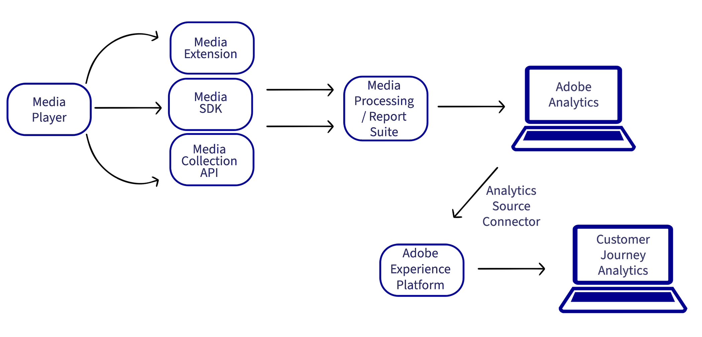

# Implementación de servicios de medios de streaming para Adobe Analytics o Customer Journey Analytics

Existen varias formas de implementar los servicios de medios de streaming de Adobe. Para ver una comparación detallada de los dispositivos y las plataformas compatibles con los métodos de implementación descritos en esta página, consulte [Dispositivos y plataformas compatibles](/help/getting-started/supported-devices.md).

## Métodos de implementación de Edge

Se recomienda utilizar Edge al implementar servicios de medios de streaming para todos los clientes nuevos de Adobe Analytics o Customer Journey Analytics.

Los métodos de implementación de Edge utilizan el complemento de recopilación de medios de streaming.

* **Medios para Edge Network SDK / Extensión:** Recopila datos de la web, dispositivos iOS y Android o dispositivos Roku y los envía a Edge Network. A continuación, los datos se pueden enviar a Customer Journey Analytics o a Adobe Analytics.

  Para obtener más información acerca de Media para Edge Network SDK/Extension, consulte [Implementar la recopilación de medios de streaming mediante Edge Network](/help/implementation/edge/implementation-edge.md).

* **API de Media Edge:** se puede personalizar para recopilar datos de cualquier dispositivo o formato (incluidos dispositivos móviles, web y de servicios OTT) y enviar datos a Edge Network. A continuación, los datos se pueden enviar a Customer Journey Analytics o a Adobe Analytics.

  Para obtener más información sobre la API de Media Edge, consulte [Información general sobre la API de Media Edge](https://developer.adobe.com/cja-apis/docs/endpoints/media-edge/).

## Métodos de implementación solo de Adobe Analytics

Los métodos de implementación de Edge descritos anteriormente se recomiendan tanto para Customer Journey Analytics como para Adobe Analytics, especialmente para las nuevas implementaciones.

Además de los métodos de implementación de Edge, hay otros métodos de implementación disponibles. Estos métodos de implementación se diseñaron para su uso con Adobe Analytics. Sin embargo, los clientes existentes con cualquiera de los siguientes métodos de implementación aún pueden hacer que los datos estén disponibles en Customer Journey Analytics creando una [Conexión de origen de Analytics](https://experienceleague.adobe.com/docs/experience-platform/sources/ui-tutorials/create/adobe-applications/analytics.html?lang=es).

Los métodos de implementación solo de Adobe Analytics utilizan el complemento de Adobe Analytics para medios de streaming.

* **Extensión de medios con etiquetas:** la extensión de Adobe Medium Analytics para audio y vídeo proporciona la funcionalidad para agregar la instancia de Media Tracker a un sitio o proyecto con etiquetas habilitadas. Los datos se envían directamente a Adobe Analytics.

  Para obtener información sobre la instalación, configuración e implementación de Media Extension con etiquetas, consulte [Extensión de Adobe Medium Analytics (SDK 3.x) para audio y vídeo](https://experienceleague.adobe.com/docs/experience-platform/tags/extensions/adobe/media-analytics-3x/overview.html?lang=es).

* **Media SDK:** Media SDK le permite medir varias plataformas de medios, incluidos sitios web, teléfonos móviles, televisores conectados, tabletas, dispositivos OTT, descodificadores y consolas de juegos. (Para obtener más información, consulte [Dispositivos y plataformas compatibles](/help/getting-started/supported-devices.md).)

  Los Media SDK utilizan la API de recopilación de medios para el seguimiento. Los datos se envían directamente a Adobe Analytics.

  Para obtener información sobre la descarga e instalación de Media SDK y extensiones, consulte [Obtención de Media SDK, Extensiones mediante etiquetas y SDK para OTT](/help/getting-started/download-sdks.md).

* **API de colección de medios:** puesto que las API de colección de medios se pueden personalizar, se pueden utilizar para aplicaciones que requieren funcionalidades de seguimiento personalizadas y para dispositivos no compatibles con Media SDK. Las API de colección de medios rastrean los eventos de audio y vídeo mediante llamadas HTTP RESTful. Los datos se envían directamente a Adobe Analytics.

  Para obtener información sobre el uso de las API de recopilación de medios, consulte [API de recopilación de medios](media-collection-api/mc-api-overview.md).

<!--
(Not sure if we need the following paragraph and graphic. Paragraph is somewhat redundant with the intro paragraph of this article)
Choose the implementation method depending on the supported platforms. Some players are not supported by the Media SDKs or the Adobe Experience Platform Media Extensions. The Media Collection APIs provide a way to support those players. For information on supported devices, see [Supported devices and platforms](/help/getting-started/supported-devices.md).

-->
