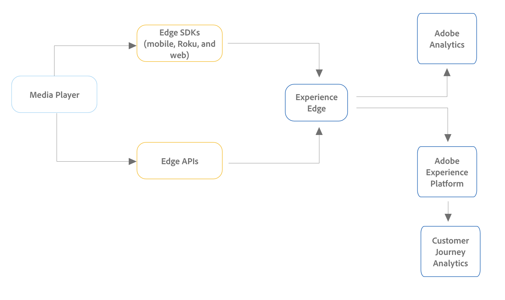

# Implementación de medios de transmisión para Adobe Analytics o CUSTOMER JOURNEY ANALYTICS

Existen varias formas de implementar Streaming Media. Para ver una comparación detallada de los dispositivos y las plataformas compatibles con los métodos de implementación descritos en esta página, consulte [Dispositivos y plataformas compatibles](/help/getting-started/supported-devices.md).

## Métodos de implementación de Edge

Para la mayoría de los casos, recomendamos utilizar Edge al implementar Media Analytics para todos los clientes nuevos de Adobe Analytics o Customer Journey Analytics.

* **Medios para la extensión/SDK de la red perimetral:** Recopila datos de dispositivos iOS y Android y los envía a Edge. A continuación, los datos se pueden enviar al Customer Journey Analytics o a Adobe Analytics.

  Para obtener más información acerca de la extensión/SDK de Media for Edge Network, consulte [Instalación de Media Analytics con Experience Platform Edge](/help/implementation/implementation-edge.md).

  >[!NOTE]
  >
  >Actualmente, este método de implementación no es compatible con el SDK web o Roku. Sin embargo, ambos son compatibles al implementar con la API de Media Edge.

* **API de Media Edge:** Se puede personalizar para recopilar datos de cualquier dispositivo o formato (incluidos dispositivos móviles, web y de servicios OTT) y enviar datos a Edge. A continuación, los datos se pueden enviar al Customer Journey Analytics o a Adobe Analytics.

  <!-- For more information about the Media Edge API, see (link to John's docs when they're ready) -->

## Otros métodos de implementación

Para la mayoría de los casos, los métodos de implementación de Edge descritos anteriormente se recomiendan tanto para Customer Journey Analytics como para Adobe Analytics, especialmente para las nuevas implementaciones.

Además de los métodos de implementación de Edge, hay otros métodos de implementación disponibles. Estos métodos de implementación se diseñaron inicialmente para su uso con Adobe Analytics. Sin embargo, los clientes con cualquiera de los siguientes métodos de implementación aún pueden hacer que los datos estén disponibles en Customer Journey Analytics creando un [Conexión de origen de Analytics](https://experienceleague.adobe.com/docs/experience-platform/sources/ui-tutorials/create/adobe-applications/analytics.html?lang=es).

* **Extensión de medios con etiquetas:** La extensión de Adobe Medium Analytics para audio y vídeo proporciona la funcionalidad para agregar la instancia de Media Tracker a un sitio o proyecto con etiquetas habilitadas. Los datos se envían a Adobe Analytics.

  Para obtener información sobre la instalación, configuración e implementación de Media Extension con etiquetas, consulte [Extensión de Adobe Medium Analytics (SDK 3.x) para audio y vídeo](https://experienceleague.adobe.com/docs/experience-platform/tags/extensions/client/media-analytics-3x/overview.html).

* **Media SDK:**  Los datos se envían a Adobe Analytics.

  Para obtener información sobre la descarga e instalación de Media SDK y extensiones, consulte [Obtención de Media SDK, Extensiones mediante etiquetas y SDK para OTT](/help/getting-started/download-sdks.md).

* **API de Media Collection:** Rastree eventos de audio y vídeo mediante llamadas HTTP RESTful. Los datos se envían a Adobe Analytics.

  Para obtener información sobre el uso de las API de recopilación de medios, consulte [API de recopilación de medios](media-collection-api/mc-api-overview.md).

<!--
(Not sure if we need the following paragraph and graphic. Paragraph is somewhat redundant with the intro paragraph of this article)
Choose the implementation method depending on the supported platforms. Some players are not supported by the Media SDKs or the Adobe Experience Platform Media Extensions. The Media Collection APIs provide a way to support those players. For information on supported devices, see [Supported devices and platforms](/help/getting-started/supported-devices.md).

-->
