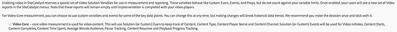

# Información general de Milestone {#milestone-overview}

>[!CAUTION]
>
>Esta opción de medición está en desuso.

[Documentación heredada de Milestone](milestone_analytics_video.pdf)

## Configuración {#configuration}

### Configuración de vídeo en Milestone

Para realizar el seguimiento de vídeos, puede designar un conjunto de *variables de conversión personalizadas* (eVars) y de *eventos personalizados* y utilizarlos para rastrear vídeos y crear informes. También se utiliza una variable de *Custom Insight* () para las rutas.`s.prop`

Las variables que selecciona para cada métrica se agregan a la página de configuración de vídeo. Esto permite al sistema generar y dar formato automáticamente a los informes de vídeo estándar. Tanto la eVar del *nombre del vídeo* como el contador de *vistas de vídeo* son obligatorios. Otras variables son opcionales pero se recomiendan para realizar una medición completa. Una vez habilitado el seguimiento de vídeos, puede ver los informes generados a partir de los datos de vídeo recopilados mediante su seguimiento.

También puede rastrear cualquier número de métricas adicionales para vídeo. Por ejemplo: Si utiliza varios reproductores de vídeo en el sitio, puede rellenar una eVar con el nombre del reproductor. Algunas de las variables que seleccione también pueden utilizarse en otras áreas del sitio. Por ejemplo: Si se utiliza en todo el sitio, la variable de *tipo de contenido* puede permitirle medir qué porcentaje de vistas de página provienen del video y relacionar los eventos de conversión con el vídeo.

### Configuración de informes de Milestone

Para configurar los informes de vídeo para una implementación de Milestone, vaya a **[!UICONTROL Administración > Administrador del grupo de informes].** Seleccione el grupo de informes y elija **[!UICONTROL Administración de vídeo > Informes de vídeo]:**

<!--
{width="248"}
-->


En la primera pantalla, solo funcionará Video Core con los datos de Milestone. Seleccione **[!UICONTROL Video Core]** y haga clic en **[!UICONTROL Guardar].**



En la pantalla siguiente, seleccione **[!UICONTROL Usar variables personalizadas].**

<!--
{width="470"}
-->


En la última pantalla, seleccione las dos eVars y los tres eventos que desea utilizar con la medición de vídeo:

<!--

-->


## Referencia de variables de vídeo {#video-variable-reference}

La siguiente tabla contiene detalles adicionales sobre las variables de comercio y los eventos personalizados para vídeo:

| Métrica de vídeo | Tipo de variable | Descripción |
| --- | --- | --- |
| Contenido | <br/>Caducidad predeterminada de la eVar: Visita | (Requerido) Recopila el nombre del vídeo tal como se especifica en la implementación. |
| Tipo de contenido | <br/>Caducidad predeterminada de la eVar: Vista de página | Recopila datos sobre el tipo de contenido que un visitante ve. Las visitas enviadas por la medición de vídeo tienen asignado un tipo de contenido de `video.` <br/>Esta variable no necesita estar reservada exclusivamente para el seguimiento de vídeo. El hecho de disponer de otros tipos de contenido de informe de contenido mediante el uso de esta misma variable le permite analizar la distribución de los visitantes entre los distintos tipos de contenido. Por ejemplo, podría etiquetar otros tipos de contenido con valores como `article` o `product page` usando esta variable. <br/>Desde una perspectiva de medición de vídeo, *Tipo de contenido* permite identificar visitantes de vídeo y, por consiguiente, calcular las tasas de conversión de vídeo. |
| Tiempo invertido en contenido | Tipo de <br/>evento: Contador | Cuenta el tiempo, en segundos, transcurrido en ver un vídeo desde el último proceso de recopilación de datos (solicitud de imagen). |
| Inicios de vídeo | Tipo de <br/>evento: Contador | Indica que un visitante ha visto alguna parte de un de vídeo. Sin embargo, no proporciona ninguna información sobre qué parte del vídeo ha visualizado el visitante, ni durante cuánto tiempo. |
| Vídeos completados | Tipo de <br/>evento: Contador | Indica que un usuario ha visto un vídeo completo. De forma predeterminada, el evento completo se mide 1 segundo antes del final del vídeo.  <br/>Durante la implementación, puede especificar cuántos segundos desde el final de vídeo quisiera considerar como una vista completa. Para vídeo en directo y otros flujos que no tienen un final definido, puede especificar un punto personalizado para medir las finalizaciones. Por ejemplo, después de un tiempo de visualización específico. |

## Variables de módulo multimedia {#media-module-variables}

Las siguientes variables permiten configurar la medición de vídeo. Debe definir valores para las variables en la tabla Variables requeridas. Además, para rastrear eventos en el reproductor de vídeo, debe habilitar autoTrack (para reproductores admitidos) o implementar el seguimiento de eventos del reproductor personalizado mediante los métodos open, play, stop y close.

| Variable    | Descripción |
| --- | --- |
| `Media.trackUsingContextData` | **Sintaxis:** <br/><br/> `s.Media.trackUsingContextData = true;` <br/>Esta opción habilita el rastreo de vídeo integrado. Cuando se establece en true, el módulo multimedia genera datos de contexto para el seguimiento de contenidos, en lugar del `pev3` heredado. <br/>Utilice `Media.contextDataMapping` para asignar los datos de contexto a las eVars y los eventos seleccionados.<br/>Valor predeterminado: `false` |
| `Media.contextDataMapping` | **Sintaxis:** <br/><br/> `s.Media.contextDataMapping = {`<br/>      `"a.media.name":"eVar2, prop2",` <br/>     `"a.media.segment":"eVar3",` <br/>     `"a.contentType":"eVar1",` <br/>     `"a.media.timePlayed":"event3",` <br/>     `"a.media.view":"event1",` <br/>     `"a.media.segmentView":"event2",` <br/>     `"a.media.complete":"event7",` <br/>     `"a.media.milestones":{` <br/>         `25:"event4",` <br/>         `50:"event5",` <br/>         `75:"event6"` <br/>     ` }` <br/> `};` <br/><br/>Un objeto que define la asignación de variables a eVars y eventos que desea usar para la medición de vídeo. El objeto debe asignar los siguientes campos: <br/><br/> **a.media.name:** (obligatorio) rellena variables con el nombre del vídeo. Proporcione la eVar que seleccionó para almacenar el nombre del vídeo y la variable de vídeo de Custom Insight (`s.prop`) que desee usar para configurar las rutas de vídeo. Disponga los valores en una lista separados por comas. <br/><br/> **a.media.segment**: (opcional) la eVar que desea que almacene el nombre del segmento de contenidos. a.contentType: (opcional) la eVar que desea que almacene el valor del vídeo, que contiene el seguimiento de visitas y visitantes habilitado para generar informes sobre ellos. La variable que seleccione probablemente ya se esté usando para almacenar datos, como diapositivas de artículos o páginas de productos.<br/><br/> **a.media.view**: (obligatorio) el evento que desea que cuente las visualizaciones de contenidos. <br/><br/> **a.media.segmentView**: (opcional) el evento que desea que cuente las vistas de segmentos. <br/><br/> **a.media.complete**: (opcional) el evento que desea que cuente las vistas completas. <br/><br/> **a.media.timePlayed**: (opcional; muy recomendable) el evento numérico que desea que almacene el número de segundos de vídeo reproducidos. <br/><br/> **a.media.milestones**: (opcional) un objeto que asigna hitos s.Media.trackMilestones a eventos de contador. Media.segmentByMilestones debe establecerse como true si define hitos. <br/><br/> **Seguimiento de anuncios** Las siguientes variables de datos de contexto están disponibles para realizar el seguimiento de anuncios: <br/> **a.media.ad.name:** (obligatorio) rellena variables con el nombre del anuncio. Proporcione la eVar que seleccionó para almacenar el nombre del anuncio y la variable de vídeo de Custom Insight (`s.prop`) que desee usar para configurar las rutas. Disponga los valores en una lista separados por comas. <br/><br/> **a.media.ad.pod:** la posición en el contenido principal en la que se reprodujo el anuncio. <br/><br/> **a.media.ad.podPosition:** la posición dentro de la secuencia en la que se reprodujo el anuncio. <br/><br/> **a.media.ad.CPM:** el CPM o CPM cifrado (con el prefijo “~”) que se aplica a esta reproducción. <br/><br/> **a.media.ad.view:** funciona igual que `a.media.view` <br/><br/> **a.media.ad.clicked:** Cuenta el número de clics para el anuncio (llamadas a `Media.click`) <br/><br/> **a.media.ad.timePlayed:** funciona igual que `a.media.timePlayed` <br/><br/> **a.media.ad.complete:** Funciona igual que a.media.ad.segment de `a.media.complete`: Funciona igual que `a.media.segment` <br/><br/> **a.media.ad.segmentView:** funciona igual que `a.media.segmentView` <br/><br/> **a.media.ad.milestones:** funciona igual que `a.media.milestones` <br/><br/> **a.media.ad.offsetMilestones:** funciona igual que `a.media.offsetMilestones` |
| `Media.trackVars` | **Sintaxis:** <br/><br/> `s.Media.trackVars =` <br/>    `"events,` `prop2,` `eVar1,` `eVar2,` `eVar3";` <br/><br/>Una lista separada por comas de todas las variables que se establecen en su código de seguimiento de vídeo. |
| `Media.trackEvents` | **Sintaxis:** <br/><br/> `s.Media.trackEvents =` <br/>    `"event1,` `event2,` `event3,` `event4,` `event5,` `event6,` `event7"` <br/><br/>Una lista separada por comas de todos los eventos que se establecen en su código de seguimiento de vídeo. |

## Variables opcionales {#optional-variables}

|  Variable    | Descripción |
| --- | --- |
| `Media.autoTrack` | **Sintaxis:** <br/><br/> `s.Media.autoTrack = true`<br/><br/>Habilita el seguimiento automático para reproductores compatibles. Estos son los reproductores compatibles: <ul> <li> Open Source Media Framework (OSMF) </li> <li> FLVPlayback (reproductores de vídeo creados por el asistente de importación de vídeo en Flash Professional) </li> <li> Silverlight </li> <li> MediaDisplay </li> <li> MediaPlayback </li> <li> Brightcove versiones de API 2 y 3 (consulte [Brightcove](https://es.integrations.support.brightcove.com/adobe/adobe-aem-brightcove-connector-using-connector.html)) </li> <li> Windows Media Player, Quicktime o Real Player con JavaScript </li> </ul> <br/><br/>Si no utiliza ninguno de esos reproductores, puede usar `Media.open` `Media.play` `Media.stop` `Media.close` para rastrear eventos de reproductor. |
| `Media.autoTrackNetStreams` | **Sintaxis:** <br/><br/> `s.Media.autoTrackNetStreams = true` <br/><br/>Flash 10.3 ha introducido nuevas funciones en el componente NetStream que permiten rastrear mejor los vídeos. Si utiliza un reproductor Flash NetStream personalizado, puede habilitar esta variable para activar una funcionalidad similar a autoTrack. Este método requiere que los vídeos se vean en Flash 10.3 o posterior. |
| `Media.completeByCloseOffset` | **Sintaxis:** <br/><br/> <br/><br/>`s.Media.completeByCloseOffset = true` <br/><br/>Esta configuración le permite contar una vista completa de vídeo unos segundos antes del verdadero final del vídeo.  <br/><br/>El evento se envía en función del número de segundos especificado en `completeCloseOffsetThreshold`. Esto permite medir las finalizaciones en reproductores de vídeo que nunca informan sobre el desplazamiento cuando este es igual a la duración del vídeo.<br/><br/>De forma predeterminada, este valor se define como true y el umbral se establece como 1 segundo. Con estos valores predeterminados, el evento de finalización se envía 1 segundo antes del final del vídeo. |
| `Media.completeCloseOffsetThreshold` | **Sintaxis:** <br/><br/> `s.Media.completeCloseOffsetThreshold = 1` <br/><br/>Este umbral le permite contar una vista completa de vídeo unos segundos antes del verdadero final del vídeo.  `Media.completeByCloseOffset` debe estar definido como true para usar este umbral.<br/><br/>El valor entero que proporciona determina a qué distancia en segundos puede estar el desplazamiento con respecto a la duración completa del vídeo y seguir contando como una finalización. Esto permite medir las finalizaciones en reproductores de vídeo que nunca informan sobre el desplazamiento cuando este es igual a la duración del vídeo.  <br/><br/>El umbral predeterminado es 1 segundo. |
| `Media.playerName` | **Sintaxis:** <br/><br/> `s.Media.playerName = "Custom Player Name"` <br/><br/>Especifica un nombre del reproductor de vídeo personalizado. |
| `Media.trackSeconds` | **Sintaxis:** <br/><br/> `s.Media.trackSeconds = 15` <br/><br/>Define el intervalo, en segundos, para enviar datos de seguimiento de vídeo a los servidores de recopilación de datos de Adobe mientras se reproduce el vídeo. El valor debe definirse en incrementos de 5 segundos. <br/><br/> Al habilitar `Media.trackSeconds`, se activan solo los eventos definidos en `Media.contextDataMapping`. Para enviar variables adicionales al margen de las especificadas para la medición de vídeo, debe usar Media.Monitor. |
| `Media.trackMilestones` | Realiza el seguimiento de hitos como un porcentaje de la duración del vídeo.  <br/><br/> **Sintaxis:** <br/><br/> `s.Media.trackMilestones = "25, 50, 75";` <br/><br/>Define el intervalo, como un porcentaje de la duración del vídeo, para enviar datos de seguimiento de vídeo a los servidores de recopilación de datos de Adobe. Indique los hitos en una lista de números enteros separados por comas. Por ejemplo: 10 = 10 %, 23 = 23 %.  <br/><br/>Puesto que estos hitos son puntos fijos del vídeo, si un visitante pasa el hito de 10 %, luego rebobina y vuelve a pasar ese hito, el módulo multimedia envía los datos de seguimiento varias veces. De igual modo, si un visitante avanza un hito rápidamente, el módulo multimedia no envía los datos de rastreo para ese hito.  <br/><br/>Al habilitar `Media.trackMilestones`, se activan solo los eventos definidos en `Media.contextDataMapping`. Para enviar variables adicionales al margen de las especificadas para la medición de vídeo, debe usar Media.Monitor. |
| `Media.trackOffsetMilestones` | Realiza el seguimiento de hitos como segundos transcurridos desde el principio del vídeo.  <br/><br/> **Sintaxis:** <br/><br/> `s.Media.trackOffsetMilestones = "20, 40, 60";` <br/><br/>Define el intervalo, como segundos transcurridos desde el principio del vídeo, para enviar datos de seguimiento de vídeo a los servidores de recopilación de datos de Adobe. Indique los hitos en una lista de números enteros separados por comas. Por ejemplo: 20 = 20 segundos, 40 = 40 segundos).  <br/><br/>Puesto que estos hitos son puntos fijos del vídeo, si un visitante pasa el hito de 20 segundos, luego rebobina y vuelve a pasar ese hito, el módulo multimedia envía los datos de seguimiento varias veces. De igual modo, si un visitante avanza un hito rápidamente, el módulo multimedia no envía los datos de rastreo para ese hito.  <br/><br/> Al habilitar `Media.trackOffsetMilestones`, se activan solo los eventos definidos en `Media.contextDataMapping`. Para enviar variables adicionales al margen de las especificadas para la medición de vídeo, debe usar Media.Monitor. |
| `Media.segmentByMilestones` | **Sintaxis:** <br/><br/> `s.Media.segmentByMilestones = true;` <br/><br/>Genera automáticamente el nombre del segmento, el número del segmento y los datos de duración del segmento, en función de la longitud de los contenidos y los hitos especificados en `Media.trackMilestones` <br/><br/>Segmentación por hitos (Milestone) es la única manera de definir segmentos al utilizar `autoTrack`. <br/><br/>Valor predeterminado: `false` |
| `Media.segmentByOffsetMilestones` | **Sintaxis:** <br/><br/> `s.Media.segmentByOffsetMilestones = true;` <br/><br/>Genera automáticamente el nombre del segmento, el número del segmento y los datos de duración del segmento, en función de la longitud de los contenidos y los hitos especificados en `Media.trackOffsetMilestones` <br/><br/>Segmentación por hitos (Milestone) es la única manera de definir segmentos al utilizar `autoTrack`.  <br/><br/>Valor predeterminado: `false` |

## Variables de seguimiento de publicidad {#ad-tracking-variables}

Estas variables se utilizan para enviar información de publicidad junto con el método openAd. Consulte [Seguimiento de anuncios de vídeo VAST.](https://experienceleague.adobe.com/docs/media-analytics/using/media-overview.html?lang=es)

| Variable    | Descripción |
| --- | --- |
| `Media.adTrackSeconds` | **Sintaxis:** <br/><br/> `s.Media.adTrackSeconds = 15;` <br/><br/>Define el intervalo, en segundos, para enviar datos de seguimiento de anuncios de vídeo a los servidores de recopilación de datos de Adobe mientras se reproduce el vídeo. El valor debe definirse en incrementos de 5 segundos.  <br/><br/> Al habilitar `Media.adTrackSeconds`, se activan solo los eventos definidos en `Media.contextDataMapping`. Para enviar variables adicionales al margen de las especificadas para la medición de vídeo, debe usar `Media.monitor`. |
| `Media.adTrackMilestones` | Realiza el seguimiento de hitos de anuncio como un porcentaje de la duración del anuncio.  <br/><br/> **Sintaxis:** <br/><br/> `s.Media.adTrackMilestones = "25, 50, 75";` <br/><br/>Define el intervalo, como un porcentaje de la duración del anuncio, para enviar datos de seguimiento de anuncio a los servidores de recopilación de datos de Adobe. Indique los hitos en una lista de números enteros separados por comas. Por ejemplo: 10 = 10 %, 23 = 23 %).  <br/><br/>Puesto que estos hitos son puntos fijos del anuncio, si un visitante pasa el hito de 10 %, luego rebobina y vuelve a pasar ese hito, el módulo multimedia envía los datos de seguimiento varias veces. De igual modo, si un visitante avanza un hito rápidamente, el módulo multimedia no envía los datos de rastreo para ese hito.  <br/><br/> Al habilitar `Media.adTrackMilestones`, se activan solo los eventos definidos en `Media.contextDataMapping`. Para enviar variables adicionales al margen de las especificadas para la medición de vídeo, debe usar `Media.monitor`. |
| `Media.adTrackOffsetMilestones` | Realiza el seguimiento de hitos como segundos transcurridos desde el principio del anuncio.  <br/><br/> **Sintaxis:** <br/><br/> `s.Media.adTrackOffsetMilestones = "20, 40, 60";` <br/><br/>Define el intervalo, como segundos transcurridos desde el principio del anuncio, para enviar datos de seguimiento de anuncio a los servidores de recopilación de datos de Adobe. Indique los hitos en una lista de números enteros separados por comas. Por ejemplo: 20 = 20 segundos, 40 = 40 segundos).  <br/><br/>Puesto que estos hitos son puntos fijos del anuncio, si un visitante pasa el hito de 20 segundos, luego rebobina y vuelve a pasar ese hito, el módulo multimedia envía los datos de seguimiento varias veces. De igual modo, si un visitante avanza un hito rápidamente, el módulo multimedia no envía los datos de rastreo para ese hito.  <br/><br/> Al habilitar `Media.adTrackOffsetMilestones`, se activan solo los eventos definidos en `Media.contextDataMapping`. Para enviar variables adicionales al margen de las especificadas para la medición de vídeo, debe usar `Media.monitor`. |
| `Media.adSegmentByMilestones` | **Sintaxis:** <br/><br/> `s.Media.adSegmentByMilestones = true;` <br/><br/>Genera automáticamente el nombre del segmento, el número del segmento y los datos de duración del segmento, en función de la longitud de los contenidos y los hitos especificados en `Media.adTrackMilestones` <br/><br/>Segmentación por hitos (Milestone) es la única manera de definir segmentos al utilizar `autoTrack`.  <br/><br/>Valor predeterminado: `false` |
| `Media.adSegmentByOffsetMilestones` | **Sintaxis:** <br/><br/> `s.Media.adSegmentByOffsetMilestones = true;` <br/><br/>Genera automáticamente el nombre del segmento, el número del segmento y los datos de duración del segmento, en función de la longitud de los contenidos y los hitos especificados en `Media.adTrackOffsetMilestones` <br/><br/>Segmentación por hitos (Milestone) es la única manera de definir segmentos al utilizar `autoTrack`. <br/><br/>Valor predeterminado: `false` |

## Métodos de módulo multimedia {#media-module-methods}

Los métodos del módulo multimedia se utilizan para rastrear manualmente eventos de reproductores y métricas adicionales que no forman parte de los informes de vídeo estándar.

Si está utilizando `Media.autoTrack` y no está rastreando métricas adicionales, no necesita llamar a ninguno de estos métodos directamente. Todos los argumentos son necesarios a menos que se especifique que son opcionales.

| Método    | Descripción |
| --- | --- |
| `Media.open` | **Sintaxis:** <br/><br/> `s.Media.open(mediaName, mediaLength, mediaPlayerName)` <br/><br/>Prepara el módulo multimedia para recopilar datos de seguimiento de vídeo. Este método emplea los parámetros siguientes: <ul><li> **mediaName:** (requerido) nombre del vídeo tal como desea que aparezca en informes de vídeo. </li><li>  **mediaLength:** (requerido) duración del vídeo en segundos.  </li><li> **mediaPlayerName**: (requerido) nombre del reproductor de contenidos que se utilizó para ver el vídeo, tal como desea que aparezca en informes de vídeo. </li></ul> |
| `Media.openAd` | **Sintaxis:** <br/><br/> `s.Media.openAd(name, length, playerName, parentName,`<br/>   `parentPod, parentPodPosition, CPM)` <br/><br/>Prepara el módulo multimedia para recopilar datos de seguimiento de anuncios. Este método emplea los parámetros siguientes: <ul> <li> **name:** (requerido) nombre o ID del anuncio.  </li> <li> **length:** (requerido) duración del anuncio.  </li> <li> **playerName:** (requerido) nombre del reproductor de contenidos que se utilizó para ver el anuncio.  </li> <li> **parentName:** nombre o ID del contenido primario donde está incrustado el anuncio.  </li> <li> **parentPod:** posición en el contenido primario en que se reprodujo el anuncio.  </li> <li> **parentPodPosition:** posición dentro del pod donde se reproduce el anuncio.  </li> <li> **CPM:** CPM o CPM cifrado (con el prefijo “~”) que se aplica a esta reproducción.  </li> </ul> |
| `Media.click` | **Sintaxis:** <br/><br/> `s.Media.click(name, offset)` <br/><br/>Rastrea cuando se hace clic en un anuncio de un vídeo. Este método emplea los parámetros siguientes: <ul> <li> **Nombre:** Nombre del anuncio. Debe coincidir con el nombre que se usa en Media.openAd.  </li> <li> **Desplazamiento:** Desplazamiento en la publicidad cuando se produjo el clic.  </li> </ul> |
| `Media.close` | **Sintaxis:** <br/><br/> `s.Media.close(mediaName)` <br/><br/>Finaliza la recopilación de datos de vídeo y envía información a servidores de recopilación de datos de Adobe. Llame a este método al final del vídeo. Este método toma el parámetro siguiente: <br/><br/> **mediaName**: nombre del vídeo. Debe coincidir con el nombre que se usa en `Media.open`. |
| `Media.complete` | **Sintaxis:** <br/><br/> `s.Media.complete(name, offset)` <br/><br/>Este método rastrea manualmente un evento completo. Este método se utiliza cuando necesita desencadenar eventos con lógica especial que no se pueden administrar con `Media.completeByCloseOffset`. <br/><br/>Por ejemplo, si está midiendo un flujo en vivo que no tiene fin definido, puede que desencadene una finalización después de que un usuario vea un flujo en vivo durante X segundos. Puede medir una finalización mediante un cálculo de porcentaje basado en la longitud y el tipo de contenido. Este método emplea los parámetros siguientes: <ul> <li> **mediaName**: nombre del vídeo. Debe coincidir con el nombre que se usa en Media.open.  </li> <li> **mediaOffset:** El número de segundos en el vídeo cuando se debe enviar el evento completo. Indique el desplazamiento teniendo en cuenta que el vídeo comienza en el segundo cero. <br/><br/>Si el reproductor multimedia rastrea con milisegundos, asegúrese de que el valor se convierta a segundos antes de llamar a Media.complete.  </li> </ul> Si planea invocar Completar manualmente, establezca <br/><br/> `s.Media.completeByCloseOffset = false`. |
| `Media.play` | **Sintaxis:** <br/><br/> `s.Media.play(name, offset, segmentNum, segment, segmentLength)` <br/><br/>Llame a este método en cualquier momento en que se comience a reproducir un vídeo. Al utilizar medición de vídeo manual, puede proporcionar los datos de segmentos actuales al enviar datos de medición de vídeo.  <br/><br/>Si el reproductor cambia de un segmento a otro por cualquier razón, debe invocar `Media.stop` `Media.play`. <br/><br/>Este método emplea los parámetros siguientes: <br/><br/> **mediaName**: nombre del vídeo. Debe coincidir con el nombre que se usa en Media.open.  <br/><br/> **mediaOffset:** El número de segundos en el vídeo en el que comienza la reproducción. Indique el desplazamiento teniendo en cuenta que el vídeo comienza en el segundo cero. Si el reproductor multimedia rastrea con milisegundos, asegúrese de que el valor se convierta a segundos antes de llamar a Media.play.  <br/><br/> **segmentNum**: (Opcional) número del segmento actual que los informes de marketing utilizan para ordenar la visualización de segmentos en informes. El parámetro segmentNum debe ser mayor que cero.  <br/><br/> **segment**: (Opcional) nombre del segmento actual.  <br/><br/> **segmentLength:** (Opcional) <br/><br/>La duración en segundos del segmento actual.  <br/><br/>Por ejemplo: <br/><br/> `s.Media.play("My Video", 1800, 2,"Second Quarter", 1800)` <br/><br/> `s.Media.play("My Video", 0, 1,"Preroll", 30)` |
| `Media.stop` | **Sintaxis:** <br/><br/> `s.Media.stop(mediaName, mediaOffset)` <br/><br/>Rastrea un evento de detención (detención, pausa, etc.) para el vídeo especificado. Este método emplea los parámetros siguientes: <ul> <li> **mediaName**: nombre del vídeo. Debe coincidir con el nombre que se usa en `Media.open`.  </li> <li> **mediaOffset:** El número de segundos en el vídeo que se produce el evento de detención o pausa. Indique el desplazamiento teniendo en cuenta que el vídeo comienza en el segundo cero.  </li> </ul> |
| `Media.monitor` | **Sintaxis:** <br/><br/> `s.Media.monitor(s, media)` <br/><br/> **Sintaxis de Silverlight:**<br/><br/> `s.Media.monitor =` <br/>   `new AppMeasurement_Media_Monitor(myMediaMonitor);` <br/><br/>El monitor multimedia de aplicaciones de Silverlight implementa el patrón de diseño de delegado Objective-C. El método de clase `myMediaMonitor` toma los parámetros `s` y `media`. <br/><br/>Utilice este método para enviar métricas de vídeos adicionales. Puede configurar variables adicionales (Props, eVars, Events) y enviarlas con `Media.track` en función del estado actual del vídeo mientras se reproduce. <br/><br/>Consulte [Medir métricas adicionales con Media.monitor.](https://experienceleague.adobe.com/docs/media-analytics/using/media-overview.html?lang=es) <br/><br/>Este método emplea los parámetros siguientes: <br/><br/>  **s:**: La instancia de `AppMeasurement` (o el objeto de JavaScript de `s`). <br/><br/> **contenidos:** Un objeto con miembros que indican el estado del vídeo. Estos miembros son:  <ul><li> `media.name:` Nombre del vídeo. Debe coincidir con el nombre que se usa en `Media.open`; </li><li> `media.length:` duración del vídeo en segundos que se proporciona en la llamada a `Media.open`; </li><li> `media.playerName:` nombre del reproductor de contenidos que se proporciona en la llamada a `Media.open`; </li><li> `media.openTime:` Ubjeto NSDate que contiene datos sobre cuándo se invocó a `Media.open`; </li><li> `media.offset:` desplazamiento actual, en segundos, (punto real en el vídeo) del vídeo. El desplazamiento comienza en cero (el primer segundo del vídeo es el segundo 0); </li><li> `media.percent:` porcentaje actual del vídeo que se reprodujo, en función de la duración del vídeo y del desplazamiento actual.;  </li><li> `media.timePlayed:` número total de segundos reproducidos hasta el momento;  </li><li> `media.eventFirstTime:` indica si esta fue la primera vez en invocar el evento multimedia para este vídeo; </li><li> `media.mediaEvent:` cadena que contiene el nombre del evento que provocó la llamada al monitor. </li></ul> |
| | `media.mediaEvent` eventos: <ul><li> `OPEN:` cuando la reproducción se observa por primera vez mediante `Media.autoTrack` o una llamada a `Media.play`; </li><li> `CLOSE:` cuando la reproducción termina al completarse el vídeo mediante `Media.autoTrack` o una llamada a `Media.close`;</li><li> `PLAY:` cuando la reproducción se reanuda después de estar pausada o se analiza mediante `Media.autoTrack` o una segunda llamada a `Media.play`;</li><li> `STOP:` cuando una reproducción se detiene debido a una pausa del principio de análisis mediante `Media.autoTrack` o una llamada a `Media.stop`;</li><li> `MONITOR:` cuando nuestra supervisión automática comprueba el estado del vídeo mientras se está reproduciendo (cada segundo);</li><li> `SECONDS:` En el segundo intervalo definido por la variable de `Media.trackSeconds`;</li><li> `MILESTONE:` en los hitos (Milestone) definidos por la variable `Media.trackMilestones`; </li></ul> |
| `Media.track` | **Sintaxis:** <br/><br/> `s.Media.track(mediaName)` <br/><br/>Envía inmediatamente el estado de vídeo actual, junto con las `Media.trackVars` y los Media.trackEvents que ha definido. Este método se utiliza dentro de `Media.monitor`. <br/><br/>Consulte [Medir métricas adicionales con Media.monitor.](https://experienceleague.adobe.com/docs/media-analytics/using/media-overview.html?lang=es) <br/><br/>Llame a `Media.open` y `Media.play` en el vídeo antes de llamar a este método. Este método emplea el parámetro siguiente: <ul> <li> **mediaName**: nombre del vídeo. Debe coincidir con el nombre que se usa en `Media.open`.</li> </ul> Este método es la única manera de enviar variables adicionales mientras se reproduce el vídeo. Restaura los contadores de intervalo de segundos y de hito porcentual a cero para evitar múltiples visitas de seguimiento. |


## Seguimiento de los eventos del reproductor de vídeo {#track-video-player-events}

Los reproductores de vídeo se pueden rastrear creando funciones incluidas en los controladores de eventos de reproductor de vídeo. Esto le permite invocar a `Media.open`, `Media.play`, `Media.stop` y `Media.close` en el momento adecuado. Por ejemplo:

* **Cargar:** Invocar a `Media.open` y `Media.play`
* **Pausar:** Invocar a `Media.stop`. Por ejemplo, si un usuario pone en pausa un vídeo después de 15 segundos, invoque `s.Media.stop("Video1", 15)`.
* **Búfer**: invoque `Media.stop` mientras el vídeo se almacena en el búfer. Llama a `Media.play` cuando se reanuda la reproducción.
* **Reanudar:** Invocar a `Media.play`. Por ejemplo, cuando un usuario reanuda un vídeo después de 15 segundos de reproducción inicial, llama a `s.Media.play("Video1", 15)`.
* **Anular (deslizador):** cuando el usuario arrastre el deslizador del vídeo, invoque `Media.stop`. Cuando el usuario libera el deslizador del vídeo, llama a `Media.play`.
* **Finalizar:** Invocar a `Media.stop` y luego a `Media.close`. Por ejemplo, al finalizar un vídeo de 100 segundos, llama a `s.Media.stop("Video1", 100)` y, a continuación, a `s.Media.close("Video1")`.

Para que esto suceda, puede definir cuatro funciones personalizadas que puede invocar desde el administrador de eventos del reproductor de contenidos. Los distintos parámetros que se pasan a `Media.open`, `Media.play`, `Media.stop` y `Media.close` proceden del reproductor. El siguiente ejemplo de código muestra cómo se puede realizar:

```javascript
/* Call on video load */
function startMovie() {
    s.Media.open(mediaName, mediaLength, mediaPlayerName);
    playMovie();
}

/* Call on video resume from pause and slider release */
function playMovie() {
    s.Media.play(mediaName,
                 mediaOffset,  
                 segmentNum,  
                 segment,  
                 segmentLength);
}
/* Call on video pause and slider grab */
function stopMovie() {
    s.Media.stop(mediaName, mediaOffset);
}

/* Call on video end */
/* Measuring Video for Developers 43 */
function endMovie() {
    stopMovie();
    s.Media.close(mediaName);
}
```

## AutoTrack en JavaScript {#javascript-autotrack}

El módulo multimedia de JavaScript identifica todas las etiquetas `<embed>` o `<object>` que hay en la página HTML. Luego busca los datos que hay en cada etiqueta para averiguar qué reproductor multimedia se está usando (si es que se usa alguno). Si el reproductor es Windows Media Player, Quicktime o Real Player, se puede usar `autoTrack`, aunque `autoTrack` solo funciona con Internet Explorer para Windows Media Player. En Windows Media Player se requiere el rastreo manual para admitir los demás exploradores.

El atributo `classid` tiene que estar definido en el objeto que quiere rastrear. `classid` es necesario para exponer los controladores de eventos que usa el módulo multimedia para rastrear automáticamente el vídeo.

```javascript
s.Media.autoTrack = true
```

## Código de muestra de JavaScript {#javascript-sample-code}

```javascript
// Sample implementation
s.usePlugins=true
function s_doPlugins(s) {
    /* Add manual calls to modules and plugins here */
}

s.doPlugins=s_doPlugins

/*********Media Module Calls**************/
s.loadModule("Media")

/*Configure Media Module Functions */
s.Media.autoTrack= true;
s.Media.trackVars="events, prop2, eVar1, eVar2, eVar3";
s.Media.trackEvents="event1, event2, event3, event4, event5, event6, event7"
s.Media.trackMilestones="25, 50, 75";
s.Media.playerName="My Media Player";
s.Media.segmentByMilestones = true;
s.Media.trackUsingContextData = true;
s.Media.contextDataMapping = {
    "a.media.name":"eVar2, prop2",
    "a.media.segment":"eVar3",
    "a.contentType":"eVar1",
    "a.media.timePlayed":"event3",
    "a.media.view":"event1",
    "a.media.segmentView":"event2",
    "a.media.complete":"event7",
    "a.media.milestones":{
        25:"event4",
        50:"event5",
        75:"event6"
    }
}

s.Media.monitor = function (s, media) { } //If Needed

/* Turn on and configure debugging here */
s.debugTracking = true;
s.trackLocal = true;

/* WARNING: Changing any of the below variables will cause drastic changes to how your visitor
data is collected. Changes should only be made when instructed to do so by your account
manager.*/
s.visitorNamespace = "yourNamespace";
s.trackingServer="metrics.mysite.com" //Use only if using first party cookies
s.trackingServerSecure="smetrics.mysite.com" // Use only if using first party cookies in  
                                             // conjunction with SSL
s.dc = '122';

/************************** PLUGINS SECTION *************************/
/* Insert any plugins code you want to use here. */

/****************************** MODULES *****************************/
/* Insert the media module tracking code here. */
```
