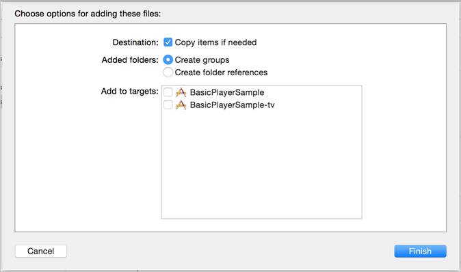

# Configuración de iOS{#set-up-ios}

Aprenda a configurar los servicios de medios de streaming para dispositivos iOS.

>[!IMPORTANT]
>
>Con la finalización de la compatibilidad con los SDK para móviles de la versión 4 el 31 de agosto de 2021, Adobe también dejará de ofrecer compatibilidad con el SDK de Media Analytics para iOS y Android.  Para obtener más información, consulte [Preguntas frecuentes sobre el fin de la asistencia del SDK de Media Analytics](/help/additional-resources/end-of-support-faqs.md).

## Requisitos previos

* **Obtenga parámetros de configuración válidos para Media SDK**
Estos parámetros se pueden obtener de un representante de Adobe una vez creada la cuenta de Analytics.
* **Implemente ADBMobile para iOS en su aplicación**
Para obtener más información acerca de la documentación de Adobe Mobile SDK, consulte [iOS SDK 4.x para soluciones de Experience Cloud.](https://experienceleague.adobe.com/docs/mobile-services/ios/overview.html?lang=es)

  >[!IMPORTANT]
  >
  >A partir de iOS 9, Apple introdujo una función denominada App Transport Security (ATS). Esta función tiene como objetivo mejorar la seguridad de la red asegurándose de que las aplicaciones utilicen únicamente los protocolos y los cifrados estándar del sector. Esta función está habilitada de forma predeterminada, pero tiene opciones de configuración que le permiten trabajar con ATS. Para obtener más información sobre ATS, consulte [Seguridad del transporte de aplicaciones.](https://experienceleague.adobe.com/docs/mobile-services/ios/config-ios/app-transport-security.html?lang=es)

* **Proporcione las siguientes capacidades en su reproductor de contenidos**:

   * _Una API para suscribirse a eventos del reproductor_: Media SDK requiere que llame a un conjunto de API simples cuando se produzcan eventos en el reproductor.
   * _Una API que proporciona información del reproductor_: Esta información incluye detalles como el nombre del medio y la posición del cabezal de reproducción.

## Implementación del SDK

>[!IMPORTANT]
>
>A partir de la versión 2.3.0, el SDK se distribuye mediante XCFrameworks.
>
>La versión 2.3.0 del SDK requiere Xcode 12.0 o posterior y, si procede, Cocoapods 1.10.0 o posterior.

* Cada vez que se mencione un archivo de biblioteca binario, deberá utilizarse su reemplazo de XCFramework:
   * MediaSDK.a > MediaSDK.xcframework
   * MediaSDK_TV.a > MediaSDKTV.xcframework
* Si agrega manualmente los XCFrameworks de Adobe a su proyecto, asegúrese de que no estén integrados.

1. Añada el Media SDK [descargado](/help/getting-started/download-sdks.md) al proyecto.

   1. Compruebe que los siguientes componentes de software existan en el directorio `libs`:

      * `ADBMediaHeartbeat.h`: archivo del encabezado Objective-C que se utiliza para las API de seguimiento de Heartbeat para iOS.
      * `ADBMediaHeartbeatConfig.h`: archivo del encabezado Objective-C que se utiliza para la configuración del SDK.
      * `MediaSDK.a`: binario multiarquitectura habilitado para código de bits que contiene las compilaciones de biblioteca para los simuladores (i386 y x86_64) y dispositivos iOS (armv7, armv7s, arm64).

        Este binario se debe vincular cuando el destino se dirija a una aplicación iOS.

      * `MediaSDK_TV.a`: binario multiarquitectura habilitado para código de bits que contiene las compilaciones de biblioteca para el simulador (x86_64) y los dispositivos Apple TV (arm64) nuevos.

        Este binario se debe vincular cuando el destino se dirija a una aplicación Apple TV (tvOS).

   1. Añada la biblioteca al proyecto:

      1. Inicie el IDE de Xcode y abra la aplicación.
      1. En **[!UICONTROL Navegador de proyectos]**, arrastre el directorio `libs` y suéltelo debajo de su proyecto.

      1. Asegúrese de que la casilla de verificación **[!UICONTROL Copiar elementos si es necesario]** esté activada, que la opción **[!UICONTROL Crear grupos]** esté seleccionada y que ninguna de las casillas de verificación de **[!UICONTROL Agregar a destino]** esté activada.

      

      1. Haga clic en **[!UICONTROL Finalizar]**.
      1. En **[!UICONTROL Navegador de proyectos]**, seleccione su aplicación y sus destinos.
      1. Vincule los marcos y bibliotecas requeridos de la sección **[!UICONTROL Marcos vinculados]** y **[!UICONTROL Bibliotecas]** en la pestaña **[!UICONTROL General]**.

         **Destinos de aplicaciones iOS:**

         * **AdobeMobileLibrary.a**
         * **MediaSDK.a**
         * **libsqlite3.0.tbd**

         **Apple TV (tvOS) Targets:**

         * **AdobeMobileLibrary_TV.a**
         * **MediaSDK_TV.a**
         * **libsqlite3.0.tbd**
         * **SystemConfiguration.framework**

      1. Confirme que la aplicación se compila sin errores.

1. Importe la biblioteca.

   ```
   #import "ADBMediaHeartbeat.h"
   #import "ADBMediaHeartbeatConfig.h"
   ```

1. Cree una instancia de `ADBMediaHeartbeatConfig`.

   Esta sección le ayudará a entender los parámetros de configuración de `MediaHeartbeat` y a seleccionar valores de configuración correctos en la instancia de `MediaHeartbeat` para conseguir un seguimiento preciso.

   Este es un ejemplo de una inicialización de `ADBMediaHeartbeatConfig`:

   ```
   // Media Heartbeat Initialization
   ADBMediaHeartbeatConfig *config = [[ADBMediaHeartbeatConfig alloc] init];
   config.trackingServer = <SAMPLE_HEARTBEAT_TRACKING_SERVER>;
   config.channel        = <SAMPLE_HEARTBEAT_CHANNEL>;
   config.appVersion     = <SAMPLE_HEARTBEAT_SDK_VERSION>;
   config.ovp            = <SAMPLE_HEARTBEAT_OVP_NAME>;
   config.playerName     = <SAMPLE_PLAYER_NAME>;
   config.ssl            = <YES/NO>;
   config.debugLogging   = <YES/NO>;
   ```

1. Implemente el protocolo de `ADBMediaHeartbeatDelegate`.

   ```
   @interface VideoAnalyticsProvider : NSObject <ADBMediaHeartbeatDelegate>
   
   @end
   
   @implementation VideoAnalyticsProvider
   
   // Replace <bitrate>, <startuptime>, <fps> and <droppeFrames>  
   // with the current playback QoS values.
   - (ADBMediaObject *)getQoSObject {
       return [ADBMediaHeartbeat createQoSObjectWithBitrate:<bitrate>  
                                 startupTime:<startuptime>   
                                 fps:<fps>  
                                 droppedFrames:<droppedFrames>];
   }
   
   // Return the current video player playhead position.
   // Replace <currentPlaybackTime> with the video player current playback time
   - (NSTimeInterval)getCurrentPlaybackTime {
       return <currentPlaybackTime>;
   }
   
   @end
   ```

1. Utilice `ADBMediaHeartBeatConfig` y `ADBMediaHeartBeatDelegate` para crear la instancia `ADBMediaHeartbeat`.

   ```
   //Replace <ADBMediaHeartBeatDelegate> with your delegate instance
   _mediaHeartbeat = [[ADBMediaHeartbeat alloc] initWithDelegate:
     <ADBMediaHeartBeatDelegate> config:config];
   ```

   >[!IMPORTANT]
   >
   >Asegúrese de que la instancia de `ADBMediaHeartbeat` es accesible y *no se desasigna hasta el final de la sesión*. Esta instancia se utilizará para todos los eventos de seguimiento posteriores.

## Migración de la versión 1.x a 2.x en iOS {#migrate-to-two-x}

En la versión 2.x, todos los métodos públicos se incluyen en la clase `ADBMediaHeartbeat` para facilitar el trabajo de los desarrolladores. Todas las configuraciones se incluyen en la clase `ADBMediaHeartbeatConfig`.

Para obtener información sobre la migración de 1.x a 2.x, consulte la documentación de Implementación heredada).

## Configurar una aplicación nativa para tvOS

Con el lanzamiento de Apple TV, ahora puede crear aplicaciones para ejecutarlas en el entorno nativo de tvOS. Puede crear una aplicación puramente nativa con cualquiera de los distintos marcos disponibles en iOS o puede crear la aplicación con plantillas XML y JavaScript. A partir de la versión 2.0 de MediaSDK, está disponible la compatibilidad con tvOS. Para obtener más información sobre tvOS, consulte el [Sitio para desarrolladores de tvOS.](https://developer.apple.com/tvos/)

Realice los siguientes pasos en su proyecto de Xcode. Esta guía se escribe suponiendo que el proyecto tiene un destinatario que es una aplicación de Apple TV segmentada a tvOS:

1. Arrastre el archivo de biblioteca `VideoHeartbeat_TV.a` a la carpeta `lib` del proyecto.

1. En la ficha **[!UICONTROL Fases de compilación]** del destino de su aplicación de tvOS, expanda la sección **[!UICONTROL Vincular binario con bibliotecas]** y agregue las bibliotecas siguientes:

   * `MediaSDK_TV.a`
   * `AdobeMobileLibrary_TV.a`
   * `libsqlite3.0.tbd`
   * `SystemConfiguration.framework`
