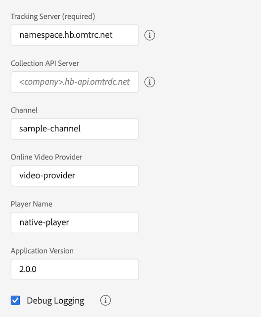

# Migración del SDK de medios independiente a Adobe Launch: Android

>[!NOTE]
>Adobe Experience Platform Launch se ha convertido en un conjunto de tecnologías de recopilación de datos en Experience Platform. Como resultado, se han implementado varios cambios terminológicos en la documentación del producto. Consulte el siguiente [documento](https://experienceleague.adobe.com/docs/experience-platform/tags/term-updates.html?lang=es) para obtener una referencia consolidada de los cambios terminológicos.


## Configuración

### SDK de medios independiente

En Media SDK independiente se establece la configuración de seguimiento en la aplicación y se traslada a
el SDK al crear el rastreador.

```java
MediaHeartbeatConfig config = new MediaHeartbeatConfig();
config.trackingServer = "namespace.hb.omtrdc.net";
config.channel = "sample-channel";
config.appVersion = "v2.0.0";
config.ovp = "video-provider";
config.playerName = "native-player";
config.ssl = true;
config.debugLogging = true;

MediaHeartbeat tracker = new MediaHeartbeat(... , config);
```

### Extensión de Launch

1. En Experience Platform Launch, haga clic en la ficha [!UICONTROL Extensiones] para su
propiedad móvil.
1. En la ficha [!UICONTROL Catálogo], busque Adobe Media Analytics para audio
y la extensión de vídeo, y haga clic en [!UICONTROL Instalar].
1. En la página de configuración de la extensión, configure los parámetros de seguimiento.
La extensión de medios utilizará los parámetros configurados para el seguimiento.



[Uso de extensiones móviles](https://developer.adobe.com/client-sdks/documentation/adobe-media-analytics/)

## Creación de rastreadores

### SDK de medios independiente

En Media SDK independiente, cree manualmente el objeto `MediaHeartbeatConfig`
y configure los parámetros de seguimiento. Implementar la interfaz delegada que expone
`getQoSObject()` y `getCurrentPlaybackTime()functions.`
Crear una instancia de `MediaHeartbeat` para el seguimiento.

```java
MediaHeartbeatConfig config = new MediaHeartbeatConfig();
config.trackingServer = "namespace.hb.omtrdc.net";
config.channel = "sample-channel";
config.appVersion = "v2.0";
config.ovp = "video-provider";
config.playerName = "native-player";
config.ssl = true;
config.debugLogging = true;

MediaHeartbeatDelegate delegate = new MediaHeartbeatDelegate() {
    @Override
    public MediaObject getQoSObject() {
        // When called should return the latest qos values.
        return MediaHeartbeat.createQoSObject(<bitrate>,  
                                              <startupTime>,  
                                              <fps>,  
                                              <droppedFrames>);
    }

    @Override
    public Double getCurrentPlaybackTime() {
        // When called should return the current player time in seconds.
        return <currentPlaybackTime>;
    }

    MediaHeartbeat tracker = new MediaHeartbeat(delegate, config);
}
```

### Extensión de Launch

[Referencia de API de medios: Crear un rastreador de medios](https://developer.adobe.com/client-sdks/documentation/adobe-media-analytics/api-reference/#createtracker)

Antes de crear el rastreador, debe registrar la extensión de medios y
extensiones dependientes con el núcleo móvil.

```java
// Register the extension once during app launch
try {
    // Media needs Identity and Analytics extension
    // to function properly
    Identity.registerExtension();
    Analytics.registerExtension();

    // Initialize media extension.
    Media.registerExtension();                
    MobileCore.start(new AdobeCallback () {
        @Override
        public void call(Object o) {
            // Launch mobile property to pick extension settings.
            MobileCore.configureWithAppID("LAUNCH_MOBILE_PROPERTY");
        }
    });
} catch (InvalidInitException ex) {
    ...
}
```

Una vez registrada la extensión de medios, cree el rastreador con la siguiente API.
El rastreador selecciona automáticamente la configuración de la propiedad configurada de Launch.

```java
Media.createTracker(new AdobeCallback<MediaTracker>() {
    @Override
    public void call(MediaTracker tracker) {
        // Use the instance for tracking media.
    }
});
```

## Actualización de los valores de experiencia del cabezal de reproducción y de la calidad.

### SDK de medios independiente

En Media SDK independiente, se pasa un objeto delegado que implementa la variable
`MediaHeartbeartDelegate` interfaz durante la creación del rastreador.  La implementación
debe devolver el último QoE y cabezal de reproducción cada vez que el rastreador invoque el
Métodos de interfaz `getQoSObject()` y `getCurrentPlaybackTime()`.

### Extensión de Launch

La implementación debe actualizar el cabezal de reproducción actual llamando a la función
El rastreador expuso el método `updateCurrentPlayhead`. Para un seguimiento preciso
debe llamar a este método al menos una vez por segundo.

[Referencia de API de medios: Actualizar el reproductor actual](https://developer.adobe.com/client-sdks/documentation/adobe-media-analytics/api-reference/#updatecurrentplayhead)

La implementación debe actualizar la información de QoE llamando a la función `updateQoEObject`
método expuesto por el rastreador. Esperamos que se llame a este método siempre que haya
supone un cambio en las métricas de calidad.

[Referencia de API de medios: Actualizar objeto de QoE](https://developer.adobe.com/client-sdks/documentation/adobe-media-analytics/api-reference/#createqoeobject)

## Transmisión de metadatos estándar/metadatos publicitarios

### SDK de medios independiente

* Metadatos de medios estándar:

  ```java
  MediaObject mediaInfo =
    MediaHeartbeat.createMediaObject("media-name",
                                     "media-id",
                                     60D,
                                     MediaHeartbeat.StreamType.VOD,
                                     MediaHeartbeat.MediaType.Video);
  
  // Standard metadata keys provided by adobe.
  Map <String, String> standardVideoMetadata =
    new HashMap<String, String>();
  standardVideoMetadata.put(MediaHeartbeat.VideoMetadataKeys.EPISODE,
                            "Sample Episode");
  standardVideoMetadata.put(MediaHeartbeat.VideoMetadataKeys.SHOW,
                            "Sample Show");
  standardVideoMetadata.put(MediaHeartbeat.VideoMetadataKeys.SEASON,
                            "Sample Season");
  mediaInfo.setValue(MediaHeartbeat.MediaObjectKey.StandardMediaMetadata,
                     standardVideoMetadata);
  
  // Custom metadata keys
  HashMap<String, String> mediaMetadata = new HashMap<String, String>();
  mediaMetadata.put("isUserLoggedIn", "false");
  mediaMetadata.put("tvStation", "Sample TV Station");
  tracker.trackSessionStart(mediaInfo, mediaMetadata);
  ```

* Metadatos de anuncio estándar:

  ```java
  MediaObject adInfo =
    MediaHeartbeat.createAdObject("ad-name",
                                  "ad-id",
                                  1L,
                                  15D);
  
  // Standard metadata keys provided by adobe.
  Map <String, String> standardAdMetadata =
    new HashMap<String, String>();
  standardAdMetadata.put(MediaHeartbeat.AdMetadataKeys.ADVERTISER,
                         "Sample Advertiser");
  standardAdMetadata.put(MediaHeartbeat.AdMetadataKeys.CAMPAIGN_ID,
                         "Sample Campaign");
  adInfo.setValue(MediaHeartbeat.MediaObjectKey.StandardAdMetadata,
                  standardAdMetadata);
  
  HashMap<String, String> adMetadata =
    new HashMap<String, String>();
  adMetadata.put("affiliate",
                 "Sample affiliate");
  
  tracker.trackEvent(MediaHeartbeat.Event.AdStart,
                     adObject,
                     adMetadata);
  ```

### Extensión de Launch

* Metadatos de medios estándar:

  ```java
  HashMap<String, Object> mediaObject =
    Media.createMediaObject("media-name",
                            "media-id",
                            60D,
                            MediaConstants.StreamType.VOD,
                            Media.MediaType.Video);
  
  HashMap<String, String> mediaMetadata =
    new HashMap<String, String>();
  
  // Standard metadata keys provided by adobe.
  mediaMetadata.put(MediaConstants.VideoMetadataKeys.EPISODE,
                    "Sample Episode");
  mediaMetadata.put(MediaConstants.VideoMetadataKeys.SHOW,
                    "Sample Show");
  
  // Custom metadata keys
  mediaMetadata.put("isUserLoggedIn", "false");
  mediaMetadata.put("tvStation", "Sample TV Station");
  
  tracker.trackSessionStart(mediaInfo, mediaMetadata);
  ```

* Metadatos de anuncio estándar:

  ```java
  HashMap<String, Object> adObject =
    Media.createAdObject("ad-name",
                         "ad-id",
                         1L,
                         15D);
  HashMap<String, String> adMetadata =
    new HashMap<String, String>();
  
  // Standard metadata keys provided by adobe.
  adMetadata.put(MediaConstants.AdMetadataKeys.ADVERTISER,
                 "Sample Advertiser");
  adMetadata.put(MediaConstants.AdMetadataKeys.CAMPAIGN_ID,
                 "Sample Campaign");
  
  // Custom metadata keys
  adMetadata.put("affiliate",
                 "Sample affiliate");
  _tracker.trackEvent(Media.Event.AdStart,
                      adObject,
                      adMetadata);
  ```
