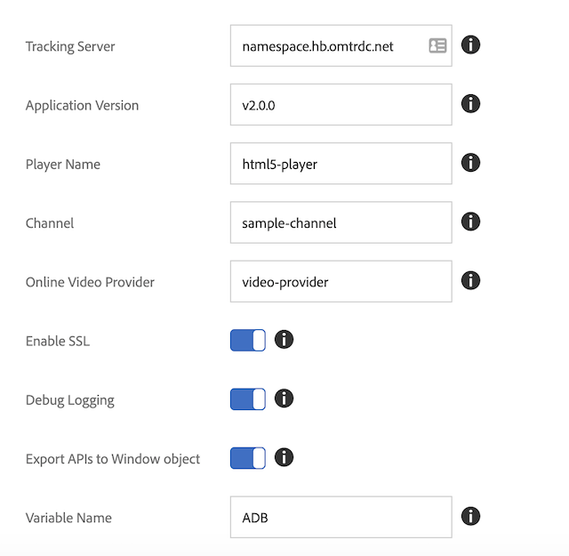

# Migración del SDK de medios independiente a Adobe Launch: Web (JS)

>[!NOTE]
>Adobe Experience Platform Launch se ha convertido en un conjunto de tecnologías de recopilación de datos en Experience Platform. Como resultado, se han implementado varios cambios terminológicos en la documentación del producto. Consulte el siguiente [documento](https://experienceleague.adobe.com/docs/experience-platform/tags/term-updates.html?lang=es) para obtener una referencia consolidada de los cambios terminológicos.

## Diferencias de características

* *Launch*: Launch proporciona una interfaz de usuario que le guiará a través de la instalación, configuración e implementación de sus soluciones de seguimiento de medios basadas en la web. Launch supone una mejora respecto a Dynamic Tag Management (DTM).
* *SDK de medios*: El SDK de medios incluye bibliotecas de seguimiento de medios diseñadas para plataformas específicas (por ejemplo: Android, iOS, etc.). Adobe recomienda usar el SDK de medios para rastrear el uso de medios en sus aplicaciones móviles.

## Configuración

### SDK de medios independiente

En Media SDK independiente se establece la configuración de seguimiento en la aplicación
y pasarlo al SDK cuando cree el rastreador.

```javascript
//Media Heartbeat initialization
var mediaConfig = new MediaHeartbeatConfig();
mediaConfig.trackingServer = "namespace.hb.omtrdc.net";
mediaConfig.playerName = "html5-player";
mediaConfig.channel = "sample-channel";
mediaConfig.ovp = "video-provider";
mediaConfig.appVersion = "v2.0.0"
mediaConfig.ssl = true;
mediaConfig.debugLogging = true;
```

Además de la configuración de `MediaHeartbeat`, la página debe configurar y pasar
la instancia `AppMeasurement` y la instancia `VisitorAPI` para el seguimiento de medios en orden
para funcionar correctamente.

### Extensión de Launch

1. En Experience Platform Launch, haga clic en la ficha [!UICONTROL Extensiones] para su
propiedad web.
1. En la ficha [!UICONTROL Catálogo], busque Adobe Media Analytics para audio y vídeo
Extensión de vídeo y haga clic en [!UICONTROL Instalar].
1. En la página de configuración de la extensión, configure los parámetros de seguimiento.
La extensión de medios utilizará los parámetros configurados para el seguimiento.

   

[Guía del usuario de Launch: Instalar y configurar la extensión de medios](https://experienceleague.adobe.com/docs/experience-platform/tags/extensions/adobe/media-analytics/overview.html?lang=es#install-and-configure-the-ma-extension)

## Diferencias en la creación del rastreador

### Media SDK

1. Añadir la biblioteca de Media Analytics al proyecto de desarrollo.
1. Crear un objeto config (`MediaHeartbeatConfig`).
1. Implementar el protocolo delegado, con las funciones `getQoSObject()` y `getCurrentPlaybackTime()`.
1. Crear una instancia de Media Heartbeat (`MediaHeartbeat`).

```
// Media Heartbeat initialization
var mediaConfig = new MediaHeartbeatConfig();
...
// Configuration settings
mediaConfig.trackingServer = Configuration.HEARTBEAT.TRACKING_SERVER;
...
// Implement Media Delegate (Quality of Service and Playhead)
var mediaDelegate = new MediaHeartbeatDelegate();
...
mediaDelegate.getQoSObject = function() {
    return MediaHeartbeat.createQoSObject(<bitrate>, <startuptime>, <fps>, <droppedFrames>);
    ...
}
...
// Create your tracker
this.mediaHeartbeat = new MediaHeartbeat(mediaDelegate, mediaConfig, appMeasurement);
```

### Launch

Launch ofrece dos métodos para crear la infraestructura de seguimiento. Ambos métodos utilizan la extensión de Launch de Media Analytics:

1. Utilice las API de seguimiento de medios de una página web.

   En este escenario, la extensión de Media Analytics exporta las API de seguimiento de medios a una variable configurada en el objeto de ventana global:

   ```
   window["CONFIGURED_VARIABLE_NAME"].MediaHeartbeat.getInstance
   ```

1. Utilice las API de seguimiento de medios de otra extensión de Launch.

   En este escenario, se utilizan las API de seguimiento de medios expuestas por los módulos compartidos `get-instance` y `media-heartbeat`.

   >[!NOTE]
   >
   >Los módulos compartidos no están disponibles para su uso en páginas web. Solo puede usar módulos compartidos desde otra extensión.

   Cree una instancia `MediaHeartbeat` con el módulo compartido `get-instance`.
Pase un objeto delegado a `get-instance` que exponga las funciones `getQoSObject()` y `getCurrentPlaybackTime()`.

   ```
   var getMediaHeartbeatInstance =
   turbine.getSharedModule('adobe-video-analytics', 'get-instance');
   ```

   Acceda a las constantes de `MediaHeartbeat` a través del módulo compartido `media-heartbeat`.

## Documentación relacionada

### Media SDK

* [Configuración de JavaScript 2.x](/help/legacy/media-sdk/setup/setup-javascript/set-up-js-2.md)
* [API de JS de Media SDK](https://adobe-marketing-cloud.github.io/media-sdks/reference/javascript/MediaHeartbeat.html)

### Launch

* [Información general de Launch](https://experienceleague.adobe.com/docs/experience-platform/tags/home.html?lang=es)
* [Extensión de Media Analytics](https://experienceleague.adobe.com/docs/experience-platform/tags/extensions/adobe/media-analytics/overview.html?lang=es)
