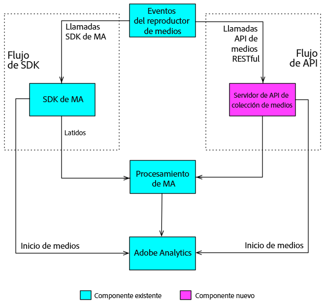

# Información general {#overview}

La API de recopilación de medios es la alternativa RESTful de Adobe al SDK de medios del lado del cliente. Con la API de recopilación de medios, el reproductor puede realizar el seguimiento de eventos de audio y vídeo mediante llamadas HTTP RESTful.

La API de recopilación de medios es esencialmente un adaptador que actúa como una versión del SDK de medios en el lado del servidor. Eso significa que algunos aspectos de la documentación de Media SDK también son pertinentes para la API de recopilación de contenido. Por ejemplo, ambas soluciones utilizan los mismos [Parámetros de audio y vídeo](/help/metrics-and-metadata/audio-video-parameters.md), y los datos recopilados de seguimiento de audio y vídeo llevan a los mismos [Informes y análisis.](/help/media-reports/media-reports-enable.md)

## Flujos de datos del seguimiento de contenidos {#media-tracking-data-flows}

Un reproductor de contenido que implementa la API de recopilación de contenido realiza llamadas de seguimiento de API RESTful directamente al servidor back-end de seguimiento de contenido, mientras que un reproductor que implementa Media SDK hace llamadas de seguimiento a las API de SDK en la aplicación del reproductor. Realizar llamadas a través de la web hace que el reproductor que implementa la API de Media Collection necesite gestionar parte del procesamiento que el Media SDK controla automáticamente. (Detalles de la [implementación de recopilación de contenido.](mc-api-impl/mc-api-quick-start.md))

Los datos de seguimiento capturados con la API de recopilación de contenido se envían y se procesan inicialmente de forma distinta a los datos de seguimiento capturados en un reproductor de Media SDK, pero se utiliza el mismo motor de procesamiento de en el servidor para ambas soluciones.



## Información general de API {#api-overview}

**URI:** Puede obtenerla de su representante de Adobe.

**Método HTTP:** POST, con el cuerpo de solicitud JSON.

### Llamadas de API {#mc-api-calls}

* **`sessions`**- Establece una sesión con el servidor y devuelve un ID de sesión utilizado en las llamadas a`events`posteriores. La aplicación invocará una vez al principio de una sesión de seguimiento.

   ```
   {uri}/api/v1/sessions
   ```

* **`events`**-  Enviar datos de seguimiento de contenidos.

   ```
   {uri}/api/v1/sessions/{session-id}/events
   ```

### Cuerpo de la solicitud {#mc-api-request-body}

```
{
    "playerTime": {
        "playhead": {playhead position in seconds},
        "ts": {timestamp in milliseconds}
    },
    "eventType": {event-type},
    "params": {
        {parameter-name}: {parameter-value},
        ...
        {parameter-name}: {parameter-value}
    },
    "qoeData" : {
        {parameter-name}: {parameter-value},
        ...
        {parameter-name}: {parameter-value}
    },
    "customMetadata": {
        {parameter-name}: {parameter-value},
        ...
        {parameter-name}: {parameter-value}
    }
}
```

* `playerTime` - obligatorio para todas las solicitudes.
* `eventType` - obligatorio para todas las solicitudes.
* `params` - obligatorio para determinados `eventTypes`. Compruebe el [esquema de validación JSON](mc-api-ref/mc-api-json-validation.md) para determinar qué tipos de evento eventTypes son obligatorios y cuáles son opcionales.

* `qoeData` - opcional para todas las solicitudes.
* `customMetadata` - Opcional para todas las peticiones, pero solo se envía con los tipos de evento `sessionStart`, `adStart` y `chapterStart`.

Para cada `eventType`, hay [un esquema de validación JSON](mc-api-ref/mc-api-json-validation.md) disponible públicamente que debe utilizarse para verificar tipos de parámetros y si uno de estos es opcional o necesario para un evento determinado.

### Tipos de eventos {#mc-api-event-types}

* `sessionStart`
* `play`
* `ping`
* `pauseStart`
* `bufferStart`
* `adStart`
* `adComplete`
* `adSkip`
* `adBreakStart`
* `adBreakComplete`
* `chapterStart`
* `chapterSkip`
* `chapterComplete`
* `sessionEnd`
* `sessionComplete`
