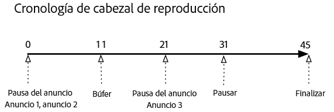
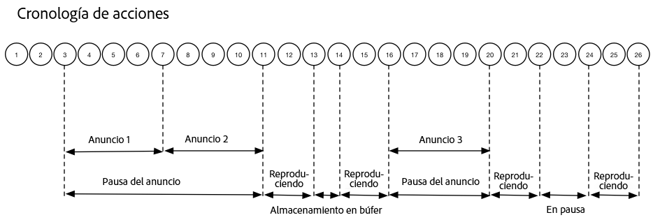

# Línea de tiempo 1: Ver el contenido hasta el final{#timeline-view-to-end-of-content}

## VOD, anuncios pre-roll, pausar, almacenar en búfer, ver contenido hasta el final

Los siguientes diagramas ilustran la línea de tiempo del cursor de reproducción y la línea de tiempo correspondiente de las acciones de un usuario. A continuación se presentan los detalles de cada acción y sus solicitudes correspondientes.








## Detalles de la acción

### Acción 1 - Iniciar sesión {#Action-1}

| Acción | Cronología de acción (segundos) | Posición del cabezal de reproducción (segundos) | Solicitud de cliente |
| --- | :---: | :---: | --- |
| Se presiona el botón de reproducción o reproducción automática, y el vídeo se empieza a cargar. | 0 | 0 | `/api/v1/sessions` |

**Detalles de implementación**

Esta llamada indica _la intención del usuario de reproducir_ un vídeo. <br/><br/>Devuelve un ID de sesión (`{sid}`) al cliente que se utiliza para identificar todas las llamadas de seguimiento subsiguientes dentro de la sesión. El estado del reproductor no es &quot;reproduciendo&quot;, sino &quot;comenzando&quot;. <br/><br/>[Los parámetros de sesión obligatorios](/help/media-collection-api/mc-api-ref/mc-api-sessions-req.md) deben incluirse en el mapa de `params` en la solicitud. <br/><br/>En el servidor, esta llamada genera una llamada de inicio a Adobe Analytics.

**Cuerpo de la solicitud de muestra**

```
{
    playerTime: {
        playhead: 0, ts: <timestamp>
    },
    eventType:sessionStart, params: {
        "media.playerName": "sample-html5-api-player",
        "analytics.trackingServer": "[ _YOUR_TS_ ]",
        "analytics.reportSuite": "[ _YOUR_RSID_ ]",
        "analytics.visitorId": "[ _YOUR_VISITOR_ID_ ]",
        "media.contentType": "VOD",
        "media.length": 60.3333333333333,
        "media.id": "VA API Sample Player",
        "visitor.marketingCloudOrgId": "[YOUR_MCID]",
        "media.name": "ClickMe",
        "media.channel": "sample-channel",
        "media.sdkVersion": "va-api-0.0.0",
        "analytics.enableSSL": false
    }
}
```

### Acción 2 - Inicio del temporizador de ping {#Action-2}

| Acción | Cronología de acción (segundos) | Posición del cabezal de reproducción (segundos) | Solicitud de cliente |
| --- | :---: | :---: | --- |
| La aplicación inicia el temporizador de eventos de ping | 0 | 0 | `/api/v1/sessions/{sid}/events` |  |

**Detalles de implementación**

Inicie el temporizador de ping de su aplicación. El primer evento de ping debe activarse en el primer segundo si hay anuncios previos a la emisión y en los 10 primeros segundos en caso contrario.

### Acción 3 - Inicio de la pausa publicitaria {#Action-3}

| Acción | Cronología de acción (segundos) | Posición del cabezal de reproducción (segundos) | Solicitud de cliente |
| --- | :---: | :---: | --- |
| Rastrear inicio de pausa del anuncio previo a la emisión | 0 | 0 | `/api/v1/sessions/{sid}/events` |

**Detalles de implementación**

Los anuncios solo se pueden rastrear durante una pausa publicitaria.

**Cuerpo de la solicitud de muestra**

```
{
    playerTime: {
        playhead: 0,
        ts: <timestamp>
    },
    eventType:adBreakStart, params: {
        "media.ad.podFriendlyName": "ad_pod1",
        "media.ad.podIndex": 0,
        "media.ad.podSecond": 0
    }
}
```

### Acción 4 - Inicio del anuncio {#Action-4}

| Acción | Cronología de acción (segundos) | Posición del cabezal de reproducción (segundos) | Solicitud de cliente |
| --- | :---: | :---: | --- |
| Rastrear inicio del anuncio previo a la emisión n.º 1 | 0 | 0 | `/api/v1/sessions/{sid}/events` |

**Detalles de implementación**

Comience a rastrear el primer anuncio pre-roll, que dura 15 segundos. Incluir metadatos personalizados con `adStart` .

**Cuerpo de la solicitud de muestra**

```
{
    playerTime: {
        playhead: 0,
        ts: &lt;timestamp&gt;
    },
    eventType:adStart,
    params: {
        "media.ad.podFriendlyName": "ad_pod1",
        "media.ad.name": "Ad 1",
        "media.ad.id": "001",
        "media.ad.length": 15,
        "media.ad.podPosition": 1,
        "media.ad.playerName": "Sample Player",
        "media.ad.advertiser": "Ad Guys",
        "media.ad.campaignId": "1",
        "media.ad.creativeId": "42",
        "media.ad.siteId": "XYZ",
        "media.ad.creativeURL": "https://xyz_creative.com",
        "media.ad.placementId": "sample_placement"
    },
    customMetadata: {
        "myCustomData1": "CustomData1",
        "myCustomData2": "CustomData2"
    }
}
```

### Acción 5 - Agrupaciones de anuncios {#Action-5}

#### Acción 5.1 - Anuncio ping 1 {#Action-5-1}

| Acción | Cronología de acción (segundos) | Posición del cabezal de reproducción (segundos) | Solicitud de cliente |
| --- | :---: | :---: | --- |
| La aplicación envía eventos de ping | 1 | 0 | `/api/v1/sessions/{sid}/events` |

**Detalles de implementación**

Mande un ping al servidor cada segundo mientras se encuentra dentro de un anuncio.

**Cuerpo de la solicitud de muestra**

```
{
    playerTime: {
        playhead: 0,
        ts: <timestamp>
    },
    eventType:ping
}
```

#### Acción 5.2 - Anuncio ping 2 {#Action-5-2}

| Acción | Cronología de acción (segundos) | Posición del cabezal de reproducción (segundos) | Solicitud de cliente |
| --- | :---: | :---: | --- |
| La aplicación envía eventos de ping | 2 | 0 | `/api/v1/sessions/{sid}/events` |

**Detalles de implementación**

Mande un ping al servidor cada segundo mientras se encuentra dentro de un anuncio.

**Cuerpo de la solicitud de muestra**

```
{
    playerTime: {
        playhead: 0,
        ts: <timestamp>
    },
    eventType:ping
}
```

#### Acción 5.3 - Anuncio ping 3 {#Action-5-3}


| Acción | Cronología de acción (segundos) | Posición del cabezal de reproducción (segundos) | Solicitud de cliente |
| --- | :---: | :---: | --- |
| La aplicación envía eventos de ping | 3 | 0 | `/api/v1/sessions/{sid}/events` |

**Detalles de implementación**

Mande un ping al servidor cada segundo mientras se encuentra dentro de un anuncio.

>[!NOTE]
>
>Los anuncios posteriores de la cronología omitirán la visualización de la serie de pings de un segundo
>para que sean más breves...

**Cuerpo de la solicitud de muestra**

```
{
    playerTime: {
        playhead: 0,
        ts: <timestamp>
    },
    eventType:ping
}
```

### Acción 6 - Finalización del anuncio {#Action-6}

| Acción | Cronología de acción (segundos) | Posición del cabezal de reproducción (segundos) | Solicitud de cliente |
| --- | :---: | :---: | --- |
| Rastrear finalización del anuncio previo a la emisión n.º 1 | 15 | 0 | `/api/v1/sessions/{sid}/events` |

**Detalles de implementación**

Rastrear el final del primer anuncio pre-roll.

**Cuerpo de la solicitud de muestra**

```
{
    playerTime: {
        playhead: 0,
        ts: <timestamp>
    },
    eventType:adComplete
}
```

### Acción 7 - Inicio del anuncio {#Action-7}

| Acción | Cronología de acción (segundos) | Posición del cabezal de reproducción (segundos) | Solicitud de cliente |
| --- | :---: | :---: | --- |
| Rastrear inicio del anuncio previo a la emisión n.º 2 | 15 | 0 | `/api/v1/sessions/{sid}/events` |

**Detalles de implementación**

Realice un seguimiento del inicio del segundo anuncio pre-roll, que dura 7 segundos.

**Cuerpo de la solicitud de muestra**

```
{
    playerTime: {
        playhead: 0,
        ts: <timestamp>
    },
    eventType:adStart, params: {
        "media.ad.podFriendlyName": "ad_pod1",
        "media.ad.name": "Ad 2",
        "media.ad.id": "002",
        "media.ad.length": 7,
        "media.ad.podPosition": 1,
        "media.ad.playerName": "Sample Player",
        "media.ad.advertiser": "Ad Guys",
        "media.ad.campaignId": "2",
        "media.ad.creativeId": "44",
        "media.ad.siteId": "XYZ",
        "media.ad.creativeURL": "https://xyz_creative.com",
        "media.ad.placementId": "sample_placement2"
    },
}
```

### Acción 8 - Agrupaciones de anuncios {#Action-8}

| Acción | Cronología de acción (segundos) | Posición del cabezal de reproducción (segundos) | Solicitud de cliente |
| --- | :---: | :---: | --- |
| La aplicación envía eventos de ping | 20 | 0 | `/api/v1/sessions/{sid}/events` |

**Detalles de implementación**

Mandar un ping al servidor cada segundo.

**Cuerpo de la solicitud de muestra**

```
{
    playerTime: {
        playhead: 0,
        ts: <timestamp>
    },
    eventType:ping
}
```

### Acción 9 - Finalización del anuncio {#Action-9}

| Acción | Cronología de acción (segundos) | Posición del cabezal de reproducción (segundos) | Solicitud de cliente |
| --- | :---: | :---: | --- |
| Rastrear finalización del anuncio previo a la emisión n.º 2 | 22 | 0 | `/api/v1/sessions/{sid}/events` |

**Detalles de implementación**

Rastrear el final del segundo anuncio pre-roll.

**Cuerpo de la solicitud de muestra**

```
{
    playerTime: {
        playhead: 0,
        ts: <timestamp>
    },
    eventType:adComplete
}
```

### Acción 10 - Se completó la pausa publicitaria {#Action-10}

| Acción | Cronología de acción (segundos) | Posición del cabezal de reproducción (segundos) | Solicitud de cliente |
| --- | :---: | :---: | --- |
| Rastrear finalización de pausa del anuncio previo a la emisión | 22 | 0 | `/api/v1/sessions/{sid}/events` |

**Detalles de implementación**

Terminó la pausa publicitaria. Durante la pausa publicitaria, el estado de reproducción ha permanecido en &quot;jugando&quot;.

**Cuerpo de la solicitud de muestra**

```
{
    playerTime: {
        playhead: 0,
        ts: <timestamp>
    },
    eventType:adBreakComplete
}
```

### Acción 11 - Reproducir contenido {#Action-11}

| Acción | Cronología de acción (segundos) | Posición del cabezal de reproducción (segundos) | Solicitud de cliente |
| --- | :---: | :---: | --- |
| Rastrear el evento de reproducción | 22 | 0 | `/api/v1/sessions/{sid}/events` |

**Detalles de implementación**

Tras el evento `adBreakComplete`, ponga el reproductor en el estado “reproduciendo” utilizando el evento `play`.

**Cuerpo de la solicitud de muestra**

```
{
    playerTime: {
        playhead: 0,
        ts: <timestamp>
    },
    eventType:play
}
```

### Acción 12 - Ping {#Action-12}

| Acción | Cronología de acción (segundos) | Posición del cabezal de reproducción (segundos) | Solicitud de cliente |
| --- | :---: | :---: | --- |
| La aplicación envía eventos de ping | 30 | 8 | `/api/v1/sessions/{sid}/events` |

**Detalles de implementación**

Mandar un ping al servidor cada 10 segundos.

**Cuerpo de la solicitud de muestra**

```
{
    playerTime: {
        playhead: 8,
        ts: <timestamp>
    },
    eventType:ping
}
```

### Acción 13 - Inicio del búfer {#Action-13}

| Acción | Cronología de acción (segundos) | Posición del cabezal de reproducción (segundos) | Solicitud de cliente |
| --- | :---: | :---: | --- |
| Se produjo el evento de inicio del búfer | 33 | 11 | `/api/v1/sessions/{sid}/events` |

**Detalles de implementación**

Rastree el movimiento del reproductor al estado &quot;almacenamiento en búfer&quot;.

**Cuerpo de la solicitud de muestra**

```
{
    playerTime: {
        playhead: 11,
        ts: <timestamp>
    }, eventType:bufferStart
}
```

### Acción 14 - Fin del búfer {#Action-14}

| Acción | Cronología de acción (segundos) | Posición del cabezal de reproducción (segundos) | Solicitud de cliente |
| --- | :---: | :---: | --- |
| El almacenamiento en búfer ha finalizado, la aplicación rastrea la reanudación del contenido | 36 | 11 | `/api/v1/sessions/{sid}/events` |

**Detalles de implementación**

El almacenamiento en búfer finaliza después de 3 segundos, por lo que el reproductor vuelve al estado &quot;reproduciendo&quot;. Debe enviar otro evento de seguimiento de reproducción cuando termine el almacenamiento en búfer.  **La llamada `play` después de `bufferStart` infiere una llamada “bufferEnd” al back end**, por lo que no es necesario un evento `bufferEnd`.

**Cuerpo de la solicitud de muestra**

```
{
    playerTime: {
        playhead: 11,
        ts: <timestamp>
    },
    eventType:play
}
```

### Acción 15 - Ping {#Action-15}

| Acción | Cronología de acción (segundos) | Posición del cabezal de reproducción (segundos) | Solicitud de cliente |
| --- | :---: | :---: | --- |
| La aplicación envía eventos de ping | 40 | 15 | `/api/v1/sessions/{sid}/events` |

**Detalles de implementación**

Mandar un ping al servidor cada 10 segundos.

**Cuerpo de la solicitud de muestra**

```
{
    playerTime: {
        playhead: 15,
        ts: <timestamp>
    }, eventType:ping
}
```

### Acción 16 - Inicio de la pausa publicitaria {#Action-16}

| Acción | Cronología de acción (segundos) | Posición del cabezal de reproducción (segundos) | Solicitud de cliente |
| --- | :---: | :---: | --- |
| Rastrear inicio de pausa del anuncio durante la emisión | 46 | 21 | `/api/v1/sessions/{sid}/events` |

**Detalles de implementación**

Anuncio mid-roll de 8 segundos: enviar `adBreakStart` .

**Cuerpo de la solicitud de muestra**

```
{
    playerTime: {
        playhead: 21,
        ts: <timestamp>
    },
    eventType:adBreakStart,
    params: {
        "media.ad.podFriendlyName": "ad_pod2",
        "media.ad.podIndex": 1,
        "media.ad.podSecond": 21
    }
}
```

### Acción 17 - Inicio del anuncio {#Action-17}

| Acción | Cronología de acción (segundos) | Posición del cabezal de reproducción (segundos) | Solicitud de cliente |
| --- | :---: | :---: | --- |
| Rastrear inicio del anuncio durante la emisión n.º 3 | 46 | 21 | `/api/v1/sessions/{sid}/events` |

**Detalles de implementación**

Seguimiento del anuncio mid-roll.

**Cuerpo de la solicitud de muestra**

```
{
    playerTime: {
        playhead: 21,
        ts: <timestamp>
    },
    eventType:adStart, params: {
        "media.ad.podFriendlyName": "ad_pod2",
        "media.ad.name": "Ad 3",
        "media.ad.id": "003",
        "media.ad.length": 8,
        "media.ad.podPosition": 2,
        "media.ad.playerName": "Sample Player",
        "media.ad.advertiser": "Ad Guys",
        "media.ad.campaignId": "7",
        "media.ad.creativeId": "40",
        "media.ad.siteId": "XYZ",
        "media.ad.creativeURL": "https://xyz_creative.com",
        "media.ad.placementId": "sample_placement2"
    },
}
```

### Acción 18 - Ping de publicidad {#Action-18}

| Acción | Cronología de acción (segundos) | Posición del cabezal de reproducción (segundos) | Solicitud de cliente |
| --- | :---: | :---: | --- |
| La aplicación envía eventos de ping | 50 | 21 | `/api/v1/sessions/{sid}/events` |

**Detalles de implementación**

Mandar un ping al servidor cada 10 segundos.

**Cuerpo de la solicitud de muestra**

```
{
    playerTime: {
        playhead: 21,
        ts: <timestamp>
    }, eventType:ping
}
```

### Acción 19 - Finalización del anuncio {#Action-19}

| Acción | Cronología de acción (segundos) | Posición del cabezal de reproducción (segundos) | Solicitud de cliente |
| --- | :---: | :---: | --- |
| Rastrear finalización del anuncio durante la emisión n.º 1 | 54 | 21 | `/api/v1/sessions/{sid}/events` |

**Detalles de implementación**

El anuncio mid-roll ha finalizado.

**Cuerpo de la solicitud de muestra**

```
{
    playerTime: {
        playhead: 21,
        ts: <timestamp>
    },
    eventType:adComplete
}
```

### Acción 20 - Se completó la pausa publicitaria {#Action-20}

| Acción | Cronología de acción (segundos) | Posición del cabezal de reproducción (segundos) | Solicitud de cliente |
| --- | :---: | :---: | --- |
| Rastrear finalización de pausa del anuncio durante la emisión | 54 | 21 | `/api/v1/sessions/{sid}/events` |

**Detalles de implementación**

Se ha completado la pausa publicitaria.

**Cuerpo de la solicitud de muestra**

```
{
    playerTime: {
        playhead: 21,
        ts: <timestamp>
    },
    eventType:adBreakComplete
}
```

### Acción 21 - Ping {#Action-21}

| Acción | Cronología de acción (segundos) | Posición del cabezal de reproducción (segundos) | Solicitud de cliente |
| --- | :---: | :---: | --- |
| La aplicación envía eventos de ping | 60 | 27 | `/api/v1/sessions/{sid}/events` |

**Detalles de implementación**

Mandar un ping al servidor cada 10 segundos.

**Cuerpo de la solicitud de muestra**

```
{
    playerTime: {
        playhead: 27,
        ts: <timestamp>
    },
    eventType:ping
}
```

### Acción 22 - Pausa {#Action-22}

| Acción | Cronología de acción (segundos) | Posición del cabezal de reproducción (segundos) | Solicitud de cliente |
| --- | :---: | :---: | --- |
| El usuario pulsó Pausa | 64 | 31 | `/api/v1/sessions/{sid}/events` |

**Detalles de implementación**

La acción del usuario cambia el estado de reproducción a &quot;en pausa&quot;.

**Cuerpo de la solicitud de muestra**

```
{
    playerTime: {
        playhead: 31,
        ts: <timestamp>
    },
    eventType:pauseStart
}
```

### Acción 23 - Ping {#Action-23}

| Acción | Cronología de acción (segundos) | Posición del cabezal de reproducción (segundos) | Solicitud de cliente |
| --- | :---: | :---: | --- |
| La aplicación envía eventos de ping | 70 | 31 | `/api/v1/sessions/{sid}/events` |

**Detalles de implementación**

Mandar un ping al servidor cada 10 segundos. El reproductor sigue en estado de &quot;almacenamiento en búfer&quot;; el usuario se queda atascado 20 segundos después de la reproducción del contenido. Eliminando...

**Cuerpo de la solicitud de muestra**

```
{
    playerTime: {
        playhead: 31,
        ts: <timestamp>
    }, eventType:ping
}
```

### Acción 24 - Reproducir {#Action-24}

| Acción | Cronología de acción (segundos) | Posición del cabezal de reproducción (segundos) | Solicitud de cliente |
| --- | :---: | :---: | --- |
| El usuario pulsó Reproducir para reanudar el contenido principal | 74 | 31 | `/api/v1/sessions/{sid}/events` |

**Detalles de implementación**

Cambie el estado de reproducción a &quot;reproduciendo&quot;.  **La llamada `play` después de `pauseStart` ya infiere una llamada “continuar” al final**, por lo que no hay necesidad de un evento `resume`.

**Cuerpo de la solicitud de muestra**

```
{
    playerTime: {
        playhead: 31,
        ts: <timestamp>
    }, eventType:play
}
```

### Acción 25 - Ping {#Action-25}

| Acción | Cronología de acción (segundos) | Posición del cabezal de reproducción (segundos) | Solicitud de cliente |
| --- | :---: | :---: | --- |
| La aplicación envía eventos de ping | 80 | 37 | `/api/v1/sessions/{sid}/events` |

**Detalles de implementación**

Mandar un ping al servidor cada 10 segundos.

**Cuerpo de la solicitud de muestra**

```
{
    playerTime: {
        playhead: 37,
        ts: <timestamp>
    }, eventType:ping
}
```

### Acción 26 - Sesión completa {#Action-26}

| Acción | Cronología de acción (segundos) | Posición del cabezal de reproducción (segundos) | Solicitud de cliente |
| --- | :---: | :---: | --- |
| El usuario puede ver el contenido hasta el final. | 88 | 45 | `/api/v1/sessions/{sid}/events` |

**Detalles de implementación**

Envíe `sessionComplete` al servidor para indicar que el usuario ha terminado de ver todo el contenido.

**Cuerpo de la solicitud de muestra**

```
{
    playerTime: {
        playhead: 45,
        ts: <timestamp>
    }, eventType:sessionComplete
}
```

>[!NOTE]
>
>**¿No hay eventos de búsqueda? -** No hay compatibilidad explícita en la API de Media Collection para eventos `seekStart` o `seekComplete`. Esto se debe a que algunos reproductores generan una gran cantidad de eventos de este tipo cuando el usuario final está borrando, y cientos de usuarios podrían fácilmente bloquear el ancho de banda de la red de un servidor. Adobe trabaja con la compatibilidad explícita con eventos de búsqueda calculando la duración de latidos basada en la marca de tiempo del dispositivo, en lugar de la posición del cabezal de reproducción.
