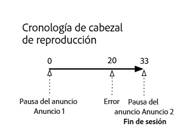

# Línea de tiempo 2: El usuario abandona la sesión {#timeline--2-user-abandons-session}

## VOD, anuncios pre-roll, anuncios mid-roll, el usuario deja el contenido antes de terminarlo

Los siguientes diagramas ilustran la línea de tiempo del cursor de reproducción y la línea de tiempo correspondiente de las acciones de un usuario. A continuación se muestran los detalles de cada acción y sus solicitudes correspondientes.





## Detalles de la acción

### Action 1 - Start session {#Action-1}

| Acción | Línea de tiempo de acción (segundos) | Posición del cabezal de reproducción (en segundos) | Solicitud del cliente |
| --- | :---: | :---: | --- |
| Se pulsa el botón de reproducción o se reproduce automáticamente. | 0 | 0 | `/api/v1/sessions` |

**Detalles de implementación**

Esta llamada indica _la intención del usuario de reproducir_ un vídeo. It returns a Session ID ( `{sid}` ) to the client that is used to identify all subsequent tracking calls within the session. El estado del reproductor no es "reproduciendo", sino "comenzando".  [Los parámetros de sesión obligatorios](/help/media-collection-api/mc-api-ref/mc-api-sessions-req.md) deben incluirse en el mapa de `params` en la solicitud.  En el servidor, esta llamada genera una llamada de inicio a Adobe Analytics.

**Cuerpo de la solicitud de muestra**

```
{
    playerTime: {
        playhead: 0,
        ts: <timestamp>
    },
    eventType:sessionStart, params: {
        "media.playerName": "sample-html5-api-player",
        "analytics.trackingServer": "[ _YOUR-TS_ ]",
        "analytics.reportSuite": "[ _YOUR-RSID_ ]",
        "analytics.visitorId": "[ _YOUR-VISITOR-ID_ ]",
        "media.contentType": "VOD",
        "media.length": 60.3333333333333,
        "media.id": "VA API Sample Player",
        "visitor.marketingCloudOrgId": "[YOUR-MCID]",
        "media.name": "ClickMe",
        "media.channel": "sample-channel",
        "media.sdkVersion": "va-api-0.0.0",
        "analytics.enableSSL": false
    }
}
```

### Action 2 - Ping timer start {#Action-2}

| Acción | Línea de tiempo de acción (segundos) | Posición del cabezal de reproducción (en segundos) | Solicitud del cliente |
| --- | :---: | :---: | --- |
| La aplicación inicia el temporizador del evento de ping | 0 | 0 |  |

**Detalles de implementación**

Inicie el temporizador de ping de la aplicación. Después, el evento de ping debe activarse 1 segundo si hay anuncios previos, 10 segundos en caso contrario.

### Action 3 - Ad break start {#Action-3}

| Acción | Línea de tiempo de acción (segundos) | Posición del cabezal de reproducción (en segundos) | Solicitud del cliente |
| --- | :---: | :---: | --- |
| Seguimiento del comienzo de la pausa publicitaria pre-roll | 0 | 0 | `/api/v1/sessions/{sid}/events` |

**Detalles de implementación**

Se deben rastrear los anuncios pre-roll. Los anuncios solo se pueden rastrear durante una pausa publicitaria.

**Cuerpo de la solicitud de muestra**

```
{
    playerTime: {
        playhead: 0,
        ts: <timestamp>
    },
    eventType:adBreakStart, params: {
        "media.ad.podFriendlyName": "ad_pod1",
        "media.ad.podIndex": 0,
        "media.ad.podSecond": 0
    }
}
```

### Action 4 - Ad start {#Action-4}

| Acción | Línea de tiempo de acción (segundos) | Posición del cabezal de reproducción (en segundos) | Solicitud del cliente |
| --- | :---: | :---: | --- |
| Seguimiento del comienzo del primer anuncio pre-roll | 0 | 0 | `/api/v1/sessions/{sid}/events` |

**Detalles de implementación**

Se inicia una publicidad de 12 segundos.

**Cuerpo de la solicitud de muestra**

```
{
    playerTime: {
        playhead: 0,
        ts: <timestamp>
    },
    eventType:adStart, params: {
        "media.ad.podFriendlyName": "ad_pod1",
        "media.ad.name": "Ad 1",
        "media.ad.id": "002",
        "media.ad.length": 7,
        "media.ad.podPosition": 1,
        "media.ad.playerName": "Sample Player",
        "media.ad.advertiser": "Ad Guys",
        "media.ad.campaignId": "1",
        "media.ad.creativeId": "42",
        "media.ad.siteId": "XYZ",
        "media.ad.creativeURL": "https://xyz-creative.com",
        "media.ad.placementId": "sample-placement2"
    },
}
```

### Action 5 - Ad pings {#Action-5}

| Acción | Línea de tiempo de acción (segundos) | Posición del cabezal de reproducción (en segundos) | Solicitud del cliente |
| --- | :---: | :---: | --- |
| La aplicación envía eventos de ping | 1 | 0 | `/api/v1/sessions/{sid}/events` |

**Detalles de implementación**

Haga ping cada 1 segundo. (Los siguientes pings de publicidad no se muestran en aras de la brevedad).

**Cuerpo de la solicitud de muestra**

```
{
    playerTime: {
        playhead: 0,
        ts: <timestamp>
    },
    eventType:ping
}
```

### Action 6 - Ad complete {#Action-6}

| Acción | Línea de tiempo de acción (segundos) | Posición del cabezal de reproducción (en segundos) | Solicitud del cliente |
| --- | :---: | :---: | --- |
| Se ha completado el seguimiento del primer anuncio pre-roll | 12 | 0 | `/api/v1/sessions/{sid}/events` |

**Detalles de implementación**

El primer anuncio pre-roll ha finalizado.

**Cuerpo de la solicitud de muestra**

```
{
    playerTime: {
        playhead: 0,
        ts: <timestamp>
    },
    eventType:adComplete
}
```

### Action 7 - Ad break complete {#Action-7}

| Acción | Línea de tiempo de acción (segundos) | Posición del cabezal de reproducción (en segundos) | Solicitud del cliente |
| --- | :---: | :---: | --- |
| Rastrear la pausa publicitaria pre-roll | 12 | 0 | `/api/v1/sessions/{sid}/events` |

**Detalles de implementación**

La pausa publicitaria ha finalizado. Durante la pausa publicitaria, el reproductor permanece en el estado "reproduciendo".

**Cuerpo de la solicitud de muestra**

```
{
    playerTime: {
        playhead: 0,
        ts: <timestamp>
    },
    eventType:adBreakComplete
}
```

### Action 8 - Play content {#Action-8}

| Acción | Línea de tiempo de acción (segundos) | Posición del cabezal de reproducción (en segundos) | Solicitud del cliente |
| --- | :---: | :---: | --- |
| Rastrear el evento de Reproducción | 12 | 0 | `/api/v1/sessions/{sid}/events` |

**Detalles de implementación**

Cambie el reproductor al estado "reproducir"; comience a rastrear el inicio de la reproducción del contenido.

**Cuerpo de la solicitud de muestra**

```
{
    playerTime: {
        playhead: 0,
        ts: <timestamp>
    },
    eventType:play,
    qoeData: { bitrate: 10000 }
}
```

### Action 9 - Ping {#Action-9}

| Acción | Línea de tiempo de acción (segundos) | Posición del cabezal de reproducción (en segundos) | Solicitud del cliente |
| --- | :---: | :---: | --- |
| La aplicación envía eventos de ping | 20 | 8 | `/api/v1/sessions/{sid}/events` |

**Detalles de implementación**

Mandar un ping al servidor cada 10 segundos.

**Cuerpo de la solicitud de muestra**

```
{
    playerTime: {
        playhead: 8ß,
        ts: <timestamp>
    },
    eventType:ping
}
```

### Action 10 - Ping {#Action-10}

| Acción | Línea de tiempo de acción (segundos) | Posición del cabezal de reproducción (en segundos) | Solicitud del cliente |
| --- | :---: | :---: | --- |
| La aplicación envía eventos de ping | 30 | 18 | `/api/v1/sessions/{sid}/events` |

**Detalles de implementación**

Mandar un ping al servidor cada 10 segundos.

**Cuerpo de la solicitud de muestra**

```
{
    playerTime: {
        playhead: 18,
        ts: <timestamp>
    },
    eventType:ping
}
```

### Action 11 - Error {#Action-11}

| Acción | Línea de tiempo de acción (segundos) | Posición del cabezal de reproducción (en segundos) | Solicitud del cliente |
| --- | :---: | :---: | --- |
| Se produce un error, la aplicación envía información del error. | 32 | 20 | `/api/v1/sessions/{sid}/events` |

**Detalles de implementación**


**Cuerpo de la solicitud de muestra**

```
{
    playerTime: {
        playhead: 20,
        ts: <timestamp>
    },
    eventType:error
}
```

### Action 12 - Play content {#Action-12}

| Acción | Línea de tiempo de acción (segundos) | Posición del cabezal de reproducción (en segundos) | Solicitud del cliente |
| --- | :---: | :---: | --- |
| La aplicación se recupera del error, el usuario pulsa Reproducir | 37 | 20 | `/api/v1/sessions/{sid}/events` |

**Detalles de implementación**


**Cuerpo de la solicitud de muestra**

```
{
    playerTime: {
        playhead: 18,
        ts: <timestamp>
    },
    eventType:play, qoeData: { bitrate: 10000 }
}
```

### Action 13 - Ping {#Action-13}

| Acción | Línea de tiempo de acción (segundos) | Posición del cabezal de reproducción (en segundos) | Solicitud del cliente |
| --- | :---: | :---: | --- |
| La aplicación envía eventos de ping | 40 | 28 | `/api/v1/sessions/{sid}/events` |

**Detalles de implementación**

Mandar un ping al servidor cada 10 segundos.

**Cuerpo de la solicitud de muestra**

```
{
    playerTime: {
        playhead: 28,
        ts: <timestamp>
    },
    eventType:ping
}
```

### Action 14 - Ad break start {#Action-14}

| Acción | Línea de tiempo de acción (segundos) | Posición del cabezal de reproducción (en segundos) | Solicitud del cliente |
| --- | :---: | :---: | --- |
| Seguimiento del comienzo del anuncio mid-roll | 45 | 33 | `/api/v1/sessions/{sid}/events` |

**Detalles de implementación**

Anuncio mid-roll de 8 segundos: enviar `adBreakStart` .

**Cuerpo de la solicitud de muestra**

```
{
    playerTime: {
        playhead: 33,
        ts: <timestamp>
    },
    eventType:adBreakStart, params: {
        "media.ad.podFriendlyName": "ad_pod2",
        "media.ad.podIndex": 1,
        "media.ad.podSecond": 33
    }
}
```

### Action 15 - Ad start {#Action-15}

| Acción | Línea de tiempo de acción (segundos) | Posición del cabezal de reproducción (en segundos) | Solicitud del cliente |
| --- | :---: | :---: | --- |
| Seguimiento del primer anuncio mid-roll | 45 | 33 | `/api/v1/sessions/{sid}/events` |

**Detalles de implementación**

Seguimiento del anuncio mid-roll.

**Cuerpo de la solicitud de muestra**

```
{
    playerTime: { playhead: 33, ts: <timestamp>
    },
    eventType:adStart, params: {
        "media.ad.podFriendlyName": "ad_pod1",
        "media.ad.name": "Ad 1",
        "media.ad.id": "002",
        "media.ad.length": 8,
        "media.ad.podPosition": 1,
        "media.ad.playerName": "Sample Player",
        "media.ad.advertiser": "Ad Guys",
        "media.ad.campaignId": "7",
        "media.ad.creativeId": "40",
        "media.ad.siteId": "XYZ",
        "media.ad.creativeURL": "https://xyz_creative.com",
        "media.ad.placementId": "sample_placement2"
    },
}
```

### Action 16 - Close app {#Action-16}

| Acción | Línea de tiempo de acción (segundos) | Posición del cabezal de reproducción (en segundos) | Solicitud del cliente |
| --- | :---: | :---: | --- |
| El usuario cierra la aplicación. La aplicación determina que el usuario ha abandonado la visualización y no va a volver a esta sesión. | 48 | 33 | `/api/v1/sessions/{sid}/events` |

**Detalles de implementación**

Envíe `sessionEnd` al servidor de VA para indicar que la sesión debe cerrarse inmediatamente, sin procesar más.

**Cuerpo de la solicitud de muestra**

```
{
    playerTime: {
        playhead: 33,
        ts: <timestamp>
    },
    eventType:sessionEnd
}
```


