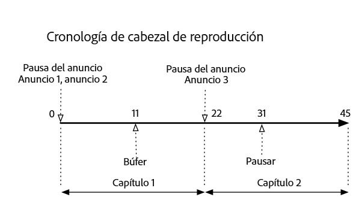
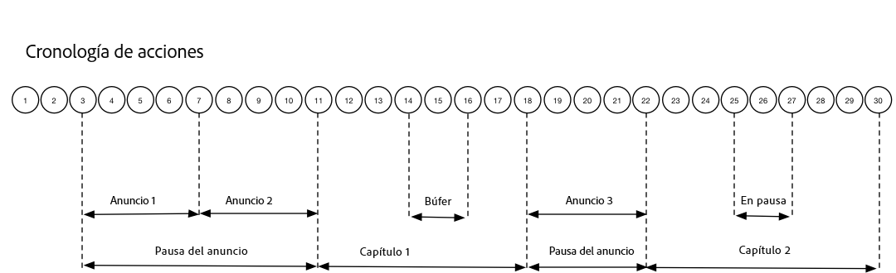

# Línea de tiempo 3: Capítulos {#timeline-3-chapters}

## VOD, anuncios pre-roll, pausar, almacenar en búfer, ver contenido hasta el final


Los siguientes diagramas ilustran la línea de tiempo del cursor de reproducción y la línea de tiempo correspondiente de las acciones de un usuario. A continuación se presentan los detalles de cada acción y sus solicitudes correspondientes.








## Detalles de la acción


### Acción 1 - Iniciar sesión {#Action-1}

| Acción | Línea de tiempo de acción (segundos) | Posición del cabezal de reproducción (en segundos) | Solicitud del cliente |
| --- | :---: | :---: | --- |
| El botón Reproducción automática o Reproducir se ha presionado, el vídeo empieza a cargarse. | 0 | 0 | `/api/v1/sessions` |

**Detalles de implementación**

Esta llamada indica _la intención del usuario de reproducir_ un vídeo. It returns a Session ID ( `{sid}` ) to the client that is used to identify all subsequent tracking calls within the session. El estado del reproductor no es "reproduciendo", sino "comenzando".  [Los parámetros de sesión obligatorios](/help/media-collection-api/mc-api-ref/mc-api-sessions-req.md) deben incluirse en el mapa de `params` en la solicitud.  En el servidor, esta llamada genera una llamada de inicio a Adobe Analytics.

**Cuerpo de la solicitud de muestra**

```
{
    playerTime: {
        playhead: 0,
        ts: <timestamp>
    },
    eventType:sessionStart, params: {
        "media.playerName": "sample-html5-api-player",
        "analytics.trackingServer": "[ _YOUR-TS_ ]",
        "analytics.reportSuite": "[ _YOUR_RSID_ ]",
        "analytics.visitorId": "[ _YOUR_VISITOR_ID_ ]",
        "media.contentType": "VOD",
        "media.length": 60.3333333333333,
        "media.id": "VA API Sample Player",
        "visitor.marketingCloudOrgId": "[YOUR_MCID]",
        "media.name": "ClickMe",
        "media.channel": "sample-channel",
        "media.sdkVersion": "va-api-0.0.0",
        "analytics.enableSSL": false
    }
}
```

### Acción 2: se inicia el temporizador de ping {#Action-2}

| Acción | Línea de tiempo de acción (segundos) | Posición del cabezal de reproducción (en segundos) | Solicitud del cliente |
| --- | :---: | :---: | --- |
| La aplicación inicia el temporizador del evento de ping | 0 | 0 |  |

**Implementation details**

Inicie el temporizador de ping. El primer evento de ping debe activarse 1 segundo en caso de que haya anuncios previos, 10 segundos en caso contrario.

### Acción 3 - Inicio de la pausa publicitaria {#Action-3}

| Acción | Línea de tiempo de acción (segundos) | Posición del cabezal de reproducción (en segundos) | Solicitud del cliente |
| --- | :---: | :---: | --- |
| Seguimiento del comienzo de la pausa publicitaria pre-roll | 0 | 0 | `/api/v1/sessions/{sid}/events` |

**Detalles de implementación**

Los anuncios solo se pueden rastrear durante una pausa publicitaria.

**Cuerpo de la solicitud de muestra**

```
{
    playerTime: {
        playhead: 0,
        ts: <timestamp>
    },
    eventType:adBreakStart, params: {
        "media.ad.podFriendlyName": "ad_pod1",
        "media.ad.podIndex": 0, "media.ad.podSecond": 0
    }
}
```

### Acción 4 - Inicio del anuncio {#Action-4}

| Acción | Línea de tiempo de acción (segundos) | Posición del cabezal de reproducción (en segundos) | Solicitud del cliente |
| --- | :---: | :---: | --- |
| Seguimiento del comienzo del primer anuncio pre-roll | 0 | 0 | `/api/v1/sessions/{sid}/events` |

**Detalles de implementación**

Comience a rastrear el primer anuncio pre-roll, que dura 15 segundos. Incluir metadatos personalizados con `adStart` .

**Cuerpo de la solicitud de muestra**

```
{
    playerTime: {
        playhead: 0,
        ts: <timestamp>
    },
    eventType:adStart, params: {
        "media.ad.podFriendlyName": "ad_pod1",
        "media.ad.name": "Ad 1",
        "media.ad.id": "001",
        "media.ad.length": 15,
        "media.ad.podPosition": 1,
        "media.ad.playerName": "Sample Player",
        "media.ad.advertiser": "Ad Guys",
        "media.ad.campaignId": "1",
        "media.ad.creativeId": "42",
        "media.ad.siteId": "XYZ",
        "media.ad.creativeURL": "https://xyz_creative.com",
        "media.ad.placementId": "sample_placement"
    },
    customMetadata: {
        "myCustomData1": "CustomData1",
        "myCustomData2": "CustomData2"
    }
}
```

### Acción 5 - Agrupaciones de anuncios {#Action-5}

| Acción | Línea de tiempo de acción (segundos) | Posición del cabezal de reproducción (en segundos) | Solicitud del cliente |
| --- | :---: | :---: | --- |
| La aplicación envía eventos de ping | 10 | 0 | `/api/v1/sessions/{sid}/events` |

**Detalles de implementación**

Ping el servidor cada 1 segundo. (Los pings de anuncios posteriores no se muestran en interés de la brevedad).

**Cuerpo de la solicitud de muestra**

```
{
    playerTime: {
        playhead: 0,
        ts: <timestamp>
    },
    eventType:ping
}
```

### Acción 6 - Finalización del anuncio {#Action-6}

| Acción | Línea de tiempo de acción (segundos) | Posición del cabezal de reproducción (en segundos) | Solicitud del cliente |
| --- | :---: | :---: | --- |
| Se ha completado el seguimiento del primer anuncio pre-roll | 15 | 0 | `/api/v1/sessions/{sid}/events` |

**Detalles de implementación**

Rastrear el final del primer anuncio pre-roll.

**Cuerpo de la solicitud de muestra**

```
{
    playerTime: {
        playhead: 0,
        ts: <timestamp>
    },
    eventType:adComplete
}
```

### Acción 7 - Inicio del anuncio {#Action-7}

| Acción | Línea de tiempo de acción (segundos) | Posición del cabezal de reproducción (en segundos) | Solicitud del cliente |
| --- | :---: | :---: | --- |
| Seguimiento del comienzo del segundo anuncio pre-roll | 15 | 0 | `/api/v1/sessions/{sid}/events` |

**Implementation details**

Realice un seguimiento del inicio del segundo anuncio pre-roll, que dura 7 segundos.

**Cuerpo de la solicitud de muestra**

```
{
    playerTime: {
        playhead: 0,
        ts: <timestamp>
    },
    eventType:adStart, params: {
        "media.ad.podFriendlyName": "ad_pod1",
        "media.ad.name": "Ad 2",
        "media.ad.id": "002",
        "media.ad.length": 7,
        "media.ad.podPosition": 1,
        "media.ad.playerName": "Sample Player",
        "media.ad.advertiser": "Ad Guys",
        "media.ad.campaignId": "2",
        "media.ad.creativeId": "44",
        "media.ad.siteId": "XYZ",
        "media.ad.creativeURL": "https://xyz_creative.com",
        "media.ad.placementId": "sample_placement2"
    },
}
```

### Acción 8 - Agrupaciones de anuncios {#Action-8}

| Acción | Línea de tiempo de acción (segundos) | Posición del cabezal de reproducción (en segundos) | Solicitud del cliente |
| --- | :---: | :---: | --- |
| La aplicación envía eventos de ping | 16 | 0 | `/api/v1/sessions/{sid}/events` |

**Implementation details**

Ping the backend every 1 second. (Subsequent ad pings not shown in the interest of brevity.)

**Cuerpo de la solicitud de muestra**

```
{
    playerTime: {
        playhead: 0,
        ts: <timestamp>
    },
    eventType:ping
}
```

### Action 9 - Ad complete {#Action-9}

| Acción | Línea de tiempo de acción (segundos) | Posición del cabezal de reproducción (en segundos) | Solicitud del cliente |
| --- | :---: | :---: | --- |
| Se ha completado el seguimiento del segundo anuncio pre-roll | 22 | 0 | `/api/v1/sessions/{sid}/events` |

**Implementation details**

Rastrear el final del segundo anuncio pre-roll.

**Cuerpo de la solicitud de muestra**

```
{
    playerTime: {
        playhead: 0,
        ts: <timestamp>
    },
    eventType:adComplete
}
```

### Acción 10 - Se completó la pausa publicitaria {#Action-10}

| Acción | Línea de tiempo de acción (segundos) | Posición del cabezal de reproducción (en segundos) | Solicitud del cliente |
| --- | :---: | :---: | --- |
| Rastrear la pausa publicitaria pre-roll | 22 | 0 | `/api/v1/sessions/{sid}/events` |

**Detalles de implementación**

La pausa publicitaria ha finalizado. Durante la pausa publicitaria, el estado de reproducción será “reproduciendo”.

**Cuerpo de la solicitud de muestra**

```
{
    playerTime: {
        playhead: 0,
        ts: <timestamp>
    },
    eventType:adBreakComplete
}
```

### Acción 11 - Reproducir contenido {#Action-11}

| Acción | Línea de tiempo de acción (segundos) | Posición del cabezal de reproducción (en segundos) | Solicitud del cliente |
| --- | :---: | :---: | --- |
| Rastrear el evento de Reproducción | 22 | 0 | `/api/v1/sessions/{sid}/events` |

**Implementation details**

Tras el evento `adBreakComplete`, ponga el reproductor en el estado "reproduciendo" utilizando el evento `play`.

**Cuerpo de la solicitud de muestra**

```
{
    playerTime: {
        playhead: 0,
        ts: <timestamp>
    },
    eventType:play
}
```

### Action 12 - Chapter start {#Action-12}

| Acción | Línea de tiempo de acción (segundos) | Posición del cabezal de reproducción (en segundos) | Solicitud del cliente |
| --- | :---: | :---: | --- |
| Rastrear el evento Inicio del capítulo | 23 | 1 | `/api/v1/sessions/{sid}/events` |

**Detalles de implementación**

Tras el evento Reproducir, realice un seguimiento del principio del primer capítulo.

**Cuerpo de la solicitud de muestra**

```
{
    playerTime: {
        playhead: 0,
        ts: <timestamp>
    },
    eventType:chapterStart, params: {
        "media.chapter.index": 1,
        "media.chapter.offset": 0, "media.chapter.length": 20, "media.chapter.friendlyName": "Chapter Uno"
    },
}
```

### Acción 13 - Ping {#Action-13}

| Acción | Línea de tiempo de acción (segundos) | Posición del cabezal de reproducción (en segundos) | Solicitud del cliente |
| --- | :---: | :---: | --- |
| La aplicación envía eventos de ping | 30 | 8 | `/api/v1/sessions/{sid}/events` |

**Detalles de implementación**

Mandar un ping al servidor cada 10 segundos.

**Cuerpo de la solicitud de muestra**

```
{
    playerTime: {
        playhead: 8,
        ts: <timestamp>
    },
    eventType:ping
}
```

### Acción 14 - Inicio del búfer {#Action-14}

| Acción | Línea de tiempo de acción (segundos) | Posición del cabezal de reproducción (en segundos) | Solicitud del cliente |
| --- | :---: | :---: | --- |
| Se produce el evento de Inicio del almacenamiento en búfer. | 33 | 11 | `/api/v1/sessions/{sid}/events` |

**Detalles de implementación**

Rastree el movimiento al estado "almacenamiento en búfer".

**Cuerpo de la solicitud de muestra**

```
{
    playerTime: {
        playhead: 11,
        ts: <timestamp>
    },
    eventType:bufferStart
}
```

### Action 15 - Buffer end (play) {#Action-15}

| Acción | Línea de tiempo de acción (segundos) | Posición del cabezal de reproducción (en segundos) | Solicitud del cliente |
| --- | :---: | :---: | --- |
| El almacenamiento en búfer finalizó, la aplicación hace un seguimiento de la reanudación del contenido. | 36 | 11 | `/api/v1/sessions/{sid}/events` |

**Detalles de implementación**

El almacenamiento en búfer finaliza después de 3 segundos, por lo que el reproductor vuelve al estado "reproduciendo". Debe enviar otro evento de seguimiento de reproducción cuando termine el almacenamiento en búfer.  **The`play`call after a`bufferStart`infers a "bufferEnd" call to the back end,** so there is no need for a `bufferEnd` event.

**Cuerpo de la solicitud de muestra**

```
{
    playerTime: {
        playhead: 11,
        ts: <timestamp>
    },
    eventType:play
}
```

### Acción 16 - Ping {#Action-16}

| Acción | Línea de tiempo de acción (segundos) | Posición del cabezal de reproducción (en segundos) | Solicitud del cliente |
| --- | :---: | :---: | --- |
| La aplicación envía eventos de ping | 40 | 15 | `/api/v1/sessions/{sid}/events` |

**Detalles de implementación**

Mandar un ping al servidor cada 10 segundos.

**Cuerpo de la solicitud de muestra**

```
{
    playerTime: {
        playhead: 15,
        ts: <timestamp>
    },
    eventType:ping
}
```

### Action 17 - Chapter end {#Action-17}

| Acción | Línea de tiempo de acción (segundos) | Posición del cabezal de reproducción (en segundos) | Solicitud del cliente |
| --- | :---: | :---: | --- |
| La aplicación rastrea el final del capítulo | 45 | 20 | `/api/v1/sessions/{sid}/events` |

**Implementation details**

El primer capítulo termina justo antes de la segunda pausa publicitaria.

**Cuerpo de la solicitud de muestra**

```
{
    playerTime: {
        playhead: 20,
        ts: <timestamp>
    },
    eventType:chapterEnd
}
```

### Action 18 - Ad break start {#Action-18}

| Acción | Línea de tiempo de acción (segundos) | Posición del cabezal de reproducción (en segundos) | Solicitud del cliente |
| --- | :---: | :---: | --- |
| Seguimiento del comienzo del anuncio mid-roll | 46 | 21 | `/api/v1/sessions/{sid}/events` |

**Implementation details**

Anuncio mid-roll de 8 segundos: enviar `adBreakStart` .

**Cuerpo de la solicitud de muestra**

```
{
    playerTime: {
        playhead: 21,
        ts: <timestamp>
    },
    eventType:adBreakStart, params: {
        "media.ad.podFriendlyName": "ad_pod2",
        "media.ad.podIndex": 1, "media.ad.podSecond": 21
    }
}
```

### Action 19 - Ad start {#Action-19}

| Acción | Línea de tiempo de acción (segundos) | Posición del cabezal de reproducción (en segundos) | Solicitud del cliente |
| --- | :---: | :---: | --- |
| Seguimiento del tercer anuncio mid-roll | 46 | 21 | `/api/v1/sessions/{sid}/events` |

**Detalles de implementación**

Seguimiento del anuncio mid-roll.

**Cuerpo de la solicitud de muestra**

```
{
    playerTime: {
        playhead: 21,
        ts: <timestamp>
    },
    eventType:adStart, params: {
        "media.ad.podFriendlyName": "ad_pod2",
        "media.ad.name": "Ad 3",
        "media.ad.id": "003",
        "media.ad.length": 8,
        "media.ad.podPosition": 2,
        "media.ad.playerName": "Sample Player",
        "media.ad.advertiser": "Ad Guys",
        "media.ad.campaignId": "7",
        "media.ad.creativeId": "40",
        "media.ad.siteId": "XYZ",
        "media.ad.creativeURL": "https://xyz_creative.com",
        "media.ad.placementId": "sample_placement2"
    },
}
```

### Action 20 - Ad Pings {#Action-20}

| Acción | Línea de tiempo de acción (segundos) | Posición del cabezal de reproducción (en segundos) | Solicitud del cliente |
| --- | :---: | :---: | --- |
| La aplicación envía eventos de ping | 47 | 21 | `/api/v1/sessions/{sid}/events` |

**Detalles de implementación**

Ping el servidor cada 1 segundo. (Subsequent ad pings not shown in the interest of brevity.)

**Cuerpo de la solicitud de muestra**

```
{
    playerTime: {
        playhead: 21,
        ts: <timestamp>
    },
    eventType:ping
}
```

### Action 21 - Ad complete {#Action-21}

| Acción | Línea de tiempo de acción (segundos) | Posición del cabezal de reproducción (en segundos) | Solicitud del cliente |
| --- | :---: | :---: | --- |
| Se ha completado el seguimiento del primer anuncio mid-roll | 54 | 21 | `/api/v1/sessions/{sid}/events` |

**Detalles de implementación**

El anuncio mid-roll ha finalizado.

**Cuerpo de la solicitud de muestra**

```
{
    playerTime: {
        playhead: 21,
        ts: <timestamp>
    },
    eventType:adComplete
}
```

### Action 22 - Ad break complete {#Action-22}

| Acción | Línea de tiempo de acción (segundos) | Posición del cabezal de reproducción (en segundos) | Solicitud del cliente |
| --- | :---: | :---: | --- |
| Seguimiento de la pausa publicitaria mid-roll completado | 54 | 21 | `/api/v1/sessions/{sid}/events` |

**Detalles de implementación**

Se ha completado la pausa publicitaria.

**Cuerpo de la solicitud de muestra**

```
{
    playerTime: {
        playhead: 21,
        ts: <timestamp>
    },
    eventType:adBreakComplete
}
```

### Action 23 - Chapter start {#Action-23}

| Acción | Línea de tiempo de acción (segundos) | Posición del cabezal de reproducción (en segundos) | Solicitud del cliente |
| --- | :---: | :---: | --- |
| Rastrear el inicio del capítulo 2 | 55 | 22 | `/api/v1/sessions/{sid}/events` |

**Detalles de implementación**


**Cuerpo de la solicitud de muestra**

```
{
    playerTime: {
        playhead: 22,
        ts: <timestamp>
    },
    eventType:chapterStart, params: {
        "media.chapter.index": 2,
        "media.chapter.offset": 22, "media.chapter.length": 22, "media.chapter.friendlyName": "Chapter Dos"
    },
}
```

### Action 24 - Ping {#Action-24}

| Acción | Línea de tiempo de acción (segundos) | Posición del cabezal de reproducción (en segundos) | Solicitud del cliente |
| --- | :---: | :---: | --- |
| La aplicación envía eventos de ping | 60 | 27 | `/api/v1/sessions/{sid}/events` |

**Detalles de implementación**

Mandar un ping al servidor cada 10 segundos.

**Cuerpo de la solicitud de muestra**

```
{
    playerTime: {
        playhead: 27,
        ts: <timestamp>
    },
    eventType:ping
}
```

### Action 25 - Pause {#Action-25}

| Acción | Línea de tiempo de acción (segundos) | Posición del cabezal de reproducción (en segundos) | Solicitud del cliente |
| --- | :---: | :---: | --- |
| El usuario ha hecho clic en Pausa | 64 | 31 | `/api/v1/sessions/{sid}/events` |

**Detalles de implementación**

La acción del usuario mueve el estado de reproducción a "pausado".

**Cuerpo de la solicitud de muestra**

```
{
    playerTime: {
        playhead: 31,
        ts: <timestamp>
    },
    eventType:pauseStart
}
```

### Action 26 - Ping {#Action-26}

| Acción | Línea de tiempo de acción (segundos) | Posición del cabezal de reproducción (en segundos) | Solicitud del cliente |
| --- | :---: | :---: | --- |
| La aplicación envía eventos de ping | 70 | 31 | `/api/v1/sessions/{sid}/events` |

**Detalles de implementación**

Mandar un ping al servidor cada 10 segundos. El reproductor sigue en estado "almacenamiento en búfer"; el usuario se queda en los 20 primeros segundos de contenido. Trabajando...

**Cuerpo de la solicitud de muestra**

```
{
    playerTime: {
        playhead: 31,
        ts: <timestamp>
    },
    eventType:ping
}
```

### Acción 27 - Reproducir contenido {#Action-27}

| Acción | Línea de tiempo de acción (segundos) | Posición del cabezal de reproducción (en segundos) | Solicitud del cliente |
| --- | :---: | :---: | --- |
| El usuario ha presionado Reproducir para reanudar el contenido principal | 74 | 31 | `/api/v1/sessions/{sid}/events` |

**Detalles de implementación**

Cambie el estado de reproducción a "reproduciendo".  **La llamada`play`después de`pauseStart`ya infiere una llamada "continuar" al final**, por lo que no hay necesidad de un evento `resume`.

**Cuerpo de la solicitud de muestra**

```
{
    playerTime: {
        playhead: 31,
        ts: <timestamp>
    },
    eventType:play
}
```

### Acción 28 - Ping {#Action-28}

| Acción | Línea de tiempo de acción (segundos) | Posición del cabezal de reproducción (en segundos) | Solicitud del cliente |
| --- | :---: | :---: | --- |
| La aplicación envía eventos de ping | 80 | 37 | `/api/v1/sessions/{sid}/events` |

**Detalles de implementación**

Mandar un ping al servidor cada 10 segundos.

**Cuerpo de la solicitud de muestra**

```
{
    playerTime: {
        playhead: 37,
        ts: <timestamp>
    },
    eventType:ping
}
```

### Acción 29 - Fin del capítulo {#Action-29}

| Acción | Línea de tiempo de acción (segundos) | Posición del cabezal de reproducción (en segundos) | Solicitud del cliente |
| --- | :---: | :---: | --- |
| Fin del capítulo 2 | 87 | 44 | `/api/v1/sessions/{sid}/events` |

**Detalles de implementación**

Rastrear el final del segundo y último capítulo.

**Cuerpo de la solicitud de muestra**

```
{
    playerTime: {
        playhead: 0,
        ts: <timestamp>
    },
    eventType:chapterEnd
}
```

### Acción 30 - Sesión completa {#Action-30}

| Acción | Línea de tiempo de acción (segundos) | Posición del cabezal de reproducción (en segundos) | Solicitud del cliente |
| --- | :---: | :---: | --- |
| El usuario termina de ver el contenido hasta el final. | 88 | 45 | `/api/v1/sessions/{sid}/events` |

**Detalles de implementación**

Envíe `sessionComplete` al servidor para indicar que el usuario ha terminado de ver todo el contenido.

**Cuerpo de la solicitud de muestra**

```
{
    playerTime: {
        playhead: 45,
        ts: <timestamp>
    },
    eventType:sessionComplete
}
```


>[!NOTE]
>
>**¿No hay eventos de búsqueda? -** No hay compatibilidad explícita en la API de Media Collection para eventos `seekStart` o `seekComplete`. Esto se debe a que algunos reproductores generan un número muy grande de eventos cuando el usuario final arrastra el cabezal de reproducción, y varios cientos de usuarios podrían atascar fácilmente el ancho de banda de red de un servidor. Adobe busca la compatibilidad explícita con los eventos de llamada con el cabezal de reproducción, computando la duración del latido en función de la marca de tiempo del dispositivo en lugar de la posición del cabezal.

