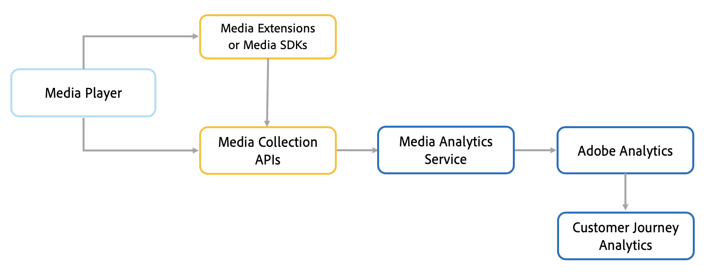

# Información general de Adobe Analytics para medios de streaming

Adobe Analytics para Streaming Media es un complemento de Adobe Analytics que ofrece potentes herramientas de medición de audio, vídeo y anuncios. Con Analytics para medios de streaming, obtiene detalles granulares y en tiempo real sobre la duración, las paradas y los inicios que le permiten evaluar y combinar métricas de vídeo y audio. Estas perspectivas le permiten comprender los hábitos de visualización y escucha de sus clientes y aumentar la participación con recomendaciones altamente personalizadas.

Adobe Analytics para medios de transmisión le permite hacer un seguimiento del recorrido completo de los clientes en su sitio y en las aplicaciones de flujo continuo. Las métricas de medios de transmisión se pueden combinar con otras funciones de Adobe Analytics, como Audience Analytics, Mobile o Cross-Device Analytics. Las métricas se integran fácilmente en los informes de Adobe Analytics y en otros productos de Adobe Experience Platform. La medición de Media le permite categorizar los datos en varias dimensiones y segmentos, capturando todos los metadatos que necesita para hacer un análisis completo y detallado. A continuación, puede analizar los datos y atribuir los criterios de éxito a los medios totalmente consumidos, el tiempo promedio empleado y los anuncios completados.

Puede medir métricas de entrega esenciales relacionadas con la calidad de la experiencia (QoE), como los fotogramas perdidos, el tiempo de almacenamiento en búfer y la velocidad de bits media. Además, las métricas se pueden combinar con los datos de su sitio web o aplicación para visualizar la ruta y los intereses del cliente, a fin de ofrecer recomendaciones mejoradas y personalizar las experiencias de los clientes mediante Adobe Experience Platform.

## Funcionamiento

Los datos de seguimiento de medios de transmisión se recopilan de un reproductor mediante Media SDK, las API de recopilación de medios o las extensiones de medios (con etiquetas). Todos los datos granulares (hasta 10 segundos) se envían al servicio de Media Analytics que recopila y procesa los datos de cada sesión de reproducción individual. Una vez que finaliza una sesión de reproducción, los datos de seguimiento calculados se envían a Adobe Analytics para su almacenamiento y para la realización de informes. Con las implementaciones de Adobe Customer Journey Analytics (CJA), los datos se pueden enviar a CJA mediante el conector de datos de Analytics (ADC) para que los clientes puedan utilizar CJA como herramienta de sistema de informes.

<!--  -->

## Funciones

Las ventajas de Adobe Analytics para Streaming Media incluyen monitorización en tiempo real, análisis detallado, perspectivas procesables y oportunidades de monetización.

* **Análisis en tiempo real**: Tome decisiones útiles en tiempo real utilizando métricas clave de rendimiento, como inicios de contenido, en varios canales.

* **Participación en la unidad**: Involucre completamente a los usuarios mediante menos eventos de almacenamiento en búfer y mediante la comprensión de dónde y cuándo debe reproducirse la publicidad dentro del contenido para proporcionar una experiencia suave y menos intrusiva que genere visitas repetidas.

* **Imagen holística**: Combine varios puntos de datos en todos los distribuidores de contenido para obtener una vista completa de toda la actividad de contenido. Mida la participación y las visualizaciones/escuchas en todos los posibles canales a través de la función Federated Analytics.

* **Mayor granularidad**: Evalúe el comportamiento de visualización en el nivel más granular, incluida la hora del día de cada visitante individual, los espectadores simultáneos u oyentes por minuto y la duración promedio de consumo del contenido.

* **Medición exacta**: Medir en los distintos dispositivos utilizados para el consumo de contenido, incluidos OTT, smartphones, tabletas, equipos de escritorio y mucho más, para controlar los patrones de participación del usuario.

* **Segmentación**: Aplique clasificaciones a sus reproductores, dispositivos, géneros, capítulos y programas para ver cómo cada uno de ellos tiene un impacto en sus vistas/escuchas generales y en la participación del cliente con el contenido, el audio, los anuncios y la combinación.
