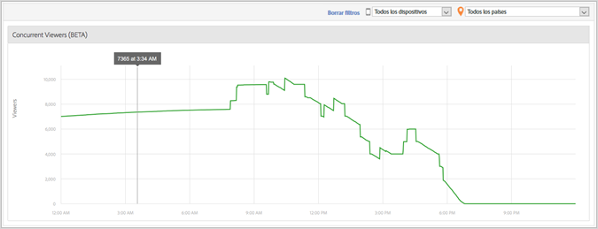

# Espectadores simultáneos de medios{#media-concurrent-viewers}

El tablero de espectadores simultáneos de medios muestra los espectadores simultáneos durante un día. Dichos datos pueden filtrarse por contenido, tipo de dispositivo o país.

>[!TIP]
>
>No se mostrarán datos si el intervalo seleccionado no es un día completo.

## Características del informe {#report-features}

Estas son algunas de las características de este informe:

* No es en tiempo real. Tiene una latencia de Adobe Analytics normal.
* El informe abarca un intervalo de tiempo de 24 horas. El eje x es la hora del día en base a la zona horaria del grupo de informes.
* Muestra los espectadores simultáneos por minuto.
* El informe *Espectadores simultáneos de medio* muestra el número de espectadores que ven o escuchan todo el contenido.
* En el informe *Detalles multimedia* está disponible el informe Espectadores simultáneos, que muestra el número de espectadores que están viendo o escuchando un elemento multimedia concreto.
* El informe solo abarca un día.
* El cliente podrá consultar los informes de espectadores simultáneos históricos (con información de un día).

## Limitaciones {#limitations}

Estas son algunas de las limitaciones de este informe:

* No puede exportar los datos como ReportBuilder.
* No muestra los datos en formato de tabla.
* No puede enviar un informe por correo electrónico.
* Incluso si no realiza el seguimiento de anuncios, debe volver a habilitar el seguimiento de medios y seleccionar el módulo de anuncios de medio.
* Esta funcionalidad proporcionará datos precisos a la hora de utilizar una biblioteca de Heartbeat con capacidades de seguimiento de pausa.

