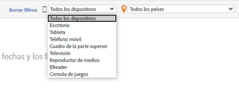
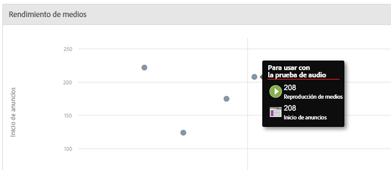

# Información general de medio{#media-overview}

Desde el tablero Información general de medio, puede supervisar los medios de su sitio. La pantalla Información general de medio muestra varias mediciones agregadas para supervisar rápidamente que el medio está teniendo el rendimiento que se esperaba. Un gráfico muestra los inicios de contenido al lado de los inicios de publicidad para que se puedan ver rápidamente estas métricas sobre cada elemento multimedia.

{width="672px"}

## Filtros rápidos {#section_8DF3E4A6734145B082657C6BECFA0BBE}

Muestre rápidamente métricas de medio por dispositivo o por país:

{width="400px"}

## Rendimiento de medios {#section_288FB476EDA44761BB8A86551F0A110C}

Haga clic y arrastre para aumentar y, a continuación, pase el ratón por encima para ver las métricas detalladas de cada medio. Haga clic  

to reset the view after you zoom.

{width="400px"}

