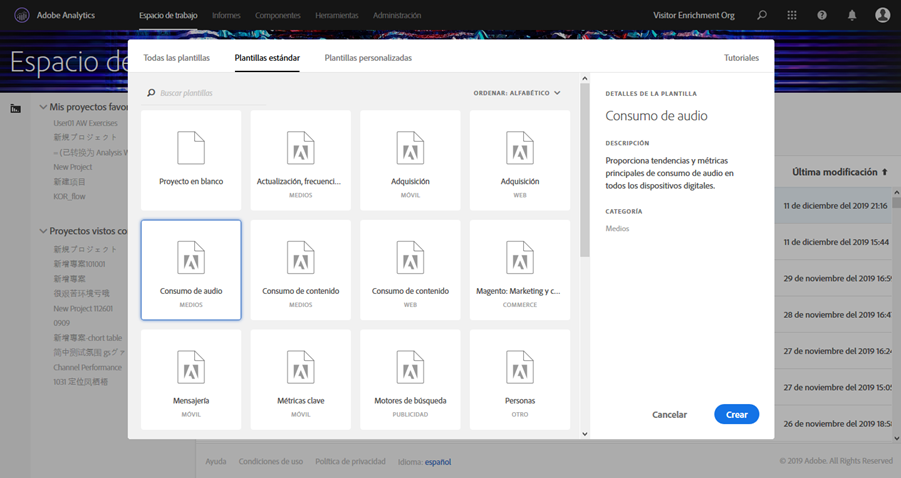
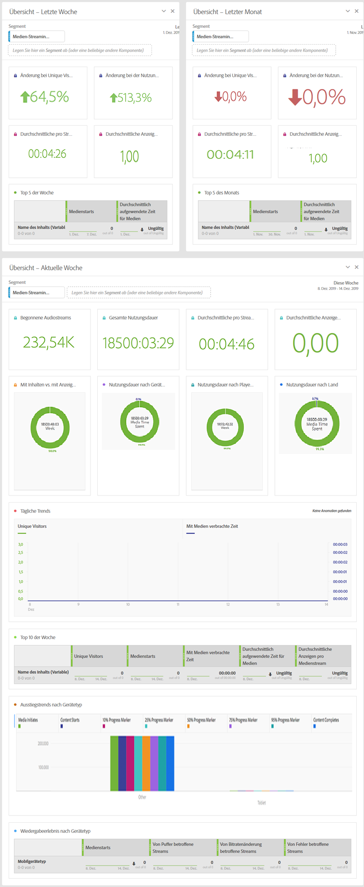

# Plantillas de Workspace de medios{#media-workspace-templates}

Adobe Analytics Workspace le ofrece la posibilidad de configurar tableros rápidamente para analizar los datos de seguimiento. Al crear un proyecto nuevo o al entrar en Workspace para administrar un proyecto existente, puede elegir entre plantillas estándar que abarcan situaciones generales de seguimiento, como adquisiciones o consumo de audio y vídeo, entre otras. Además, puede crear, modificar y guardar sus propias plantillas personalizadas.

Puede trabajar con las plantillas de la pestaña de Workspace de Adobe Analytics para crear o gestionar un proyecto. Al entrar en Workspace por primera vez, se le presentan las opciones para crear un proyecto nuevo o para abrir uno existente:

* **Crear un nuevo proyecto:** al hacer clic en el botón **[!UICONTROL Crear nuevo proyecto]** de Workspace, aparece un cuadro de diálogo en el que puede seleccionar una opción de su recopilación de plantillas (estándar o personalizadas):

   

   Por ejemplo, si elige la plantilla **[!UICONTROL Consumo de audio]**, aparece el siguiente tablero orientado al audio:

   

* **Administrar proyectos**: en un proyecto existente, puede modificar la presentación de datos y guardarlo para crear su propia recopilación de plantillas personalizadas.

