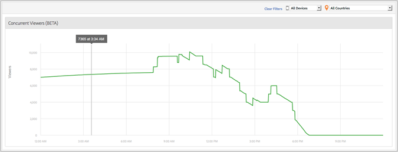

# Informes de espectadores simultáneos de medios {#media-concurrent-viewers}

El panel de control Espectadores simultáneos de medios muestra los visualizadores simultáneos durante un día. Dichos datos pueden filtrarse por contenido, tipo de dispositivo o país.

>[!TIP]
>
> Este informe se basa en sesiones de medios activas simultáneas.  Para ver los visualizadores simultáneos por visitante único, con las funcionalidades adicionales para aplicar un segmento, desglosar y comparar, utilice la variable [Panel de visualizadores simultáneos de medios en Analysis Workspace](https://experienceleague.adobe.com/docs/analytics/analyze/analysis-workspace/panels/media-concurrent-viewers.html?lang=es).
>

## Características del informe {#report-features}

Estas son algunas de las características de este informe:

* No es en tiempo real. Tiene latencia normal de Adobe Analytics.
* El informe abarca un periodo de 24 horas. El eje x es la hora del día en función del huso horario del grupo de informes.
* Muestra los visores simultáneos en granularidad de minutos.
* Hay un *informe de Espectadores simultáneos de medios* que muestra cuántos visualizadores están viendo o escuchando todo el contenido.
* Hay un informe de Espectadores simultáneos en el informe *Detalles de medios* que muestra cuántos visualizadores están viendo o escuchando un elemento de medios determinado.
* El informe solo funciona durante un día.
* El cliente podrá consultar los informes de espectadores simultáneos históricos (con información de un día).

## Limitaciones {#limitations}

Estas son algunas limitaciones de este informe:

* No se mostrarán datos si el intervalo seleccionado no es un día completo.
* No es posible exportar los datos, como ReportBuilder.
* No se pueden presentar los datos en formato de tabla.
* No puede enviar un informe por correo electrónico.
* Incluso si no rastrea anuncios, debe volver a habilitar el seguimiento de medios y seleccionar el módulo de publicidad de medios.
* Esta funcionalidad proporciona datos precisos cuando se usa una biblioteca de latidos con capacidades de seguimiento de pausa.
