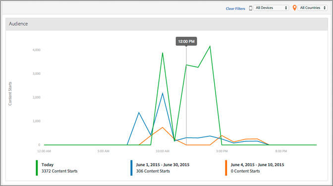

# Partición de días de medio {#media-daypart}

En el tablero Partición de días de medio se muestran los inicios de contenido por hora del día para permitirle ver rápidamente el momento de compromiso de la audiencia. 
