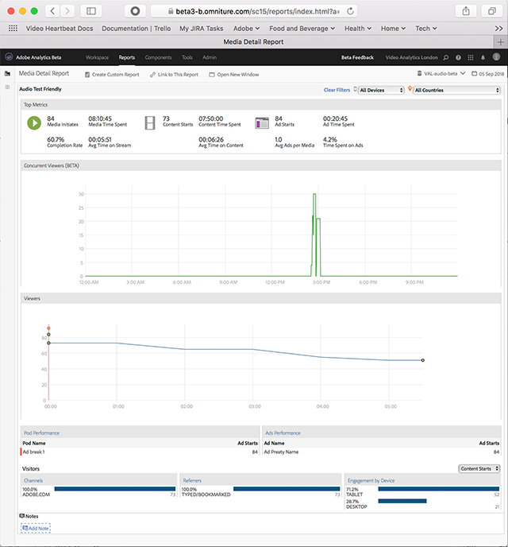

# Detalles multimedia{#media-detail}

En el tablero Detalles multimedia se muestran las métricas detalladas de todo el contenido, incluidos los espectadores u oyentes simultáneos, los inicios de contenido, la tasa de finalización, el tiempo invertido y los inicios de publicidad.

