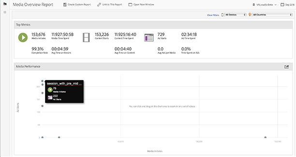
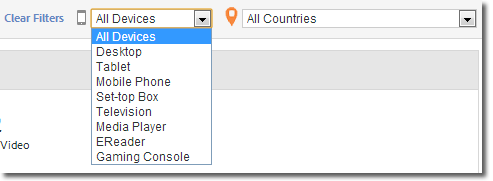
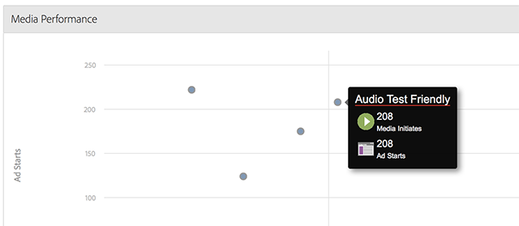

# Información general de medio{#media-overview}

El tablero Información general de medios está diseñado para permitirle monitorizar los medios en todo el sitio. La pantalla Información general de medios muestra varias medidas acumuladas para que pueda monitorizar rápidamente que los medios están funcionando según lo esperado. Un gráfico muestra [[!UICONTROL inicios de contenido]](/help/reporting/metrics/content-starts.md) junto a [[!UICONTROL inicios de publicidad]](/help/reporting/metrics/ad-starts.md) para que puedas ver rápidamente estas métricas para cada elemento de medios.

<!--
{width="672px"}
-->

## Filtros rápidos {#quick-filters}

Muestre rápidamente métricas de medio por dispositivo o por país:

<!--
{width="400px"}
-->

## Rendimiento de medios {#media-performance}

Haga clic y arrastre para aumentar y, a continuación, pase el ratón por encima para ver las métricas detalladas de cada medio. Haga clic en 

para restablecer la vista después de ampliar.

<!--
{width="400px"}
-->
