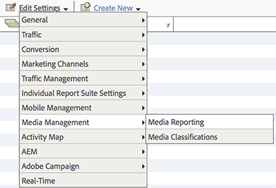

# Configuración de informes para implementaciones solo de Analytics

Antes de que una implementación exclusiva de Analytics pueda recopilar datos de medios de streaming, cada grupo de informes que reciba esos datos debe configurarse para habilitar los módulos de medios adecuados. En esta página se describe cómo habilitar esos módulos y dónde encontrar los informes resultantes.

* **Requisitos previos**: Una implementación de Adobe Analytics. Consulte la [descripción general de la implementación solo de Analytics](/help/implementation/analytics-only/overview.md) y el método de implementación elegido.

## Habilitar la creación de informes de contenidos en un grupo de informes

Para enviar datos sobre los contenidos, es necesario configurar todos los grupos de informes que recopilan métricas de contenidos.

1. En [Adobe Analytics](https://experience.adobe.com/analytics), vaya a **[!UICONTROL Administrador]** → **[!UICONTROL Grupos de informes]**.
1. Seleccione los grupos de informes que recopilan datos de medios. Seleccione **[!UICONTROL Editar configuración]** → **[!UICONTROL Administración de medios]** → **[!UICONTROL Informes de medios]**.

   

1. En la página **[!UICONTROL Informes de medios]**, habilite los módulos de medios de transmisión que desee (ver a continuación).

1. Seleccionar **[!UICONTROL Guardar].**

   Si este grupo de informes ya está configurado para recopilar datos de medios, después de seleccionar **[!UICONTROL Guardar]**, se mostrará una página de configuración adicional. Si ve la página **[!UICONTROL Medición de Componentes básicos de contenidos]**, continúe con el siguiente paso.

## Módulos de medios de streaming disponibles

La medición de contenidos incluye los siguientes módulos:

* **[!UICONTROL Componentes básicos de medios]**: Necesario para todo el seguimiento de medios de transmisión. Reserva variables de solución para la reproducción de contenido y los datos de sesión.
   * **Dimensiones:**
      * [[!UICONTROL Contenido]](/help/reporting/dimensions/content.md)
      * [[!UICONTROL Canal de contenido]](/help/reporting/dimensions/content-channel.md)
      * [[!UICONTROL Longitud del contenido (variable)]](/help/reporting/dimensions/content-length.md)
      * [[!UICONTROL Nombre de contenido (variable)]](/help/reporting/dimensions/content-name.md)
      * [[!UICONTROL Nombre del reproductor de contenido]](/help/reporting/dimensions/content-player-name.md)
      * [[!UICONTROL Segmento de contenido]](/help/reporting/dimensions/content-segment.md)
      * [[!UICONTROL Tipo de contenido]](/help/reporting/dimensions/content-type.md)
      * [[!UICONTROL Ruta de medios]](/help/reporting/dimensions/media-path.md)
      * [[!UICONTROL ID de sesión de medios]](/help/reporting/dimensions/media-session-id.md)
      * [[!UICONTROL Tipo de emisión]](/help/reporting/dimensions/stream-type.md)
   * **Métricas:**
      * [[!UICONTROL Público medio por minuto]](/help/reporting/metrics/average-minute-audience.md)
      * [[!UICONTROL Contenido finalizado]](/help/reporting/metrics/content-completes.md)
      * [[!UICONTROL Reanudación del contenido]](/help/reporting/metrics/content-resumes.md)
      * [[!UICONTROL Vistas de segmentos de contenido]](/help/reporting/metrics/content-segment-views.md)
      * [[!UICONTROL El contenido comienza]](/help/reporting/metrics/content-starts.md)
      * [[!UICONTROL Tiempo invertido en contenido]](/help/reporting/metrics/content-time-spent.md)
      * [[!UICONTROL Comienzos de medios]](/help/reporting/metrics/media-starts.md)
      * [[!UICONTROL Pausar eventos]](/help/reporting/metrics/pause-events.md)
      * [[!UICONTROL Flujos afectados por la pausa]](/help/reporting/metrics/paused-impacted-streams.md)
      * [[!UICONTROL Marcadores de progreso]](/help/reporting/metrics/progress-markers.md)
      * [[!UICONTROL Duración total de la pausa]](/help/reporting/metrics/total-pause-duration.md)
      * [[!UICONTROL Tiempo único reproducido]](/help/reporting/metrics/unique-time-played.md)
* **[!UICONTROL Anuncios multimedia]**: habilita el seguimiento de anuncios dentro del contenido multimedia.
   * **Dimensiones:**
      * [[!UICONTROL Anuncio]](/help/reporting/dimensions/ad.md)
      * [[!UICONTROL Posición del anuncio en la secuencia]](/help/reporting/dimensions/ad-in-pod-position.md)
      * [[!UICONTROL Longitud del anuncio (variable)]](/help/reporting/dimensions/ad-length.md)
      * [[!UICONTROL Nombre del anuncio (variable)]](/help/reporting/dimensions/ad-name.md)
      * [[!UICONTROL Nombre del reproductor del anuncio]](/help/reporting/dimensions/ad-player-name.md)
      * [[!UICONTROL pod de anuncios]](/help/reporting/dimensions/ad-pod.md)
      * [[!UICONTROL Anunciante]](/help/reporting/dimensions/advertiser.md)
      * [[!UICONTROL ID de campaña]](/help/reporting/dimensions/campaign-id.md)
   * **Dimensiones de clasificación:**
      * [[!UICONTROL ID de recurso]](/help/reporting/dimensions/asset-id.md)
      * [[!UICONTROL Clasificación del contenido]](/help/reporting/dimensions/content-rating.md)
      * [[!UICONTROL ID. DE Creative]](/help/reporting/dimensions/creative-id.md)
      * [[!UICONTROL Primera fecha de emisión]](/help/reporting/dimensions/first-air-date.md)
      * [[!UICONTROL Primera fecha digital]](/help/reporting/dimensions/first-digital-date.md)
      * [[!UICONTROL Nombre de la secuencia]](/help/reporting/dimensions/pod-name.md)
      * [[!UICONTROL Posición de la secuencia]](/help/reporting/dimensions/pod-position.md)
   * **Métricas:**
      * [[!UICONTROL Finalización del anuncio]](/help/reporting/metrics/ad-completes.md)
      * [[!UICONTROL El anuncio comienza]](/help/reporting/metrics/ad-starts.md)
      * [[!UICONTROL Tiempo invertido en publicidad]](/help/reporting/metrics/ad-time-spent.md)
      * [[!UICONTROL Tiempo invertido en contenido]](/help/reporting/metrics/media-time-spent.md)
* **[!UICONTROL Capítulos multimedia]**: Habilita el seguimiento de capítulos dentro del contenido multimedia.
   * **Dimension:**
      * [[!UICONTROL Capítulo]](/help/reporting/dimensions/chapter.md)
   * **Dimensiones de clasificación:**
      * [[!UICONTROL Longitud del capítulo]](/help/reporting/dimensions/chapter-length.md)
      * [[!UICONTROL Nombre de capítulo]](/help/reporting/dimensions/chapter-name.md)
      * [[!UICONTROL Desplazamiento de capítulo]](/help/reporting/dimensions/chapter-offset.md)
      * [[!UICONTROL Posición del capítulo]](/help/reporting/dimensions/chapter-position.md)
      * [[!UICONTROL Creador]](/help/reporting/dimensions/originator.md)
   * **Métricas:**
      * [[!UICONTROL El capítulo finaliza]](/help/reporting/metrics/chapter-completes.md)
      * [[!UICONTROL El capítulo comienza]](/help/reporting/metrics/chapter-starts.md)
      * [[!UICONTROL Tiempo invertido en el capítulo]](/help/reporting/metrics/chapter-time-spent.md)
* **[!UICONTROL Calidad de los medios]**: Habilita el seguimiento de los datos de calidad de la reproducción, incluidos los eventos de almacenamiento en búfer, velocidad de bits y error.
   * **Dimensiones:**
      * [[!UICONTROL Velocidad de bits media]](/help/reporting/dimensions/average-bitrate.md)
      * [[!UICONTROL Cambios de velocidad de bits]](/help/reporting/dimensions/bitrate-changes.md)
      * [[!UICONTROL Eventos de búfer]](/help/reporting/dimensions/buffer-events.md)
      * [[!UICONTROL Fotogramas perdidos]](/help/reporting/dimensions/dropped-frames.md)
      * [[!UICONTROL Errores]](/help/reporting/dimensions/errors.md)
      * [[!UICONTROL Id. de error externo]](/help/reporting/dimensions/external-error-ids.md)
      * [[!UICONTROL ID de error del reproductor SDK]](/help/reporting/dimensions/player-sdk-error-ids.md)
      * [[!UICONTROL Tiempo para el inicio]](/help/reporting/dimensions/time-to-start.md)
      * [[!UICONTROL Duración total del búfer]](/help/reporting/dimensions/total-buffer-duration.md)
   * **Métricas:**
      * [[!UICONTROL Velocidad de bits media]](/help/reporting/metrics/average-bitrate.md)
      * [[!UICONTROL Flujos afectados por cambio de velocidad de bits]](/help/reporting/metrics/bitrate-change-impacted-streams.md)
      * [[!UICONTROL Cambios de velocidad de bits]](/help/reporting/metrics/bitrate-changes.md)
      * [[!UICONTROL Eventos de búfer]](/help/reporting/metrics/buffer-events.md)
      * [[!UICONTROL Flujos afectados por búfer]](/help/reporting/metrics/buffer-impacted-streams.md)
      * [[!UICONTROL Flujos afectados por fotogramas rechazados]](/help/reporting/metrics/dropped-frame-impacted-streams.md)
      * [[!UICONTROL Fotogramas perdidos]](/help/reporting/metrics/dropped-frames.md)
      * [[!UICONTROL Pérdidas antes del inicio]](/help/reporting/metrics/drops-before-start.md)
      * [[!UICONTROL Eventos de error]](/help/reporting/metrics/error-events.md)
      * [[!UICONTROL Flujos afectados por error]](/help/reporting/metrics/error-impacted-streams.md)
      * [[!UICONTROL Tiempo para el inicio]](/help/reporting/metrics/time-to-start.md)
      * [[!UICONTROL Duración total del búfer]](/help/reporting/metrics/total-buffer-duration.md)
* **[!UICONTROL Metadatos de vídeo]**: Habilita el seguimiento de atributos de contenido de vídeo estándar, como programa, temporada y género.
   * **Dimensiones:**
      * [[!UICONTROL Cargas de publicidad]](/help/reporting/dimensions/ad-load-type.md)
      * [[!UICONTROL Parte del día]](/help/reporting/dimensions/day-part.md)
      * [[!UICONTROL Episodio]](/help/reporting/dimensions/episode.md)
      * [[!UICONTROL Género]](/help/reporting/dimensions/genre.md)
      * [[!UICONTROL Tipo de fuente de medios]](/help/reporting/dimensions/media-feed-type.md)
      * [[!UICONTROL MVPD]](/help/reporting/dimensions/mvpd.md)
      * [[!UICONTROL Red]](/help/reporting/dimensions/network.md)
      * [[!UICONTROL Temporada]](/help/reporting/dimensions/season.md)
      * [[!UICONTROL Mostrar]](/help/reporting/dimensions/show.md)
      * [[!UICONTROL Mostrar tipo]](/help/reporting/dimensions/show-type.md)
   * **Métrica:**
      * [[!UICONTROL Autorizado]](/help/reporting/metrics/authorized.md)
* **[!UICONTROL Metadatos de audio]**: Habilita el seguimiento de atributos de contenido de audio estándar como artista, álbum y estación.
   * **Dimensiones:**
      * [[!UICONTROL Álbum]](/help/reporting/dimensions/album.md)
      * [[!UICONTROL Artista]](/help/reporting/dimensions/artist.md)
      * [[!UICONTROL Autor]](/help/reporting/dimensions/author.md)
      * [[!UICONTROL Etiqueta]](/help/reporting/dimensions/label.md)
      * [[!UICONTROL Editor]](/help/reporting/dimensions/publisher.md)
      * [[!UICONTROL Estación]](/help/reporting/dimensions/station.md)
* **[!UICONTROL Seguimiento de estado del reproductor]**: permite medir estados estándar de la interfaz de usuario del reproductor, como pantalla completa, subtítulos y la imagen en la imagen.
   * **Métricas:**
      * [[!UICONTROL Recuentos de subtítulos]](/help/reporting/metrics/closed-captioning-count.md)
      * [[!UICONTROL Duración total de los subtítulos]](/help/reporting/metrics/closed-captioning-total-duration.md)
      * [[!UICONTROL Recuentos de pantalla completa]](/help/reporting/metrics/full-screen-count.md)
      * [[!UICONTROL Duración total de pantalla completa]](/help/reporting/metrics/full-screen-total-duration.md)
      * [[!UICONTROL Recuentos de enfoque]](/help/reporting/metrics/in-focus-count.md)
      * [[!UICONTROL Duración total del enfoque]](/help/reporting/metrics/in-focus-total-duration.md)
      * [[!UICONTROL Recuentos de Silenciar]](/help/reporting/metrics/mute-count.md)
      * [[!UICONTROL Duración total de Silenciar]](/help/reporting/metrics/mute-total-duration.md)
      * [[!UICONTROL Recuentos de imagen en imagen]](/help/reporting/metrics/picture-in-picture-count.md)
      * [[!UICONTROL Duración total de la imagen en imagen]](/help/reporting/metrics/picture-in-picture-total-duration.md)
      * [[!UICONTROL Transmisiones afectadas por los subtítulos]](/help/reporting/metrics/closed-captioning-streams-impacted.md)
      * [[!UICONTROL Transmisiones afectadas por pantalla completa]](/help/reporting/metrics/full-screen-streams-impacted.md)
      * [[!UICONTROL Transmisiones afectadas por el enfoque]](/help/reporting/metrics/in-focus-streams-impacted.md)
      * [[!UICONTROL Transmisiones afectadas por silenciar]](/help/reporting/metrics/mute-streams-impacted.md)
      * [[!UICONTROL Transmisiones afectadas por imagen en imagen]](/help/reporting/metrics/picture-in-picture-streams-impacted.md)

>[!MORELIKETHIS]
>
>* [Informes de contenidos en Workspace](/help/reporting/workspace/media-workspace-templates.md)
>* [Resumen de dimensiones](/help/reporting/dimensions/overview.md)
>* [Resumen de métricas](/help/reporting/metrics/overview.md)
