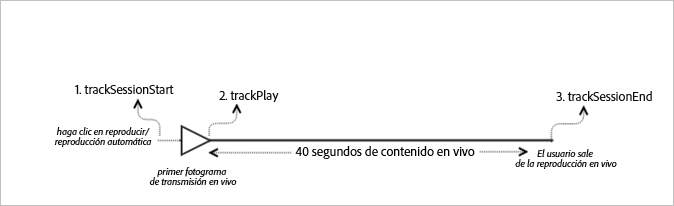

# Contenido principal activo{#live-main-content}

## Situación {#section_13BD203CBF7546D2A6AD0129B1EEB735}

En esta situación, solo hay un recurso activo sin anuncios que se reproduce durante 40 segundos tras unirse a la emisión en directo.

| Activador | Método de Heartbeat | Llamadas de red | Notas   |
|---|---|---|---|
| User clicks **[!UICONTROL Play]** | `trackSessionStart` | Inicio del contenido de Analytics, inicio del contenido de Heartbeat | Puede ser porque el usuario hace clic en **[!UICONTROL Reproducir]o por un evento de reproducción automática.** |
| Se reproduce el primer fotograma del medio. | `trackPlay` | Reproducción del contenido de Heartbeat | Este método desencadena el temporizador. Se envían latidos cada 10 segundos mientras dura la reproducción. |
| Se reproduce el contenido. |  | Latidos de contenido |  |
| La sesión finaliza. | `trackSessionEnd` |  | `SessionEnd` significa el final de una sesión de visualización. Se debe llamar a esta API aunque el usuario no consuma los medios hasta la finalización. |

## Parámetros {#section_D52B325B99DA42108EF560873907E02C}

Muchos de los valores que existen en las llamadas de inicio de contenido de Adobe Analytics están presentes en las llamadas de inicio de contenido de Heartbeat. También verá muchos otros parámetros que Adobe utiliza para rellenar los distintos informes de medios en Adobe Analytics. Aquí no vamos a detallar todos, solo los más importantes.

### Inicio del contenido de Heartbeat

| Parámetro | Valor | Notas |
|---|---|---|
| `s:sc:rsid` | &lt;El ID de su grupo de informes de Adobe&gt; |  |
| `s:sc:tracking_serve` | &lt;La URL de servidor de seguimiento de Analytics&gt; |  |
| `s:user:mid` | `s:user:mid` | Debe coincidir con el valor medio de la llamada de inicio de contenido de Adobe Analytics |
| `s:event:type` | "start" |  |
| `s:asset:type` | "main" |  |
| `s:asset:mediao_id` | &lt; Nombre del medio &gt; |  |
| `s:stream:type` | live |  |
| `s:meta:*` | opcional | Metadatos personalizados establecidos en el medio |

## Latidos de contenido {#section_7B387303851A43E5993F937AE2B146FE}

Durante la reproducción de medios, hay un temporizador que enviará uno o más latidos (o pings) cada 10 segundos para el contenido principal y cada segundo para las publicidades. Estos latidos contienen datos sobre la reproducción, los anuncios y el almacenamiento en búfer, entre otros. El contenido exacto de cada latido no se detallará en este documento. Lo más importante es que los latidos se desencadenan constantemente mientras dura la reproducción.

En los latidos de contenido debe fijarse en ciertos detalles:

| Parámetro | Valor | Notas |
|---|---|---|
| `s:event:type` | "play" |  |
| `l:event:playhead` | &lt;posición del cabezal de reproducción&gt; p.ej., 50, 60, 70 | Debe indicar la posición actual del cabezal de reproducción. |

## Finalización de contenido de Heartbeat {#section_2CA970213AF2457195901A93FC9D4D0D}

No habrá una llamada completa en este escenario, ya que el flujo activo nunca se completó.

## Configuración del valor del cursor de reproducción

Para los flujos en directo, es necesario definir el cursor de reproducción como un desplazamiento desde el momento en que comenzó la programación, de modo que en los informes, los analistas pueden determinar en qué punto se están participando los usuarios y dejando el flujo en directo en una vista de 24 horas.

### Al inicio

Para los medios LIVE, cuando un usuario comienza a reproducir el flujo, debe establecer `l:event:playhead` en el desplazamiento actual, en segundos. Esto se contrasta con VOD, donde debe configurar el cursor de reproducción en "0".

Por ejemplo, supongamos que un evento de flujo DIRECTO comienza a medianoche y se ejecuta durante 24 horas (`a.media.length=86400`; `l:asset:length=86400`). A continuación, supongamos que un usuario comienza a reproducir ese flujo en directo a las 12:00. En este escenario, debe establecerse `l:event:playhead` en 43200 (12 horas en el flujo).

### Al pausar

La misma lógica «cursor de reproducción directo» aplicada al principio de la reproducción debe aplicarse cuando un usuario detiene la reproducción. Cuando el usuario vuelve a reproducir el flujo en directo, debe definir `l:event:playhead` el valor en la nueva posición de desplazamiento de la cabeza, _no_ en el punto en el que el usuario pause el flujo en directo.

## Código de muestra {#section_vct_j2j_x2b}



### Android

Este es el orden esperado de las llamadas de API:

```java
// Set up mediaObject 
MediaObject mediaInfo = MediaHeartbeat.createMediaObject( 
  Configuration.MEDIA_NAME,  
  Configuration.MEDIA_ID,  
  Configuration.MEDIA_LENGTH,  
  MediaHeartbeat.StreamType.LIVE 
); 

HashMap<String, String> mediaMetadata = new HashMap<String, String>(); 
mediaMetadata.put(CUSTOM_VAL_1, CUSTOM_KEY_1); 
mediaMetadata.put(CUSTOM_VAL_2, CUSTOM_KEY_2); 

// 1. Call trackSessionStart() when the user clicks Play or if autoplay is used,  
//    i.e., there is an intent to start playback.  
_mediaHeartbeat.trackSessionStart(mediaInfo, mediaMetadata); 

...... 
...... 

// 2. Call trackPlay() when the playback actually starts, i.e., when the first  
//    frame of main content is rendered on the screen. 
_mediaHeartbeat.trackPlay(); 

....... 
....... 

// 3. Call trackSessionEnd() when user ends the playback session.  
//    Since the user does not watch live media to completion, there  
//    is no need to call trackComplete().  
_mediaHeartbeat.trackSessionEnd(); 
....... 
....... 
```

### iOS

Este es el orden esperado de las llamadas de API:

```
// Set up mediaObject 
ADBMediaObject *mediaObject =  
[ADBMediaHeartbeat createMediaObjectWithName:MEDIA_NAME  
                   length:MEDIA_LENGTH  
                   streamType:ADBMediaHeartbeatStreamTypeLIVE]; 
 
NSMutableDictionary *mediaContextData = [[NSMutableDictionary alloc] init]; 
[mediaContextData setObject:CUSTOM_VAL_1 forKey:CUSTOM_KEY_1]; 
[mediaContextData setObject:CUSTOM_VAL_2 forKey:CUSTOM_KEY_2]; 
 
// 1. Call trackSessionStart when the user clicks Play or if autoplay is used,  
//    i.e., there is an intent to start playback. 
[_mediaHeartbeat trackSessionStart:mediaObject data:mediaContextData]; 
...... 
...... 
 
// 2. Call trackPlay when the playback actually starts, i.e., when the first  
//    frame of the main content is rendered on the screen. 
[_mediaHeartbeat trackPlay]; 
....... 
....... 
 
// 3. Call trackSessionEnd when user ends the playback session. Since the user  
//    does not watch live media to completion, there is no need to call  
//    trackComplete. 
[_mediaHeartbeat trackSessionEnd]; 
........ 
........ 
```

### JavaScript

Este es el orden esperado de las llamadas de API:

```js
// Set up mediaObject 
var mediaInfo =  
MediaHeartbeat.createMediaObject(Configuration.MEDIA_NAME,  
                                 Configuration.MEDIA_ID,  
                                 Configuration.MEDIA_LENGTH,  
                                 MediaHeartbeat.StreamType.VOD); 

var mediaMetadata = { 
  CUSTOM_KEY_1 : CUSTOM_VAL_1,  
  CUSTOM_KEY_2 : CUSTOM_VAL_2,  
  CUSTOM_KEY_3 : CUSTOM_VAL_3 
}; 

// 1. Call trackSessionStart() when Play is clicked or if autoplay  
//    is used, i.e., there's an intent to start playback. 
this._mediaHeartbeat.trackSessionStart(mediaInfo, mediaMetadata); 

...... 
...... 

// 2. Call trackPlay() when the playback actually starts, i.e., when the  
//    first frame of media is rendered on the screen. 
this._mediaHeartbeat.trackPlay(); 

....... 
....... 

// 3. Call trackSessionEnd() when user ends the playback session.  
//    Since user does not watch live media to completion, there is  
//    no need to call trackComplete(). 
this._mediaHeartbeat.trackSessionEnd(); 

........ 
........ 
```

