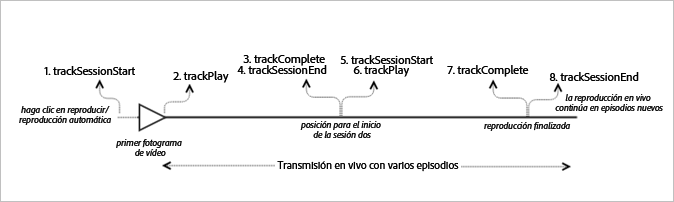

# Contenido principal activo con seguimiento secuencial {#live-main-content-with-sequential-tracking}

## Situación {#scenario}

En esta situación, solo hay un recurso activo sin anuncios que se reproduce durante 40 segundos tras unirse a la emisión en directo.

Este es el mismo escenario que el de [Reproducción de VOD sin anuncios](/help/sdk-implement/tracking-scenarios/vod-no-intrs-details.md), pero una parte del contenido se analiza y se realiza una llamada desde un punto del contenido principal hasta otro punto.

| Activador | Método de Heartbeat |  Llamadas de red  |  Notas   |
| --- | --- | --- | --- |
| El usuario hace clic en [!UICONTROL Reproducir]. | trackSessionStart | Inicio del contenido de Analytics, inicio del contenido de Heartbeat | La biblioteca de medición no sabe que hay un anuncio previo, por lo que estas llamadas de red son idénticas al escenario de [Reproducción de VOD sin anuncios](/help/sdk-implement/tracking-scenarios/vod-no-intrs-details.md). |
| Se reproduce el primer fotograma del contenido. | trackPlay | Reproducción del contenido de Heartbeat | Cuando el contenido del capítulo se reproduce antes del contenido principal, los latidos comienzan al inicio del capítulo. |
| Se reproduce el contenido. |  | Latidos de contenido | Esta llamada de red es exactamente la misma que la del escenario de [Reproducción de VOD sin anuncios](/help/sdk-implement/tracking-scenarios/vod-no-intrs-details.md). |
| Fin de la sesión 1 (el episodio 1 ha finalizado). | trackComplete / trackSessionEnd | Finalización de contenido de Heartbeat | La finalización significa que se llegó a la sesión 1 del primer episodio y que se vio entera. Antes de iniciar la sesión del siguiente episodio, hay que finalizar esta sesión. |
| Episodio 2 iniciado (inicio de la sesión 2). | trackSessionStart | Inicio del contenido de Analytics Inicio del contenido de Heartbeat | Esto se debe a que el usuario vio el primer episodio y luego siguió viendo otro |
| 1º fotograma de contenido | trackPlay | Reproducción del contenido de Heartbeat | Este método desencadena el temporizador y a partir de este momento se envían latidos cada 10 segundos mientras dura la reproducción. |
| Se reproduce el contenido. |  | Latidos de contenido |  |
| Fin de la sesión (el episodio 2 ha finalizado). | trackComplete / trackSessionEnd | Finalización de contenido de Heartbeat | La finalización significa que se llegó a la sesión 2 del segundo episodio y que se vio entera. Antes de iniciar la sesión del siguiente episodio, hay que finalizar esta sesión. |

## Parámetros {#parameters}

### Inicio del contenido de Heartbeat

| Parámetro | Valor | Notas |
|---|---|---|
| `s:sc:rsid` | &lt;El ID de su grupo de informes de Adobe&gt; |  |
| `s:sc:tracking_serve` | &lt;La URL de servidor de seguimiento de Analytics&gt; |  |
| `s:user:mid` | `s:user:mid` | Debe coincidir con el valor medio de la llamada de inicio de contenido de Adobe Analytics |
| `s:event:type` | `"start"` |  |
| `s:asset:type` | `"main"` |  |
| `s:asset:media_id` | &lt;Nombre de su contenido&gt; |  |
| `s:stream:type` | `live` |  |
| `s:meta:*` | *opcional* | Metadatos personalizados definidos en el contenido |

## Reproducción del contenido de Heartbeat {#heartbeat-content-play}

Es igual que la llamada de inicio de contenido de Heartbeat salvo en el parámetro “s:event:type”. Aquí todos los parámetros deben seguir definidos.

| Parámetro | Valor | Notas |
|---|---|---|
| `s:event:type` | `"play"` |  |
| `s:asset:type` | `"main"` |  |

## Latidos de contenido {#content-heartbeats}

Durante la reproducción de contenidos, hay un temporizador que enviará uno o más latidos cada 10 segundos para el contenido principal y cada segundo para los anuncios. Estos latidos contienen datos sobre la reproducción, los anuncios y el almacenamiento en búfer, entre otros. El contenido exacto de cada latido no se detallará en este documento. Lo más importante es que los latidos se desencadenan constantemente mientras dura la reproducción.

En los latidos de contenido debe fijarse en ciertos detalles:

| Parámetro | Valor | Notas |
|---|---|---|
| `s:event:type` | `"play"` |  |
| `l:event:playhead` | &lt;posición del cabezal de reproducción&gt; p.ej., 50, 60, 70 | Debe indicar la posición actual del cabezal de reproducción. |

## Finalización de contenido de Heartbeat {#heartbeat-content-complete}

Cuando la reproducción de un episodio determinado finaliza (el cabezal de reproducción sobrepasa el límite del episodio), se envía una llamada de finalización de contenido de Heartbeat. Se parece a otras llamadas de Heartbeat, pero contiene dos cosas específicas:

| Parámetro | Valor | Notas |
|---|---|---|
| `s:event:type` | `"complete"` |  |
| `s:asset:type` | `"main"` |  |

## Código de muestra {#sample-code}



### Android

Este es el orden esperado de las llamadas de API:

```java
// Set up mediaObject 
MediaObject mediaInfo = MediaHeartbeat.createMediaObject( 
  Configuration.MEDIA_NAME,  
  Configuration.MEDIA_ID,  
  Configuration.MEDIA_LENGTH,  
  MediaHeartbeat.StreamType.LIVE 
); 

HashMap<String, String> mediaMetadata = new HashMap<String, String>(); 
mediaMetadata.put(CUSTOM_VAL_1, CUSTOM_KEY_1); 
mediaMetadata.put(CUSTOM_VAL_2, CUSTOM_KEY_2); 

// 1. Call trackSessionStart() when the user clicks Play or if autoplay is used,  
//    i.e., when there is an intent to start playback.  
_mediaHeartbeat.trackSessionStart(mediaInfo, mediaMetadata); 

...... 
...... 

// 2. Call trackPlay() when the playback actually starts, i.e., when the first  
//    frame of main content is rendered on the screen.  
_mediaHeartbeat.trackPlay(); 

....... 
....... 

// 3. Call trackComplete() when the playback reaches the end of session,  
//    i.e., when the media completes and finishes playing 1st episode/session.  
_mediaHeartbeat.trackComplete(); 

........ 
........ 

// 4. Call trackSessionEnd() to end session 1 
_mediaHeartbeat.trackSessionEnd(); 

........ 
........ 

// Start tracking session 2 /episode 2 of the same live stream.  
// There is no need to reinstantiate a mediaHeartbeat instance for tracking sesison 2. 
// Set up mediaObject 
MediaObject mediaInfo = MediaHeartbeat.createMediaObject( 
  Configuration.MEDIA_NAME,  
  Configuration.MEDIA_ID,  
  Configuration.MEDIA_LENGTH,  
  MediaHeartbeat.StreamType.LIVE 
); 

HashMap<String, String> mediaMetadata = new HashMap<String, String>(); 
mediaMetadata.put(CUSTOM_VAL_1, CUSTOM_KEY_1); 
mediaMetadata.put(CUSTOM_VAL_2, CUSTOM_KEY_2); 

// 5. Call trackSessionStart() when the playhead reaches a point that denotes the 
//    start of session 2 
_mediaHeartbeat.trackSessionStart(mediaInfo, mediaMetadata); 

...... 
...... 

// 6. Call trackPlay() to start tracking session 2 playback  
_mediaHeartbeat.trackPlay(); 

....... 
....... 

// 7. Call trackComplete() when the playback reaches the end of session 2,  
//    i.e., the media completes and finishes playing.  
_mediaHeartbeat.trackComplete(); 

........ 
........ 

// 8. Call trackSessionEnd() to end session 2 
_mediaHeartbeat.trackSessionEnd(); 

........ 
........ 

// Continue similarly tracking further sessions in the live stream if required 
```

### iOS

Este es el orden esperado de las llamadas de API:

```
// Set up mediaObject 
ADBMediaObject *mediaObject =  
[ADBMediaHeartbeat createMediaObjectWithName:MEDIA_NAME  
                   length:MEDIA_LENGTH  
                   streamType:ADBMediaHeartbeatStreamTypeLIVE]; 
  
NSMutableDictionary *mediaContextData = [[NSMutableDictionary alloc] init]; 
[mediaContextData setObject:CUSTOM_VAL_1 forKey:CUSTOM_KEY_1]; 
[mediaContextData setObject:CUSTOM_VAL_2 forKey:CUSTOM_KEY_2]; 
  
// 1. Call trackSessionStart when the user clicks Play or if autoplay is used,  
//    i.e., there is an intent to start playback. 
[_mediaHeartbeat trackSessionStart:mediaObject data:mediaContextData]; 
...... 
...... 
  
// 2. Call trackPlay when the playback actually starts, i.e., when the first  
//    frame of main content is rendered on the screen. 
[_mediaHeartbeat trackPlay]; 
....... 
....... 

// 3. Call trackComplete when the playback reaches the end of session,  
//    i.e., when the media completes and finishes playing the first 
//    episode/session. 
[_mediaHeartbeat trackComplete]; 
....... 
....... 

// 4. Call trackSessionEnd to end session 1 
[_mediaHeartbeat trackSessionEnd]; 
........ 
........ 

// Start tracking session 2 / episode 2 of the same live stream, No need to  
// reinstantiate mediaHeartbeat instance for tracking sesison 2. 

// Set up mediaObject 
ADBMediaObject *mediaObject =  
[ADBMediaHeartbeat createMediaObjectWithName:MEDIA_NAME  
                   length:MEDIA_LENGTH  
                   streamType:ADBMediaHeartbeatStreamTypeLIVE]; 
 
NSMutableDictionary *mediaContextData = [[NSMutableDictionary alloc] init]; 
[mediaContextData setObject:CUSTOM_VAL_1 forKey:CUSTOM_KEY_1]; 
[mediaContextData setObject:CUSTOM_VAL_2 forKey:CUSTOM_KEY_2]; 
 
// 5. Call trackSessionStart when the playhead reaches a point that denotes  
//    start of session 2 
[_mediaHeartbeat trackSessionStart:mediaObject data:mediaContextData]; 
...... 
...... 
 
// 6. Call trackPlay to start tracking session 2 playback 
[_mediaHeartbeat trackPlay]; 
....... 
....... 
 
// 7. Call trackComplete when the playback reaches the end of session 2,  
//    i.e., when the media completes and finishes playing. 
[_mediaHeartbeat trackComplete]; 
........ 
........ 
 
// 8. Call trackSessionEnd to end the session 2 
[_mediaHeartbeat trackSessionEnd]; 
........ 
........ 

// Continue tracking further sessions in live stream similarly if required 
```

### JavaScript

Este es el orden esperado de las llamadas de API:

```js
// Set up mediaObject 

var mediaInfo = MediaHeartbeat.createMediaObject( 
  Configuration.MEDIA_NAME,  
  Configuration.MEDIA_ID,  
  Configuration.MEDIA_LENGTH,  
  MediaHeartbeat.StreamType.VOD 
); 

var mediaMetadata = { 
  CUSTOM_KEY_1 : CUSTOM_VAL_1,  
  CUSTOM_KEY_2 : CUSTOM_VAL_2,  
  CUSTOM_KEY_3 : CUSTOM_VAL_3 
}; 

// 1. Call trackSessionStart() when Play is clicked or if autoplay is used,  
//    i.e., there's an intent to start playback. 
this._mediaHeartbeat.trackSessionStart(mediaInfo, mediaMetadata); 

...... 
...... 

// 2. Call trackPlay() when the playback actually starts, i.e., when the  
//    first frame of media is rendered on the screen. 
this._mediaHeartbeat.trackPlay(); 

....... 
....... 

// 3. Call trackComplete() when the playback reaches the end of a session,  
//    i.e., whn playback completes and finishes playing the 1st episode/session. 
this._mediaHeartbeat.trackComplete(); 

........ 
........ 

// 4. Call trackSessionEnd() to end session 1 
this._mediaHeartbeat.trackSessionEnd(); 

........ 
........ 

// Start tracking session 2/episode 2 of the same live stream. There is no need  
// to reinstantiate a mediaHeartbeat instance for tracking sesison 2. 

// Set up mediaObject 
var mediaInfo2 = MediaHeartbeat.createMediaObject( 
  Configuration.MEDIA_NAME,  
  Configuration.MEDIA_ID,  
  Configuration.MEDIA_LENGTH,  
  MediaHeartbeat.StreamType.LIVE 
); 

var mediaMetadata2 = { 
  CUSTOM_KEY_1 : CUSTOM_VAL_1,  
  CUSTOM_KEY_2 : CUSTOM_VAL_2,  
  CUSTOM_KEY_3 : CUSTOM_VAL_3 
}; 

// 5. Call trackSessionStart() when the playhead reaches a point that denotes  
//    the start of session 2 
this._mediaHeartbeat.trackSessionStart(mediaInfo2, mediaMetadata2); 

...... 
...... 

// 6. Call trackPlay() to start tracking session 2 playback 
this._mediaHeartbeat.trackPlay(); 

....... 
....... 

// 7. Call trackComplete() when the playback reaches the end of session 2,  
//    i.e., playback completes and finishes playing. 
this._mediaHeartbeat.trackComplete(); 

........ 
........ 

// 8. Call trackSessionEnd() to end session 2 
this._mediaHeartbeat.trackSessionEnd(); 

........ 
........ 

// Continue tracking further sessions in live stream similarly if required 
```

