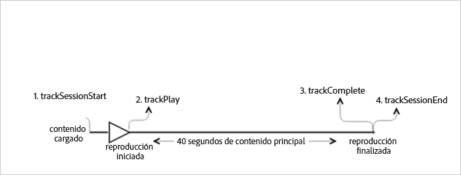

# Reproducción de VOD sin anuncios{#vod-playback-with-no-ads}

## Situación {#scenario}

Este caso trata de un recurso de VOD sin anuncios que se reproduce una vez de principio a fin.

| Activador | Método de Heartbeat | Llamadas de red | Notas   |
|---|---|---|---|
| User clicks **[!UICONTROL Play]** | `trackSessionStart` | Inicio del contenido de Analytics, inicio del contenido de Heartbeat | Puede ser porque el usuario hace clic en Reproducir o por un evento de reproducción automática. |
| Primer fotograma del medio | `trackPlay` | Reproducción del contenido de Heartbeat | Este método desencadena el temporizador y, a partir de este punto, se envían latidos cada 10 segundos mientras dura la reproducción. |
| Se reproduce el contenido. |  | Latidos de contenido |  |
| El contenido termina de reproducirse. | `trackComplete` | Finalización de contenido de Heartbeat | *Complete* significa que el cabezal de reproducción ha llegado al final del contenido. |

## Parámetros {#parameters}

Many of the same values that you see on Heartbeat Content Start Calls are also seen on Adobe Analytics `Content Start` Calls. Hay muchos parámetros que Adobe utiliza para rellenar los distintos informes de medios, pero en la tabla siguiente solo se muestran los más importantes:

### Inicio del contenido de Heartbeat

| Parámetro | Valor | Notas   |
|---|---|---|
| `s:sc:rsid` | &lt;El ID de su grupo de informes de Adobe&gt; |  |
| `s:sc:tracking_server` | &lt;La URL de servidor de seguimiento de Analytics&gt; |  |
| `s:user:mid` | se debe definir | Debe coincidir con el valor medio de la `Adobe Analytics Content Start` llamada. |
| `s:event:type` | `"start"` |  |
| `s:asset:type` | `"main"` |  |
| `s:asset:media_id` | &lt;Nombre del medio&gt; |  |
| `s:meta:*` | opcional | Metadatos personalizados que se establecen en el medio. |

## Reproducción del contenido de Heartbeat {#heartbeat-content-play}

These parameters should look nearly identical to the `Heartbeat Content Start` call, but the key difference is the `s:event:type` parameter. Todos los demás parámetros deben seguir estando.

| Parámetro | Valor | Notas   |
|---|---|---|
| `s:event:type` | `"play"` |  |
| `s:asset:type` | `"main"` |  |

## Latidos de contenido {#content-heartbeats}

Durante la reproducción de medios, un temporizador envía al menos un latido cada 10 segundos. Estos latidos contienen información sobre la reproducción, los anuncios y el almacenamiento en búfer, entre otras cosas. El contenido exacto de cada latido no se detallará en este documento, pero lo más importante que hay que saber es que los latidos se desencadenan constantemente mientras dura la reproducción.

En el contenido de los latidos, busque los parámetros siguientes:

| Parámetros | Valor | Notas   |
|---|---|---|
| `s:event:type` | `"play"` |  |
| `l:event:playhead` | &lt;posición del cabezal de reproducción&gt; p.ej., 50,60,70 | Este parámetro indica la posición actual del cabezal de reproducción. |

## Finalización de contenido de Heartbeat {#heartbeat-content-complete}

When playback has completed, which means that the end of the playhead is reached, a `Heartbeat Content Complete` call is sent. Esta llamada es como las otras llamadas de Heartbeat, pero contiene algunos parámetros específicos:

| Parámetros | Valor | Notas   |
|---|---|---|
| `s:event:type` | `"complete"` |  |
| `s:asset:type` | `"main"` |  |

## Código de muestra {#sample-code}

En esta situación, el contenido tiene una duración de 40 segundos. Se reproduce hasta el final sin interrupciones.



### Android

```java
// Set up  mediaObject 
MediaObject mediaInfo = MediaHeartbeat.createMediaObject( 
  Configuration.MEDIA_NAME,  
  Configuration.MEDIA_ID,  
  Configuration.MEDIA_LENGTH,  
  MediaHeartbeat.StreamType.VOD 
); 

HashMap<String, String> mediaMetadata = new HashMap<String, String>(); 
mediaMetadata.put(CUSTOM_VAL_1, CUSTOM_KEY_1); 
mediaMetadata.put(CUSTOM_VAL_2, CUSTOM_KEY_2); 

// 1. Call trackSessionStart() when the user clicks Play or if autoplay  
//    is used, i.e., there's an intent to start playback.  
_mediaHeartbeat.trackSessionStart(mediaInfo, mediaMetadata); 

...... 
...... 

// 2. Call trackPlay() when the playback actually starts,  
//    i.e., the first frame of media is rendered on the screen.  
_mediaHeartbeat.trackPlay(); 

....... 
....... 

// 3. Call trackComplete() when the playback reaches the end,  
//    i.e., when the media completes and finishes playing.  
_mediaHeartbeat.trackComplete(); 

........ 
........ 

// 4. Call trackSessionEnd() when the playback session is over.  
//    This method must be called even if the user does not watch  
//    the media to completion.  
_mediaHeartbeat.trackSessionEnd(); 

........ 
........ 
```

### iOS

```
when the user clicks Play 
ADBMediaObject *mediaObject =  
[ADBMediaHeartbeat createMediaObjectWithName:MEDIA_NAME  
                   length:MEDIA_LENGTH  
                   streamType:ADBMediaHeartbeatStreamTypeVOD]; 

NSMutableDictionary *mediaContextData = [[NSMutableDictionary alloc] init]; 
[mediaContextData setObject:CUSTOM_VAL_1 forKey:CUSTOM_KEY_1]; 
[mediaContextData setObject:CUSTOM_VAL_2 forKey:CUSTOM_KEY_2]; 

// 1. Call trackSessionStart when the user clicks Play or if autoplay is used,  
//    i.e., there's an intent to start playback. 
[_mediaHeartbeat trackSessionStart:mediaObject data:mediaContextData]; 
...... 
...... 

// 2. Call trackPlay when the playback actually starts, i.e., when the  
//    first frame of main content is rendered on the screen. 
[_mediaHeartbeat trackPlay]; 
....... 
....... 

// 3. Call trackComplete when the playback reaches the end, i.e.,  
//    when the media completes and finishes playing. 
[_mediaHeartbeat trackComplete]; 
........ 
........ 

// 4. Call trackSessionEnd when the playback session is over. This method  
//    must be called even if the user does not watch the media to completion. 
[_mediaHeartbeat trackSessionEnd]; 
........ 
........ 
```

### JavaScript

```js
// Set up mediaObject 

var mediaInfo = MediaHeartbeat.createMediaObject(Configuration.MEDIA_NAME, Configuration.MEDIA_ID,  
Configuration.MEDIA_LENGTH,MediaHeartbeat.StreamType.VOD); 
var mediaMetadata = { 
  CUSTOM_KEY_1 : CUSTOM_VAL_1,  
  CUSTOM_KEY_2 : CUSTOM_VAL_2,  
  CUSTOM_KEY_3 : CUSTOM_VAL_3 

}; 

// 1. Call trackSessionStart() when the user clicks play, or when autoplay is used,  
//    i.e., there's an intent to start playback. 
this._mediaHeartbeat.trackSessionStart(mediaInfo, mediaMetadata); 

...... 
...... 

// 2. Call trackPlay() when the main content starts, i.e.,  
//    the first frame of the media content is rendered on the screen. 
this._mediaHeartbeat.trackPlay(); 

....... 
....... 

// 3. Call trackComplete() when the playback reaches the end,  
    i.e., the media completes and finishes playing. 
this._mediaHeartbeat.trackComplete(); 

........ 
........ 

// 4. Call trackSessionEnd() when the playback session is over.  
//    This method must be called even if the user does not  
//    watch the media to completion. 
this._mediaHeartbeat.trackSessionEnd(); 

........ 
........
```

