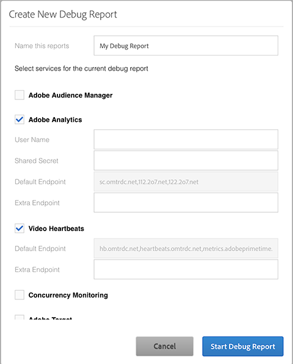

# Creación de un nuevo informe de Debug{#create-a-new-debug-report}

Para crear un nuevo informe de Debug:

1. En [!UICONTROL Crear nuevo informe de Debug], seleccione lo siguiente:

   

1. Complete los campos con la siguiente información:

   * **Asignar un nombre al informe**: Introduzca el nombre y la fecha del reproductor para poder realizar un seguimiento durante la certificación y mantener las marcas y plataformas por separado.
   * **Adobe Analytics**

      * [!UICONTROL Nombre de usuario] y [!UICONTROL Secreto compartido]: Estos campos son opcionales, pero puede agregar sus credenciales de API de servicios web a Adobe Debug para mostrar los nombres de las variables y las configuraciones de variables del grupo de informes.

         Puede acceder de las siguientes maneras:

         * [!UICONTROL Analytics > Administrador > Configuración de la empresa > Servicios web]
         * [!UICONTROL Analytics > Administrador > Administración de usuarios > Usuarios > Configuración de usuario individual] Para crear una credencial de API de servicios web para un nuevo usuario, en [!UICONTROL Administración de usuarios], agregue el usuario al grupo de usuarios **Acceso al servicio web**.
      * [!UICONTROL Punto final por defecto]: Adobe proporciona los datos de este campo y no se pueden cambiar.
      * [!UICONTROL Punto final extra]: Añada `CNAMES` como servidor de seguimiento, si los usa, como `metrics.companyname.com`
   * **Video Heartbeats (Media Analytics)**

      * [!UICONTROL Punto final por defecto]: Adobe proporciona los datos de este campo y no se pueden cambiar.
      * [!UICONTROL Punto final extra]: Añada `CNAMES`, si los usa, para su servidor de seguimiento, es decir, `metrics.companyname.com`.
