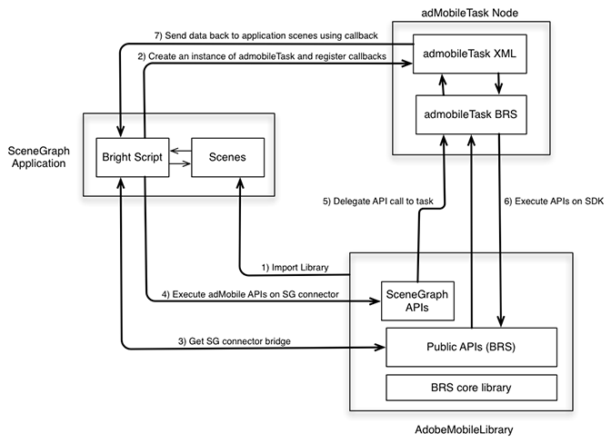

# Seguimiento de Roku en SceneGraph {#tracking-in-scenegraph-roku}

## Primeros pasos {#introduction}

Puede utilizar el marco de programación XML de Roku SceneGraph para desarrollar aplicaciones. Este nuevo marco de trabajo incluye dos nuevos conceptos clave:

* Representación SceneGraph en las pantallas de la aplicación
* Configuración de XML en las pantallas de SceneGraph

El SDK de Adobe Mobile para Roku está escrito en BrightScript. El SDK utiliza muchos componentes que no están disponibles para una aplicación que se ejecuta en SceneGraph (por ejemplo, los subprocesos). Por lo tanto, un desarrollador de aplicaciones Roku que pretenda usar el marco de trabajo de SceneGraph no puede llamar las API de SDK de Adobe Mobile (estas últimas son similares a las que están disponibles en aplicaciones heredadas de BrightScript).

## Arquitectura {#architecture}

Para que SceneGraph sea compatible con el SDK de AdobeMobile, Adobe ha añadido una nueva API que crea un puente de conector entre el SDK AdobeMobile y `adbmobileTask`. Este es un nodo SceneGraph utilizado para ejecutar la API del SDK. (El uso de `adbmobileTask` se explica en detalle en el resto de este documento).

El puente conector está diseñado para funcionar de la siguiente manera:

* El puente devuelve una instancia compatible con SceneGraph del SDK de AdobeMobile. El SDK compatible con SceneGraph tiene todas las API que expone el SDK heredado.
* Las API de SDK de AdobeMobile se usan en SceneGraph de forma muy similar a como se usan las API heredadas.
* El puente también expone un mecanismo para escuchar las llamadas de retorno de las API que arrojan algunos datos.



## Componentes {#components}

**Aplicación SceneGraph:**

* Utiliza las API de `AdobeMobileLibrary` gracias al puente conector con SceneGraph.
* Registra las llamadas de retorno en `adbmobileTask` para las variables de datos de salida esperadas.

**AdobeMobileLibrary:**

* Expone un conjunto de API públicas (heredadas), incluida la API de puente conector.
* Arroja una instancia de conector de SceneGraph que envuelve todas las API públicas heredadas.
* Se comunica con un nodo `adbmobileTask` de SceneGraph para ejecutar las API.

**Nodo adbmobileTask:**

* Nodo de tareas de SceneGraph que ejecuta la API `AdobeMobileLibrary` en un subproceso en segundo plano.
* Sirve como delegado para devolver los datos a la aplicación.

## API de SceneGraph públicas {#public-scenegraph-apis}

### ADBMobileConnector

| Categoría | Nombre del método | Descripción |
|---|---|---|
| **Constantes** | |  |
|  | `sceneGraphConstants` | Devuelve un objeto que contiene `SceneGraphConstants`. Consulte la tabla anterior para obtener más detalles. |
|  | | |
| **Registro de Debug** | | |
|  | `setDebugLogging` | La API de SceneGraph establece el registro de depuración en el SDK de ADBMobile. |
|  | `getDebugLogging` | La API de SceneGraph obtiene el registro de depuración del SDK de ADBMobile. |
|  | Para obtener más información, consulte la sección Depuración del SDK heredado. | |
|  | | |
| **Estado de privacidad/Desactivar** | | |
|  | `setPrivacyStatus` | La API de SceneGraph establece el estado de privacidad en el SDK de ADBMobile. |
|  | `getPrivacyStatus` | La API de SceneGraph obtiene el estado de privacidad del SDK de ADBMobile. |
|  | Para obtener más información, consulte la sección Desactivar/Estado de privacidad del SDK heredado. | |
|  | | |
| **Analytics** | | |
|  | `trackState` | La API de SceneGraph rastrea el estado en el SDK de ADBMobile. |
|  | `trackAction` | La API de SceneGraph rastrea la acción en el SDK de ADBMobile. |
|  | `trackingIdentifier` | La API de SceneGraph obtiene un identificador de seguimiento del SDK de ADBMobile. |
|  | `userIdentifier` | La API de SceneGraph obtiene un identificador de usuario del SDK de ADBMobile. |
|  | `setUserIdentifier` | La API de SceneGraph define el identificador de usuario en el SDK de ADBMobile. |
|  | `getAllIdentifiers` | La API de SceneGraph recupera todas las identidades de usuario conocidas y persistentes por el SDK de Roku. |
|  | Para obtener más información, consulte la sección Analytics del SDK heredado. | |
|  | | |
| **Experience Cloud** | | |
|  | `visitorSyncIdentifiers` | La API de SceneGraph sincroniza los identificadores de Experience Cloud con el SDK de ADBMobile. |
|  | `visitorMarketingCloudID` | La API de SceneGraph obtiene el Experience Cloud ID del visitante del SDK de ADBMobile. |
|  | Para obtener más información, consulte la sección Experience Cloud del SDK heredado. | |
|  | | |
| **Audience Manager** | | |
|  | `audienceSubmitSignal` | La API de SceneGraph envía una señal de gestión de público con rasgo. |
|  | `audienceVisitorProfile` | La API de SceneGraph obtiene un perfil del visitante de Audience Manager del SDK de ADBMobile. |
|  | `audienceDpid` | La API de SceneGraph obtiene una audiencia Dpid del SDK de ADBMobile. |
|  | `audienceDpuuid` | La API de SceneGraph obtiene audiencias Dpuuid del SDK de ADBMobile. |
|  | `audienceSetDpidAndDpuuid` | La API de SceneGraph define la audiencia Dpid y Dpuuid en el SDK de ADBMobile. |
|  | Para obtener más información, consulte la sección Audience Manager del SDK heredado. | |
|  | | |
| **MediaHeartbeat** | | |
|  | `mediaTrackLoad` | La API de SceneGraph carga contenido de vídeo para el seguimiento de MediaHeartbeat. |
|  | mediaTrackStart | La API de SceneGraph inicia la sesión de seguimiento de vídeo mediante MediaHeartbeat. |
|  | `mediaTrackUnload` | La API de SceneGraph descarga contenido de vídeo de seguimiento de MediaHeartbeat. |
|  | `mediaTrackPlay` | La API de SceneGraph rastrea la reproducción del contenido de vídeo. |
|  | mediaTrackPause | La API de SceneGraph rastrea contenido de vídeo pausado. |
|  | `mediaTrackComplete` | La API de SceneGraph rastrea la reproducción completa del contenido de vídeo. |
|  | `mediaTrackError` | La API de SceneGraph rastrea errores de reproducción. |
|  | mediaTrackEvent | La API de SceneGraph rastrea eventos de reproducción durante el seguimiento. Por ejemplo: anuncios, capítulos. |
|  | `mediaUpdatePlayhead` | La API de SceneGraph envía actualizaciones del cabezal de reproducción a MediaHeartbeat durante el seguimiento de vídeos. |
|  | `mediaUpdateQoS` | La API de SceneGraph envía actualizaciones de QoS a MediaHeartbeat durante el seguimiento de vídeos. |
|  | Para obtener más información, consulte la sección MediaHeartbeat del SDK heredado. | |

### SceneGraphConstants

| Nombre de la constante | Descripción |
|---|---|
| `API_RESPONSE` | Se utiliza para recuperar el objeto Response del campo `adbmobileTask` del nodo `adbmobileApiResponse`. |
| `DEBUG_LOGGING` | Se usa como `apiName` para `getDebugLogging` |
| `PRIVACY_STATUS` | Se usa como `apiName` para `getPrivacyStatus` |
| `TRACKING_IDENTIFIER` | Se usa como `apiName` para `trackingIdentifier` |
| `USER_IDENTIFIER` | Se usa como `apiName` para `userIdentifier` |
| `VISITOR_MARKETING_CLOUD_ID` | Se usa como `apiName` para `visitorMarketingCloudID` |
| `AUDIENCE_VISITOR_PROFILE` | Se usa como `apiName` para `audienceVisitorProfile` |
| `AUDIENCE_DPID` | Se usa como `apiName` para `audienceDpid` |
| `AUDIENCE_DPUUID` | Se usa como `apiName` para `audienceDpuuid` |

### Nodo adbmobileTask

<table>
<thead>
<tr>
<td> Campo </td><td> Tipo </td><td> Predeterminado </td><td> Uso </td>
</tr>
</thead>
<tbody>
<tr>
<td> adbmobileApiCall </td>
<td> assocarray </td>
<td> No válido </td>
<td> NO modifique este campo ni deje que la aplicación lo utilice. Este campo lo utiliza el conector ADBMobile SceneGraphConnector para enrutar llamadas API a través de nodos SceneGraph y obtener respuestas. Por lo tanto, esta clave/campo queda reservado para la compatibilidad de AdobeMobileSDK con SceneGraph. <b>Importante:</b> Cualquier modificación en este campo puede hacer que AdobeMobileSDK funcione incorrectamente.</td>
</tr>
<tr>
<td> adbmobileApiResponse </td>
<td> assocarray </td>
<td> No válido </td>
<td> Solo lectura: Todas las API ejecutadas en AdobeMobileSDK devolverán las respuestas en este campo. Regístrese y reciba una llamada de retorno para conocer las actualizaciones de este campo y recibir los objetos de respuesta. A continuación, se muestra el formato del objeto de respuesta:  
<pre>
response = {
  "apiName" : &lt;SceneGraphConstants.
               API_NAME&gt; 
  "returnValue : &lt;API_RESPONSE&gt;
}</pre>
Se enviará una instancia de este objeto Response para cualquier llamada de API en AdobeMobileSDK de la que se espera un valor de retorno conforme a la guía de referencia de la API. Por ejemplo, una llamada API para visitorMarketingCloudID() devolverá el siguiente objeto de respuesta:
<pre>
response = {
  "apiName" : m.
              adbmobileConstants.
              VISITOR_MARKETING_CLOUD_ID  
  "returnValue : "07050x25671x33760x72644x14"  
}
</pre>
O bien, los datos de respuesta podrían no ser válidos:
<pre>
response = {  
  "apiName" : m.
              adbmobileConstants.
              VISITOR_MARKETING_CLOUD_ID  
  "returnValue : invalid
}
</pre>
</td>
</tr>
</tbody>
</table>

### `adbmobile.brs`

#### `getADBMobileConnectorInstance`

Firma de API: `ADBMobile().getADBMobileConnectorInstance()`\
Entrada: `adbmobileTask`
Tipo de devolución: `ADBMobileConnector`

#### `sgConstants`

Firma de API: `ADBMobile().sgConstants()`
Entrada: Ninguno\
Tipo de devolución: `SceneGraphConstants`

>[!NOTE]
>Consulte la referencia API de `ADBMobileConnector` para obtener más detalles.

### Constantes ADBMobile

|  Función  | Nombre de la constante | Descripción   |
|---|---|---|
| Versiones | `version` | Constante para recuperar la información de versión de AdobeMobileLibrary. |
| Privacidad/exclusión | `PRIVACY_STATUS_OPT_IN` | Constante para el estado de privacidad activada. |
|   | `PRIVACY_STATUS_OPT_OUT` | Constante para el estado de privacidad desactivada. |
| Constantes de MediaHeartbeat | Consulte las constantes de esta página: <br/><br/>[Métodos de Heartbeat para contenido multimedia.](/help/use-cases/track-av-playback/track-core/track-core-roku.md) | Utilice estas constantes con las API de MediaHeartbeat. |
| Metadatos estándar | Consulte las constantes de esta página: <br/><br/>[Parámetros de metadatos estándar.](/help/use-cases/track-av-playback/impl-std-metadata/impl-std-metadata-roku.md) | Utilice estas constantes para asociar metadatos de vídeo/publicidad estándar a las API de MediaHeartbeat. |


Las API de `MediaHeartbeat` de utilidades definidas globalmente en el archivo AdobeMobileLibrary heredado son accesibles *tal como se encuentran* en el entorno de SceneGraph porque no utilizan componentes Brightscript que no estén en los nodos SceneGraph. Para obtener más información sobre estos métodos, consulte la siguiente tabla:

### Métodos globales para MediaHeartbeat

| Método | Descripción |
| --- | --- |
| `adb_media_init_mediainfo` | Este método devuelve un objeto de información multimedia inicializado. `Function adb_media_init_mediainfo(name As String, id As String, length As Double, streamType As String) As Object` |
| `adb_media_init_adinfo` | Este método devuelve el objeto de información de publicidad inicializado. `Function adb_media_init_adinfo(name As String, id As String, position As Double, length As Double) As Object` |
| `adb_media_init_chapterinfo` | Este método devuelve el objeto de información del capítulo inicializado. `Function adb_media_init_adbreakinfo(name As String, startTime as Double, position as Double) As Object` |
| `adb_media_init_adbreakinfo` | Este método devuelve el objeto de información de AdBreak inicializado. `Function adb_media_init_chapterinfo(name As String, position As Double, length As Double, startTime As Double) As Object` |
| `adb_media_init_qosinfo` | Este método devuelve un objeto de información de QoS inicializado. `Function adb_media_init_qosinfo(bitrate As Double, startupTime as Double, fps as Double, droppedFrames as Double) As Object` |

## Implementación {#implementation}

1. **Descargue la biblioteca Roku:** Descargue la [última biblioteca Roku.](https://github.com/Adobe-Marketing-Cloud/media-sdks/releases/tag/roku-v2.2.2)

1. **Configurar el entorno de desarrollo**

   1. Copie `adbmobile.brs` (AdobeMobileLibrary) en su directorio `pkg:/source/`.

   1. Para la compatibilidad con SceneGraph, copie `adbmobileTask.brs` y `adbMobileTask.xml` en el directorio `pkg:/components/`.

1. **Inicializar**

   1. Importe `adbmobile.brs` en la escena.

      ```
      <script type="text/brightscript" uri="pkg:/source/adbmobile.brs" />
      ```

   1. Cree una instancia del nodo `adbmobileTask` en la escena.

      ```
      m.adbmobileTask = createObject("roSGNode", "adbmobileTask")
      ```

   1. Obtenga una instancia del conector `adbmobile` para SceneGraph con la instancia de `adbmobileTask`.

      ```
      m.adbmobile = ADBMobile().getADBMobileConnectorInstance(m.adbmobileTask)
      ```

   1. Obtenga constantes SG de `adbmobile`.

      ```
      m.adbmobileConstants = m.adbmobile.sceneGraphConstants()
      ```

   1. Registre una llamada de retorno para recibir un objeto Response para todas las llamadas a la API `AdbMobile`.

      ```
      m.adbmobileTask.ObserveField(m.adbmobileConstants.API_RESPONSE,  
                                   "onAdbmobileApiResponse")
      
      ' Sample implementation of the callback
      ' Listen for all the constants for which API calls are made on the SDK
      function onAdbmobileApiResponse() as void
          responseObject = m.adbmobileTask[m.adbmobileConstants.API_RESPONSE]
      
          if responseObject <> invalid
              methodName = responseObject.apiName
              retVal = responseObject.returnValue
      
              if methodName = m.adbmobileConstants.DEBUG_LOGGING
                  if retVal
                      print "API Response: DEBUG LOGGING: " + "True"
                  else
                      print "API Response: DEBUG LOGGING: " + "False"
                  endif
              else if methodName = m.adbmobileConstants.PRIVACY_STATUS
                  print "API Response: PRIVACY STATUS: " + retVal
              else if methodName = m.adbmobileConstants.TRACKING_IDENTIFIER
                  if retVal <> invalid
                      print "API Response: TRACKING IDENTIFIER: " + retVal
                  else
                      print "API Response: TRACKING IDENTIFIER: " + "invalid"
                  endif
              else if methodName = m.adbmobileConstants.USER_IDENTIFIER
                  if retVal <> invalid
                      print "API Response: USER IDENTIFIER: " + retVal
                  else
                      print "API Response: USER IDENTIFIER: " + "invalid"
                  endif
              else if methodName = m.adbmobileConstants.VISITOR_MARKETING_CLOUD_ID
                  if retVal <> invalid
                      print "API Response: MCID: " + retVal
                  else
                      print "API Response: MCID: " + "invalid"
                  endif
              else if methodName = m.adbmobileConstants.AUDIENCE_DPID
                  if retVal <> invalid
                      print "API Response: AUDIENCE DPID: " + retVal
                  else
                      print "API Response: AUDIENCE DPID: " + "invalid"
                  endif
              else if methodName = m.adbmobileConstants.AUDIENCE_DPUUID
                  if retVal <> invalid
                      print "API Response: AUDIENCE DPUUID: " + retVal
                  else
                      print "API Response: AUDIENCE DPUUID: " + "invalid"
                  endif
              else if methodName = m.adbmobileConstants.AUDIENCE_VISITOR_PROFILE
                  if retVal <> invalid
                      print "API Response: AUDIENCE VISITOR PROFILE: Valid Object"
                  else
                      print "API Response: AUDIENCE VISITOR PROFILE: " + "invalid"
                  endif
              endif
          endif
      end function
      ```

## Implementación de muestra {#sample-implementation}

### Llamadas de API de muestra en el SDK heredado

```
'get an instance of SDK
m.adbmobile = ADBMobile()

'execute setter APIs
m.adbmobile.setDebugLogging(true)

'execute getter APIs
debugLogging = m.adbmobile.getDebugLogging()
```

### Ejemplo de llamadas de API en SG SDK

```
'create adbmobileTask instance
m.adbmobileTask = createObject("roSGNode", "adbmobileTask")

'get an instance of SDK using task instance
m.adbmobile =  
  ADBMobile().getADBMobileConnectorInstace(m.adbmobileTask)
m.adbmobileConstants = m.adbmobile.sceneGraphConstants()
'execute setter APIs
m.adbmobile.setDebugLogging(true)

'execute getter APIs
m.adbmobileTask.ObserverField(m.adbConstants.API_RESPONSE,  
                              "onAdbmobileApiResponse")
m.adbmobile.getDebugLogging()

'listen for return data in registered callbacks
function onAdbmobileApiResponse() as void
    responseObject = m.adbmobileTask[m.adbmobileConstants.API_RESPONSE]

        if responseObject <> invalid
            methodName = responseObject.apiName
            retVal = responseObject.returnValue

        if methodName = m.adbmobileConstants.DEBUG_LOGGING
            if retVal
                print "API Response: DEBUG LOGGING: " + "True"
            else
                print "API Response: DEBUG LOGGING: " + "False"
         endif
    endif
end function
```
