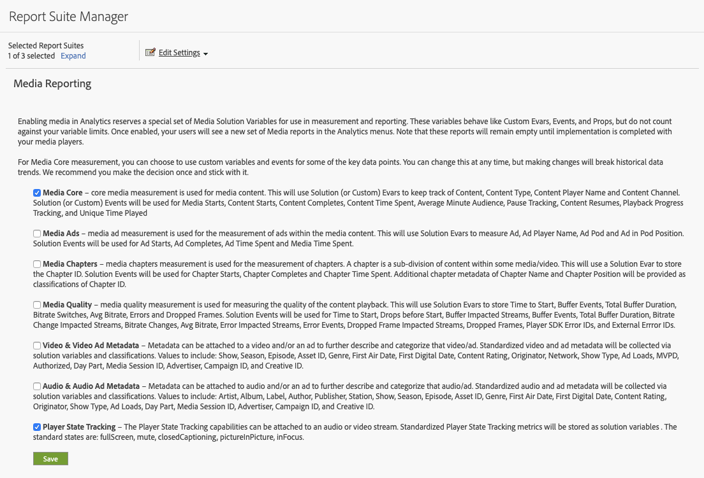
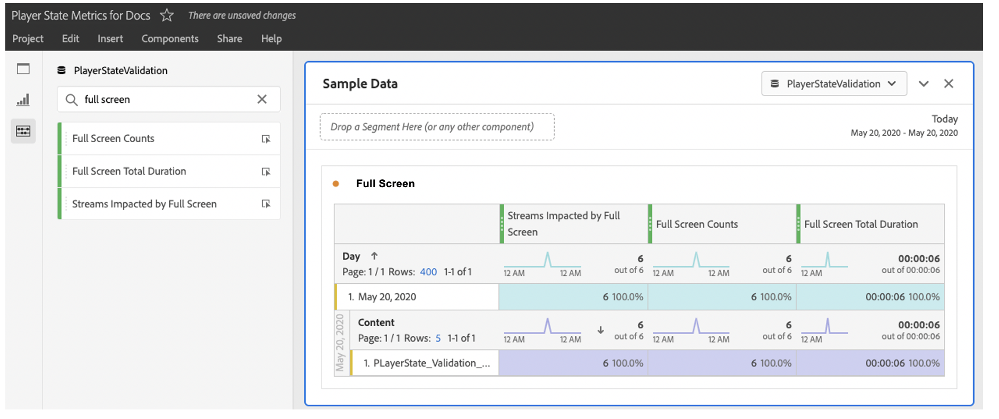

# Implementación y sistema de informes

Durante una sesión de reproducción, se debe realizar un seguimiento individual de cada incidencia de estado (de principio a fin). Media SDK y la API de Media Collection proporcionan métodos de seguimiento para esta capacidad.

Media SDK incluye dos métodos para el seguimiento de estado personalizado:

`trackStateStart("state_name")`

`trackStateClose("state_name")`


La API de Media Collection incluye dos eventos que tienen `media.stateName` como parámetro obligatorio:

`stateStart` y `stateEnd`

## Implementación de Media SDK

Inicios de estado del reproductor

```
// StateStart (ex: Mute is switched on)
var stateObject = ADB.Media.createStateObject(ADB.Media.PlayerState.Mute);
tracker.trackEvent(ADB.Media.Event.StateStart, stateObject);
```

Finalización del estado del reproductor

```
// StateEnd (ex: Mute is switched off)
tracker.trackEvent(ADB.Media.Event.StateEnd, stateObject);
```


## Implementación de la API de Media Collection

Inicios de estado del reproductor

```
// StateStart (ex: Mute is switched on)
http(s)://<Analytics_Visitor_Namespace>.hb-api.omtrdc.net/api/v1/sessions/<SID>/events
{
  "eventType": "stateStart",
  "params": {
    "media.state.name": "mute"
  },
  "playerTime": {
    "playhead": 0,
    "ts": 1569999130627
  }
}
```

Finalización del estado del reproductor

```
// StateEnd (ex: Mute is switched off)
http(s)://<Analytics_Visitor_Namespace>.hb-api.omtrdc.net/api/v1/sessions/<SID>/events

{
  "eventType": "stateEnd",
  "params": {
    "media.state.name": "mute"
  },
  "playerTime": {
    "playhead": 600,
    "ts": 1569999730638
  }
}
```

## Métricas de estado

Las métricas proporcionadas para cada estado individual se calculan y transfieren a Adobe Analytics como parámetros de datos de contexto y se almacenan para el sistema de informes. Hay tres métricas disponibles para cada estado:

* `a.media.states.[state.name].set = true` — Se establece en true si el estado se estableció al menos una vez por cada reproducción específica de una transmisión.
* `a.media.states.[state.name].count = 4` — Identifica el número de ocurrencias de un estado durante cada reproducción individual de una transmisión.
* `a.media.states.[state.name].time = 240` — Identifica la duración total del estado en segundos por cada reproducción individual de una transmisión.

## Creación de informes

Todas las métricas de estado del reproductor se pueden utilizar para cualquier visualización de creación de informes disponible en Analysis Workspace o en un componente (segmento, métricas calculadas) una vez que un grupo de informes esté habilitado para el seguimiento de estado del reproductor. Estas métricas se pueden habilitar desde Admin Console para cada informe individual mediante la configuración de creación de informes de medios (Editar configuración > Administración de medios > Creación de informes de medios).



En Analysis Workspace, todas las propiedades nuevas se encuentran en el panel de métricas. Por ejemplo, puede buscar por `full screen` para ver los datos de pantalla completa en el panel de métricas.



## Importación de métricas declaradas por el reproductor a Adobe Experience Platform

Los datos almacenados en Analytics se pueden usar para cualquier fin y las métricas del estado del reproductor se pueden importar en Adobe Experience Platform mediante XDM y se pueden usar con Customer Journey Analytics. Las propiedades de estado estándar tienen propiedades específicas, mientras que los estados personalizados son propiedades disponibles mediante los eventos personalizados.
