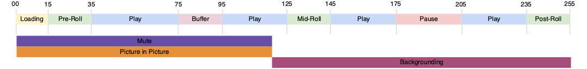

# Seguimiento de varios estados de reproductor

A veces, dos estados de reproductor comienzan y finalizan al mismo tiempo, o el principio de uno es también el inicio de otro, como se muestra en la siguiente imagen:



La implementación actual permite ambas situaciones:
- `stateStart(pictureInPicture)` - t0
- `stateStart(mute)` - t0
- `stateEnd(mute)` - t1
- `stateEnd(pictureInPicture)` - t1
- `stateStart(fullScreen)` - t1
- `stateEnd(fullScreen)` - t2

Sin embargo, esto requiere que emita varios eventos `stateStart` y `stateEnd` para indicar múltiples cambios de estado simultáneos. Entrada
para optimizar este comportamiento común, se ha implementado un nuevo tipo de evento `statesUpdate`, que finaliza una lista de estados
e inicia una lista de nuevos estados.

Con el nuevo evento `statesUpdate`, la lista anterior de eventos se convierte en lo siguiente:
- `statesUpdate(statesEnd=[], statesStart=[pictureInPicture, mute])` - t0
- `statesUpdate(statesEnd=[mute, pictureInPicture], statesStart=[fullScreen])` - t1
- `statesUpdate(statesEnd=[fullScreen], statesStart=[])` - t2

El número de llamadas de actualización de estado se ha reducido de seis a tres para el mismo comportamiento. El último evento
también podría haber sido un simple `stateEnd(fullScreen)`.

## Implementación de la API de Media Collection {#mpst-api}

Puede utilizar la API de recopilación de medios para implementar el seguimiento de varios estados de reproductor.

### Ejemplo

A continuación se muestra un ejemplo de implementación de la API de recopilación de medios para el seguimiento de varios estados de reproductor.

```
// statesUpdate (ex: mute and pictureInPicture are switched on)
http(s)://<Analytics_Visitor_Namespace>.hb-api.omtrdc.net/api/v1/sessions/<SID>/events
{
  "eventType": "statesUpdate",
  "params": {
    "statesStart": [
      {
        "media.state.name": "mute"
      },
      {
        "media.state.name": "pictureInPicture"
      }
    ]
  },
  "playerTime": {
    "playhead": 0,
    "ts": 1569999130627
  }
}
```

```
// statesUpdate (ex: mute and pictureInPicture are switched off, fullScreen is switched on)
http(s)://<Analytics_Visitor_Namespace>.hb-api.omtrdc.net/api/v1/sessions/<SID>/events
{
  "eventType": "statesUpdate",
  "params": {
    "statesEnd": [
      {
        "media.state.name": "mute"
      },
      {
        "media.state.name": "pictureInPicture"
      }
    ],
    "statesStart": [
      {
        "media.state.name": "fullScreen"
      }
    ]
  },
  "playerTime": {
    "playhead": 0,
    "ts": 1569999130627
  }
}
```

```
// statesUpdate (ex: fullScreen is switched off)
http(s)://<Analytics_Visitor_Namespace>.hb-api.omtrdc.net/api/v1/sessions/<SID>/events
{
  "eventType": "statesUpdate",
  "params": {
    "statesEnd": [
      {
        "media.state.name": "fullScreen"
      }
    ]
  },
  "playerTime": {
    "playhead": 0,
    "ts": 1569999130627
  }
}
```

## Implementación de Media SDK

No hay ninguna implementación del SDK de medios.
