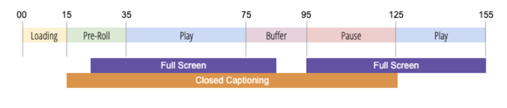

# Acerca del seguimiento del estado de reproducción

Para optimizar la experiencia del producto y aumentar el valor para su empresa, es importante comprender el comportamiento del cliente cuando ve los vídeos. Esto incluye el tiempo empleado en diferentes estados del reproductor.  También es importante tener la flexibilidad de crear y medir nuevos estados y eventos del reproductor según sea necesario.

El seguimiento de estado del reproductor ofrece la capacidad de capturar la interacción del visor durante la reproducción mediante un conjunto estándar de variables de solución para pantalla completa, subtítulos, silenciar, imagen en imagen y enfocado.  El seguimiento de estado del reproductor también proporciona la flexibilidad para crear estados de reproductor personalizados. Puede utilizar las variables de seguimiento de estado del reproductor para la creación de informes en Analysis Workspace.

Para capturar los cambios en el estado del reproductor, el seguimiento de estado del reproductor actualiza los metadatos de medición de vídeo. Por ejemplo, para determinar la participación “true” en el vídeo, el seguimiento de estado del reproductor mide el tiempo empleado con el sonido en comparación con las vistas de vídeo pasivas o no comprometidas cuando el sonido está desactivado o el tiempo empleado en el modo Normal frente al modo de Pantalla completa.

El seguimiento del estado del reproductor ofrece las siguientes ventajas:

* Proporciona variables estándar que miden estados comunes como pantalla completa o subtítulos
* Proporciona variables personalizables para medir estados personalizados durante una sesión de reproducción
* Mide el tiempo empleado en un estado de reproductor personalizado
* Mide varios estados que pueden ser simultáneos

## Requisitos

El seguimiento de estado del reproductor requiere una de las siguientes opciones para la recopilación de datos:
* Media JS SDK 3.0+
* SDK de Chromecast 3.0 para las soluciones de Adobe Marketing Cloud
* Extensión de Media Analytics (para uso con los SDK de Adobe Experience Platform (AEP))
   * Web: Adobe Media Analytics (SDK 3.x) para audio y vídeo v1.0 o posterior
   * Móvil: extensión de Adobe Media Analytics para audio y vídeo versión 2.0 o posterior
* API de Media Collection

## Directrices

Antes de implementar el seguimiento de estado del reproductor, considere las siguientes pautas.

* El estado del reproductor se calcula en todos los estados de reproducción (sin división).
* Puede medir varios estados de reproductor al mismo tiempo.
* La cantidad máxima de estados del reproductor que se pueden rastrear durante una reproducción es de 10.
* Las métricas de estado del reproductor se envían a Analytics para sistema de informes solo en la llamada de cierre de medios.
* El conocimiento del estado de la aplicación no se mantiene una vez que se detiene un estado. Una vez finalizado el estado, este debe volver a iniciarse para continuar con el seguimiento. Para cada nuevo estado de reproducción, se debe volver a iniciar el estado del reproductor.
* Los estados del reproductor se capturan para cada sesión de reproducción individual; el estado del reproductor no se calcula entre reproducciones.
