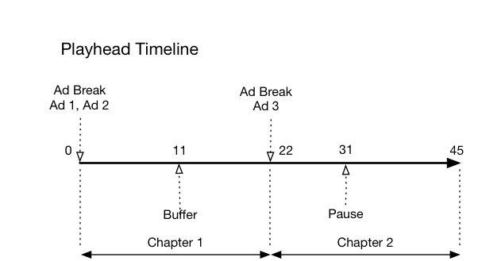
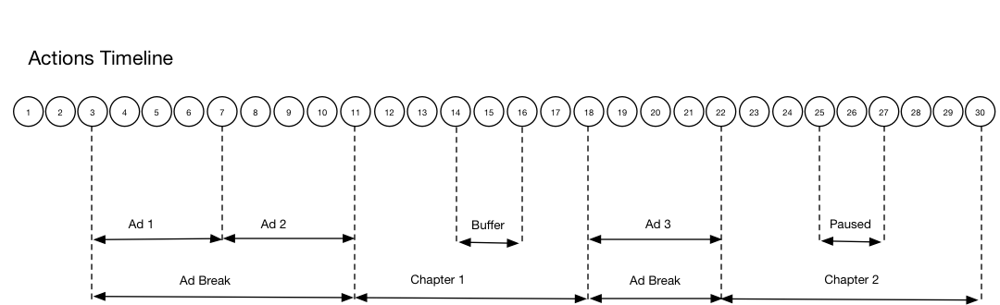

# Cronología: Capítulos {#timeline-3-chapters}

## VOD, anuncios pre-roll, pausar, almacenar en búfer, ver contenido hasta el final

Los siguientes diagramas ilustran la cronología del cabezal de reproducción y la cronología correspondiente de las acciones de un usuario. A continuación se presentan los detalles de cada acción y sus solicitudes correspondientes.





## Detalles de la acción

### Acción 1: inicio de la sesión {#Action-1}

| Acción | Cronología de acción (segundos) | Posición del cabezal de reproducción (segundos) | Solicitud de cliente |
| --- | :---: | :---: | --- |
| Se presiona el botón de reproducción o reproducción automática, y el vídeo se empieza a cargar. | 0 | 0 | `/api/v1/sessions` |

Esta llamada indica _la intención del usuario de reproducir_ un vídeo. Devuelve un ID de sesión (`{sid}`) al cliente que se utiliza para identificar todas las llamadas de seguimiento subsiguientes dentro de la sesión. El estado del reproductor no es &quot;reproduciendo&quot;, sino &quot;comenzando&quot;.  Los parámetros de sesión obligatorios deben incluirse en el mapa de `params` en la solicitud.  En el servidor, esta llamada genera una llamada de inicio a Adobe Analytics. Para obtener información sobre las sesiones, consulte la documentación de la API de recopilación de medios.

```json
{
    "playerTime": {
        "playhead": 0,
        "ts": "<timestamp>"
    },
    "eventType": "sessionStart",
    "params": {
        "media.playerName": "sample-html5-api-player",
        "analytics.trackingServer": "[ _YOUR-TS_ ]",
        "analytics.reportSuite": "[ _YOUR_RSID_ ]",
        "analytics.visitorId": "[ _YOUR_VISITOR_ID_ ]",
        "media.contentType": "VOD",
        "media.length": 60.3333333333333,
        "media.id": "VA API Sample Player",
        "visitor.marketingCloudOrgId": "[YOUR_MCID]",
        "media.name": "ClickMe",
        "media.channel": "sample-channel",
        "media.sdkVersion": "va-api-0.0.0",
        "analytics.enableSSL": false
    }
}
```

### Acción 2: se inicia el temporizador de ping {#Action-2}

| Acción | Cronología de acción (segundos) | Posición del cabezal de reproducción (segundos) | Solicitud de cliente |
| --- | :---: | :---: | --- |
| La aplicación inicia el temporizador de eventos de ping | 0 | 0 |  |

Inicie el temporizador de ping. El primer evento de ping debe activarse en el primer segundo si hay anuncios previos a la emisión y en los 10 primeros segundos en caso contrario.

### Acción 3: inicio de la pausa publicitaria {#Action-3}

| Acción | Cronología de acción (segundos) | Posición del cabezal de reproducción (segundos) | Solicitud de cliente |
| --- | :---: | :---: | --- |
| Rastrear inicio de pausa del anuncio previo a la emisión | 0 | 0 | `/api/v1/sessions/{sid}/events` |

Los anuncios solo se pueden rastrear durante una pausa publicitaria.

```json
{
    "playerTime": {
        "playhead": 0,
        "ts": "<timestamp>"
    },
    "eventType": "adBreakStart",
    "params": {
        "media.ad.podFriendlyName": "ad_pod1",
        "media.ad.podIndex": 0, "media.ad.podSecond": 0
    }
}
```

### Acción 4: inicio del anuncio {#Action-4}

| Acción | Cronología de acción (segundos) | Posición del cabezal de reproducción (segundos) | Solicitud de cliente |
| --- | :---: | :---: | --- |
| Rastrear inicio del anuncio previo a la emisión n.º 1 | 0 | 0 | `/api/v1/sessions/{sid}/events` |

Comience a rastrear el primer anuncio pre-roll, que dura 15 segundos. Incluir metadatos personalizados con `adStart` .

```json
{
    "playerTime": {
        "playhead": 0,
        "ts": "<timestamp>"
    },
    "eventType": "adStart",
    "params": {
        "media.ad.podFriendlyName": "ad_pod1",
        "media.ad.name": "Ad 1",
        "media.ad.id": "001",
        "media.ad.length": 15,
        "media.ad.podPosition": 1,
        "media.ad.playerName": "Sample Player",
        "media.ad.advertiser": "Ad Guys",
        "media.ad.campaignId": "1",
        "media.ad.creativeId": "42",
        "media.ad.siteId": "XYZ",
        "media.ad.creativeURL": "https://example.com",
        "media.ad.placementId": "sample_placement"
    },
    "customMetadata": {
        "myCustomData1": "CustomData1",
        "myCustomData2": "CustomData2"
    }
}
```

### Acción 5: pings de anuncios {#Action-5}

| Acción | Cronología de acción (segundos) | Posición del cabezal de reproducción (segundos) | Solicitud de cliente |
| --- | :---: | :---: | --- |
| La aplicación envía eventos de ping | 10 | 0 | `/api/v1/sessions/{sid}/events` |

Mandar un ping al servidor cada segundo. (Los pings de anuncios posteriores no se muestran en interés de la brevedad).

```json
{
    "playerTime": {
        "playhead": 0,
        "ts": "<timestamp>"
    },
    "eventType": "ping"
}
```

### Acción 6: anuncio completo {#Action-6}

| Acción | Cronología de acción (segundos) | Posición del cabezal de reproducción (segundos) | Solicitud de cliente |
| --- | :---: | :---: | --- |
| Rastrear finalización del anuncio previo a la emisión n.º 1 | 15 | 0 | `/api/v1/sessions/{sid}/events` |

Rastrear el final del primer anuncio previo a la emisión.

```json
{
    "playerTime": {
        "playhead": 0,
        "ts": "<timestamp>"
    },
    "eventType": "adComplete"
}
```

### Acción 7: inicio del anuncio {#Action-7}

| Acción | Cronología de acción (segundos) | Posición del cabezal de reproducción (segundos) | Solicitud de cliente |
| --- | :---: | :---: | --- |
| Rastrear inicio del anuncio previo a la emisión n.º 2 | 15 | 0 | `/api/v1/sessions/{sid}/events` |

Realice un seguimiento del inicio del segundo anuncio previo a la emisión, que dura 7 segundos.

```json
{
    "playerTime": {
        "playhead": 0,
        "ts": "<timestamp>"
    },
    "eventType": "adStart",
    "params": {
        "media.ad.podFriendlyName": "ad_pod1",
        "media.ad.name": "Ad 2",
        "media.ad.id": "002",
        "media.ad.length": 7,
        "media.ad.podPosition": 1,
        "media.ad.playerName": "Sample Player",
        "media.ad.advertiser": "Ad Guys",
        "media.ad.campaignId": "2",
        "media.ad.creativeId": "44",
        "media.ad.siteId": "XYZ",
        "media.ad.creativeURL": "https://example.com",
        "media.ad.placementId": "sample_placement2"
    },
}
```

### Acción 8: pings de anuncios {#Action-8}

| Acción | Cronología de acción (segundos) | Posición del cabezal de reproducción (segundos) | Solicitud de cliente |
| --- | :---: | :---: | --- |
| La aplicación envía eventos de ping | 16 | 0 | `/api/v1/sessions/{sid}/events` |

Mandar un ping al servidor cada segundo. (Los pings de anuncios posteriores no se muestran en interés de la brevedad).

```json
{
    "playerTime": {
        "playhead": 0,
        "ts": "<timestamp>"
    },
    "eventType": "ping"
}
```

### Acción 9: anuncio completo {#Action-9}

| Acción | Cronología de acción (segundos) | Posición del cabezal de reproducción (segundos) | Solicitud de cliente |
| --- | :---: | :---: | --- |
| Rastrear finalización del anuncio previo a la emisión n.º 2 | 22 | 0 | `/api/v1/sessions/{sid}/events` |

Rastrear el final del segundo anuncio previo a la emisión.

```json
{
    "playerTime": {
        "playhead": 0,
        "ts": "<timestamp>"
    },
    "eventType": "adComplete"
}
```

### Acción 10: pausa publicitaria completa {#Action-10}

| Acción | Cronología de acción (segundos) | Posición del cabezal de reproducción (segundos) | Solicitud de cliente |
| --- | :---: | :---: | --- |
| Rastrear finalización de pausa del anuncio previo a la emisión | 22 | 0 | `/api/v1/sessions/{sid}/events` |

Terminó la pausa publicitaria. Durante la pausa publicitaria, el estado de reproducción ha permanecido en &quot;jugando&quot;.

```json
{
    "playerTime": {
        "playhead": 0,
        "ts": "<timestamp>"
    },
    "eventType": "adBreakComplete"
}
```

### Acción 11: reproducir contenido {#Action-11}

| Acción | Cronología de acción (segundos) | Posición del cabezal de reproducción (segundos) | Solicitud de cliente |
| --- | :---: | :---: | --- |
| Rastrear el evento de reproducción | 22 | 0 | `/api/v1/sessions/{sid}/events` |

Tras el evento `adBreakComplete`, ponga el reproductor en el estado “reproduciendo” utilizando el evento `play`.

```json
{
    "playerTime": {
        "playhead": 0,
        "ts": "<timestamp>"
    },
    "eventType": "play"
}
```

### Acción 12: inicio del capítulo {#Action-12}

| Acción | Cronología de acción (segundos) | Posición del cabezal de reproducción (segundos) | Solicitud de cliente |
| --- | :---: | :---: | --- |
| Rastrear evento de inicio de capítulos | 23 | 1 | `/api/v1/sessions/{sid}/events` |

Tras el evento Reproducir, realice un seguimiento del principio del primer capítulo.

```json
{
    "playerTime": {
        "playhead": 0,
        "ts": "<timestamp>"
    },
    "eventType": "chapterStart",
    "params": {
        "media.chapter.index": 1,
        "media.chapter.offset": 0, "media.chapter.length": 20, "media.chapter.friendlyName": "Chapter Uno"
    },
}
```

### Acción 13: ping {#Action-13}

| Acción | Cronología de acción (segundos) | Posición del cabezal de reproducción (segundos) | Solicitud de cliente |
| --- | :---: | :---: | --- |
| La aplicación envía eventos de ping | 30 | 8 | `/api/v1/sessions/{sid}/events` |

Mandar un ping al servidor cada 10 segundos.

```json
{
    "playerTime": {
        "playhead": 8,
        "ts": "<timestamp>"
    },
    "eventType": "ping"
}
```

### Acción 14: inicio del búfer {#Action-14}

| Acción | Cronología de acción (segundos) | Posición del cabezal de reproducción (segundos) | Solicitud de cliente |
| --- | :---: | :---: | --- |
| Se produjo el evento de inicio del búfer | 33 | 11 | `/api/v1/sessions/{sid}/events` |

Rastree el movimiento al estado “almacenamiento en búfer”.

```json
{
    "playerTime": {
        "playhead": 11,
        "ts": "<timestamp>"
    },
    "eventType": "bufferStart"
}
```

### Acción 15: fin del búfer (reproducción) {#Action-15}

| Acción | Cronología de acción (segundos) | Posición del cabezal de reproducción (segundos) | Solicitud de cliente |
| --- | :---: | :---: | --- |
| El almacenamiento en búfer ha finalizado, la aplicación rastrea la reanudación del contenido | 36 | 11 | `/api/v1/sessions/{sid}/events` |

El almacenamiento en búfer finaliza después de 3 segundos, por lo que el reproductor vuelve al estado &quot;reproduciendo&quot;. Debe enviar otro evento de seguimiento de reproducción cuando termine el almacenamiento en búfer.  **La llamada `play` después de `bufferStart` infiere una llamada “bufferEnd” al back end**, por lo que no es necesario un evento `bufferEnd`.

```json
{
    "playerTime": {
        "playhead": 11,
        "ts": "<timestamp>"
    },
    "eventType": "play"
}
```

### Acción 16: ping {#Action-16}

| Acción | Cronología de acción (segundos) | Posición del cabezal de reproducción (segundos) | Solicitud de cliente |
| --- | :---: | :---: | --- |
| La aplicación envía eventos de ping | 40 | 15 | `/api/v1/sessions/{sid}/events` |

Mandar un ping al servidor cada 10 segundos.

```json
{
    "playerTime": {
        "playhead": 15,
        "ts": "<timestamp>"
    },
    "eventType": "ping"
}
```

### Acción 17: fin del capítulo {#Action-17}

| Acción | Cronología de acción (segundos) | Posición del cabezal de reproducción (segundos) | Solicitud de cliente |
| --- | :---: | :---: | --- |
| La aplicación rastrea el fin del capítulo | 45 | 20 | `/api/v1/sessions/{sid}/events` |

El primer capítulo termina justo antes de la segunda pausa publicitaria.

```json
{
    "playerTime": {
        "playhead": 20,
        "ts": "<timestamp>"
    },
    "eventType": "chapterComplete"
}
```

### Acción 18: inicio de la pausa publicitaria {#Action-18}

| Acción | Cronología de acción (segundos) | Posición del cabezal de reproducción (segundos) | Solicitud de cliente |
| --- | :---: | :---: | --- |
| Rastrear inicio de pausa del anuncio durante la emisión | 46 | 21 | `/api/v1/sessions/{sid}/events` |

Anuncio durante la emisión de 8 segundos: enviar `adBreakStart`.

```json
{
    "playerTime": {
        "playhead": 21,
        "ts": "<timestamp>"
    },
    "eventType": "adBreakStart",
    "params": {
        "media.ad.podFriendlyName": "ad_pod2",
        "media.ad.podIndex": 1, "media.ad.podSecond": 21
    }
}
```

### Acción 19: inicio del anuncio {#Action-19}

| Acción | Cronología de acción (segundos) | Posición del cabezal de reproducción (segundos) | Solicitud de cliente |
| --- | :---: | :---: | --- |
| Rastrear inicio del anuncio durante la emisión n.º 3 | 46 | 21 | `/api/v1/sessions/{sid}/events` |

Seguimiento del anuncio durante la emisión.

```json
{
    "playerTime": {
        "playhead": 21,
        "ts": "<timestamp>"
    },
    "eventType": "adStart",
    "params": {
        "media.ad.podFriendlyName": "ad_pod2",
        "media.ad.name": "Ad 3",
        "media.ad.id": "003",
        "media.ad.length": 8,
        "media.ad.podPosition": 2,
        "media.ad.playerName": "Sample Player",
        "media.ad.advertiser": "Ad Guys",
        "media.ad.campaignId": "7",
        "media.ad.creativeId": "40",
        "media.ad.siteId": "XYZ",
        "media.ad.creativeURL": "https://example.com",
        "media.ad.placementId": "sample_placement2"
    },
}
```

### Acción 20: pings de anuncios {#Action-20}

| Acción | Cronología de acción (segundos) | Posición del cabezal de reproducción (segundos) | Solicitud de cliente |
| --- | :---: | :---: | --- |
| La aplicación envía eventos de ping | 47 | 21 | `/api/v1/sessions/{sid}/events` |

Mandar un ping al servidor cada segundo. (Los pings de anuncios posteriores no se muestran en interés de la brevedad).

```json
{
    "playerTime": {
        "playhead": 21,
        "ts": "<timestamp>"
    },
    "eventType": "ping"
}
```

### Acción 21: anuncio completo {#Action-21}

| Acción | Cronología de acción (segundos) | Posición del cabezal de reproducción (segundos) | Solicitud de cliente |
| --- | :---: | :---: | --- |
| Rastrear finalización del anuncio durante la emisión n.º 1 | 54 | 21 | `/api/v1/sessions/{sid}/events` |

El anuncio durante la emisión ha finalizado.

```json
{
    "playerTime": {
        "playhead": 21,
        "ts": "<timestamp>"
    },
    "eventType": "adComplete"
}
```

### Acción 22: pausa publicitaria completa {#Action-22}

| Acción | Cronología de acción (segundos) | Posición del cabezal de reproducción (segundos) | Solicitud de cliente |
| --- | :---: | :---: | --- |
| Rastrear finalización de pausa del anuncio durante la emisión | 54 | 21 | `/api/v1/sessions/{sid}/events` |

Se ha completado la pausa publicitaria.

```json
{
    "playerTime": {
        "playhead": 21,
        "ts": "<timestamp>"
    },
    "eventType": "adBreakComplete"
}
```

### Acción 23: inicio del capítulo {#Action-23}

| Acción | Cronología de acción (segundos) | Posición del cabezal de reproducción (segundos) | Solicitud de cliente |
| --- | :---: | :---: | --- |
| Rastrear inicio del capítulo 2 | 55 | 22 | `/api/v1/sessions/{sid}/events` |


```json
{
    "playerTime": {
        "playhead": 22,
        "ts": "<timestamp>"
    },
    "eventType": "chapterStart",
    "params": {
        "media.chapter.index": 2,
        "media.chapter.offset": 22, "media.chapter.length": 22, "media.chapter.friendlyName": "Chapter Dos"
    },
}
```

### Acción 24: ping {#Action-24}

| Acción | Cronología de acción (segundos) | Posición del cabezal de reproducción (segundos) | Solicitud de cliente |
| --- | :---: | :---: | --- |
| La aplicación envía eventos de ping | 60 | 27 | `/api/v1/sessions/{sid}/events` |

Mandar un ping al servidor cada 10 segundos.

```json
{
    "playerTime": {
        "playhead": 27,
        "ts": "<timestamp>"
    },
    "eventType": "ping"
}
```

### Acción 25: pausa {#Action-25}

| Acción | Cronología de acción (segundos) | Posición del cabezal de reproducción (segundos) | Solicitud de cliente |
| --- | :---: | :---: | --- |
| El usuario pulsó Pausa | 64 | 31 | `/api/v1/sessions/{sid}/events` |

La acción del usuario cambia el estado de reproducción a “en pausa”.

```json
{
    "playerTime": {
        "playhead": 31,
        "ts": "<timestamp>"
    },
    "eventType": "pauseStart"
}
```

### Acción 26: ping {#Action-26}

| Acción | Cronología de acción (segundos) | Posición del cabezal de reproducción (segundos) | Solicitud de cliente |
| --- | :---: | :---: | --- |
| La aplicación envía eventos de ping | 70 | 31 | `/api/v1/sessions/{sid}/events` |

Mandar un ping al servidor cada 10 segundos. El reproductor sigue en estado de &quot;almacenamiento en búfer&quot;; el usuario se queda atascado 20 segundos después de la reproducción del contenido. Eliminando...

```json
{
    "playerTime": {
        "playhead": 31,
        "ts": "<timestamp>"
    },
    "eventType": "ping"
}
```

### Acción 27: reproducir contenido {#Action-27}

| Acción | Cronología de acción (segundos) | Posición del cabezal de reproducción (segundos) | Solicitud de cliente |
| --- | :---: | :---: | --- |
| El usuario pulsó Reproducir para reanudar el contenido principal | 74 | 31 | `/api/v1/sessions/{sid}/events` |

Cambie el estado de reproducción a &quot;reproduciendo&quot;.  **La llamada `play` después de `pauseStart` ya infiere una llamada &quot;continuar&quot; al final**, por lo que no hay necesidad de un evento `resume`.

```json
{
    "playerTime": {
        "playhead": 31,
        "ts": "<timestamp>"
    },
    "eventType": "play"
}
```

### Acción 28: ping {#Action-28}

| Acción | Cronología de acción (segundos) | Posición del cabezal de reproducción (segundos) | Solicitud de cliente |
| --- | :---: | :---: | --- |
| La aplicación envía eventos de ping | 80 | 37 | `/api/v1/sessions/{sid}/events` |

Mandar un ping al servidor cada 10 segundos.

```json
{
    "playerTime": {
        "playhead": 37,
        "ts": "<timestamp>"
    },
    "eventType": "ping"
}
```

### Acción 29: fin del capítulo {#Action-29}

| Acción | Cronología de acción (segundos) | Posición del cabezal de reproducción (segundos) | Solicitud de cliente |
| --- | :---: | :---: | --- |
| El capítulo 2 finalizó | 87 | 44 | `/api/v1/sessions/{sid}/events` |

Rastrear el final del segundo y último capítulo.

```json
{
    "playerTime": {
        "playhead": 0,
        "ts": "<timestamp>"
    },
    "eventType": "chapterComplete"
}
```

### Acción 30: sesión completa {#Action-30}

| Acción | Cronología de acción (segundos) | Posición del cabezal de reproducción (segundos) | Solicitud de cliente |
| --- | :---: | :---: | --- |
| El usuario puede ver el contenido hasta el final. | 88 | 45 | `/api/v1/sessions/{sid}/events` |

Envíe `sessionComplete` al servidor para indicar que el usuario ha terminado de ver todo el contenido.

```json
{
    "playerTime": {
        "playhead": 45,
        "ts": "<timestamp>"
    },
    "eventType": "sessionComplete"
}
```


>[!NOTE]
>
>**¿No hay eventos de búsqueda? -** No hay compatibilidad explícita en la API de Media Collection para eventos `seekStart` o `seekComplete`. Esto se debe a que algunos reproductores generan una gran cantidad de eventos de este tipo cuando el usuario final está borrando, y cientos de usuarios podrían fácilmente bloquear el ancho de banda de la red de un servidor. Adobe trabaja con la compatibilidad explícita con eventos de búsqueda calculando la duración de latidos basada en la marca de tiempo del dispositivo, en lugar de la posición del cabezal de reproducción.
