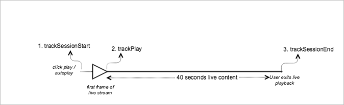

# Contenido principal en directo{#live-main-content}

## Escenario {#scenario}

En este escenario, hay un recurso activo sin anuncios reproducidos durante 40 segundos tras unirse a la emisión en directo.

| Activador | Método de Heartbeat | Llamadas de red | Notas   |
|---|---|---|---|
| El usuario hace clic en **[!UICONTROL Reproducir]**. | `trackSessionStart` | Inicio del contenido de Analytics, inicio del contenido de Heartbeat | Puede ser porque el usuario hace clic en **[!UICONTROL Reproducir]** o por un evento de reproducción automática. |
| Se reproduce el primer fotograma del contenido. | `trackPlay` | Reproducción del contenido de Heartbeat | Este método activa el temporizador. Los latidos se envían cada 10 segundos mientras dure la reproducción. |
| Se reproduce el contenido. |  | Latidos de contenido |  |
| La sesión finaliza. | `trackSessionEnd` |  | `SessionEnd` significa el final de una sesión de visualización. Hay que invocar a esta API aunque el usuario no vea el contenido completo. |

## Parámetros {#parameters}

Muchos de los valores que existen en las llamadas de inicio de contenido de Adobe Analytics están presentes en las llamadas de inicio de contenido de Heartbeat. También verá muchos otros parámetros que Adobe utiliza para rellenar los distintos informes de contenido en Adobe Analytics. Aquí no vamos a detallar todos, solo los más importantes.

### Inicio del contenido de Heartbeat

| Parámetro | Valor | Notas |
|---|---|---|
| `s:sc:rsid` | &lt;El ID de su grupo de informes de Adobe> |  |
| `s:sc:tracking_serve` | &lt;La URL de servidor de seguimiento de Analytics> |  |
| `s:user:mid` | `s:user:mid` | Debe coincidir con el valor medio de la llamada de inicio de contenido de Adobe Analytics |
| `s:event:type` | &quot;start&quot; |  |
| `s:asset:type` | &quot;main&quot; |  |
| `s:asset:mediao_id` | &lt;Nombre de su contenido> |  |
| `s:stream:type` | live |  |
| `s:meta:*` | opcional | Metadatos personalizados definidos en el contenido |

## Latidos de contenido {#content-heartbeats}

Durante la reproducción del contenido, hay un temporizador que enviará uno o más latidos (o pings) cada 10 segundos para el contenido principal y cada segundo para los anuncios. Estos latidos tendrán información sobre la reproducción, los anuncios, el almacenamiento en búfer y muchas otras cosas. El contenido exacto de cada latido está fuera del ámbito de este documento. Lo más importante para validar es que los latidos se activan de forma coherente durante la reproducción.

En los latidos de contenido, busque algunas cosas específicas:

| Parámetro | Valor | Notas |
|---|---|---|
| `s:event:type` | &quot;play&quot; |  |
| `l:event:playhead` | &lt;posición del cabezal de reproducción> p. ej., 50, 60, 70 | Esto debería indicar la posición actual del cabezal de reproducción. |

## Contenido de latidos completo {#heartbeat-content-complete}

No habrá una llamada de finalización en este caso, ya que la emisión en directo nunca llegó a completarse.

## Configuración del valor del cabezal de reproducción

Para los flujos en directo, debe establecer el valor del cabezal de reproducción como el número de segundos desde la medianoche (UTC) de ese día, de modo que en los informes, los analistas puedan determinar en qué momento se unen los usuarios y abandonan el flujo en directo en una vista de 24 horas.

### Al comienzo

En el caso de los medios en directo, cuando un usuario comienza a reproducir el flujo, debe establecer `l:event:playhead` a la cantidad de segundos desde la medianoche UTC en ese día. Esto es lo contrario a VOD, donde establecería el cursor de reproducción en “0”. Nota: Cuando se utilizan marcadores de progreso, la duración del contenido es obligatoria y el cabezal de reproducción debe actualizarse como número de segundos desde el principio del elemento de medios, empezando por 0.

Por ejemplo, supongamos que un evento de transmisión en vivo comienza a medianoche y se ejecuta durante 24 horas (`a.media.length=86400`; `l:asset:length=86400`). Entonces, digamos que un usuario empieza a reproducir ese flujo en vivo a las 12:00 pm. En esta situación, debe configurar `l:event:playhead` a 43 200 (12 horas desde la medianoche UTC de ese día en segundos).

### Al pausar

La misma lógica de “cabezal de lectura en directo” aplicada al inicio de la reproducción debe aplicarse cuando un usuario pone en pausa la reproducción. Cuando el usuario vuelve a reproducir el flujo en directo, debe establecer el valor `l:event:playhead` según el nuevo número de segundos desde la medianoche (UTC), _no_ en el punto en el que el usuario detuvo el flujo en directo.

## Código de muestra {#sample-code}



### Android

Este es el orden esperado de las llamadas de API:

```java
// Set up mediaObject 
MediaObject mediaInfo = MediaHeartbeat.createMediaObject( 
  Configuration.MEDIA_NAME,  
  Configuration.MEDIA_ID,  
  Configuration.MEDIA_LENGTH,  
  MediaHeartbeat.StreamType.LIVE 
); 

HashMap<String, String> mediaMetadata = new HashMap<String, String>(); 
mediaMetadata.put(CUSTOM_VAL_1, CUSTOM_KEY_1); 
mediaMetadata.put(CUSTOM_VAL_2, CUSTOM_KEY_2); 

// 1. Call trackSessionStart() when the user clicks Play or if autoplay is used,  
//    i.e., there is an intent to start playback.  
_mediaHeartbeat.trackSessionStart(mediaInfo, mediaMetadata); 

...... 
...... 

// 2. Call trackPlay() when the playback actually starts, i.e., when the first  
//    frame of main content is rendered on the screen. 
_mediaHeartbeat.trackPlay(); 

....... 
....... 

// 3. Call trackSessionEnd() when user ends the playback session.  
//    Since the user does not watch live media to completion, there  
//    is no need to call trackComplete().  
_mediaHeartbeat.trackSessionEnd(); 
....... 
....... 
```

### iOS

Este es el orden esperado de las llamadas de API:

```
// Set up mediaObject 
ADBMediaObject *mediaObject =  
[ADBMediaHeartbeat createMediaObjectWithName:MEDIA_NAME  
                   length:MEDIA_LENGTH  
                   streamType:ADBMediaHeartbeatStreamTypeLIVE]; 
 
NSMutableDictionary *mediaContextData = [[NSMutableDictionary alloc] init]; 
[mediaContextData setObject:CUSTOM_VAL_1 forKey:CUSTOM_KEY_1]; 
[mediaContextData setObject:CUSTOM_VAL_2 forKey:CUSTOM_KEY_2]; 
 
// 1. Call trackSessionStart when the user clicks Play or if autoplay is used,  
//    i.e., there is an intent to start playback. 
[_mediaHeartbeat trackSessionStart:mediaObject data:mediaContextData]; 
...... 
...... 
 
// 2. Call trackPlay when the playback actually starts, i.e., when the first  
//    frame of the main content is rendered on the screen. 
[_mediaHeartbeat trackPlay]; 
....... 
....... 
 
// 3. Call trackSessionEnd when user ends the playback session. Since the user  
//    does not watch live media to completion, there is no need to call  
//    trackComplete. 
[_mediaHeartbeat trackSessionEnd]; 
........ 
........ 
```

### JavaScript

Este es el orden esperado de las llamadas de API:

```js
// Set up mediaObject 
var mediaInfo =  
MediaHeartbeat.createMediaObject(Configuration.MEDIA_NAME,  
                                 Configuration.MEDIA_ID,  
                                 Configuration.MEDIA_LENGTH,  
                                 MediaHeartbeat.StreamType.VOD); 

var mediaMetadata = { 
  CUSTOM_KEY_1 : CUSTOM_VAL_1,  
  CUSTOM_KEY_2 : CUSTOM_VAL_2,  
  CUSTOM_KEY_3 : CUSTOM_VAL_3 
}; 

// 1. Call trackSessionStart() when Play is clicked or if autoplay  
//    is used, i.e., there's an intent to start playback. 
this._mediaHeartbeat.trackSessionStart(mediaInfo, mediaMetadata); 

...... 
...... 

// 2. Call trackPlay() when the playback actually starts, i.e., when the  
//    first frame of media is rendered on the screen. 
this._mediaHeartbeat.trackPlay(); 

....... 
....... 

// 3. Call trackSessionEnd() when user ends the playback session.  
//    Since user does not watch live media to completion, there is  
//    no need to call trackComplete(). 
this._mediaHeartbeat.trackSessionEnd(); 

........ 
........ 
```
