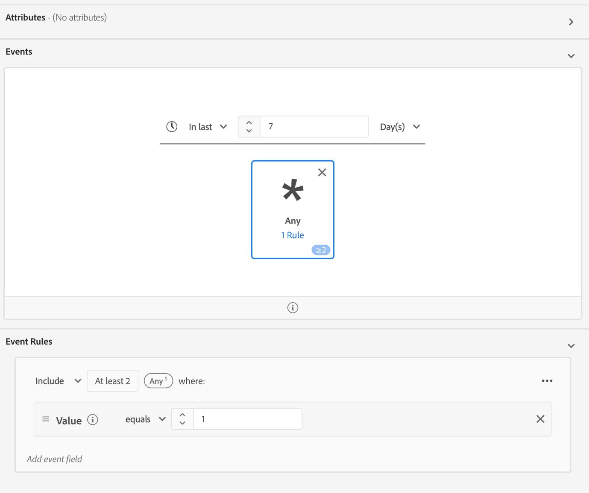

# Migración de audiencias a los nuevos campos de medios de streaming

En este documento se describe cómo se debe migrar una audiencia que usa campos del tipo de datos de los servicios de medios de streaming de Adobe llamados &quot;medios&quot; para que use el nuevo tipo de datos correspondiente denominado &quot;[Detalles de informes de medios](https://experienceleague.adobe.com/en/docs/experience-platform/xdm/data-types/media-reporting-details)&quot;.

## Migración de una audiencia

Para migrar una audiencia del tipo de datos anterior denominado &quot;Medios&quot; al nuevo tipo de datos denominado &quot;[Detalles de informes de medios](https://experienceleague.adobe.com/en/docs/experience-platform/xdm/data-types/media-reporting-details)&quot;, debe editar la audiencia y, en cada regla, reemplazar el campo anterior del tipo de datos obsoleto por el nuevo campo correspondiente del nuevo tipo de datos:

1. Busque reglas que contengan campos del tipo de datos &quot;Medios&quot; obsoleto. Estos son todos los campos que comienzan con la ruta de acceso `media.mediaTimed`.

1. Duplique esas reglas utilizando campos del nuevo tipo de datos &quot;[Detalles de informes de medios](https://experienceleague.adobe.com/en/docs/experience-platform/xdm/data-types/media-reporting-details)&quot;.

1. Mantenga ambas reglas en su lugar hasta que valide que las audiencias funcionan según lo esperado.

1. Elimine las reglas que contienen campos del tipo de datos &quot;Medios&quot; obsoleto.

1. Compruebe que las audiencias siguen funcionando según lo esperado.

Consulte el parámetro [Content ID](https://experienceleague.adobe.com/en/docs/media-analytics/using/implementation/variables/audio-video-parameters#content-id) en la página [Parámetros de audio y vídeo](https://experienceleague.adobe.com/es/docs/media-analytics/using/implementation/variables/audio-video-parameters) para asignar entre los campos antiguos y los campos nuevos. La ruta de campo antigua se encuentra en la propiedad &quot;Ruta de campo XDM&quot;, mientras que la nueva ruta de campo se encuentra en la propiedad &quot;Ruta de campo XDM de creación de informes&quot;.

## Ejemplo

Para facilitar el seguimiento de las directrices de migración, observe el siguiente ejemplo, que contiene una audiencia con una sola regla. Dado que la audiencia tiene una sola regla, solo es necesario aplicar las directrices de migración una vez.

1. Seleccione el botón [!UICONTROL **Editar audiencia**] en la esquina superior derecha.

1. Busque las reglas configuradas para la audiencia.

   

   

1. Seleccione la regla para abrir su configuración.

   

1. (Opcional) Para ver la ruta del campo utilizado en la regla, seleccione el botón de información junto al nombre del campo.

   

1. Identifique el nombre del campo (en este caso, &quot;Inicio de contenidos&quot;).

   

1. Consulte la página [Parámetros de audio y vídeo](https://experienceleague.adobe.com/es/docs/media-analytics/using/implementation/variables/audio-video-parameters) para asignar entre los campos antiguos. La ruta de campo antigua se encuentra en la propiedad &quot;Ruta de campo XDM&quot;, mientras que la nueva ruta de campo se puede encontrar en la propiedad &quot;Ruta de campo XDM de creación de informes&quot;. A modo de ejemplo, para el parámetro [Comienzos de medios](https://experienceleague.adobe.com/en/docs/media-analytics/using/implementation/variables/audio-video-parameters#media-starts), el corresponsal de `media.mediaTimed.impressions.value` es `mediaReporting.sessionDetails.isViewed`.

   

1. Añada la misma regla que la existente utilizando el nuevo campo.

   

   

   

1. Seleccione [!UICONTROL **Guardar**] para guardar la audiencia. Puede mantener esta configuración durante el tiempo que necesite para validar que la audiencia sigue funcionando según lo esperado.

1. Una vez completada la validación, quita el campo antiguo y selecciona [!UICONTROL **Guardar**] para guardar la audiencia.

   

1. Vuelva a validar la audiencia.

   El proceso de migración de audiencias ha finalizado.
