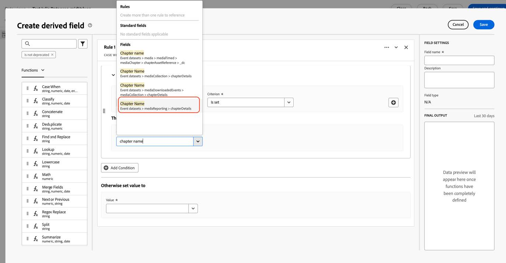

# Migrar Customer Journey Analytics para utilizar los nuevos campos de medios de streaming

En este documento se describe cómo se debe actualizar una configuración de Customer Journey Analytics que usa el tipo de datos de servicios de medios de streaming de Adobe denominado &quot;Medios&quot; para usar el nuevo tipo de datos correspondiente denominado &quot;[Detalles de informes de medios](https://experienceleague.adobe.com/en/docs/experience-platform/xdm/data-types/media-reporting-details)&quot;.

## Migrar Customer Journey Analytics

Para migrar una configuración de Customer Journey Analytics del tipo de datos anterior denominado &quot;Medios&quot; al nuevo tipo de datos denominado &quot;[Detalles de informes de medios](https://experienceleague.adobe.com/en/docs/experience-platform/xdm/data-types/media-reporting-details)&quot;, debe actualizar las configuraciones siguientes que usan el tipo de datos anterior:

* Vistas de datos

* Campos derivados

### Migración de vistas de datos

Para migrar las vistas de datos al nuevo tipo de datos:

1. Busque todas las vistas de datos con el tipo de datos obsoleto &quot;Medios&quot;. Estos son todos los campos para los que la ruta de acceso comienza por `media.mediaTimed`.

1. Realice cualquiera de los siguientes pasos:

   * En esas vistas de datos, inserte los campos del nuevo tipo de datos Detalles de creación de informes de contenidos.

   * Cree un campo derivado que utilice el nuevo tipo de datos &quot;Detalles de creación de informes de contenidos&quot; si está establecido, o que vuelva al antiguo tipo de datos &quot;Detalles de creación de informes de contenidos&quot; si no está establecido.

### Migrar campos derivados

Para migrar campos derivados al nuevo tipo de datos:

1. Busque todos los campos derivados utilizando el tipo de datos obsoleto &quot;Medios&quot;. Son todos campos derivados que contienen campos para los que la ruta de acceso comienza por `media.mediaTimed`.

1. Reemplace todos los campos antiguos del campo derivado por el nuevo campo correspondiente de &quot;Detalles de creación de informes de medios&quot;.

Consulte el parámetro [Content ID](https://experienceleague.adobe.com/en/docs/media-analytics/using/implementation/variables/audio-video-parameters#content-id) en la página [Parámetros de audio y vídeo](https://experienceleague.adobe.com/es/docs/media-analytics/using/implementation/variables/audio-video-parameters) para asignar entre los campos antiguos y los campos nuevos. La ruta de campo antigua se encuentra en la propiedad &quot;Ruta de campo XDM&quot;, mientras que la nueva ruta de campo se encuentra en la propiedad &quot;Ruta de campo XDM de creación de informes&quot;.

## Ejemplo

Para facilitar el seguimiento de las directrices de migración, tenga en cuenta el siguiente ejemplo que contiene una vista de datos con campos del antiguo tipo de datos obsoleto &quot;Medios&quot;. En esta vista de datos, debe agregar los nuevos campos correspondientes.

### Actualización de la vista de datos

Puede utilizar cualquiera de las siguientes opciones para actualizar la vista de datos:

#### Opción 1

1. Busque una métrica o una dimensión que utilice el campo antiguo del tipo de datos obsoleto.

   

1. Compruebe el nuevo campo correspondiente en la sección [Desplazamiento de capítulo](https://experienceleague.adobe.com/en/docs/media-analytics/using/implementation/variables/chapter-parameters#chapter-offset) del artículo [Parámetros de capítulo](https://experienceleague.adobe.com/es/docs/media-analytics/using/implementation/variables/chapter-parameters).

1. Busque el nuevo campo correspondiente en la vista de datos.

   

1. Arrastre el nuevo campo a la métrica o dimensión.

1. Repita este proceso para todas las métricas y dimensiones que utilicen campos del tipo de datos obsoleto &quot;Medios&quot;.

#### Opción 2

Esta opción crea un campo derivado que selecciona el valor del campo antiguo o el valor del nuevo campo en función del cual existe uno para un evento específico. Este campo derivado reemplaza el tipo de datos &quot;Medios&quot; antiguo en cualquier proyecto en el que se utilice.

Si desea crear un campo derivado para el &quot;Nombre del capítulo&quot; que utilice el nuevo tipo de datos &quot;Detalles de informes de contenidos&quot; si está establecido, o que vuelva al antiguo tipo de datos &quot;Detalles de informes de contenidos&quot; si no está establecido:

1. Arrastre una cláusula &quot;Case When&quot; a los campos derivados.

   

1. Rellene la cláusula [!UICONTROL **If**] con el valor de **Ruta del campo XDM de creación de informes**, como se muestra en el parámetro [Chapter name](https://experienceleague.adobe.com/en/docs/media-analytics/using/implementation/variables/chapter-parameters#chapter-name) de la página [Chapter parameters](https://experienceleague.adobe.com/es/docs/media-analytics/using/implementation/variables/chapter-parameters).

   

   

   

   

1. Rellene el valor de reserva con el campo antiguo del tipo de datos obsoleto &quot;Medios&quot;.

   

   

   Esta es la definición final del campo derivado.

   

1. Para actualizar los campos derivados, busque un campo derivado que utilice los campos obsoletos antiguos (ruta de acceso que comienza por `media.mediaTimed`).

   

1. Pase el cursor sobre el campo derivado que quiera actualizar y luego seleccione el icono [!UICONTROL **Editar**].

1. Busque todos los campos del tipo de datos anterior (ruta de acceso que comienza por `media.mediaTimed`) y reemplácelos por el nuevo campo correspondiente.

   

1. Compruebe el campo nuevo correspondiente en la sección [Nombre de contenido (variable)](https://experienceleague.adobe.com/en/docs/media-analytics/using/implementation/variables/audio-video-parameters#content-name-variable) del artículo [Parámetros de medios de streaming](https://experienceleague.adobe.com/en/docs/media-analytics/using/implementation/variables/audio-video-parameters#content-name-variable).

1. Reemplace el campo antiguo por el nuevo.

   

1. Repita este proceso para todos los campos derivados mediante campos del antiguo tipo de datos obsoleto &quot;Medios&quot;.

   Se completó la migración de la configuración de CJA.
