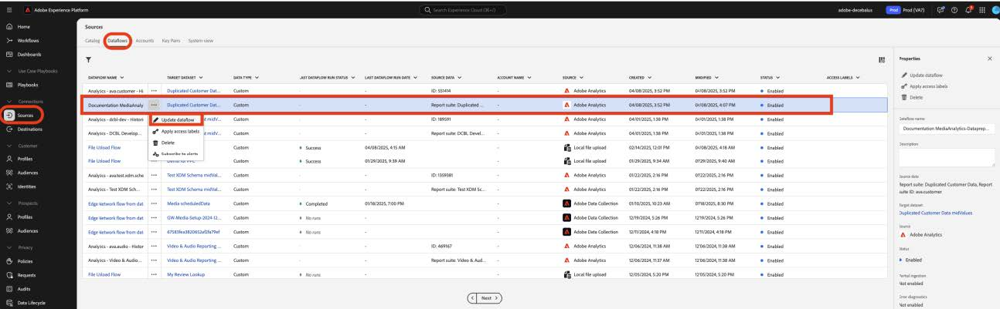
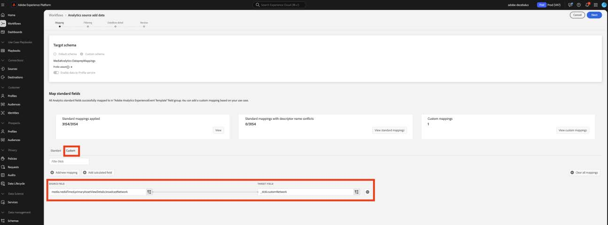
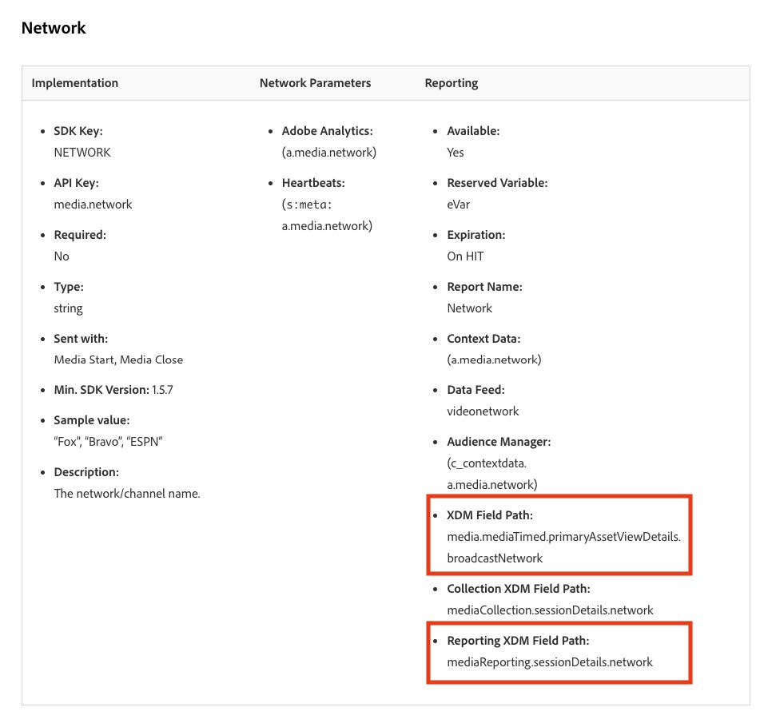
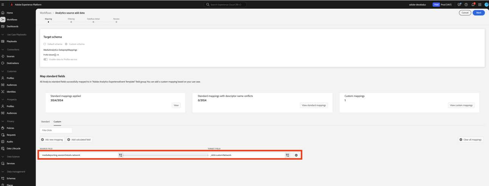
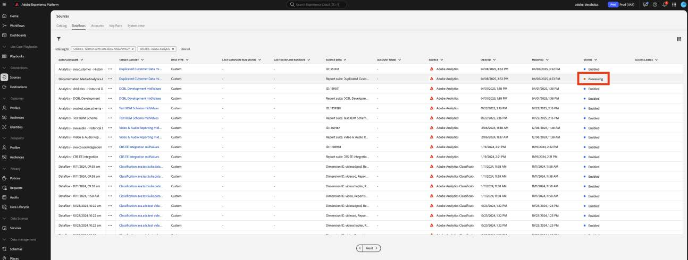
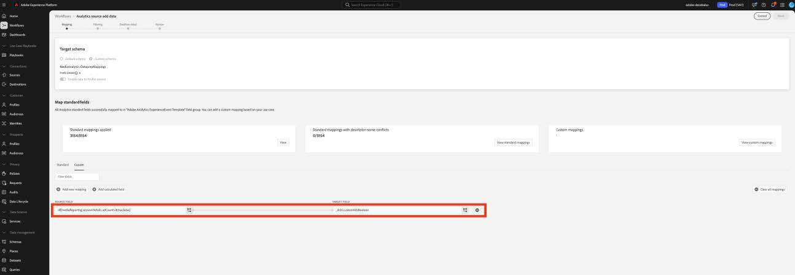

# Migración de la preparación de datos para campos personalizados a los nuevos campos de medios de streaming

En este documento se describe el proceso de migración del servicio de preparación de datos que existe sobre los flujos de recopilación de datos de Adobe habilitados para los datos de recopilación de medios de streaming de Adobe. La migración convierte una asignación de preparación de datos del tipo de datos de recopilación de medios de streaming de Adobe llamado &quot;Medios&quot; para usar el nuevo tipo de datos correspondiente denominado &quot;[Detalles de informes de medios](https://experienceleague.adobe.com/es/docs/experience-platform/xdm/data-types/media-reporting-details)&quot;.

## Migración de la preparación de datos para campos personalizados

Para migrar las asignaciones de preparación de datos del tipo de datos anterior denominado &quot;Medios&quot; al nuevo tipo de datos denominado &quot;[Detalles de informes de medios](https://experienceleague.adobe.com/es/docs/experience-platform/xdm/data-types/media-reporting-details)&quot;, debe editar las asignaciones de preparación de datos:

>[!IMPORTANT]
>
>Para evitar la pérdida de datos, asegúrese de que el conector de origen de Analytics se haya implementado utilizando los nuevos campos `mediaReporting` antes de completar los pasos de esta sección.

1. En Adobe Experience Platform, en la sección [!UICONTROL **Sources**], vaya a la pestaña [!UICONTROL **Dataflows**].

1. Busque el flujo de datos responsable de importar los datos de medios de streaming de Adobe Analytics a Adobe Experience Platform mediante la recopilación de datos de Adobe.

1. Seleccione [!UICONTROL **Actualizar flujo de datos**] para modificar la configuración de la preparación de datos reemplazando cada asignación de origen personalizada que contenga un campo obsoleto con el nuevo campo correspondiente del nuevo objeto XDM.

1. Busque las asignaciones que contienen campos de origen del objeto &quot;Media&quot; obsoleto.

1. Reemplace esas fuentes utilizando campos del nuevo objeto &quot;Detalles de creación de informes de medios&quot;.

1. Compruebe que las asignaciones siguen funcionando según lo esperado.

Consulte el parámetro [Content ID](/help/reporting/dimensions/content.md) y el resto de las variables de medios de streaming documentadas en [Servicios de medios de streaming](/help/media-overview.md) para asignar entre los campos antiguos y los campos nuevos. La ruta de campo antigua se encuentra en la propiedad &quot;Ruta de campo XDM&quot;, mientras que la nueva ruta de campo se encuentra en la propiedad &quot;Ruta de campo XDM de creación de informes&quot;.

## Ejemplo

Para facilitar el seguimiento de las directrices de migración, tenga en cuenta el siguiente ejemplo de flujo de datos que contiene una sola asignación. En este caso, debe aplicar las directrices de migración solo una vez.

1. En Adobe Experience Platform, en la sección [!UICONTROL **Sources**], vaya a la pestaña [!UICONTROL **Dataflows**].

1. Busque el flujo de datos responsable de importar los datos de medios de streaming de Adobe Analytics a Adobe Experience Platform mediante la recopilación de datos de Adobe.

1. Seleccione **[!UICONTROL Actualizar flujo de datos]** para ingresar a la interfaz de usuario de edición como se muestra en la siguiente imagen.

   

1. En la ficha **[!UICONTROL Asignación]**, seleccione **[!UICONTROL Personalizada]**.

1. Identifique las asignaciones personalizadas que dependen de `media.mediaTimed` campos como orígenes.

   

   En este ejemplo, dado que creó un grupo de campos personalizados en el esquema de su organización de desarrollo, el campo de destino se encuentra en `_dcbl`. La ruta del grupo de campos personalizados difiere según el nombre de la organización.

1. Para cada asignación que utiliza el objeto `media.mediaTimed`, busque su correspondiente en el objeto `mediaReporting` con esta documentación.

   Por ejemplo, para Network, el corresponsal de `media.mediaTimed.primaryAssetViewDetails`.broadcastNetwork es `mediaReporting.sessionDetails.network`.

   

1. En el campo **[!UICONTROL Source field]**, reemplace la ruta de acceso `media.mediaTimed` por la ruta de acceso `mediaReporting`. El campo de destino permanece sin cambios.

   

1. Seleccione **[!UICONTROL Siguiente]** para guardar los cambios.

   El estado se muestra como **[!UICONTROL Procesando]**. Una vez aplicados los cambios, el estado se muestra como **[!UICONTROL Habilitado]**.

   

## Ejemplo con diferentes tipos de datos

En el ejemplo anterior, todos los tipos de datos implicados eran de tipo cadena, por lo que el reemplazo de asignación fue directo.

Si el tipo de datos del campo de origen es diferente al tipo de datos del campo de destino, debe seguir las directrices de la [Guía de solución de problemas de la preparación de datos](https://experienceleague.adobe.com/es/docs/experience-platform/data-prep/troubleshooting-guide), [Gestión de formatos de datos con la preparación de datos](https://experienceleague.adobe.com/es/docs/experience-platform/data-prep/data-handling) y [Funciones de asignación de la preparación de datos](https://experienceleague.adobe.com/es/docs/experience-platform/data-prep/data-handling).

Por ejemplo, si el tipo de origen es una cadena y el tipo de destino es un booleano, la preparación de datos puede analizar automáticamente el valor y convertirlo en un booleano.

Si el tipo de origen es un número y el tipo de destino es un booleano, debe utilizar funciones de manipulación de datos:

Asignando con `media.mediaTimed` a un campo personalizado.

Asignando `mediaReporting` al mismo campo personalizado:

